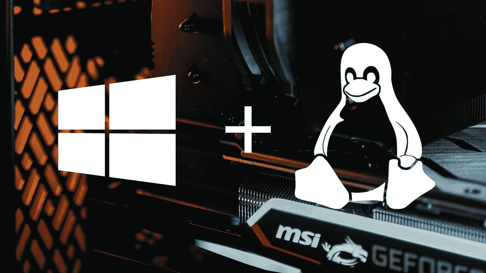
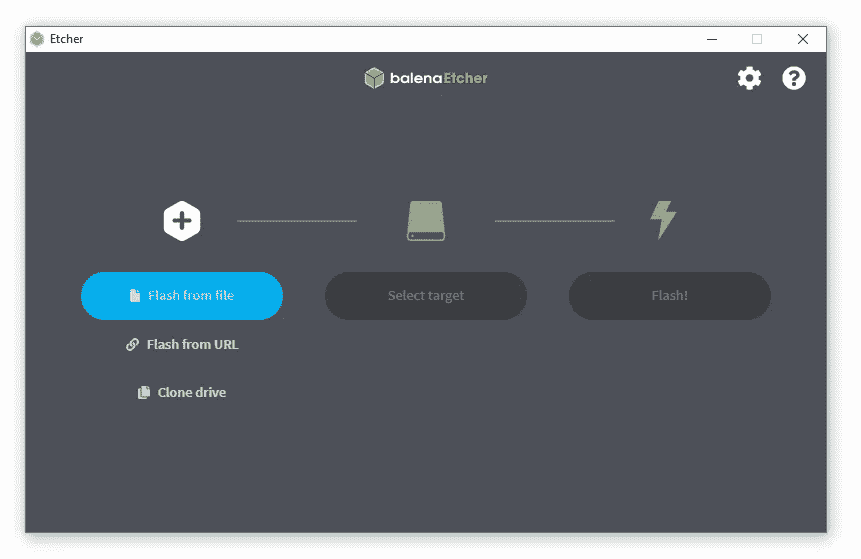
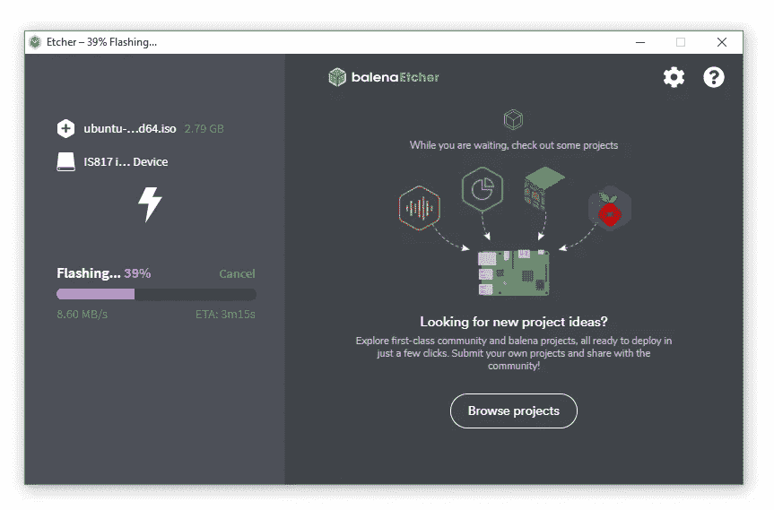
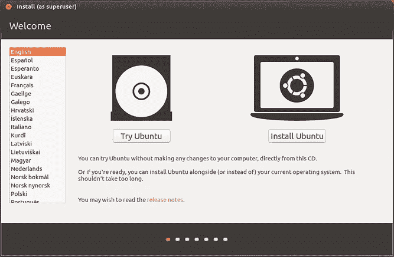
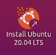
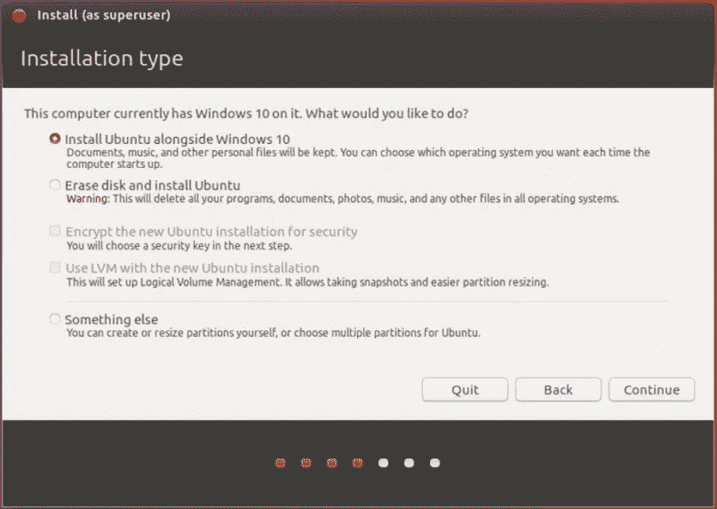
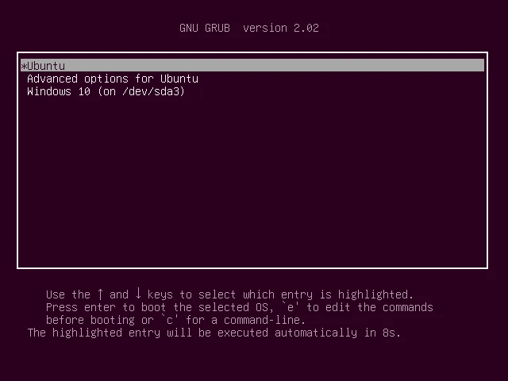
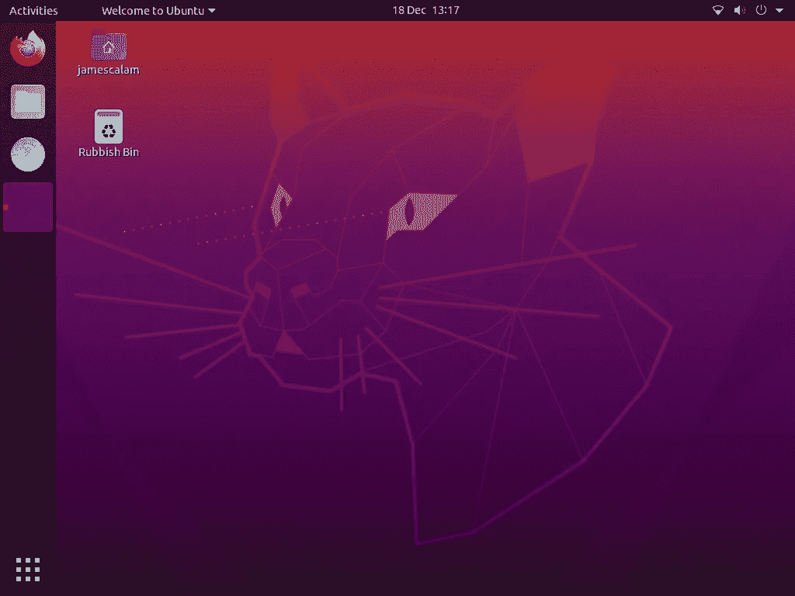

# 如何在 Windows 上安装 Linux

> 原文：<https://betterprogramming.pub/how-to-install-linux-on-windows-9f63cfc98f21>

## 双引导任何 Linux 发行版和 Windows



[马丁·卡特勒](https://unsplash.com/@martinkatler?utm_source=unsplash&utm_medium=referral&utm_content=creditCopyText)在 [Unsplash](https://unsplash.com/t/technology?utm_source=unsplash&utm_medium=referral&utm_content=creditCopyText) 拍摄的背景照片。作者改编的 Windows 和 Linux 图像

Windows 是这个星球上最受欢迎的桌面操作系统，大约占有 87.6%的份额——远远超过了 Linux 区区 2.4%的份额。

然而，当你开始研究其他操作系统发行版时，情况就完全相反了。Unix(其中大部分被预测为 Linux)在公共互联网服务器领域占主导地位，托管的服务器是 Windows 的两倍多[2]。

最后但肯定不是最不重要的是 Linux 在超级计算机领域的绝对优势。Linux 具有明显的垄断地位，截至 2020 年 6 月，全球 500 强超级计算机中 100%都是 Linux。

```
> [Prerequisites](#02f6)
  1\. USB Drive
  2\. Etcher Software
  3\. Linux Distro> [Create the Bootable Drive](#d953)> [Boot From Your USB](#cacb)> [Install Ubuntu](#5d92)> [Dual Boot](#812f)
```

# 先决条件

1.  **u 盘**——首先你需要一个 u 盘。驱动器上的所有内容都将被擦除，这样您就可以将它用作可引导驱动器(安装 Linux 时需要)。尝试使用一次性的东西。正如我注意到的，一些人在使用 Etcher 软件后，他们的 USB 出现了[问题。](https://forums.balena.io/t/etcher-killed-my-usb-stick/3933/6)
2.  **Etcher 软件** —你需要软件来安装你选择的 Linux 发行版。我将使用 [balenaEtcher](https://www.balena.io/etcher/) ，它非常好，可以帮助我们避免覆盖任何我们不想覆盖的内容。
3.  **Linux 发行版** —最后，您需要一个 Linux 发行版来安装。这需要发行版的 ISO 镜像。这里可以找到几个比较热门的: [Ubuntu](https://ubuntu.com/download/desktop) 、 [Debian](https://www.debian.org/releases/buster/debian-installer/) 、 [CentOS](https://www.centos.org/) 。

一旦你拥有了这三样东西，你就可以开始了！

# 创建可引导驱动器



balenaEtcher 的第一个屏幕。在这里，我们可以添加我们的 ISO 文件，USB 驱动器，然后开始闪存过程。

下载蚀刻机后，你应该看到蚀刻机窗口。(如果没有，手动打开。)在这里，我们选择我们的下载 ISO 文件，选择我们的目标(一个 USB 或 CD/DVD)，并单击闪存！



将 Ubuntu 刷新到外部 u 盘的过程。

在这之后，我们需要等待 Etcher 将 ISO 文件刷新到我们的驱动器上，这不会花很长时间。一旦完成，我们进入下一步。

# 从 USB 启动

接下来，我们需要进入 BIOS 来改变计算机的启动顺序。

您可以通过重新启动计算机并在启动时按 BIOS entry 键来进入 BIOS 菜单。每个系统都会有所不同，但通常是 F1、F2、F10 或德尔:

常见品牌及其 BIOS 密钥[部分来自惠普](https://store.hp.com/us/en/tech-takes/how-to-enter-bios-setup-windows-pcs#:~:text=In%20order%20to%20access%20BIOS,advanced%20start%20menu%20recovery%20settings.)

进入 BIOS 菜单后，导航至引导，并将 USB 驱动器设置为 Linux 作为第一个引导选项。

完成此更改后，保存 BIOS 更改并让计算机启动。我们应该会看到 Linux 发行版安装程序出现。(如果没有，请尝试重新启动计算机或在 BIOS 中禁用快速启动)。这将带我们进入下一步。

# 安装 Ubuntu

请记住，根据您正在安装的发行版，这些步骤可能完全不同。比如 Debian 就不像 Ubuntu 那么直白。因此，如果您正在安装另一个发行版，请非常小心，并找到另一篇专门介绍安装该发行版的文章。



第一个屏幕应该显示两个选项:试用 Ubuntu 和安装 Ubuntu。建议您先尝试一下，测试您的硬件是否如预期的那样与 Ubuntu 集成。



一旦你完成了测试，回到你的主屏幕，点击安装 Ubuntu 20.04 LTS(或者任何你正在安装的版本)。

这将带你完成安装过程，包括几个重要的步骤(以及许多小的调整，如设置键盘布局，当前位置等。).

这些重要的设置包括:

## 更新和其他软件

*   最小/正常安装:这里我用最小来减少媒体播放器等带来的软件膨胀。然而，这不是必须的——随你喜欢的去做。
*   是否在安装 Ubuntu 时下载更新:这可以帮助我们减少以后手动安装更新的时间，这可能是有用的。
*   是否为图形和其他项目安装第三方软件:我会推荐这样做，以帮助 Ubuntu 更好地与我们的硬件集成，而无需手动安装/更新驱动程序。

## 安装类型



必须显示“在 Windows 10 旁边安装 Ubuntu”选项——这就是我们如何在不擦拭 Windows 的情况下安装 Ubuntu。

你能看到“在 Windows 10 旁边安装 Ubuntu”选项，并且选择了这个选项，这一点非常重要。

**如果你已经有了想要保留的操作系统，不要选择“擦除磁盘并安装 Ubuntu”**因为这个选项会擦除所有内容。

如果你看不到“在 Windows 10 旁边安装 Ubuntu”选项，你很可能需要改变你的启动位置。应该有两个选项可用:从 UEFI 引导或从 BIOS 引导(可以从 BIOS 菜单中更改)。

关于[问 Ubuntu](https://askubuntu.com/questions/876100/ubuntu-installer-doesnt-detect-windows-10) 修复 Ubuntu 安装程序检测不到 Windows 的问题有几点建议。

## 在 Windows 10 旁边安装 Ubuntu

最后重要的一步是决定给 Ubuntu 和 Windows 分配多少空间。左边的框代表 Windows，应该是文件，而右边的框代表 Ubuntu，应该是 Ubuntu**T3。**

## 安装

经过几个简单的步骤后，您应该可以选择“立即重启”。这样做是为了开始双引导设置的最后一部分。

# 双靴

重启时，回到你的 BIOS 菜单。确认快速启动被禁用，并且启动顺序优先于 Ubuntu(这应该在安装 Ubuntu 后自动更新)。保存并退出。



计算机应该像往常一样继续加载，但是在到达 Windows 加载屏幕之前，您应该会看到上面的内容。选项可能多也可能少——就像只要你有 Ubuntu 和 Windows 10，一切都应该设置好了！

现在，在电脑启动时，我们总是会看到这个屏幕，这将允许我们在 Ubuntu 或 Windows 之间进行选择。



默认的 Ubuntu 主屏幕

你可能会发现，在 Ubuntu 与你的硬件完美集成之前，你需要安装图形驱动程序或其他东西，但所有的要素现在都应该已经启动并运行了。在双引导菜单中选择 Ubuntu 后，你应该会找到 Ubuntu 主屏幕。

我们可能希望或需要同时使用 Windows 和 Linux 有很多原因。不管是什么原因，双启动往往是完美的解决方案。

应该考虑的一个替代方案是 Windows 子系统 Linux (WSL)。它抽象了我们上面讨论的大部分工作，但同时，并没有提供完全成熟的 Linux GUI 或 GPU 支持。

尽管如此，如果你需要的只是一种更面向终端的体验，那么 Dimitris Poulopoulos 有一篇关于 WSL 的[文章。](https://towardsdatascience.com/dual-boot-is-dead-windows-and-linux-are-now-one-27555902a128)

这就是本文关于双启动 Windows 和 Linux 的全部内容。希望你觉得有用。

如果你有任何问题，请通过 [Twitter](https://twitter.com/jamescalam) 或者在下面的评论中告诉我。如果你想要更多这样的内容，我也会在 YouTube 上发布。

感谢阅读！

# 参考

[1] [操作系统市场份额](https://netmarketshare.com/operating-system-market-share.aspx?options=%7B%22filter%22%3A%7B%22%24and%22%3A%5B%7B%22deviceType%22%3A%7B%22%24in%22%3A%5B%22Desktop%2Flaptop%22%5D%7D%7D%5D%7D%2C%22dateLabel%22%3A%22Trend%22%2C%22attributes%22%3A%22share%22%2C%22group%22%3A%22platform%22%2C%22sort%22%3A%7B%22share%22%3A-1%7D%2C%22id%22%3A%22platformsDesktop%22%2C%22dateInterval%22%3A%22Monthly%22%2C%22dateStart%22%3A%222019-11%22%2C%22dateEnd%22%3A%222020-10%22%2C%22segments%22%3A%22-1000%22%7D) (2020 年)，净市场份额

[2] [网站操作系统使用统计](https://w3techs.com/technologies/overview/operating_system) (2020)，W3Techs

[3][2020 年 6 月](https://www.top500.org/lists/top500/2020/06/)，500 强

[🤖《变形金刚》NLP 课程 70%的折扣](https://bit.ly/nlp-transformers)