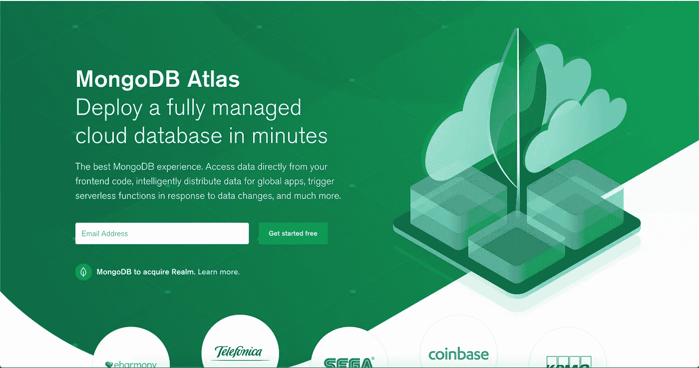
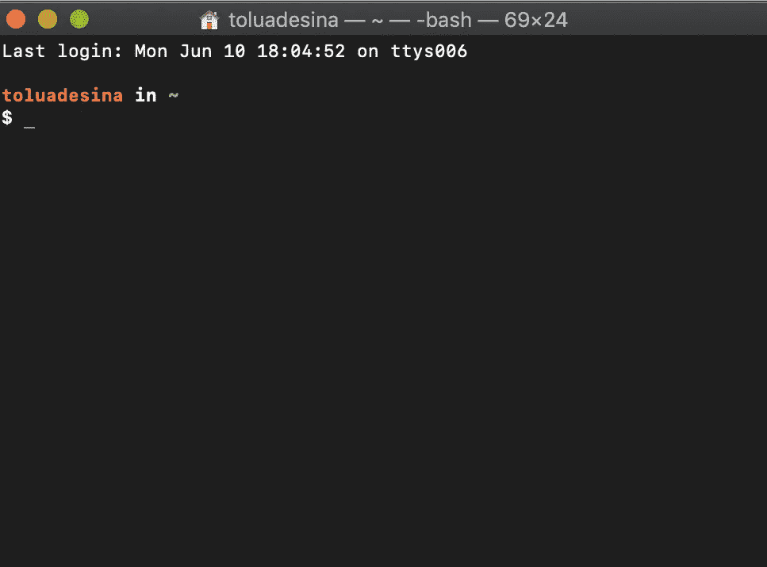

# 如何在 Mac 上安装 MongoDB

> 原文：<https://betterprogramming.pub/how-to-install-mongodb-on-your-mac-42020fc19827>

## 尽快启动并运行



摘自 [MongoDB 的](https://www.mongodb.com/)网站

首先你需要检查你的电脑上是否有[自制软件](https://brew.sh/)——`brew help`**，以防你不需要。家酿是一个 MacOs 的软件包管理器。**

**`/usr/bin/ruby -e "$(curl -fsSL https://raw.githubusercontent.com/Homebrew/install/master/install)"`**

**将上述代码(来自家酿网站)粘贴到您的终端中。当它完成运行时，你也应该在你的终端中运行`brew install wget`，以获得必要的依赖。**

**你也可以运行`brew update`和`brew help`，以确保 Brew 一切正常。**

****

**终点站**

**现在我们已经安装了家酿软件，我们可以继续安装 [MongoDB](https://www.mongodb.com/) ，这毕竟是你阅读这篇文章的原因。**

**在您的终端中再次运行`brew install mongodb`——这将为我们安装 MongoDB。**

**下一步可能不是每个人都需要的，但是如果您看到以下错误:**

```
Error: The `brew link` step did not complete successfullyThe formula built, but is not symlinked into /usr/localCould not symlink bin/bsondumpTarget /usr/local/bin/bsondump...
```

**您应该执行以下操作:**

**`brew unlink mongodb-community && brew link mongodb-community`**

**将它粘贴到您的终端——这将正确同步(链接)MongoDB。**

**完成的另一步是设置数据库所在的目录。**

**运行:`sudo mkdir -p /data/db`。**

**你可以通过运行这个来检查你是谁:`whoami`。**

**然后运行下面的代码:`sudo chown -R $(whoami) /data/db`为您的用户提供读写数据库的权限。**

**现在我们完成了。运行`mongod`启动 Mongo 服务器。然后，您可以将另一个终端窗口作为标签或独立窗口打开。在新的终端上运行`mongo`，以便能够与您的 MongoDB 数据库进行交互。**

**运行`show dbs`查看当前数据库。**

**谢谢你的时间。我希望你喜欢阅读这篇文章。**