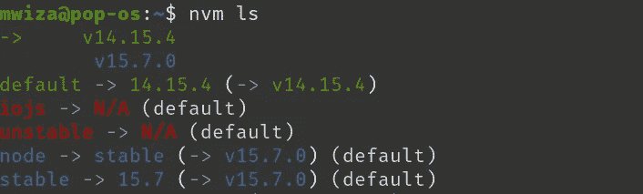

# 如何在 Linux PC 上安装多个版本的 Node.js

> 原文：<https://betterprogramming.pub/how-to-install-multiple-versions-of-node-js-on-a-linux-pc-fa8d9269311c>

## 在 Linux 上的几个 Node.js 版本之间切换


卡斯帕·卡米尔·鲁宾在 [Unsplash](https://unsplash.com?utm_source=medium&utm_medium=referral) 上的照片。

如果您曾经因为没有安装 Node.js 的兼容版本而在运行项目时遇到困难，那么您并不孤单。幸运的是，有一个简单的方法可以解决这个问题。

使用[节点版本管理器](https://github.com/nvm-sh/nvm) (NVM)，您可以在您的机器上安装几个版本的 Node.js，并根据您想要运行的项目选择使用哪个版本。

NVM 是一个开源项目，旨在简化 Node.js 的管理和安装。

# 安装 NVM

在 Linux 中安装 NVM 非常简单。打开命令终端，然后运行以下命令:

```
curl -o- https://raw.githubusercontent.com/nvm-sh/nvm/v0.37.2/install.sh | bash
```

该命令将运行下载和安装 NVM 的脚本。此外，它还将在您的环境变量中设置一个配置文件。

环境变量文件位于以下任一位置:`~/.bash_profile`、`~/.zshrc`、`~/.profile`或`~/.bashrc`。

自动添加到环境变量文件中的条目将类似于下面的条目:

```
export NVM_DIR="$HOME/.nvm"
[ -s "$NVM_DIR/nvm.sh" ] && \. "$NVM_DIR/nvm.sh"  # This loads nvm
[ -s "$NVM_DIR/bash_completion" ] && \. "$NVM_DIR/bash_completion"  # This loads nvm bash_completion
```

# 验证安装

*注意:在检查安装是否成功之前，请关闭当前的终端。然后打开一个新的终端。*

在新的终端窗口中，您可以通过运行以下命令来检查 NVM 是否已成功安装:

```
command -v nvm
```

如果一切顺利，上面命令的输出将是`nvm`。

要检查安装的 NVM 版本，您可以运行以下命令:

```
nvm -v
```

# 安装 Node.js

用 NVM 安装 Node.js 非常容易。例如，要安装 Node.js 的最新版本，可以运行以下命令:

```
nvm install node 
```

要安装 Node.js 的某个特定版本，可以运行`nvm install <version>`。例如，要安装 node . js 14 . 15 . 4 版，可以运行以下命令:

```
nvm install 14.15.4 
```

Node.js 版本 14.15.4 是撰写本文时 Node.js 的最新 LTS 版本。

如果您已经运行了上面的两个命令，那么恭喜您！您的 PC 上安装了两个版本的 Node.js。

# 选择要使用的 Node.js 版本

例如，当您安装了多个版本的 Node.js 并且希望使用 14.15.4 版时，您可以运行以下命令:

```
nvm use 14.15.4
```

要查看 PC 上安装的 Node.js 版本列表，可以运行以下命令:

```
nvm ls
```

清单的输出类似于下面的内容。当前活动的版本也会突出显示:



要列出 Node.js 的可用安装版本，可以运行:

```
nvm ls-remote 
```

# 获得帮助

要了解有关 NVM 命令的更多信息或获得帮助，只需运行以下命令:

```
nvm -h
```

# 最后的想法

在本指南中，我们安装了节点版本管理器(NVM)来简化 Node.js 的管理和安装

如果您的项目使用不同版本的 Node.js，那么 NVM 就是适合您的工具。它只会让你的生活更轻松。