# 如何在 Ubuntu-16.04/18.04 上安装 RTX 2080 Ti GPU 的 Nvidia 驱动和 CUDA-10.0

> 原文：<https://betterprogramming.pub/how-to-install-nvidia-drivers-and-cuda-10-0-for-rtx-2080-ti-gpu-on-ubuntu-16-04-18-04-ce32e4edf1c0>

如果你正试图在 Linux 平台上安装 [Nvidia](https://www.nvidia.com/Download/index.aspx) 驱动程序和 [CUDA](https://developer.nvidia.com/cuda-zone) ，我写这篇文章是为了帮你节省大量时间。

在试图安装它的时候，你可能会遇到黑屏、登录循环和系统冻结。我重新安装了 10 多次 Ubuntu，并在网上尝试了 20 多种不同的答案，才最终找到了解决办法。在这里和大家分享一下我的解决方案。

# 我们开始吧

我假设你已经安装了 Ubuntu 16.04 或者 18.04(其他版本没试过)。

你可能会看到分辨率很差，图标/字母比较大(Ubuntu 18.04 可能没有这个问题)。不要担心，这是因为机器还没有找到合适的 GPU 驱动程序，它可能正在使用开源的[新](https://nouveau.freedesktop.org/)显示驱动程序。

所以，我们的第一步是为我们的 RTX 2080 Ti GPU 安装 Nvidia 驱动程序。确保您有互联网连接。

继续并[下载 Linux 的显示驱动程序](https://www.nvidia.com/download/driverResults.aspx/138279/en-us)。写这篇文章时的稳定版本是 nvidia-410。

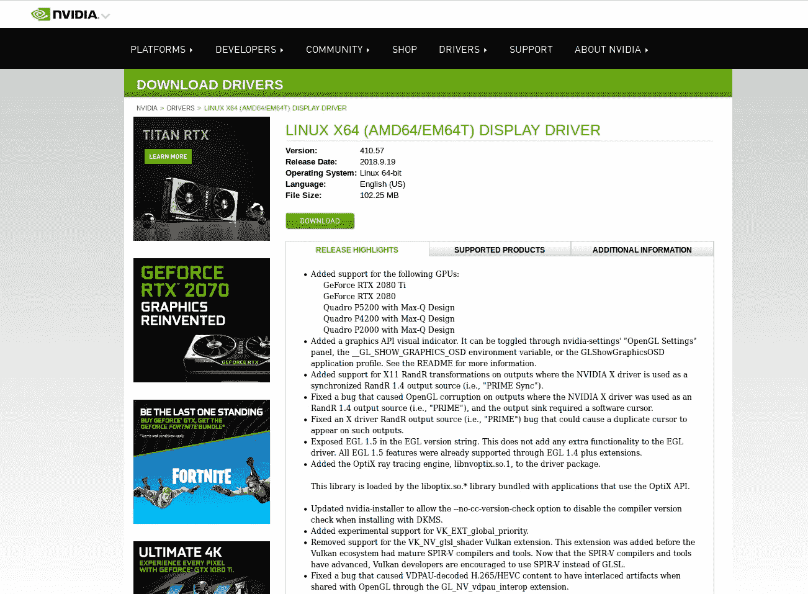

下载显示器驱动程序的 Nvidia 页面

现在打开一个终端(`CTRL+ALT+ T`)，按照以下步骤安装驱动程序:

1.  `cd Downloads/`
2.  `ls
    NVIDIA-Linux-x86_64–410.57.run #output of ls`
3.  `chmod +x NVIDIA-Linux-x86_64–410.57.run`#获取执行运行文件的权限。
4.  `sudo ./NVIDIA-Linux-x86_64–410.57.run — no-x-check`

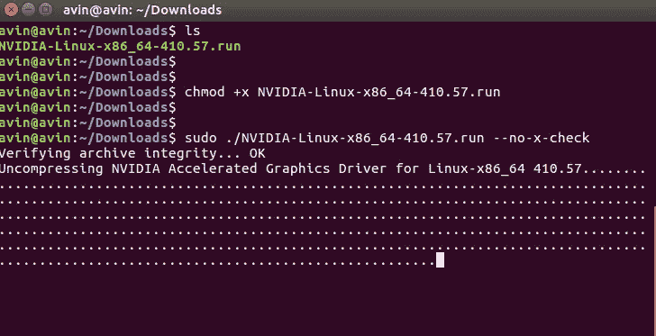

命令行安装

注意，如果你运行最后一个命令而没有`--no-x-check` 标志*，*它会抛出一个错误，告诉你在安装驱动程序之前需要禁用 X-Server。但在这一点上，我们不会这么做。

运行最后一个命令后，Nvidia GUI 将会打开。

在这一步，Ubuntu 18.04 用户可能会得到一个安装失败错误，因为在这种情况下，机器正在使用某种形式的 Nvidia 驱动程序。

因此，您可能希望通过机器上的`sudo nvidia-uninstall`和`reboot` 删除该驱动程序，然后再次按照安装命令安装正确的驱动程序。

**注意:**有时，Nvidia 驱动程序要求禁用 Linux 的 UEFI 安全引导。如果是这种情况，安装 GUI 将会指出这一点。不会出错的。但是，如果是这样，最好从引导选项中禁用安全引导。

在 GUI 中选择*继续安装*并按照步骤操作。

然而，向 DKMS 注册内核模块源代码是可选的，你可以在这里选择*否*。你可以选择*是*来安装 Nvidia 32 位兼容库。

**重要提示:**当它要求自动更新你的 X 配置文件时，选择*否*。

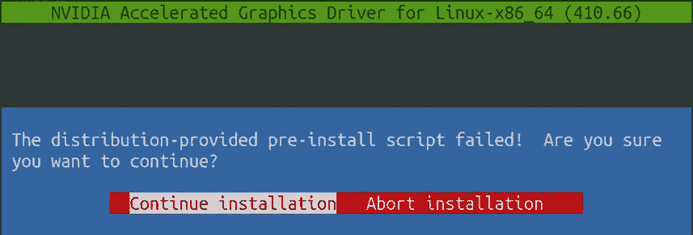

用于驱动程序安装的 Nvidia GUI

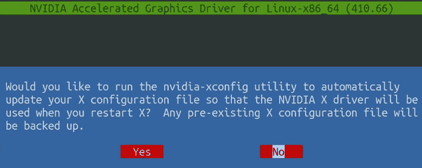

对此问题选择“否”

成功安装驱动程序后，重新启动机器。

你会注意到分辨率已经恢复正常，一切看起来都很好。

要验证安装，在终端上运行`nvidia-settings` 命令。

如果驱动程序安装正确，您可能会看到如下窗口。

您也可以通过在终端上运行`nvidia-smi`命令来验证安装，它应该会产生如下图所示的输出。

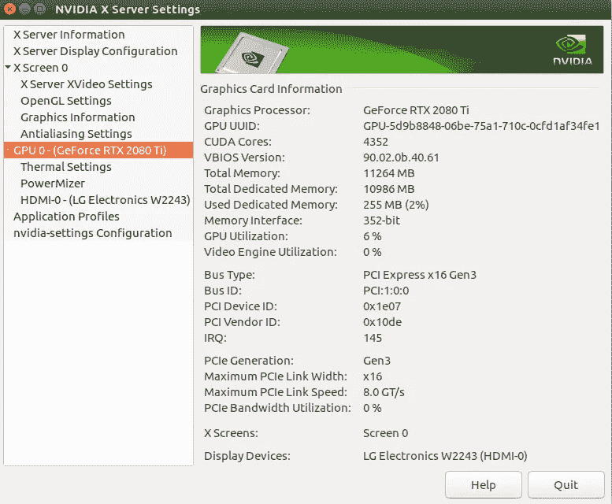

NVIDIA-设置输出

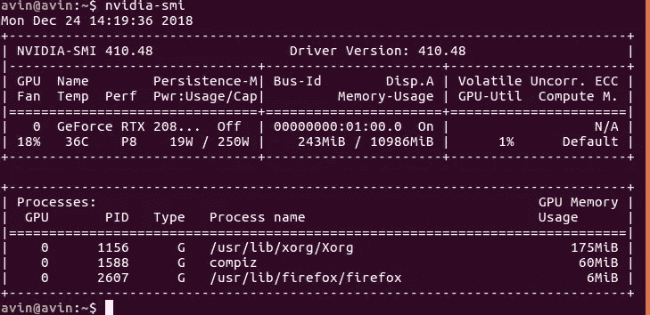

nvidia-smi 输出

好吧，那么，司机完成！现在，繁重的任务是为你的深度学习工作安装 CUDA。

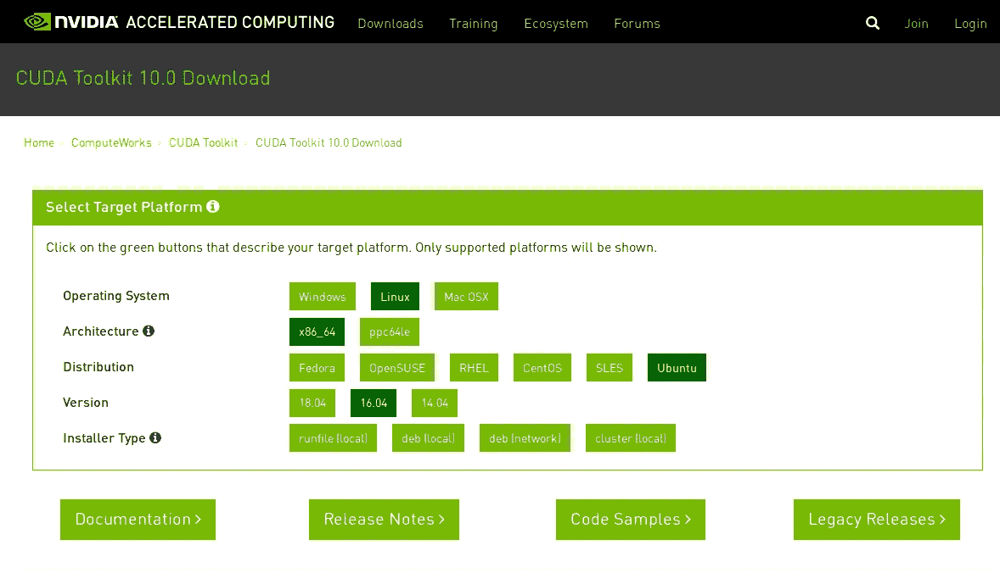

如上图，先去 Nvidia 网站[下载 cuda-10.0 runfile(本地)](https://developer.nvidia.com/cuda-downloads?target_os=Linux&target_arch=x86_64&target_distro=Ubuntu&target_version=1604)。

接下来的部分很棘手。我们需要将新的显示驱动程序列入黑名单，并从 GUI 中注销以开始安装。

当我们仍然在 GUI 中时，在您的主目录中创建一个名为`blacklist-nouveau.conf` 的文件，并将以下行添加到该文件中。

`blacklist nouveau
options nouveau modeset=0`

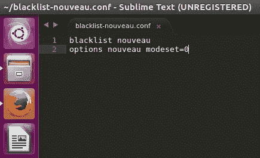

将新显示驱动程序列入黑名单

如果您之前尝试过安装 CUDA，请确保使用`sudo apt-get purge nvidia-cuda*`删除机器中所有的 Nvidia-CUDA 安装。

现在用`CTRL+ALT+ F1` **从 GUI 中注销。这将是一个黑屏。**

输入您的用户名和密码以进入终端。现在按照下面的步骤。(放心吧，`CTRL+ALT+ F7`是你的救命恩人登陆回 GUI)

1.  我们需要在这个黑屏终端中运行`sudo service lightdm stop` 来禁用 X-server。
2.  运行`sudo -i`进入超级用户模式。
3.  现在我们必须将我们在主目录中创建的黑名单文件复制到`/etc/modprobe.d`目录中。
    为此，运行`sudo cp /home/avin/blacklist-nouveau.conf /etc/modprobe.d`用你的用户名修改 avin。
4.  以上完成后，运行`sudo update-initramfs -u`。
5.  退出超级用户模式，运行`exit`。
6.  Cd 到您下载 CUDA 运行文件的目录，运行`cd Downloads/`。
7.  用`md5sum cuda_10.0.130_410.48_linux.run` 验证 CUDA 运行文件(可选)。
8.  运行`sudo sh cuda_10.0.130_410.48_linux.run`。

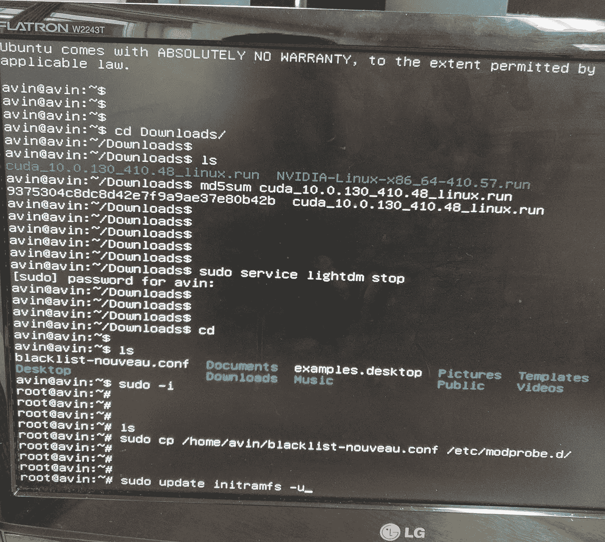

* *除了第一、第三和第四步，命令顺序无关紧要

将出现 CUDA 安装向导。只需按下`Q`跳过阅读协议，键入`accept`并按照下图所示的安装步骤进行操作。

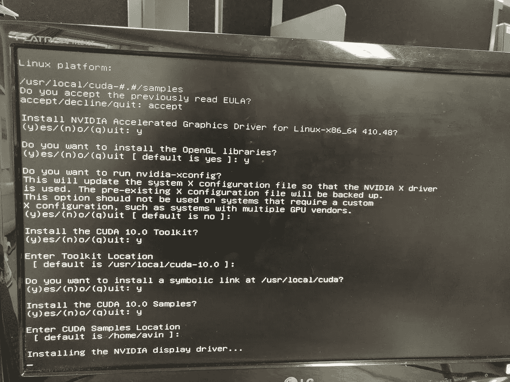

cuda 安装指南

它将在大约三分钟内在你的 Ubuntu 机器上安装 cuda-10.0。

最后，为了当场测试安装，您可以通过运行以下代码将 CUDA 路径添加到`PATH`变量中。

1.  `export PATH=/usr/local/cuda-10.0/bin${PATH:+:${PATH}}`
2.  `nvcc -V`

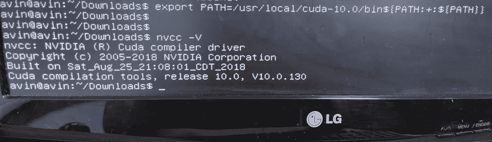

CUDA 安装成功消息

CUDA 现已安装。但是等等！我们还没完。

在此终端运行`reboot` 重启机器。一旦机器重启，我们必须将 CUDA 路径添加到`.bashrc`。

1.  运行`sudo subl ~/.bashrc` **。** 如果你没有安装 sublime-text3，你可以像[这个](https://askubuntu.com/questions/172698/how-do-i-install-sublime-text-2-3)一样安装它。或者你可以运行`sudo gedit ~/.bashrc`。
2.  在`.bashrc`文件的末尾添加后两行，并保存。`export PATH=/usr/local/cuda-10.0/bin${PATH:+:${PATH}}`和`export LD_LIBRARY_PATH=/usr/local/cuda-10.0/lib64${LD_LIBRARY_PATH:+:${LD_LIBRARY_PATH}}`
3.  运行`source ~/.bashrc`。

现在在终端中运行`nvcc -V`，只是为了验证你的安装。它应该给出如上图所示的输出。

安装 cuda-10.0 就是这样！我希望你喜欢读这篇文章，它对你有帮助。

**注意:**如果你打算在 GPU 上运行深度学习模型，你必须安装 [cuDNN](https://developer.nvidia.com/cudnn) 库和一个深度学习库，比如 [TensorFlow](https://www.tensorflow.org/) 。

这篇[文章](https://www.pytorials.com/how-to-install-tensorflow-gpu-with-cuda-10-0-for-python-on-ubuntu/2/)为[安装 cuDNN 和 TensorFlow-GPU 版本](https://www.pytorials.com/how-to-install-tensorflow-gpu-with-cuda-10-0-for-python-on-ubuntu/2/)提供了优秀的教程。