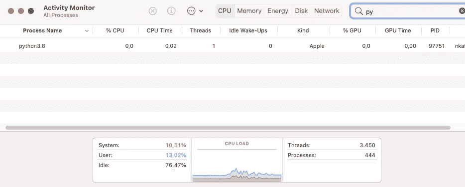

# 如何在苹果 M1 系列上安装 PyTorch

> 原文：<https://betterprogramming.pub/how-to-install-pytorch-on-apple-m1-series-512b3ad9bc6>

## 包括 M1 Macbook，以及一些让安装更顺畅的技巧


在 [Unsplash](https://unsplash.com?utm_source=medium&utm_medium=referral) 上由 [PolaroMagnet](https://unsplash.com/@polaromagnet?utm_source=medium&utm_medium=referral) 拍摄的照片

当苹果宣布发布新的苹果硅 M1 Macbook 时，它让 ML 社区大吃一惊。所有数据科学家首先想到的是，是否有可能将他们的工作空间转移到 MacOS 上。

当然，如果至少有两个最流行的数据科学框架 Tensorflow 和 Pytorch 与新处理器兼容，这样的举动是有意义的。就 Tensorflow 而言，已经取得了很多进展，无论是社区还是苹果。此外，苹果还发布了新的金属插件，使 Tensorflow 能够通过 tensor flow-Metal pluggable device 利用 GPU。

> 你可以从[这里](https://medium.com/@nikoskafritsas/list/setup-apple-m1-for-deep-learning-75e74b9f7cb4)访问“为深度学习设置苹果 M1”系列的所有文章，包括如何[在 Mac M1](/installing-tensorflow-on-apple-m1-with-new-metal-plugin-6d3cb9cb00ca) 上安装 Tensorflow 的指南。

Pytorch 在兼容性方面有些落后，但是，你现在可以在 M1 macbook 上安装 Pytorch 了。以下是如何做到这一点:

**注意:**如果已经安装了 Tensorflow，可以跳过前 2 步。

# 步骤 1:安装 Xcode

一些 M1 macbook 预装了 Xcode。如果没有，可以很容易地从 App Store 下载。然后，使用以下命令安装 Xcode 命令行工具:

```
$ xcode-select --install
```

# 步骤 2:安装 MiniForge

本质上，MiniForge 是一个 conda 安装程序，与 MiniConda 相当。它最大的优势之一是兼容 MacOS，包括 M1 设备。要下载它，请转到此[页面](https://github.com/conda-forge/miniforge)，选择 Apple Silicon 的安装程序并执行:

```
$ bash Miniforge3-MacOSX-arm64.sh
```

如果您已经有了一个预先存在的 conda 发行版，例如 Anaconda 或 MiniConda，那么就没有必要卸载它来使用 MiniForge。对于那些熟悉 conda 生态系统的人来说，在一个给定的时间内，只有一个 conda 发行版可以“正常运行”。查看这篇[文章](/switching-between-multiple-conda-distributions-on-macos-b78b6b21720)，了解如何有效地同时管理多个 conda 发行版！

# 步骤 3:设置 conda 环境并安装 MiniForge

让我们在 MiniForge 中创建新的 conda 环境，并将其命名为 *pytorch_m1。*另外，不要忘记激活它:

```
$ conda create --name pytorch_m1 python=3.8
$ conda activate pytorch_m1
```

接下来，安装 Pytorch。检查[这里](https://pytorch.org/get-started/locally/)找到哪个版本合适。因为我们想要一个最小的 Pytorch 设置，只需执行:

```
$ conda install -c pytorch pytorch
```

或者，安装 Jupyter 笔记本电脑或实验室:

```
$ conda install -c conda-forge jupyter jupyterlab
```

就是这样！

要测试一切是否正常，运行一个简单的程序:

```
*# -*- coding: utf-8 -*-*
import torch
import math

dtype = torch.float
device = torch.device("cpu")

*# Create random input and output data*
x = torch.linspace(-math.pi, math.pi, 2000, device=device, dtype=dtype)
y = torch.sin(x)

*# Randomly initialize weights*
a = torch.randn((), device=device, dtype=dtype)
b = torch.randn((), device=device, dtype=dtype)
c = torch.randn((), device=device, dtype=dtype)
d = torch.randn((), device=device, dtype=dtype)

learning_rate = 1e-6
for t in range(2000):
    *# Forward pass: compute predicted y*
    y_pred = a + b * x + c * x ** 2 + d * x ** 3

    *# Compute and print loss*
    loss = (y_pred - y).pow(2).sum().item()
    if t % 100 == 99:
        print(t, loss)

    *# Backprop to compute gradients of a, b, c, d with respect to loss*
    grad_y_pred = 2.0 * (y_pred - y)
    grad_a = grad_y_pred.sum()
    grad_b = (grad_y_pred * x).sum()
    grad_c = (grad_y_pred * x ** 2).sum()
    grad_d = (grad_y_pred * x ** 3).sum()

    *# Update weights using gradient descent*
    a -= learning_rate * grad_a
    b -= learning_rate * grad_b
    c -= learning_rate * grad_c
    d -= learning_rate * grad_d

print(f'Result: y = {a.item()} + {b.item()} x + {c.item()} x^2 + {d.item()} x^3')
```

除此之外，检查程序是否在苹果 M1 处理器上本地运行也是必要的。如果是这种情况，在活动监视器上的 **'** 种类 **'** 下，您应该会看到“苹果”选项。如果您看到英特尔，说明安装过程中出现了问题。



# 解决几个常见问题:

## 1 . **Numpy 未被识别**

实际上，这个问题是由于 Miniforge 安装了非 conda-forge numpy 版本而出现的。您可能会看到类似这样的内容:


这个问题可以通过安装`openblas`包轻松解决:

```
$ conda install -c conda-forge openblas
```

## 2.**英特尔使用而非苹果:**

一些用户可能仍然会在活动监视器中观察到使用的是英特尔而不是苹果。对此的一种可能解释是 conda 没有正确识别 arm64 架构(这是自动完成的)。因此，conda 安装了基于 arm64 的库版本。

在这种情况下，应该在创建新的 conda 环境时明确指定架构。为了解决这个问题，在 Minforge 中创建新的 conda 环境时，改为执行以下命令:

```
$ CONDA_SUBDIR=osx-arm64 conda create --name pytorch_m1 python=3.8
```

# 结束语

Pytorch 是数据科学生态系统不可或缺的一部分，这就是为什么我认为在新系列的苹果芯片计算机上安装该框架的全面指南是绝对必要的。

另一方面，Pytorch 还有很长的路要走。下一个里程碑可能是允许 Pytorch 使用 GPU 的库或插件。