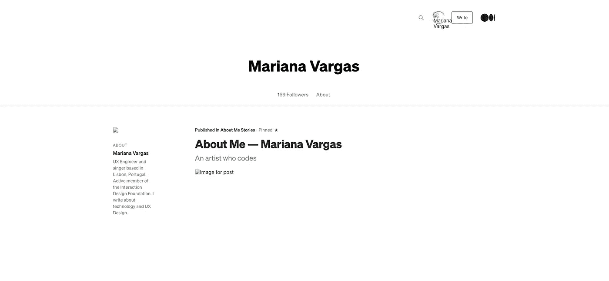
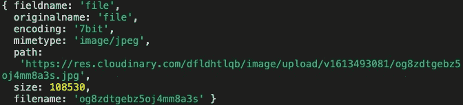

# 如何在 Node.js + React Web App 中集成图片上传的云服务

> 原文：<https://betterprogramming.pub/how-to-integrate-cloud-services-for-image-upload-in-a-node-js-react-web-app-9cc0aea25015>

## 告别残破的映像和不堪重负的服务器


由 [vectorjuice](https://br.freepik.com/search?dates=any&format=search&query=cloud%20service%20vectorjuice&sort=popular) 在 [freepik](http://br.freepik.com) 上拍摄的照片。

你能想象访问你的中型个人资料页面并看到这个吗？



带有破损图像的作者中等个人资料页面

我不相信它会发生，因为媒体有一个非常坚实的平台。然而，在我学会如何在云中存储图像之前，我的一些旧网站曾经发生过这种情况。

在云服务中存储图像(和任何其他类型的文件),可靠性只是你的 web 应用程序可以获得的好处之一。由于更少的服务器请求，性能大大提高，这对于需要频繁上传文件或大量媒体资源的 web 应用程序至关重要。

你一定听说过最受欢迎的云服务，比如亚马逊 S3 和谷歌云。由科技巨头管理，他们可能是你能找到的最可靠的人。但是它们也有一些缺点，比如复杂的配置和对信用卡的要求。

如果你只是想要一个免费、快速、简单的设置，我有一个鲜为人知的选择给你: [Cloudinary](https://cloudinary.com/) 。

尽管如此，让我来指导您如何在 Node.js 和 React web 应用程序中创建图像上传功能，以及在 Cloudinary 云服务上存储图像(和其他文件)。作为奖励，我还将详细说明如何一次上传多个文件。

# 初始设置

本教程的起点是一个基本的 MERN 应用程序设置:

*   用 [create-react-app](https://reactjs.org/docs/create-a-new-react-app.html) 创建的前端，运行在端口 3000 上。
*   用 [express-generator](https://www.npmjs.com/package/express-generator) 创建的后端，运行在端口 5000 上(您必须在`bin/www`文件中更改默认端口)。

不要忘记正确设置 cors，以避免后端阻塞您的请求。我通过在`app.js`文件中添加下面这段代码来处理`cors`包:

```
npm install cors
```

在后端文件夹中创建一个新的`configs`文件夹。在其中，您将创建云二进制配置文件。我将在教程的后面详细介绍如何做到这一点。现在，您只需创建文件夹。

创建一个`.env`文件来设置所需的环境变量。之后，安装`[dotenv](https://www.npmjs.com/package/dotenv)`包:

```
*# with npm:*npm install dotenv*# or with Yarn:*yarn add dotenv
```

最后，在`app.js`文件的顶部导入包:

```
require(‘dotenv’).config()
```

不要忘记将`.env`文件添加到您的`.gitignore`文件中，这样您的环境变量就不会被推到远程存储库中！

# 使用 Cloudinary 上传文件

1.  转到 [Cloudinary](https://cloudinary.com/) 并创建您的帐户。
2.  创建并激活您的帐户后，复制 Cloudinary 仪表盘中显示的云名称、API 密钥和 API 秘密，并将其粘贴到`.env`文件中。


```
CLOUDINARY_NAME=your_cloudinary_name
CLOUDINARY_KEY=your_cloudinary_key
CLOUDINARY_SECRET=your_cloudinary_secret
```

3.安装必要的 NPM 软件包:

*   [cloudinary](https://www.npmjs.com/package/cloudinary) —带有完整映像管理管道的 cloudinary 软件包。
*   [multer](https://www.npmjs.com/package/multer) —用于处理`multipart/form-data`的 Node.js 中间件，主要用于上传文件。
*   [多存储云库](https://www.npmjs.com/package/multer-storage-cloudinary) —云库的多存储引擎。

要安装这三个软件包，您只需在前端的根文件夹中运行以下命令:

```
 npm install cloudinary multer multer-storage-cloudinary
```

4.在`configs`文件夹中，创建一个`cloudinary.config.js`文件。在该文件中，您将存储通过应用程序上传图像所需的所有配置:

上面代码中的`config`方法接收您在最后一步中设置的环境变量。

`CloudinaryStorage`对象决定 multer 接收的文件如何存储——即存储位置和可以存储的文件类型。该应用程序将只接受包含在`allowedFormats`数组中的格式。在这个例子中，我只上传了图片，但是你可以指定`.pdf`或者`.wav`文件。我只使用了`allowedFormats`和`filename`属性创建了`CloudinaryStorage`对象，但是你可以使用更多的属性。可选属性的完整列表见[官方上传 API 文档](https://cloudinary.com/documentation/image_upload_api_reference)。

5.创建一个名为`/cloudinary-upload`的路由来处理文件上传。

注意，这个路由返回了一个包含`secure_url`属性的 JSON 对象。`secure_url`的值是上传到云端的图片的 URL。这将有助于在浏览器中显示它。我建议在您的控制台中打印文件对象，以查看其全部内容。也许其他属性会对您有用:



不要忘记在`app.js`文件中添加路线以使其工作:

6.用 API 调用创建一个文件`services/uploads`文件到上一步定义的路线:

7.使用您选择的样式创建一个“file”类型的输入，并创建一个处理函数来附加文件。

只能将文件上传到带有`multipart/form-data` enctype 的数据结构中。因此，有必要将它附加到数据形式对象类型，以便正确地将它分派到后端。或者，只要添加适当的 enctype 作为属性，就可以使用表单组件来代替输入字段:

```
<form action="/movies/create" method="post" enctype="multipart/form-data"> </form>
```

# 运行您的应用

如果您启动服务器和客户端，现在您可以通过浏览器上传您的映像。以下是我的例子:


更新前上传页面截图。

上传一张图片后，你会在上传按钮旁边找到上传文件的名称。


更新后上传页面截图。

如果您访问 Cloudinary 平台，您可能会看到一张存储的图片:


更新后的 Cloudinary 平台截图。

# 图像显示

如果你的目标是上传图片，你可能也想在浏览器中显示它们。

注意，`/upload`已经返回了与上传到云中的图像的 URL 相对应的新文件路径。您可以直接使用它来设置`img`组件的`src`属性。下面是一个使用 React 钩子的例子:

以下是运行示例代码的结果:


如果您现在删除您从电脑上传的图像，该图像将继续显示在浏览器中，因为它存储在云服务中。只要你不在你的 Cloudinary 平台删除，就不用担心以后会成为残破的镜像。

# 额外收获:上传多张图片

如果您想允许上传多个文件，您可以调整您的`/upload`路径以适应一系列文件:

注意，`fileUploader`现在也将返回一个 URL 数组，而不是一个 URL。

# 结束语

现在，您可以使用 Cloudinary 等云服务在云上存储任何类型的文件，而不是用大量文件给数据库增加压力。您可以允许用户通过应用程序上传自己的文件，并通过链接将他们的图像显示到客户端，而不必将上传的图片本身保存在数据库中。

我希望你喜欢这个教程。您可以在本 [GitHub repo](https://github.com/marianamv112/cloud-service-image-upload) 中找到示例中使用的源代码。

编码快乐！

# 资源

*   [云二进制 npm 包](https://www.npmjs.com/package/cloudinary)
*   [Multer npm 包](https://www.npmjs.com/package/multer)
*   [多存储云 npm 包](https://www.npmjs.com/package/multer-storage-cloudinary)
*   [Cloudinary 云服务](https://cloudinary.com/)
*   [React 图像上传示例](https://academind.com/learn/react/snippets/image-upload/)