# 向 Django 和 React 应用程序添加条纹支付

> 原文：<https://betterprogramming.pub/how-to-integrate-django-react-app-with-stripe-payments-95709b3f23e5>

## 把你的用户变成顾客


rupixen.com 在 [Unsplash](https://unsplash.com?utm_source=medium&utm_medium=referral) 上[的照片](https://unsplash.com/@rupixen?utm_source=medium&utm_medium=referral)

# **简介**

你有没有想过创建一个应用程序，让用户只需支付一些一次性费用，并定期订阅？一方面，您希望根据需要保留尽可能多的信息，以便控制您的客户及其付款。另一方面，信用卡数据非常敏感，将它们存储在数据库中风险很大。

幸运的是，有一个非常有趣的解决方案。将您的应用与 [Stripe](https://stripe.com/docs) 整合将节省您的时间，并提供一个真正干净安全的支付流程。凭借其丰富的 API，您将能够实现任何类型的货币交易，此外，所有敏感数据都将在 Stripe cloud 中得到保护。

# **我们的目标**

出于本文的目的，我们将使用 [Django REST 框架](https://www.django-rest-framework.org/)为 API 后端创建一个简单的应用程序，使用 [React](https://reactjs.org/) 为前端创建一个简单的应用程序。

## ***我们 app 的主流程***

1.  用户提供他的电子邮件和信用卡/借记卡数据。
2.  我们根据用户提供的数据创建一个新的 Stripe 客户。
3.  用户将被收取创建帐户的一次性费用。
4.  用户还将注册每月订阅，以保持他的帐户活跃。

似乎很简单，不是吗？所以我们开始吧！

# 设置 Django API

假设我们已经创建了一个名为`StripeApp`的 Django 项目，并安装了 Django REST 框架库。

## **让我们在** `**StripeApp**` **项目根目录**中创建一个新的应用程序

```
python manage.py startapp payments
```

我们的项目结构应该是这样的(确保您有粗体文件名的文件，如果需要的话，创建缺失的文件):

```
- StripeApp/
  - payments
    - migrations/
    - __init.py__
    - admin.py
    - apps.py
    - models.py
    - tests.py
    - **urls.py**
    - **views.py**
  - stripeapp/
    - __init.py__
    **- settings.py
    - urls.py**
```

## **安装条带库**

```
pip install --upgrade stripe
```

## **注册 Stripe 仪表盘，获取您的测试密钥**

创建您的 [Stripe 帐户](https://dashboard.stripe.com/register)并从[仪表板](https://dashboard.stripe.com/test/apikeys)中获取您的测试密钥(可公开的和秘密的)。

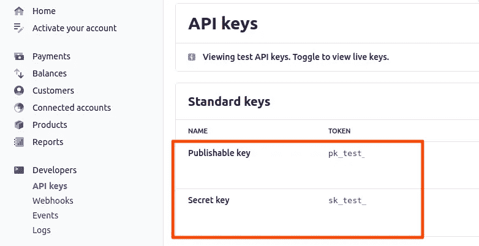

条带仪表板:API 键

## **将您的密钥复制到您的 Django 项目中**

```
*# payments/views.py*stripe.api_key = ‘sk_test_’ # your real key will be much longer
```

## **向条带 API 发出测试请求**

创建一个简单的视图进行条纹支付，以检查您的密钥是否有效。

**注意:**现在，只需复制代码，不要试图理解这个函数中发生了什么。一切稍后再解释。

```
*# payments/views.py*@api_view(['POST'])
def test_payment(request):test_payment_intent = stripe.PaymentIntent.create(
    *amount*=1000, *currency*='pln', 
    *payment_method_types*=['card'],
    *receipt_email*='test@example.com')return Response(*status*=status.HTTP_200_OK, *data*=test_payment_intent)
```

用`payments/urls.py`中的 URL 连接视图。

```
*# payments/urls.py*from django.conf.urls import url
from payments import viewsurlpatterns = [
    url(r'^test-payment/$', views.test_payment),
]
```

并在`stripeapp/urls.py`中定义`payments` URL 前缀。

```
*# stripeapp/urls.py*urlpatterns = [
    path('admin/', admin.site.urls),

 *# add this line* **path('payments/', include('payments.urls'))**
]
```

使用 Postman 发送您的新请求(`http://localhost:8000/payments/test-payment`)。如果您得到一个与下面类似的 JSON 对象，这意味着您已经成功地向 Stripe 发送了第一个请求。

```
{ 
  "id": "pi_123", #you will have a unique id every time
  "object": "payment_intent",
  "amount": 1000,
  "amount_capturable": 0,
  "amount_received": 0, 
  "application": null,
  "application_fee_amount": null,
...
}
```

# 设置前端项目

假设我们已经创建了一个名为`StripeAppFront`的 React 项目。

## **安装反应条纹**

```
npm install @stripe/react-stripe-js @stripe/stripe-js
```

## **创建结账表单**

创建一个新的 React 组件，它将显示如下表单:

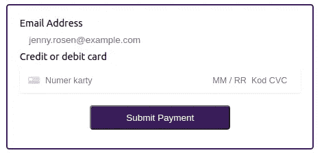

我们希望用户提供他的电子邮件和信用卡/借记卡数据。虽然电子邮件将被发送到我们的 API，但卡的敏感数据将由 Stripe 的`CardElement`处理，因此我们不会将它们存储在任何不安全的地方。根据条纹[文档](https://stripe.com/en-pl/payments/elements):

> “条纹元素使收集支付细节更加安全，并有助于防止恶意行为者窃取任何敏感信息。我们生成一个安全的 iframe，将敏感信息从您的网站中隔离出来，消除了所有类型的攻击，同时还能让您完全掌控全局。”

所以让我们写一些代码:

在`App.js`中，加载你条带的可发布 bey 并导入`Elements`。

```
*// App.js* *import React from 'react';
import './App.css';
import {Elements} from '@stripe/react-stripe-js';
import {loadStripe} from "@stripe/stripe-js/pure";
import CheckoutForm from "./components/CheckoutForm";**const stripePromise = loadStripe('pk_test_');**const App = () => (
  <Elements stripe={stripePromise}>
    <CheckoutForm />
  </Elements>
);**export default App;*
```

创建一个名为`components`的新文件夹，并在其中创建文件`CheckoutForm.js`。这将是前端项目中最重要的组成部分。

```
*# components/CheckoutForm.js*import {CardElement, useElements, useStripe} from "@stripe/react-stripe-js";
import React, {*useState*} from "react";
import ApiService from "../api";const *CheckoutForm* = () => {
  const [error, setError] = *useState*(null);
  const [email, setEmail] = *useState*('');
  const stripe = useStripe();
  const elements = useElements();*// Handle real-time validation errors from the CardElement.* const handleChange = (*event*) => {
  if (*event*.error) {
    setError(*event*.error.message);
  } else {
    setError(null);
  }
}*// Handle form submission.* const handleSubmit = async (*event*) => {
  *event*.preventDefault();
}; return (
  <form onSubmit={handleSubmit} className="stripe-form">
    <div className="form-row">
      <label htmlFor="email">Email Address</label>
      <input className="form-input" id="email" name="name"    type="email" placeholder="jenny.rosen@example.com" required 
value={email} onChange={(*event*) => { setEmail(*event*.target.value)}} />
    </div>
    <div className="form-row">
      <label for="card-element">Credit or debit card</label> 
      <CardElement id="card-element" onChange={handleChange}/>
      <div className="card-errors" role="alert">{error}</div>
    </div>
    <button type="submit" className="submit-btn">
      Submit Payment
    </button>
  </form>
 );
};export default *CheckoutForm*;
```

## **创建付款方式**

接下来，我们将使用 Stripe API 创建`PaymentMethod`对象，并将其 ID 发送给我们的 API。让我们再一次快速浏览一下条带文档并检查一下`PaymentMethod`的定义:

> "`PaymentMethod`对象代表客户的支付工具。它们可以与`[PaymentIntents](https://stripe.com/docs/payments/payment-intents)`一起使用来收取付款，或者保存到`Customer`对象中，以存储未来付款的工具详细信息。”

这意味着`PaymentMethod`存储用户的卡数据以用于支付交易。

所以让我们给`handleSubmit`方法添加几行代码:

```
const handleSubmit = async (*event*) => {
  *event*.preventDefault();
  const card = elements.getElement(CardElement);

 // add these lines
 **const {paymentMethod, error} = await stripe.createPaymentMethod({
     type: 'card',
     card: card
});**
}
```

**注:**您可以查看文档，了解`PaymentMethod`条纹的不同[类型](https://stripe.com/en-no/payments/payment-methods-guide#choosing-the-right-payment-methods-for-your-business)。

我们还添加了`console.log`操作来检查`PaymentMethod`对象的真实外观。因此，打开您的页面(`http://localhost:3000`)并将测试数据传递给表单。

**注:**作为卡号，可以使用 Stripe 提供的[测试卡](https://stripe.com/docs/testing#cards)中的一张，(如`4242 4242 4242 4242`)。CVC 和邮政编码都可以是任何数字，到期日期可以是任何未来的日期。

点击“提交付款”按钮，查看浏览器控制台。您可以看到一个包含大量数据的对象，但最重要的是`card`属性(如下图所示)。我们可以看到它没有存储完整的卡号，只存储了最后四个数字。现在，我们可以肯定没有人能够捕捉用户的卡的细节。

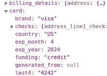

PaymentMethod 对象

## **向 Django API 发送 payment method . id**

安装`axios`包来处理前端的发送请求。

```
npm install axios --save
```

然后在项目根中，创建文件`api.js`，并创建`ApiService`类。在新创建的类中，定义静态方法`saveStripeInfo` 向我们的 API 发送 POST 请求(我们稍后将处理这个请求):

```
*// api.js*import axios from "axios";
export const API_URL ='http://localhost:8000'export const api = axios.create({
  baseURL: API_URL,
  headers: {
    "Content-type": "application/json"
  }
});export default class ApiService{
  static *saveStripeInfo*(*data*={}){
    return api.post(`${API_URL}/payments/save-stripe-info/`, *data*)
  }
}
```

最后，调用`CheckoutForm`组件中的方法:

```
*// CheckoutForm.js*const handleSubmit = async (*event*) => {*[...]* const {paymentMethod, error} = await stripe.createPaymentMethod({
    type: 'card',
    card: card
  }); //add these lines **ApiService.*saveStripeInfo*({
    email, payment_method_id: paymentMethod.id})
  .then(*response* => {
    *console*.log(*response*.data);
  }).catch(*error* => {
    *console*.log(*error*)
  })** **};**}
```

# 用 Stripe 实现 API 连接请求

现在是时候创建一个 API 视图来实现我们的主要目标了。在这个视图中，我们将创建一个新的磁条`[Customer](https://stripe.com/docs/api/customers)`，并向他的卡收取一次性费用(`[PaymentIntent](https://stripe.com/docs/api/payment_intents)`)。然后，我们将设置他的每月订阅(`[Subscription](https://stripe.com/docs/api/subscriptions)`)。在我们开始编码之前，让我们看一下 Stripe 文档，阅读一下提到的对象。

> `Customer`对象允许您执行重复收费，并跟踪与同一客户相关联的多项收费
> 
> “一个`PaymentIntent`引导你从你的顾客那里收集付款的过程。我们建议您在系统中为每个订单或客户会话创建一个`PaymentIntent`。”
> 
> "`Subscriptions`允许您重复向客户收费。"

好了，现在我们知道得更多了，不是吗？所以我们来编码吧。

## **创建您的客户**

在`payments/views.py`中，创建新方法`save_stripe_info`。我们将把`email`和`payment_method_id`传递给 Stripe，这样用户将与提供的卡数据相关联。

```
def save_stripe_info(*request*):
    data = *request*.data
    email = data['email']
    payment_method_id = data['payment_method_id']

    *# creating customer* customer = stripe.Customer.create(
      *email*=email, *payment_method*=payment_method_id)

    return Response(*status*=status.HTTP_200_OK, 
      *data*={
        'message': 'Success', 
        'data': {'customer_id': customer.id}   
    ) 
```

并将其添加到`payments/urls.py`:

```
urlpatterns = [
    url(r'^test-payment/$', views.test_payment),
 **url(r'^save-stripe-info/$', views.save_stripe_info),**
```

现在你可以刷新我们的网页并测试它。打开浏览器控制台，用`test@gmail.com`填写表格，使用任意测试卡号，然后提交。

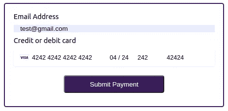

在控制台中，您应该会看到`Success`状态消息以及新创建的客户 ID。

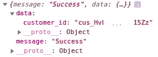

让我们检查别的东西。登录您的 Stripe 仪表板，打开[客户](https://dashboard.stripe.com/test/customers)选项卡。在这里，您可以看到一个新客户，他有我们在表单中提供的电子邮件。如果您单击它并打开客户详细信息，您将看到与控制台中打印的 ID 相同的 ID。

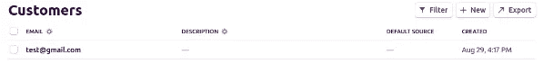

条带仪表板中的客户列表


条纹仪表板:客户详细信息

如果您向下滚动客户详细信息页面，您会发现付款方式部分包含表单中提供的卡数据。

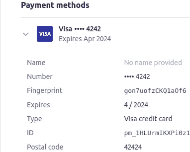

条纹仪表板:客户付款方式

这意味着我们刚刚创建了第一个 Stripe 客户。

## **检查客户是否已经存在**

好了，让我们稍微回顾一下我们的应用程序流程。用户正在传递他的电子邮件和信用卡数据，基于此，我们正在创建一个新的 Stripe 客户。一会儿，我们会起诉他，但是如果同一个人第二次填写表格呢？我们绝对不希望在 Stripe 中有重复的帐户，所以我们需要验证提供的电子邮件是否已经被使用。

Stripe API 共享一个列出我们的客户的方法`list`。使用一个`email`参数，我们可以获取一个过滤列表，并检查该电子邮件是否已经链接到另一个客户。让我们来看看:

```
# payments/views.py@api_view(['POST'])
def save_stripe_info(*request*):
  data = *request*.data
  email = data['email']
  payment_method_id = data['payment_method_id']
 **extra_msg = ''** # add new variable to response message *# checking if customer with provided email already exists***customer_data = stripe.Customer.list(*email*=email).data   
** 
  # if the array is empty it means the email has not been used yet  
 **if *len*(customer_data) == 0:**    *# creating customer* customer = stripe.Customer.create(
    *email*=email, *payment_method*=payment_method_id) **else:
    customer = customer_data[0]
    extra_msg = "Customer already existed."** return Response(*status*=status.HTTP_200_OK, 
    *data*={'message': 'Success', 'data': {
      'customer_id': customer.id, **'extra_msg': extra_msg**}
   })
```

我们刚刚添加了获取用户列表及其提供的电子邮件，并检查返回的数组是否为空。在第一种情况下，这意味着没有找到用户，我们可以创建一个新的用户。在第二种情况下，我们获取数组的第一个元素，并将其作为现有客户返回。

**注意:**当然，从`stripe.Customer.list`返回的数组可能有多个元素，但是出于本文的目的，我们假设客户电子邮件必须是惟一的。

让我们快速检查一下当前代码。刷新浏览器，再次发送相同的电子邮件。您应该在控制台中看到响应包含了`extra_msg`键，并且`customer_id`与前一个相同。条纹仪表板也没有改变，仍然只有一个客户。

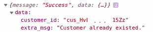

让我们再运行一次测试，并用电子邮件地址`test2@gmail.com`发送数据。


这次又发生了什么？

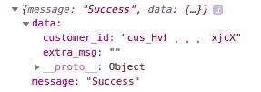

控制台给我们展示了一个不同的`customer_id`和一个空的`extra_msg`。现在，在 Stripe 仪表盘中，我们可以看到一个电子邮件地址为`test2@gmail.com`的新客户。

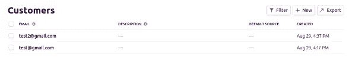

条纹仪表板:客户；中断服务线程

我们的验证正在起作用！

**注意:**通常你应该以某种方式处理电子邮件验证，并向用户显示一些消息或做任何其他事情来保持你的应用程序的流动。但在我们的案例中，我们不会关注它，所有的操作都只是应用于现有的或新创建的客户。

## **创建 payment intent——向客户收取一次性费用**

让我们实现第三个目标，向客户收取一次性费用。如前所述，我们将为此使用`PaymentIntent`对象。

```
# payments/views.py@api_view(['POST'])
def save_stripe_info(*request*): [...]
  else:
    customer = customer_data[0]
    extra_msg = "Customer already existed." # add these lines**stripe.PaymentIntent.create(
    *customer*=customer, 
    *payment_method*=payment_method_id,  
    *currency*='pln',** #you can provide any currency you want ***amount*=999)** # it equals 9.99 PLN
```

我们将我们的`customer`对象、`payment_method_id`、`currency`和`amount`传递给了`stripe.PaymentIntent.create`方法。让我们再次发送表单，并检查 Stripe 仪表板中会发生什么。当您打开[支付选项卡时，](https://dashboard.stripe.com/test/payments)您应该会看到如下内容:

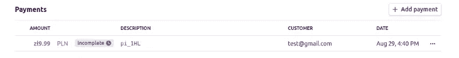

条纹仪表板:付款

付款似乎已经创建，但尚未完成。发生了什么事？让我们打开付款详情，向下滚动查看事件和日志。

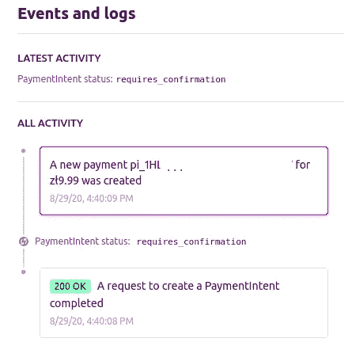

条纹仪表板:付款日志

好像付款需要确认。让我们回到[文档](https://stripe.com/docs/api/payment_intents/create)，再次阅读关于创建`PaymentIntent` s:

> “在`PaymentIntent`创建后，附上付款方式并[确认](https://stripe.com/docs/api/payment_intents/confirm)继续付款。(…)在创建过程中使用`confirm=true`时，相当于在同一个调用中创建并确认`PaymentIntent`(...)此参数默认为`false`。”

这意味着我们有两种可能性:(1)调用方法`stripe.PaymentIntent.confirm`来确认支付或者(2)在`stripe.PaymentIntent.create`方法中设置参数`confirm=True`。
让我们选择第二个选项，稍微修改一下我们的代码:

```
# payments/views.pystripe.PaymentIntent.create(
    *customer*=customer, 
    *payment_method*=payment_method_id,  
    *currency*='pln', # you can provide any currency you want
    *amount*=**1500**, # I modified amount to distinguish payments **confirm=True)**
```

再次发送表单，并刷新 Stripe 仪表板。您应该会看到状态为`Succeeded`的新付款:

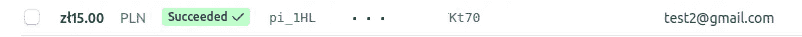

日志呢？

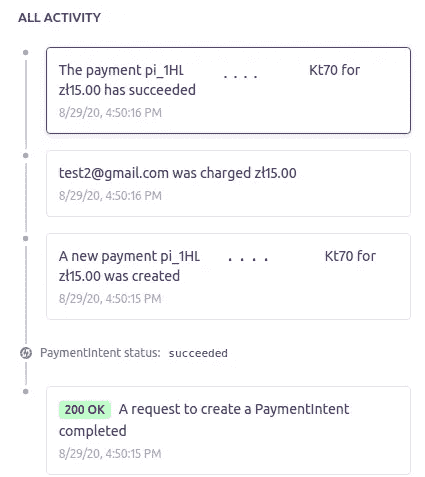

条纹仪表板—支付日志

一切都很好。付款已一次性创建并确认。我们刚刚完成了第三个目标。

# 创建订阅

最后，我们可以设置用户的订阅。根据条带文档，`Subscription`需要与一个`Price`对象链接，`Price`通常被分配给某个`Product`。

为了更好地解释，让我们想象不同类型的电影票:普通票、半价票和免费票。在这种情况下，我们的`Product`将是具有三个不同`Price`的`Ticket`对象。请看下图:

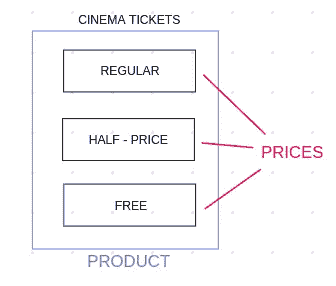

在我们的项目中，我们将为我们的应用程序创建一个名为`Monthly Subscription`的`Product`，每月支付价格为 50.00 PLN。

Stripe 共享 API 请求来创建代码中提到的所有对象。但是还有另一个更快更简单的选择:使用仪表板。因此，让我们打开[产品](https://dashboard.stripe.com/test/products)选项卡，并单击添加产品按钮。

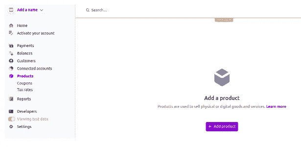

条纹仪表板:产品

然后填写名称和(可选)描述字段:

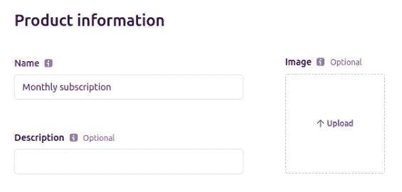

条纹仪表板:新产品形式

并创建一个`Price`和一个循环(每月)计费周期:

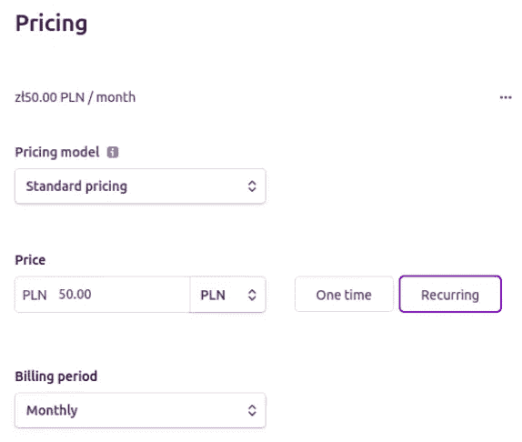

条纹仪表板:新定价表单

太好了！现在，您应该会在仪表板中看到新的`Product`。复制它的`Price`的 ID(从`price_`开始)，编辑我们的`save_stripe_info`。

```
# payments/views.py@api_view(['POST'])
def save_stripe_info(*request*): [...]
  **stripe.Subscription.create(
    *customer*=customer,
    *items*=[
      {
       'price': 'price_' #here paste your price id
      }
    ]
  )**
```

一切似乎都很好。它应该是有效的——不是吗？让我们检查一下。

哦不！你刚刚得到了一个类似于下面的错误吗？

```
***stripe.error.InvalidRequestError****: Request req_123: 
This customer has no attached payment source or default payment method.*
```

这是什么意思？让我们回到[文档，](https://stripe.com/docs/api/customers/object)在那里你会找到非常重要的信息:

> `Customer.invoice_settings.default_payment_method (optional)`
> 
> 附加到客户的付款方式的 ID，用作客户订阅和发票的默认付款方式

这意味着当您想要向您的客户收取定期订阅费用时，您必须首先分配`default_payment_method`。

好，我们开始吧！修改`stripe.Customer.create`方法:

```
customer = stripe.Customer.create(
  *email*=email,
  *payment_method*=payment_method_id,
  ***invoice_settings*={
    'default_payment_method': payment_method_id
  }**
)
```

并使用新的电子邮件重试:

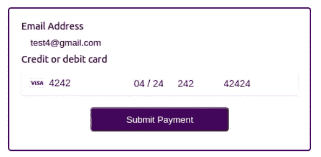

您应该会在控制台中看到`Success`消息，当您刷新 Stripe 仪表盘时，应该会有新的付款:

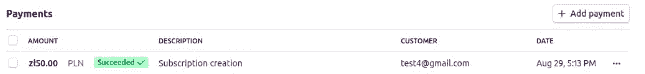

条纹仪表板:付款

当你点击它，你甚至会看到下一个付款日期:

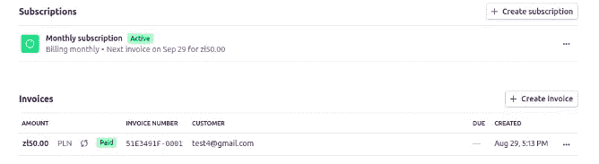

条带仪表板:订阅

太好了！您刚刚完成了应用程序。恭喜你！

你可以在这里找到完整的代码:[https://github.com/ewelina29/StripeApp/tree/master](https://github.com/ewelina29/StripeApp/tree/master)

# 结论

我希望你能成为 Stripe 的朋友，因为它是一个非常强大的库，可以处理你在开发生涯中遇到的任何支付噩梦。

我还建议您仔细阅读 Stripe 文档，因为其中有很多有用的信息可以帮助您避免错误，让您的生活更加轻松。