# 如何在前端集成 GraphQL 数据库

> 原文：<https://betterprogramming.pub/how-to-integrate-graphql-databases-in-your-frontend-25cddc13411>

## 用 FaunaDB 和 Next.js 构建一个简单的笔记应用


来源: [Amandazi 摄影](https://unsplash.com/@amandazi_photography)上 [Unsplash](http://unsplash.com)

# 介绍

## FaunaDB 是什么，为什么要用它？

说到构建 web 应用程序，MongoDB 是最流行的数据库解决方案之一。毫无疑问，使用和理解起来很简单。

例如，假设您想要从`Note`集合中检索一个项目列表。你可以用[猫鼬库](/how-to-use-mongoose-with-node-js-913a8073b29c)做类似的事情:

```
Note.find({}).lean();
```

这行代码将返回每个项目的所有字段。虽然这可能行得通，但在某些情况下有一个小问题。如果您只想显示列表中的一个字段，例如,`title`属性，该怎么办？

这就是 FaunaDB 的用武之地。和 MongoDB 一样，它也是一个非 SQL 数据库，但是使用 GraphQL 作为查询方法之一。这意味着，如果您只需要每个便笺的`title`字段，您可以运行这个 GraphQL 命令:

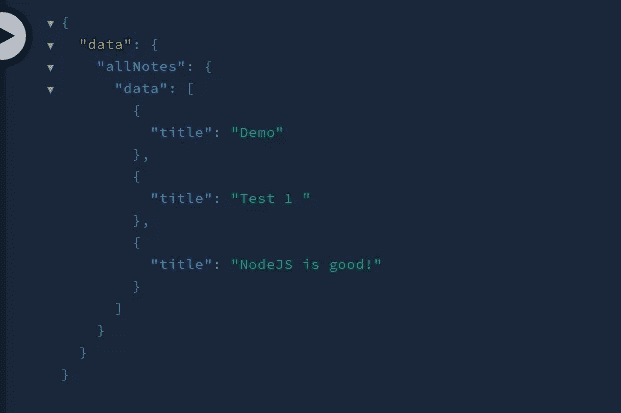

来自数据库的所有注释

就这么简单！此外，因为它是基于云的，所以非常适合无服务器应用程序。因此，您不必担心数据库环境的维护，因为动物群会为您处理一切。因此，它可以让您专注于编写应用程序，并构建您梦想的项目。

总而言之，FaunaDB 带来了稳定性、易用性和开发速度。

既然我们已经讨论了它的成果，让我们开始吧！

本教程结束时，您将拥有一个具有基本 CRUD 功能的笔记应用程序:


本文的结果

# 项目设置

## 创建 Next.js 存储库

要搭建 Next.js 项目，请运行以下终端命令:

```
npx create-next-app fauna-tutorial
```

## 模块安装

我们的项目使用以下依赖关系:

*   `formik`:我们将使用表单来捕捉用户输入。福米克图书馆将帮助我们做到这一点。
*   `graphql`和`graphql-request`:帮助我们在数据库上运行 GraphQL 请求。
*   顾名思义，这个模块将让我们构建模态和弹出窗口。

要安装这些依赖项，请执行以下 bash 命令:

```
npm i formik graphql graphql-request reactjs-popup
```

## 项目文件夹结构

我们现在需要在项目目录中创建一些文件夹。这将鼓励文件组织。

在项目目录的根目录中，创建以下文件和文件夹:

*   这个文件夹将保存我们的 GraphQL 配置和其他帮助方法。
*   `components`:将包含我们的可重用组件。
*   `schema.graphql`:`schema.graphql`文件将保存我们的`Note`集合的模式。

```
mkdir utils components
touch schema.graphql
```

最后，您的项目文件夹应该如下所示:


项目文件夹目录

完成后，就该建立我们的动物数据库了。

## 建立 FaunaDB

继续之前，在 [FaunaDB 的网页](https://dashboard.fauna.com/)上做一个账户。接下来，选择“新建数据库”来预配新数据库。

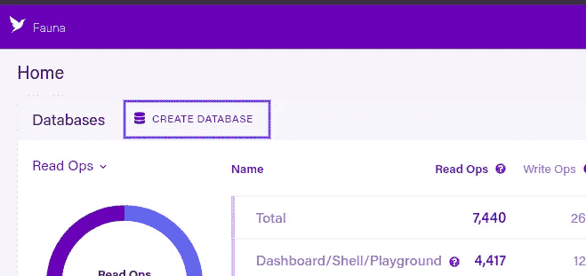

创建我们的数据库

现在，为您的新服务器指定一个名称及其托管区域。

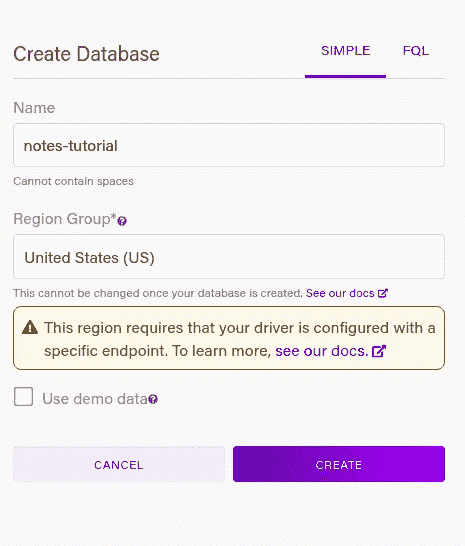

数据库设置

创建服务器后，单击“GraphQL”导航至 GraphQL 平台:

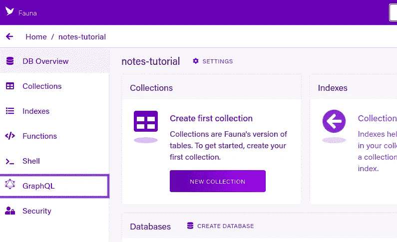

去 GraphQL 游乐场

FaunaDB 将要求您导入一个 GraphQL 模式。我们的模式将告诉动物界我们数据的结构。

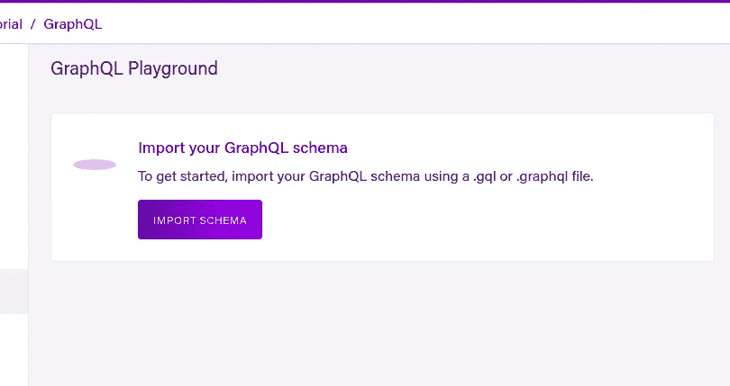

导入模式

在下一节中，我们将创建该应用程序所需的模式。

## 设计笔记模式

现在让我们创建我们的`Note`集合的模式。

之前，我们在项目中创建了一个`schema.graphql`文件。在该文件中编写以下代码块:

*   第 2 行和第 3 行:每个`Note`文档都有一个`title`和`body`字段。两者都是类型`String`。
*   第 6 行:当用户查询`allNotes`时，数据库将返回数据库中存在的所有笔记。

将该文件导入数据库，如下所示:

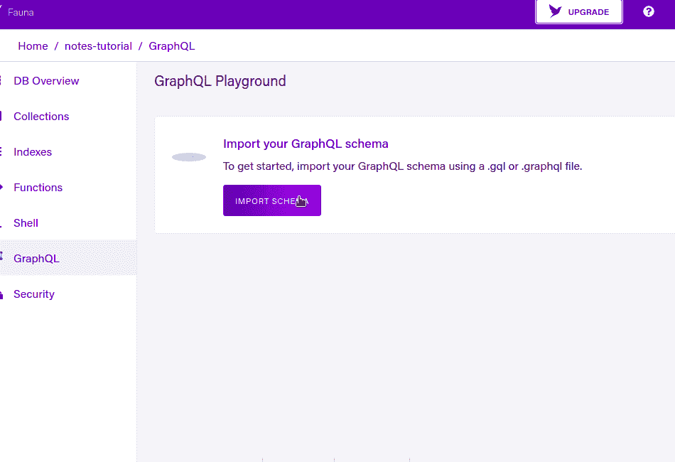

导入我们的模式

## 使用 GraphQL 操场

我们可以使用 Fauna 的 GraphQL playground 在我们的数据库上执行 CRUD 操作。

在操场上，从编写下面这段代码开始:

*   第 2 行:创建一个`Note`记录，并指定它的`title`和`body`字段。

这将是输出:

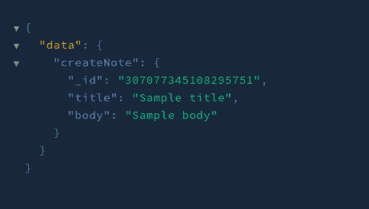

代码的输出

太好了！我们现在已经向数据库添加了数据。

现在让我们验证操作是否成功:

*   第 2 行:将所有的笔记存入存储器。
*   第 4–6 行:检索它们的`id`、`title`和`body`字段。

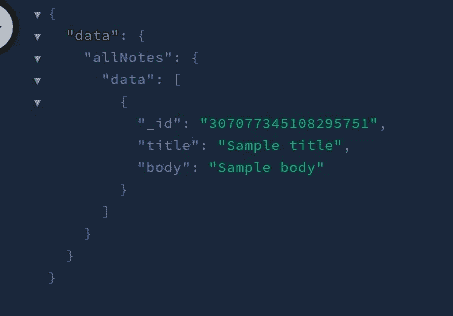

代码的输出

太好了！这意味着我们的行动成功了。

## 获取凭据

我们现在去拿安全钥匙。我们将需要这个来连接我们的数据库前端。

单击左侧面板中的“安全”:

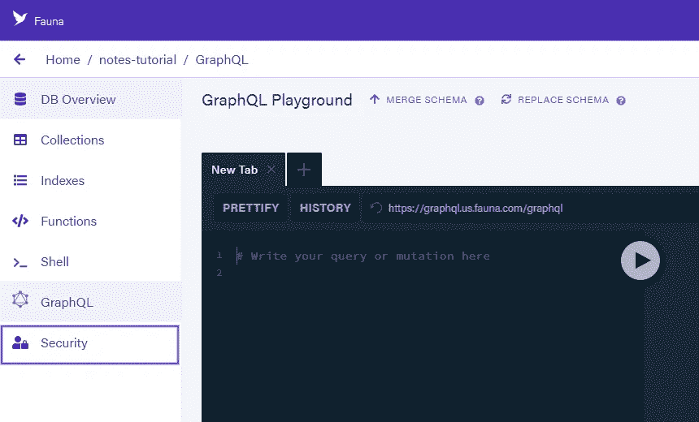

点击“安全”

完成此步骤后，单击“新建密钥”。确保您已经选择了以下设置:

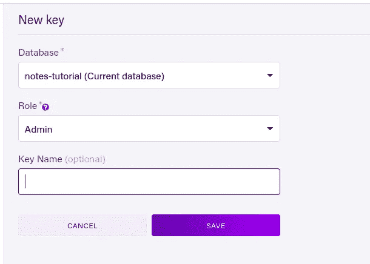

新密钥的设置

然后，弗娜会给你分配一个密钥:

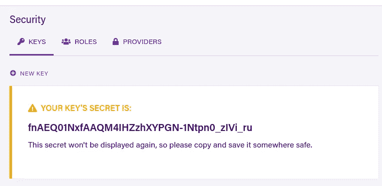

获取密钥

将该字符串复制到项目的`.env.local`文件中，如下所示:

```
NEXT_PUBLIC_FAUNA_SECRET=myKey
```

完成后，让我们现在构建我们的项目。

# 创建实用函数和自定义组件

在使用笔记功能之前，让我们创建助手函数和 React 元素。

## 定义我们的 GraphQL 查询

在你的`utils`文件夹中，创建一个名为`queryStrings.js`的文件。顾名思义，这个文件将保存我们的 CRUD 进程所需的 GraphQL 查询。

在该文件中，首先编写以下代码:

*   第 4 行:`insertNote`命令将运行一个突变请求。这里，`title`和`body`是`String`类型的变量。
*   第 5 行:这将告诉 Fauna 插入一个`Note`文档，并指定`title`和`body`字段。
*   第 13–16 行:`findNoteByID`查询搜索具有所需 ID 的文档。如果注释存在，服务器将返回其`_id`、`title`和`body`字段。

接下来，在`queryStrings.js`文件中添加以下代码:

让我们一点一点地解构这段代码:

*   `getAllNotes`将查询数据库中的所有记录。我们将使用它们的`id`和`title`字段。
*   `deleteNote`突变将找到具有所需 ID 的文档并删除它。
*   `updateQuery`变量将搜索具有特定 ID 的注释。找到后，动物群将编辑其`title`和`body`字段。

完成后，现在让我们配置我们的 GraphQL 客户端。

## 定义我们的 GraphQL 客户端

在本节中，我们将编写我们的动物客户端配置。这将允许我们链接我们的前端和后端。

在您的`utils`文件夹中，创建一个名为`graphqlClient.js`的文件。在这里，编写以下代码:

*   第 4 行:用我们选择的端点创建一个客户机。
*   第 6 行:提供我们的密钥用于认证目的。
*   第 10 行:导出这个配置，这样我们就可以向我们的动物群客户端发出请求。

## 创建查询函数

在您的`utils`文件夹中，创建一个名为`noteFunctions.js`的文件。这个文件将由执行 GraphQL 查询的帮助函数组成。

在这里，编写以下代码块:

构建我们的项目

*   第 10–12 行:运行`insertQuery`查询。这将告诉动物创建一个新的笔记。我们还通过参数提供了`title`和`body`变量。
*   第 14–16 行:该函数将调用`updateQuery`命令。
*   第 17–19 行:`deleteNote`方法将执行`deleteQuery`。我们提供`id`字段作为参数。这将从数据库中删除所选记录。

接下来，在同一个文件中编写以下代码:

*   第 1–4 行:该函数将获取服务器中的所有笔记并返回结果。
*   第 5–8 行:`getSingleNote`将从集合中检索所需的文档。

## 编写我们的弹出组件

在这一部分，我们将构建一个自定义的 React 弹出组件。当用户点击一个项目时，UI 会在一个弹出窗口中显示它的信息。

在您的`components`文件夹中，创建一个名为`PopupComponent.js`的文件。在这里，编写以下代码:

*   第 5 行:`PopupComponent`模块将接受一个`id`道具。这将是记录的 ID。
*   第 8–10 行:调用`getSingleNote`函数。这将获得具有匹配 ID 的记录。稍后，将结果存储在`data`钩子中。

接下来，将这段代码添加到同一个文件中:

*   第 6 行:单击时，将用户重定向到`edit`页面，并将注释的`id`字段作为 URL 参数发送。

## 创建我们的列表组件

在您的`components`文件夹中，创建一个名为`NotesList.js`的文件。该模块将在列表中显示客户的笔记。

*   第 7 行:`NotesList`会接受一个`data`道具。这将是包含用户笔记的数组。

现在，将这段代码添加到`NotesList.js`中:

从这段代码中可以得出一些推论:

*   第 5 行和第 19 行:`Popup`标签之间的所有代码都将是弹出窗口的一部分。
*   第 6–9 行:如果用户按下这个`button`元素，弹出窗口将会打开。方法将从 DOM 中移除这个模态。
*   第 12 行:用注释的`id`字段作为道具显示我们的`PopupComponent`。
*   第 20–27 行:单击时，运行`deleteNote`方法并刷新页面。

我们现在已经为此应用奠定了基础。在下一节中，我们将把这些模块结合在一起，让我们的 web 应用变得更加生动。

# 构建我们的项目

## 显示注释列表和删除功能

在`pages/index.js`中，开始编写以下代码:

*   第 9–11 行:从数据库中获取所有记录，并将结果存储到`data`钩子中。

完成后，在`pages/index.js`中添加以下代码:

*   第 3 行:点击时，引导用户到`add`页面。我们稍后将处理这条路线。
*   第 4 行:使用条件渲染。如果`data`的值是`null`(响应还没有加载)，通知用户数据正在路上。数据加载后，向用户显示列表。

运行代码。这将是结果:

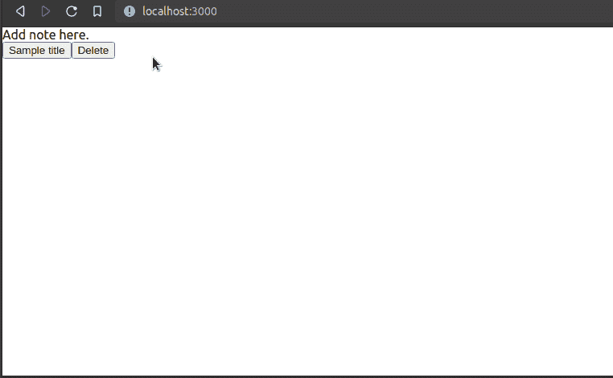

代码的输出

太好了！我们的代码有效。现在让我们来处理我们的`add`路线。

## 添加注释

在您的`pages/`目录中，创建一个名为`add.js`的新文件。这里，从编写以下代码块开始:

*   第 13–16 行:当用户提交表单时，调用`addNote`函数并将用户的输入作为参数传入。该过程完成后，将用户重定向到主页。

接下来，在同一个文件中添加以下代码:

*   第 3 行和第 6 行:为我们的`title`和`body`值创建输入字段。

这将是输出:

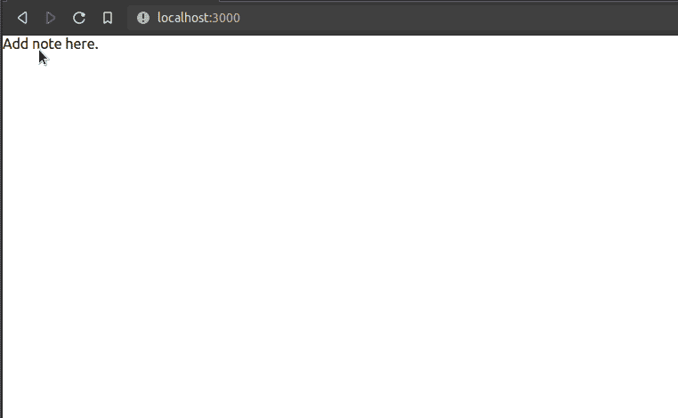

代码的输出

## 更新注释

在您的`pages`文件夹中，创建一个名为`edit.js`的新文件。这条路线将允许用户更新他们选择的笔记。

在这里，编写以下代码:

*   第 16 行:每当 React 检测到`isReady`变量的变化时，这个`useEffect`函数中的代码就会运行。这将告诉我们路由器字段是否可以在客户端使用。
*   第 15 行:如果`router.isReady`是`true`(我们可以消费`useRouter's`字段)，调用`getData`方法。这将检索当前记录的信息。这里，我们使用 URL 的`id`参数作为`getData`函数的参数。

第二步，在同一个文件中添加以下代码:

*   第 5 行和第 6 行:这个表单的初始值将是注释的当前`title`和`body`值。
*   第 8–10 行:当用户提交时，运行`editNote`方法。这将根据用户的当前输入更新文档。

这将是代码的输出:

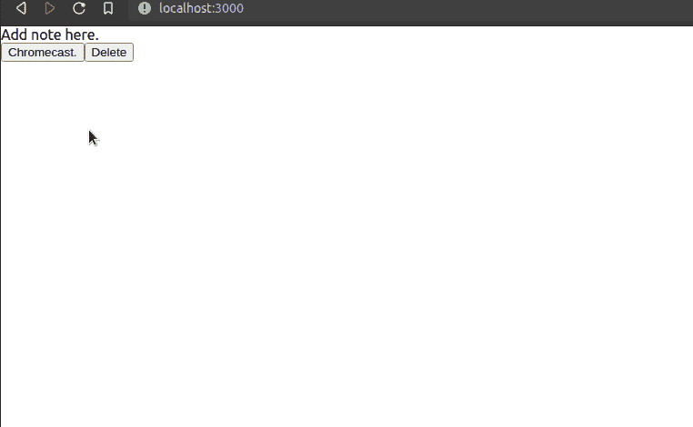

代码的输出

我们完事了。

# 额外资源

[GitHub 仓库的代码](https://github.com/HussainArif12/fauna-next-tutorial)。

*   [让我们用 FaunaDB 和 React](/lets-build-a-note-taking-app-with-react-and-faunadb-a2a1d5e78359)——[特雷弗-因德雷克·拉斯恩](https://medium.com/u/ce572601b7e?source=post_page-----25cddc13411--------------------------------)来构建一个笔记应用
*   [用 FaunaDB 和 Netlify 函数创建一个书签管理器 App](https://levelup.gitconnected.com/create-a-bookmark-manager-app-using-faunadb-and-netlify-serverless-functions-7d4365652692)——[Yogesh Chavan](https://medium.com/u/24d03d066e6c?source=post_page-----25cddc13411--------------------------------)
*   [将 Next.js 用于动物群和 GraphQL！—李·罗宾逊](https://www.youtube.com/watch?v=92qPXQa_BUQ)

# 结论

正如您在上面的代码示例中看到的，使用 FaunaDB 就像在公园里散步一样简单。它是稳定的，允许开发者快速构建他们的应用程序。动物群对无服务器应用程序很有用。这意味着程序员不必担心数据库的维护或设置。非常感谢您的阅读！编码快乐！