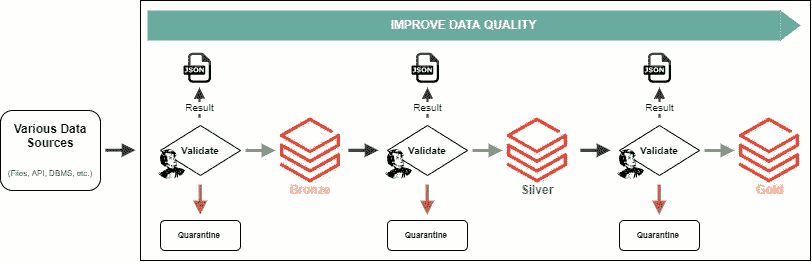
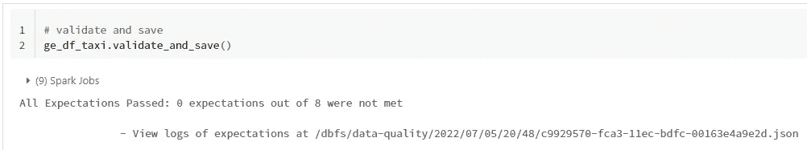
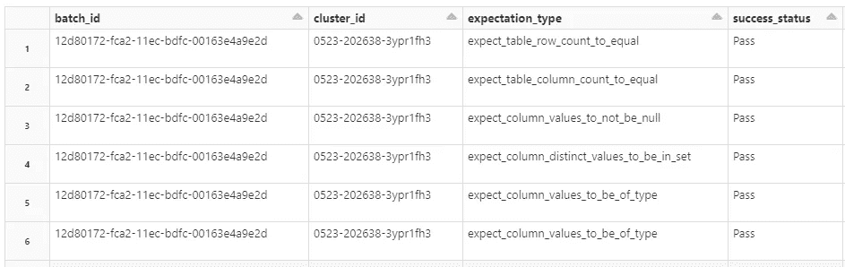
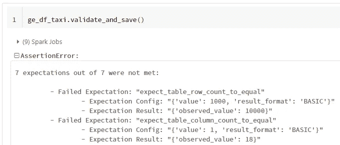

# 如何将《远大前程》与 Databricks 整合

> 原文：<https://betterprogramming.pub/how-to-integrate-great-expectations-with-databricks-e17740e2a97a>

## 获得更好的数据质量指标，实现一个巨大的改变

远大前程和数据砖块是绝配！形象成就了作者。

数据工程团队面临的一个常见挑战是如何最好地衡量数据质量。糟糕的数据质量会导致错误的见解和潜在的糟糕商业决策。集成的数据质量框架减少了团队在评估数据质量问题时的工作量。

[远大前程](https://greatexpectations.io/) (GE)是一个很棒的数据质量 python 库。它集成了 Apache Spark 和几十个预配置的数据预期。 [Databricks](https://databricks.com/) 是基于 Spark 构建的顶级数据平台。因此，您会期望它们无缝集成，但事实并非如此。

因此，在本文中，我将介绍一个简单的变化，您可以对一个 ge 类进行修改，从而在 GE 和 Databricks 之间实现更加集成的解决方案。

本文所有代码均可在回购[**这里**](https://github.com/sjrusso8/databricks-great-expectations-extended) 。

## **问题**

我希望有一种简单的方法来集成 GE 和 Databricks，而不需要在 PySpark 和配置文件之间切换。我发现在托管环境中使用 GE 很有挑战性。通用电气确实提供了“如何在数据块中使用远大期望”的分步指南如果您一步一步地遵循指南，您最终会得到堆积如山的配置设置。

具体来说，我想要一个数据质量框架，它能很好地与 data bricks[Medallion Architecture](https://databricks.com/glossary/medallion-architecture)相适应，并触及以下领域:

*   最小的开销，并且它“只适用于”数据块
*   能够根据其他 PySpark 代码编写数据质量测试
*   如果基础数据以意外方式更改，则引发错误
*   将结果作为文件保存到存储位置

最终状态将是类似于以下的架构模式:

灵感来自数据砖[圆形建筑](https://databricks.com/glossary/medallion-architecture)的示意图

随着数据通过每一级，数据质量逐渐提高。在这个过程中，每次数据被验证时，结果都被保存为 JSON，坏数据在加载到下一级之前被隔离。

## 解决方案:扩展 *SparkDFDataset* 类

GE 的一个基本数据集类是 **SparkDFDataset** 。SparkDFDataset 继承了 PySpark DataFrame，并将所有期望都实现为方法。

> 通过扩展 **SparkDFDataset** 类，您可以添加新方法来增强与数据块的集成。

下面的代码演示了我如何添加一些方法来集成 GE 和 Databricks。

方法`get_notebook_metdata()`使用 Databricks `dbutils`对象收集关于笔记本的所有元数据，并返回一个 python 字典。

最重要的添加是`.validate_and_save()`方法，它完成了以下工作:

*   将 Databricks 元数据作为阿格引文添加进来
*   运行`.validate()`生成“验证对象”
*   将“验证对象”作为 JSON 保存到存储位置
*   断言没有预期失败，并在笔记本上打印出一条消息

这些是对主类的小调整，但是它们有助于使 GE 和 Databricks 的使用更加顺畅。

## **使用 *ExtendedSparkDFDataset* 类**

为了与通用电气教程保持一致，下面的例子使用了一个相似的纽约出租车数据集。该数据集被预加载到 Databricks 工作空间中的位置' */databricks-datasets/* '下。下面提供的代码将使用 **ExtendedSparkDFDataset** 作为“验证”步骤的一部分。

当在笔记本中运行`validate_and_save()`方法时，会提供一条打印消息，显示所评估的期望值数量以及 JSON 文件在存储器中的写入位置。

笔记本中 validate_and_save()方法的示例

因为所有的验证结果都是 JSON，所以可以使用 Databricks 查询结果。以下是查询 JSON 文件的输出结果:

cluster_id 是运行笔记本或作业的 Spark 集群 id。

相反，如果期望在`validate_and_save(),`期间没有通过，则输出消息将类似于带有`AssertionError`的以下内容:

有错误的笔记本中的 validate_and_save()方法示例

## 插图的编号

尽管这种方法消除了一些启动和运行 GE 的配置开销，但是您也失去了一些特性。以下是扩展`SparkDFDataset`的一些利弊:

## **优点**

1.  更简洁的管道代码，配置设置更少
2.  预期与 PySpark 一致
3.  断言预期的成功将抛出一个错误并停止处理
4.  结果保存为 JSON，可以用本地数据块函数进行查询

## 骗局

1.  失去轻松呈现 GE 数据文档的能力
2.  不能使用 GE 文档中描述的“期望套件”或“检查点”
3.  您必须在不使用 profiler 类的情况下编写每个期望，以快速生成一个基本的期望套件

最后，Databricks 有一个新的 [**Delta Live Tables**](https://databricks.com/product/delta-live-tables) 特性，带有内置的质量控制。问题是，您必须专门为 Delta Live 表开发管道。我计划将来一定要深入 DLT！

## 把它包起来！

在本文中，我展示了如何扩展一个基本的 GE 数据集，以实现与 Databricks 的额外集成。我在我的数据工程中使用了一个类似的定制类，这样我的团队可以随着时间的推移准确地跟踪数据质量。我相信这种方法比设置 GE 在托管环境中工作更直接有效。

同样，这篇文章的所有代码都可以在回购[这里](https://github.com/sjrusso8/databricks-great-expectations-extended)找到。

查看我的另一篇关于如何隔离坏数据的文章，现在您已经识别了它:

 [## 处理不良数据质量的 3 种方法

### 设计为在坏数据毒害您的平台之前处理它！

medium.com](https://medium.com/@sjrusso/3-methods-for-dealing-with-bad-data-quality-b2e8c72fafc3)