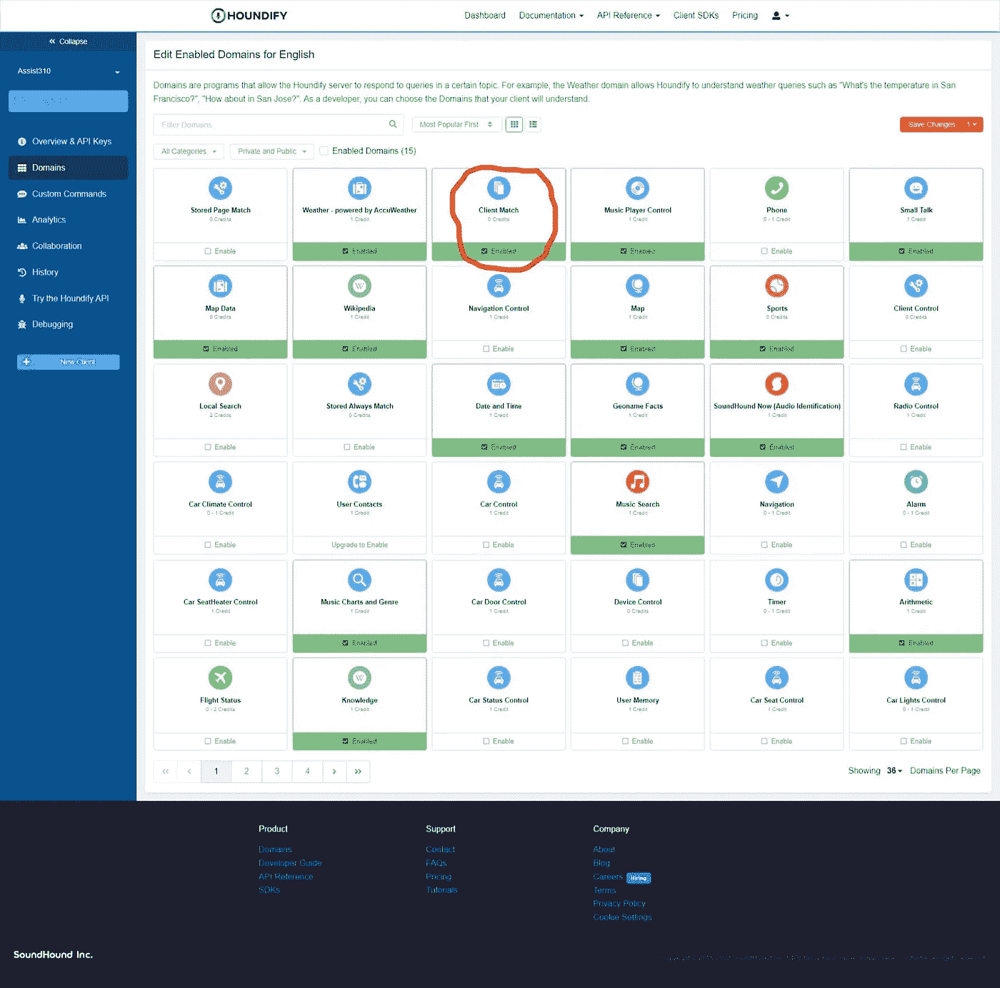
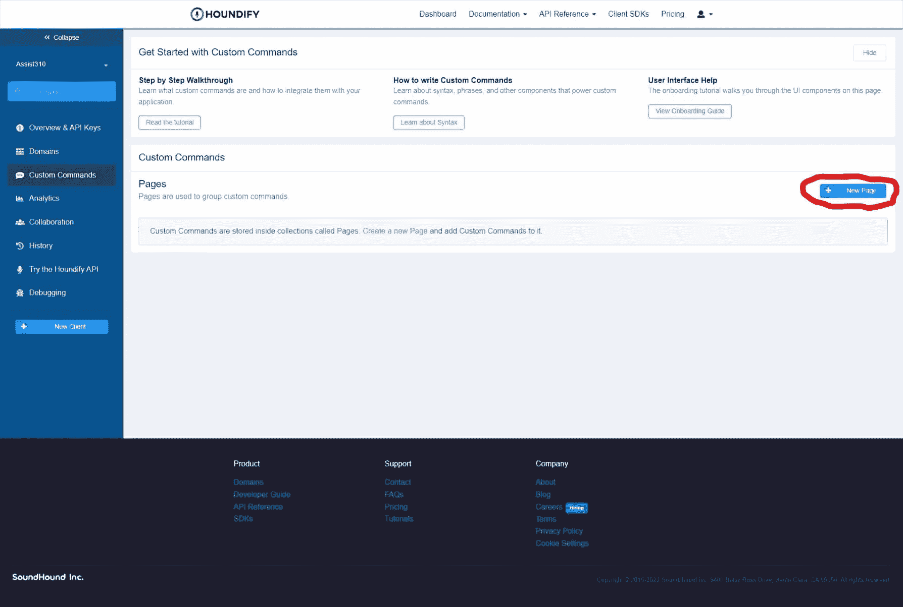
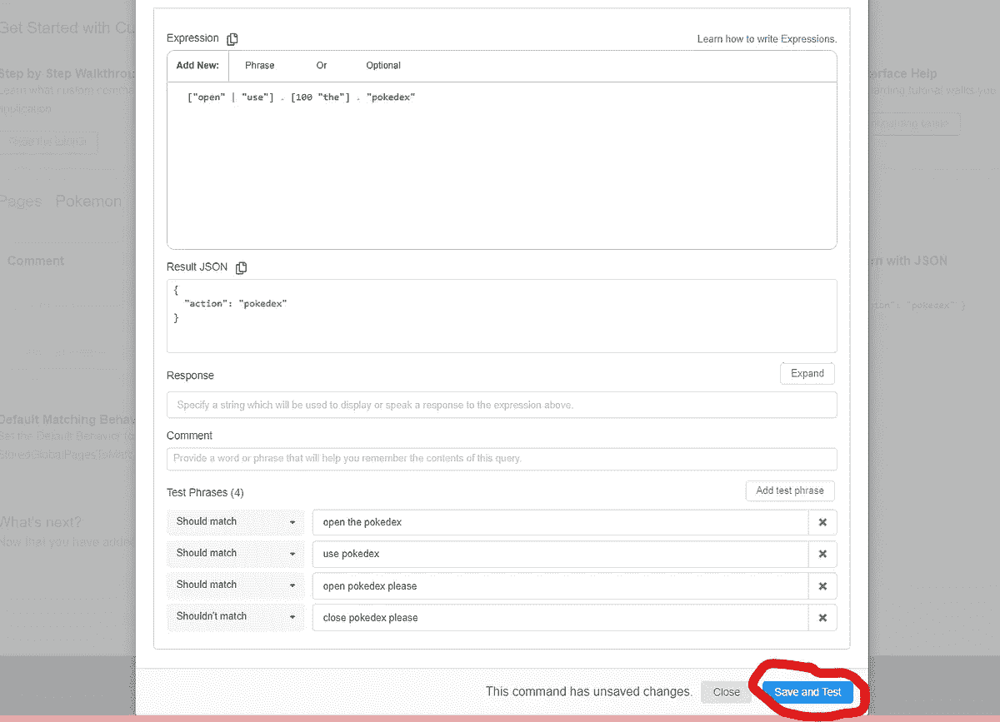

# 如何将 Pokédex 集成到您的人工智能助手 React 应用程序中

> 原文：<https://betterprogramming.pub/how-to-integrate-pok%C3%A9dex-into-your-ai-powered-assistant-react-app-83ab0e7136ec>

## 给我们的人工智能助手添加一个 Pokedex


# 安装

如果您错过了上一篇文章，[请到这里](/identify-music-with-your-ai-powered-assistant-4202763ca553)来了解我们如何添加新的命令处理程序。

如果您想重新开始，可在[这里](https://github.com/WoolDoughnut310/houndify-voice-assistant/tree/part4)获得启动代码。

首先，启用 ClientMatch 命令，如下所示:



启用并单击右上角的保存更改。这个域将使我们能够创建我们的命令。我们需要自定义命令，因为 Houndify 没有对 Pokedex 的内置支持。

# 创建自定义命令

点击侧边栏中的自定义命令，然后点击新页面。给新页面起个简单的名字，“口袋妖怪”



接下来，您需要创建一个新命令来触发客户端打开 Pokedex。像这样填写细节。



表达式显示了触发命令所需的查询。结果 JSON 包含我们运行命令时发送给客户机的数据。

我们将响应留空，因为我们将根据神奇宝贝的统计数据创建它。

切换到对话框的配置选项卡。点击`Imperative Phrase`。现在用户可以在命令的末尾添加一些东西，比如“please”。

点击`Save and Test`。如果您正确地配置了所有的东西，您应该会看到所有的测试都通过了。

# 处理客户端匹配命令

创建一个新的处理程序文件，见上一篇文章。把它命名为`ClientMatchCommand.ts`。

用以下代码完成该文件:

我们检查是否需要来自结果 JSON 的 Pokedex。然后我们调用`updatePokemonKeys`从 Pokedex 获取响应的对象键。稍后会详细介绍。

不要忘记在`handlers`数组中包含我们的新处理程序。

# 读取口袋妖怪数据

为了从 Pokemon API 获取数据，我们将从 NPM 为它安装一个名为`pokenode-ts`的包装器。

```
npm i pokenode-ts
```

在`handlers`目录下名为`ClientMatch`的文件夹中创建一个新文件。将文件命名为`handlePokemonCommand.ts`。

导入库并在文件顶部初始化一个新对象，如下所示:

```
import { PokemonClient } from "pokenode-ts";const pokedex = new PokemonClient();
```

现在我们需要定义一个函数来格式化 Pokedex 数据，供客户端使用。这些字段包括一些基本属性和额外的统计数据。

# 处理 Pokedex 命令

现在我们需要为这个文件定义默认的导出。首先，它提示用户输入口袋妖怪的名字和想要的属性。然后它获取这些信息并改变客户端的响应。

将以下代码添加到文件中:

我们还需要定义我们的`pokemonKeys`数组。它包含了结果类型`parsePokemonData`的键。

在文件顶部插入以下内容:

这将使用示例 pokemon 数据(id 1)缓存键值。

这篇文章的源代码可以在[这里](https://github.com/WoolDoughnut310/houndify-voice-assistant/tree/part5)找到。

请继续关注本系列的最后一部分，我们将把我们的应用程序部署到 web 上！

*原发布于*[*https://cs 310 . hash node . dev*](https://cs310.hashnode.dev/build-your-own-ai-powered-virtual-assistant-on-the-web-part5)*。*