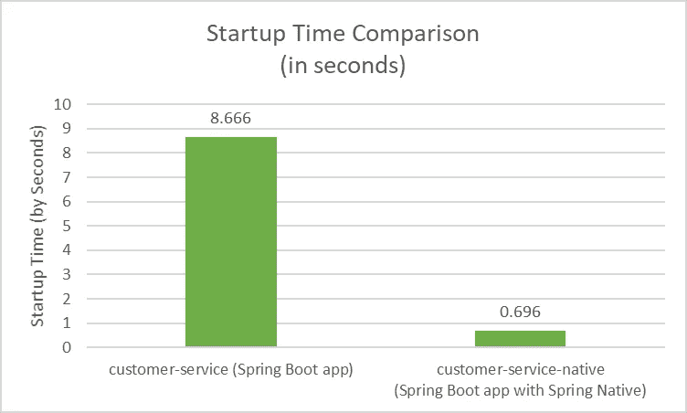
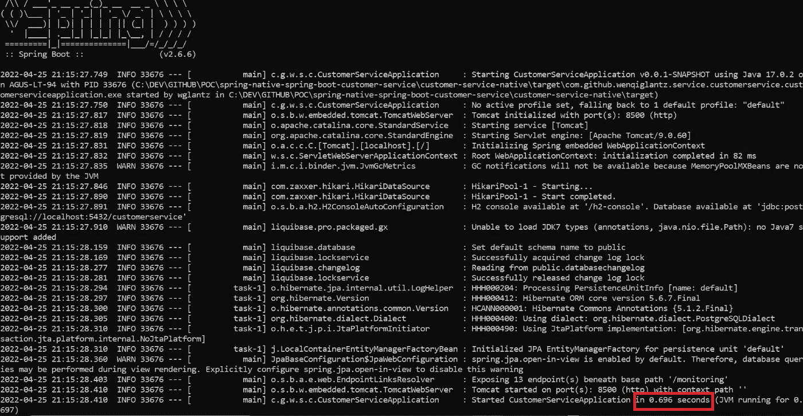
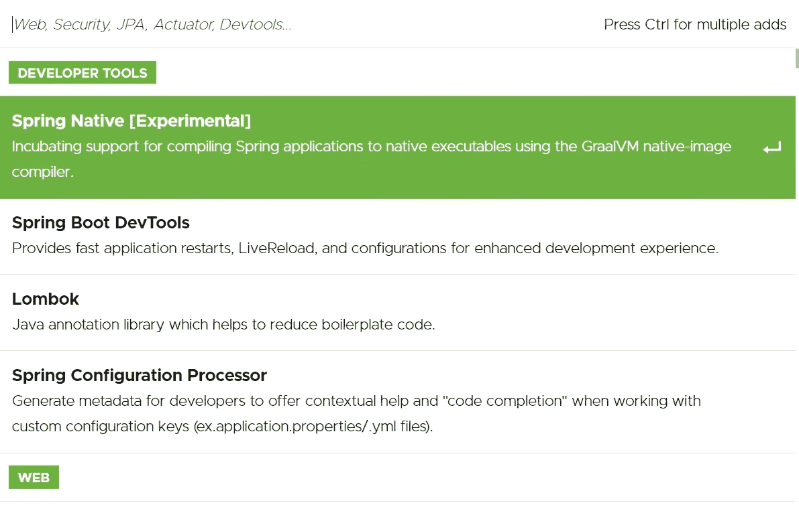
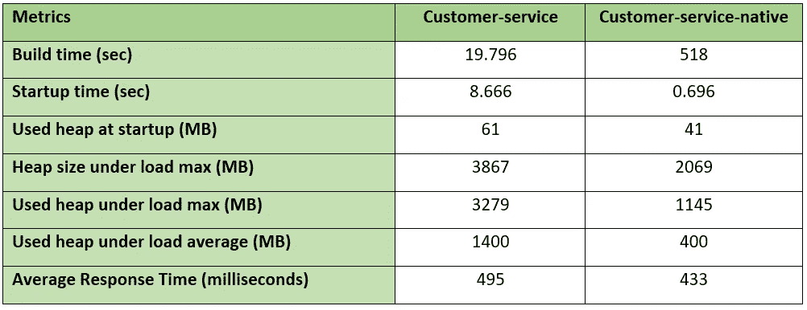
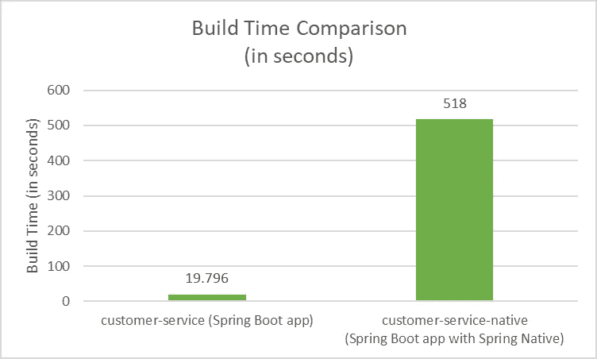
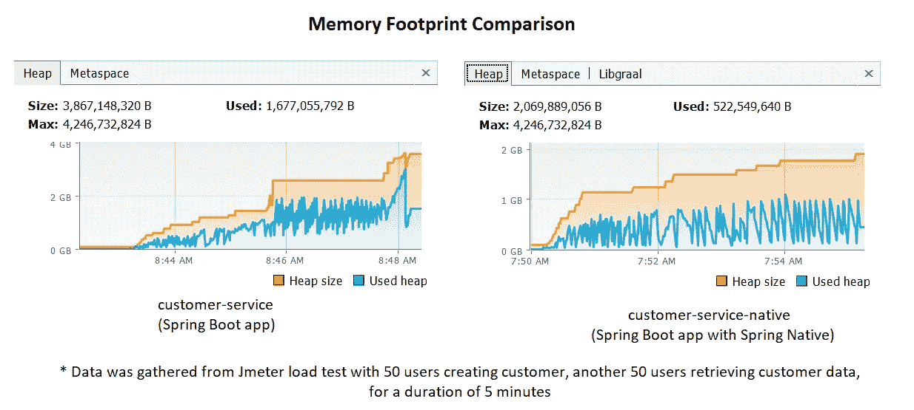
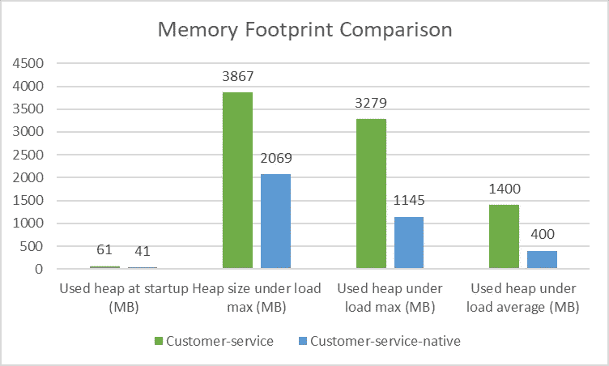
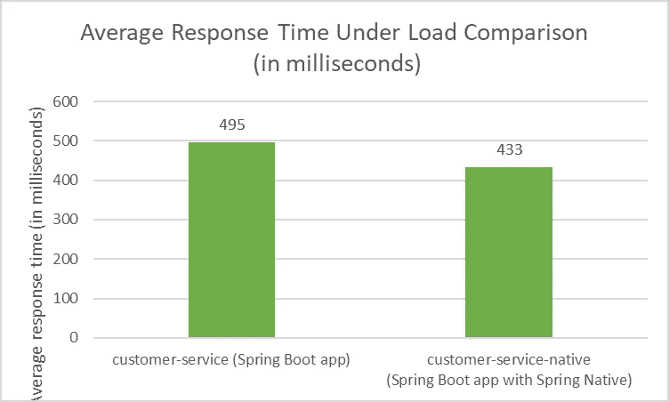

# 春天的土著:让 Spring Boot 飞翔的翅膀

> 原文：<https://betterprogramming.pub/how-to-integrate-spring-native-into-spring-boot-microservices-add2ece541b8>

## 如何将 Spring Native 集成到 Spring Boot 微服务的分步指南


图像背景由 [finix8](https://pixabay.com/users/finix8-13744375/) 来自 [Pixabay](https://pixabay.com/photos/hummingbird-bird-hibiscus-nature-5171798/)

尽管 Spring Boot 在 web 和微服务开发方面非常受欢迎，但它也有其局限性。最明显的是，启动时间长，内存消耗高。根本原因在于 Spring 如何依赖反射在运行时检查类、接口、字段和方法。在运行时不使用反射也能有同样的生产力吗？

是啊！春原有答案！

在这个故事中，我们将探索如何将 Spring Native 集成到名为[客户服务](https://github.com/wenqiglantz/spring-native-spring-boot-customer-service)的 Spring Boot 微服务中，这是一个管理客户的简单 CRUD 应用程序。我们将有两个客户服务应用程序，一个名为 customer-service 的普通 Spring Boot 应用程序，另一个名为 customer-service-native 的 Spring Boot 应用程序，内置了 Spring Native。我们将仔细观察 Spring Native 给 Spring Boot 带来的性能提升。

下面先睹为快，比较一下客户服务和本地客户服务的启动时间。



如你所见，原生 Spring 应用程序启动速度极快！要了解如何做到这一点，请继续阅读。

# 春天本土

Spring Native 在构建时使用 GraalVM 本机映像编译器将 Spring 应用程序编译成本机可执行文件，提供了一种部署 Spring Boot 应用程序的新方法，可以非常高效地运行。与 JVM 相比，GraalVM 本机映像可以为许多类型的工作负载提供更便宜、更可持续的托管。使用 GraalVM 本机映像提供了一些关键优势，例如:

*   即时启动
*   瞬间峰值性能
*   降低内存消耗

# GraalVM

GraalVM 是一个高性能、云原生、多语言的运行时，在应用程序性能和效率方面提供了显著的改进，是微服务的理想选择。GraalVM 由 Oracle 实验室开发，旨在提高基于 JVM 的语言的性能，以匹配本地语言的性能。它还旨在通过使用 GraalVM 原生映像技术提前编译(AOT)基于 JVM 的应用程序来减少启动时间。

# 原生图像

原生映像是一种创新技术，它将 Java 代码提前编译(AOT)成独立的二进制可执行文件，称为原生映像。AOT 编译器在构建期间执行几项任务，减少启动时间，如静态分析、删除未使用的代码、创建固定的类路径等。

本机映像构建器`native-image`是一个实用程序，它处理应用程序的所有类及其依赖项，包括来自 JDK 的类。它静态地分析这些数据，以确定在应用程序执行期间哪些类和方法是可访问的。然后它提前将可获得的代码和数据编译成特定操作系统和架构的本地可执行文件。

AOT 编译器的主要缺点是构建时间长。AOT 引擎在构建时评估条件，以生成优化的应用上下文和专为我们的应用打造的 Spring factory(Spring Boot 背后的插件系统)。实际上，这意味着:

*   运行时要执行的 Spring 基础设施更少。
*   运行时要评估的条件更少。
*   反射较少，因为使用了[编程 bean 注册](https://spring.io/blog/2017/03/01/spring-tips-programmatic-bean-registration-in-spring-framework-5)。

# 将 Spring Native 集成到 Spring Boot 微服务中

为了演示我们如何将 Spring Native 集成到 Spring Boot 微服务中，我们将把一个名为 [customer-service](https://github.com/wenqiglantz/spring-native-spring-boot-customer-service/tree/main/customer-service) 的演示 Spring Boot 服务转换为一个原生 Spring Boot 服务 [customer-service-native](https://github.com/wenqiglantz/spring-native-spring-boot-customer-service/tree/main/customer-service-native) ，通过下面的步骤来体验 Spring Native 带来的性能提升。

## **步骤 1:安装 GraalVM 和原生映像工具**

参考[GraalVM 入门说明](https://www.graalvm.org/22.0/docs/getting-started/)安装 GraalVM 和原生映像。对于 Windows 用户来说，用 Windows 10 SDK 安装 Visual Studio 还需要几个额外的步骤。请务必不要错过这些步骤。详情可以在故事[中找到在 Windows 10 上使用 GraalVM 和原生映像。](https://medium.com/graalvm/using-graalvm-and-native-image-on-windows-10-9954dc071311)在 Windows 上，`native-image`工具只有在从 Visual Studio 的 x64 原生工具命令提示符下执行时才起作用。

## **第二步:pom.xml 的变化**

Spring Native 的目标是支持将现有的或新的 Spring Boot 应用程序编译成本地可执行文件。不变。这是一个关键点！在将 Spring Native 引入 Spring Boot 微服务时，我们不期望任何代码更改。仅编译文件变更，如`pom.xml`或任何与本机提示相关的配置变更(参见下面关于本机提示的部分)。

我们需要在`pom.xml`中进行以下更改:

*   添加`spring-native`依赖
*   添加`spring-aot-maven-plugin`
*   为本地构建添加 spring 存储库
*   使用构建包构建本机映像或 docker 映像的选项
*   确保与`runtime`范围的任何依赖关系都已删除其范围，如 H2，请参见下面的代码片段。否则，本机映像构建将会失败。在 H2 的例子中，它抱怨`package org.h2.server.web does not exist`，这是有意义的，因为本机映像是在构建时构建的，所以标记为`runtime` 范围的依赖项在构建时将不可见。简单的解决方法是删除依赖关系的`scope`行。

```
*<*dependency*>
   <*groupId*>*com.h2database*</*groupId*>
   <*artifactId*>*h2*</*artifactId*>
   <*scope*>*runtime*</*scope*>
</*dependency*>*
```

需要记住的一个关键点是，AOT 编译器在构建期间花费的时间要长得多(在构建我们的客户服务本地应用程序时需要 8 分钟以上)，这在开发阶段是不可取的。为了解决这个问题，我们可以引入多个 maven 概要文件:

*   `default`配置文件允许我们的应用程序像普通的 Spring Boot 应用程序一样运行，没有`spring-native`依赖性。这对于开发阶段的构建非常理想。开发者甚至不会注意到他们正在开发的 Spring Boot 应用有 Spring 原生支持。
*   `spring-native`概要文件增加了`spring-native`依赖和 AOT maven 插件。这将 Spring Native 烘焙到我们的 Spring Boot 应用程序中。请注意，我们只在这个概要文件中添加了`spring-native`依赖关系，因此`default`概要文件不受`spring-native`的影响。
*   `build-docker-image`配置文件通过`paketobuildpacks/builder:tiny`构建器将应用程序构建到 Docker 映像中，这需要安装 Docker。
*   `build-native-image`概要文件使用 GraalVM 本机映像将应用程序构建为本机可执行文件。

按照 spring.io 的说法，在撰写本文时，最新的 spring 原生版本 0.11.4 已经针对 Spring Boot 2.6.6 进行了测试。让我们来看看完整的`pom.xml`变化，特别是不同的配置文件，如上所述:

## **第三步:构建 Spring Boot 原生 app**

如上所述，有两种方法可以构建 Spring Boot 原生应用:

*   假设已经安装了 Docker，使用 Spring Boot Buildpacks 支持来生成包含本机可执行文件的轻量级容器。

```
mvn clean package spring-boot:build-image -Pspring-native,build-docker-image
```

*   使用本机构建工具生成本机可执行文件。

```
mvn clean package spring-boot:build-image -Pspring-native,build-native-image
```

## **第四步:运行 Spring Boot 本地 app**

要在使用`build-docker-image`成功构建 Buildpacks 之后启动 Docker 容器，运行以下命令来启动我们的演示本机应用程序。注意添加了`--rm`标志来指示 Docker 在容器退出时自动清理容器并删除文件系统。

```
docker run --rm wenqi/customerservice:latest
```

如果您使用本地构建工具`build-native-image`构建您的本地应用程序，在`target`目录下会生成一个可执行文件。在我们的例子中，文件名是`com.github.wenqiglantz.service.customerservice.customerserviceapplication.exe`。

只需运行可执行文件来启动应用程序:

```
./target/com.github.wenqiglantz.service.customerservice.customerserviceapplication
```



0.696 秒！太神奇了！

如果你正在使用 [Spring Initializr](https://start.spring.io/) 创建一个新的 Spring Boot 微服务，Spring Native 已经在依赖列表中了。一定要去看看。



# 比较

让我们将这两个演示应用放在一起，比较一些关键数据点。还使用 JMeter 执行了一个负载测试，通过 [VisualVM](https://visualvm.github.io/) 进行监控，其中 50 个用户创建客户，另外 50 个用户检索客户数据。每个应用程序的负载测试持续五分钟。

*   客服:建成并运行于`amazon-corretto-17.0.1.12.1-windows-x64-jdk`
*   本地客户服务:在`graalvm-ce-java17-22.0.0.2`上构建并运行。
*   测试是在我的 Dell Latitude 7400、英特尔酷睿 i7–8665 u CPU @ 1.90 GHz、2112 Mhz、4 个内核和 8 个逻辑处理器上进行的。16GB 内存。基于 x64 的微软 Windows 10 企业版操作系统。



# **对比总结**

*   由于其 AOT 编译器，原生 Spring Boot 应用程序的构建时间要长得多。
*   原生 Spring Boot 应用程序具有闪电般的启动时间，由于其 GraalVM 和 AOT 编译器的设计。这也是我们将 Spring Native 集成到 Spring Boot 应用中的原因之一。为了实现如此惊人的性能提升，我可以愉快地忍受长构建时间。:-)更好的是，我们可以使用`default` maven 概要文件进行本地开发构建，并将本机映像构建移交给 CI 管道。
*   原生 Spring Boot 应用程序在启动和加载时的内存占用都要低得多。本机应用程序的堆大小和使用的堆比非本机应用程序低得多，特别是在负载下，这是非常令人印象深刻的！证明原生应用是未来的发展方向！
*   本地 Spring Boot 应用在负载下的平均响应时间上比非本地应用稍有优势。

# Spring 本机限制

Spring Native Beta 于 2021 年 3 月推出。请记住，有些库确实需要修改配置，所以这还不是完全无缝的体验。从最新版本 0.11.4 开始，它支持以下常见的 Spring Boot 初学者库:

*   `spring-boot-starter-data-jdbc`
*   `spring-boot-starter-data-jpa`(带配置修改)
*   `spring-boot-starter-aop`
*   `spring-boot-starter-batch`
*   `spring-boot-starter-web`(有配置修改)
*   `spring-boot-starter-actuator`(带配置修改)
*   `spring-boot-starter-test`(尚不支持 mockito)
*   等等。

关于 Spring 原生支持哪些库，哪些库需要配置修改的详细列表，请参考 Spring 网站上的 [Spring Boot 支持](https://docs.spring.io/spring-native/docs/current/reference/htmlsingle/#support-spring-boot)。

在开发演示原生应用时，我遇到了多个与依赖项相关的问题，包括 JPA、OpenAPI 和 Liquibase。截至本文撰写时，Spring Native 仍然不支持 Liquibase，有一个[开放 JIRA 票](https://github.com/spring-projects-experimental/spring-native/issues/620)用于此问题。

Spring Native 还不支持或不完全支持相当多的库，所以我不得不寻找本机提示来解决问题。

# 本机提示

正如在 [Spring 的本机提示页面](https://docs.spring.io/spring-native/docs/current/reference/htmlsingle/#native-hints)中所指定的，为了使用 Spring Native 尚不支持的特性或库，我们可以在`META-INF/native-image`下手动添加由 GraalVM 本机映像自动发现的静态文件。这被称为“本机提示”，这是 Spring Native 团队创造的一个有趣的术语。

在我的本地应用程序启动时，我遇到了一个丢失的`PostgreSQLDialect`错误。在目录`META-INF\native-image\org\springframework\aot\spring-aot\reflect-config.json`下的`reflect-config.json`中显式添加以下代码片段后，错误消失了。是的，这是一个必须添加的新目录/文件，以便手动提示 Spring Native 发现该文件中的类。

```
[
  {
    "name": "org.hibernate.dialect.PostgreSQLDialect",
    "condition": {
      "typeReachable": "org.postgresql.Driver"
    },
    "allDeclaredConstructors": true,
    "allDeclaredMethods": true
  }
]
```

在我的本地应用程序启动期间，我还遇到了以下 Liquibase 错误:

```
Native reflection configuration for liquibase.configuration.LiquibaseConfiguration.<init>() is missing
```

在将`LiquibaseConfiguration`类添加到`reflect-config.json`后，我遇到了一系列与其他 Liquibase 类缺失相关的错误。经过一些研究后，我发现了 Josh Long 的解决方案来解决 Spring Native 缺乏对 Liquibase 支持的问题。这是一个相当冗长的解决方案，但它仍然有效。

在 Spring Native 能够提出一个更好的解决方案之前，我们将不得不暂时采用这种变通方法。查看我的 GitHub repo，获取我的 `[reflect-config.jso](https://github.com/wenqiglantz/spring-native-spring-boot-customer-service/blob/main/customer-service-native/src/main/resources/META-INF/native-image/org/springframework/aot/spring-aot/reflect-config.json)n`的[最终版本。](https://github.com/wenqiglantz/spring-native-spring-boot-customer-service/blob/main/customer-service-native/src/main/resources/META-INF/native-image/org/springframework/aot/spring-aot/reflect-config.json)

正如其包命名约定中所提到的，Spring Native 仍然是一个“实验性”模块，这意味着它还没有完全做好生产准备。此外，本机映像仍有一些限制，包括:

*   它不支持所有的 Java 特性
*   反射需要特殊的配置
*   惰性类加载不可用

同样值得一提的是，对 Spring Native 的支持目前还不像其他一些流行的 Spring 库那样丰富。社区正在关注它，但是还没有准备好积极地接受它。

# 展望未来

Spring Native 的未来是 Spring Boot 3.x 中一流的原生支持！Spring Boot 3 AOT 和本地支持旨在:

*   在 Spring Boot 无缝集成
*   增加了本机支持
*   通过本机和 JVM 的 AOT 转换提高运行时效率
*   Java 17 基线

《Spring Boot 3》的正式上市日期目前定于 2022 年 11 月下旬。致力于构建一个强大的 Java 原生生态系统，Spring 团队承诺 Spring Boot 3 将成为未来十年的框架！确实是一个激动人心的时刻！

Spring Boot 3 AOT 优化和原生支持将惠及数百万 Spring Boot 应用。当我们急切地等待这个重要的版本时，让我们开始使用 Spring Native 将我们的 Spring Boot 应用程序编译成本地可执行文件。

在尝试 Spring Native 的过程中，我真的希望看到围绕 Spring Native 有更多的开发人员，以实现更好的协作和相互支持，这样我们就可以体验在 Spring Native 的帮助下在 Spring Boot 上空翱翔了！

# 摘要

在这个故事中，我们通过研究 GraalVM、本机映像和 AOT 编译器探索了 Spring Native。然后，我们逐步将 Spring Native 集成到现有的 Spring Boot 应用程序中。我们还研究了 Spring Native 的一些限制。《春之原》和《Spring Boot 3》的未来超级精彩！

我希望这个故事能让你更好地理解什么是 Spring Native，它的优点和缺点，以及它超级有前途的未来。

查看[我的 GitHub repo](https://github.com/wenqiglantz/spring-native-spring-boot-customer-service) 获取演示应用。

编码快乐！

# **参考文献**

*   [春原生文档](https://docs.spring.io/spring-native/docs/current/reference/htmlsingle/#getting-started)
*   [GraalVM](https://www.graalvm.org/why-graalvm/)
*   [架构概述](https://www.graalvm.org/22.0/docs/introduction/)
*   [构建你的第一个 Spring 原生应用](https://medium.com/geekculture/building-your-first-spring-native-application-ae169136e544)
*   [添加对 Liquibase 问题# 1118 spring-projects-experimental/spring-native 的支持](https://github.com/spring-projects-experimental/spring-native/issues/1118)
*   [https://spring . io/blog/2021/12/09/new-AOT-engine-▲spring-native-to-next-level](https://spring.io/blog/2021/12/09/new-aot-engine-brings-spring-native-to-the-next-level)
*   [https://www.baeldung.com/spring-boot-startup-speed](https://www.baeldung.com/spring-boot-startup-speed)