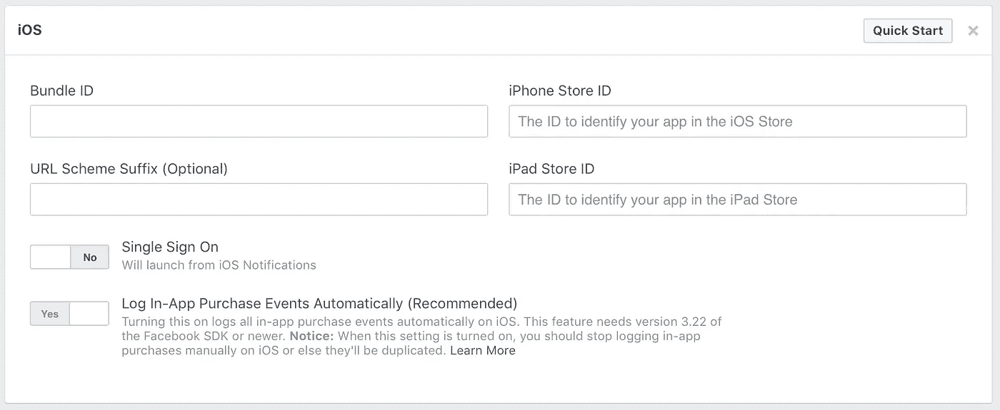

# 如何在 Swift 5 中集成 iOS 脸书 SDK

> 原文：<https://betterprogramming.pub/how-to-integrate-the-ios-facebook-sdk-in-swift-4-9c0192ce7dbf>

## 在大多数 iOS 项目中，iOS 脸书 SDK 是一个有用的库，允许您将您的 iOS 应用程序与脸书紧密集成


iOS 版脸书应用

集成 iOS 脸书 SDK(仅举几个例子)将使你的应用程序能够访问用户资料，提供脸书登录，并在无处不在的社交网络上共享内容。

有些人可能会质疑这篇文章的必要性，但我想在最近的一个项目中为 iOS 实现脸书后写下这篇文章。在这样做的时候，我遇到了一些其他人也可能阻碍其他人的障碍。脸书在将他们的 SDK 集成到 Objective-C 中时提供了一些优秀的文档，不幸的是，Swift 却不能这么说(在撰写本文时)。

希望下面的步骤能给你提供一套比脸书目前提供的更清晰的说明。

# 步骤 1:设置你的脸书应用

首先，你需要打开[脸书应用仪表板](https://developers.facebook.com/apps)，创建一个新应用或导航到现有应用。

然后你需要选择你的应用程序的设置，这个例子中的基本设置就足够了。一旦你在这里，你将能够添加一个 iOS 平台到你的脸书应用。



将 iOS 平台添加到应用程序设置后的脸书应用程序仪表盘

此时，您需要向脸书提供您的应用的捆绑包标识符。当您第一次在 Xcode 中设置您的项目时，您已经设置了此选项。您可以在 Info.plist 中找到它，它类似于下面的表单:

```
com.yourcompany.YourProject
```

确保您已将其添加到脸书应用程序控制面板上的捆绑包 ID 字段，并保存您的应用程序。

# 步骤 2:使用 CocoaPods 安装 iOS 脸书 SDK

有几种方法可以安装 iOS 脸书 SDK，但为了方便起见，我只介绍 CocoaPods。如果你刚接触椰子，你可以在这里找到更多的。

CocoaPods 是一个依赖管理器，让你以一种简单有效的方式安装 iOS 脸书 SDK。它还会确保你的应用运行的是最新版本的 iOS 脸书 SDK，所以你不必担心。

将以下内容添加到您的 Podfile 中:

```
use_frameworks!

pod 'FacebookCore'
pod 'FacebookLogin'
pod 'FacebookShare'
```

从项目根目录中的命令行运行:

```
pod install
```

此过程完成后，您的项目将包含所有必要的文件和设置，以继续将您的项目与 iOS 脸书 SDK 集成。

另外，如果你想升级到 iOS 脸书 SDK 的最新版本，你可以使用下面的命令:

```
pod update
```

# 步骤 3:配置您的 Info.plist

你需要导航到你的应用程序的`Info.plist`文件，并将其作为源代码查看。如果右键单击文件并选择打开为>源代码。`Info.plist`文件将显示为 XML，您需要在最后的`</dict>`标签前添加以下代码片段。

最后，你需要在脸书应用仪表板上用你的应用 ID 和应用名称替换`{your-app-id}`和`{your-app-name}`。

# 第四步:连接你的应用代理

首先，您需要将脸书 SDK 导入到您的 AppDelegate 中:

```
import FBSDKCoreKit
```

使用`didFinishLaunchingWithOptions`方法启动 iOS 脸书 SDK，代码如下:

```
ApplicationDelegate.shared.application(application, didFinishLaunchingWithOptions: launchOptions)
```

通过向应用的委托添加以下方法，确保应用可以处理脸书授权 URL:

## 步骤 5(推荐):跟踪应用程序事件

最后一步是让脸书知道用户何时启动了你的应用。如果你计划通过脸书为你的应用做广告，或者如果你想使用他们的分析来跟踪你的应用的指标，这是很有用的。

使用应用程序的委托将下面一行添加到您的`applicationDidBecomeActive`方法中:

```
AppEventsLogger.activate(application)
```

这应该涵盖了在 Swift 5 中设置您的应用程序和 iOS 脸书 SDK 的初始集成所需的一切。你现在可以利用脸书软件开发工具包的所有特性了。

## 如果这篇文章对你有帮助，请帮助我，并点击下面的按钮👏。

如果你需要更多的帮助，想要联系我或者你只是对我正在做的事情感兴趣，你可以在 Twitter 上关注。