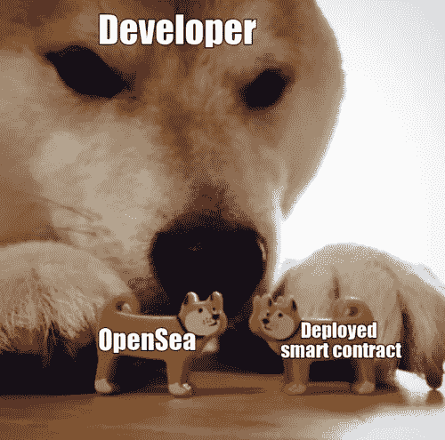
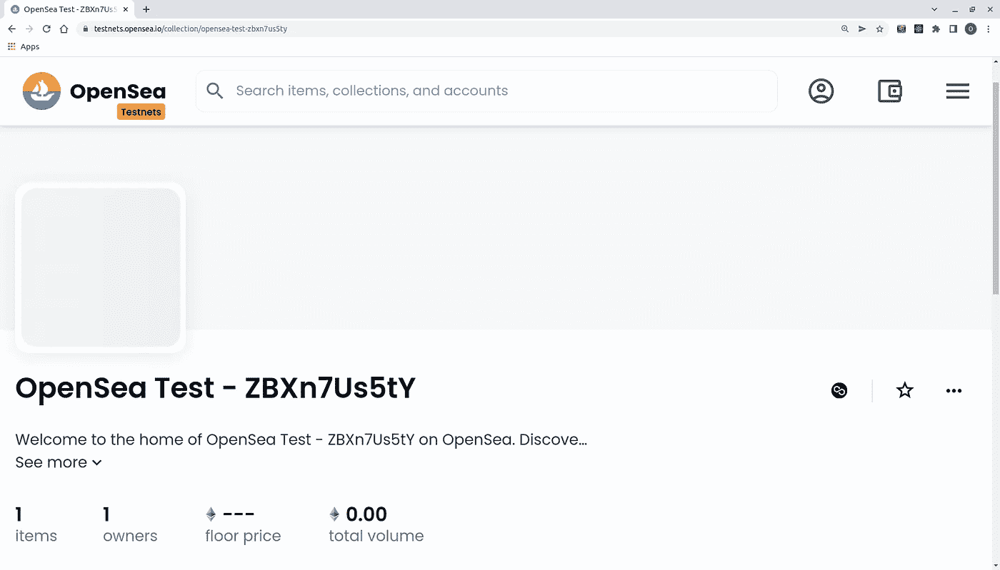
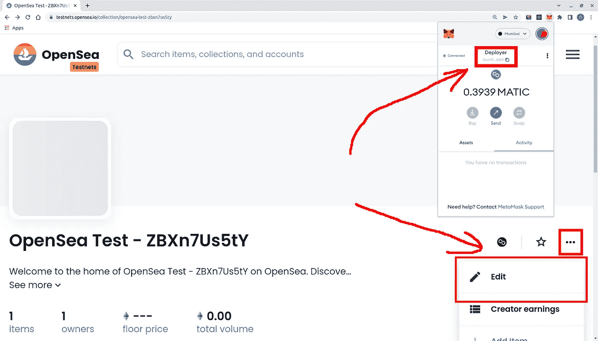
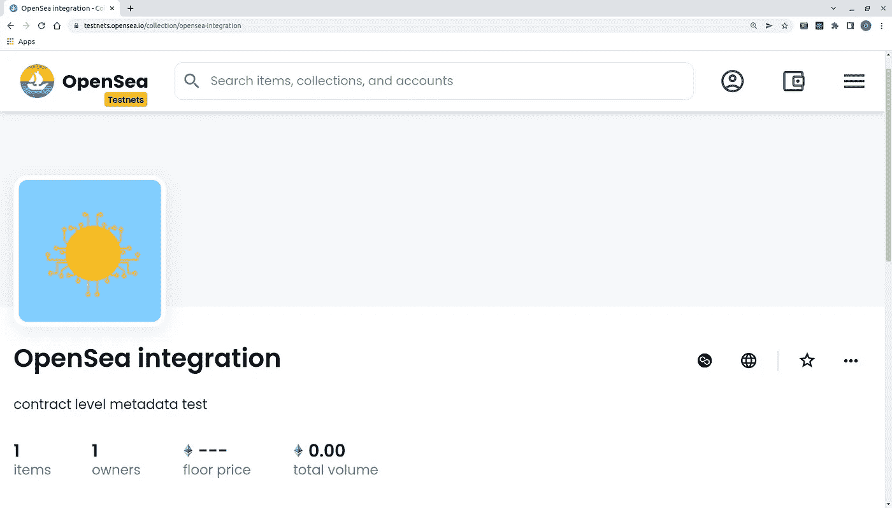
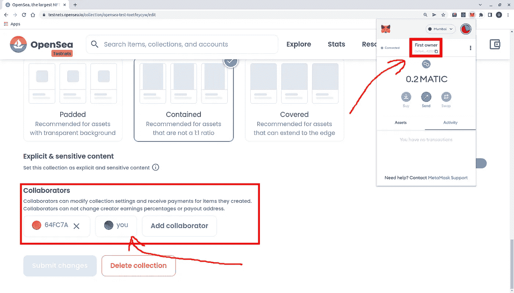
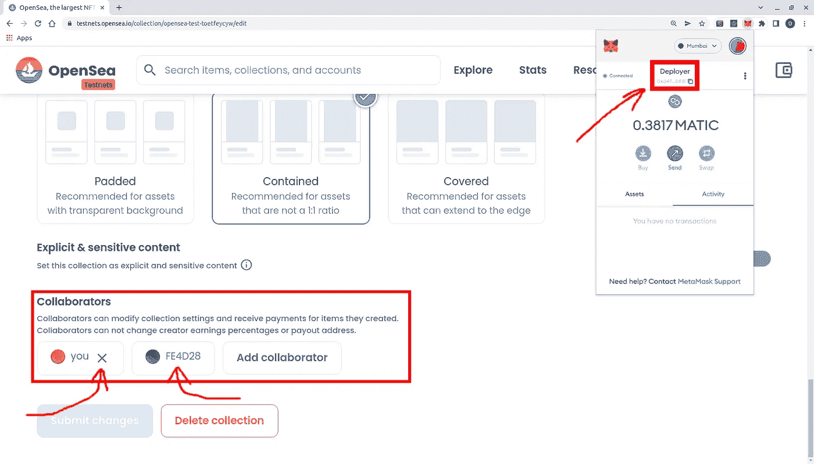

# 如何将您的 NFT 智能合同与 OpenSea 集成

> 原文：<https://betterprogramming.pub/how-to-integrate-your-nft-smart-contracts-with-opensea-b2925789a62f>

## OpenSea 智能合同集合中列出的工作方式

我在几个区块链项目的定制应用程序中工作了 4 年。

我们目前正在开发一个 [W3dding](https://twitter.com/w3dding_io?s=11&t=lXZ9EOlJUDaObTaSQhDOJQ) iOS web3 应用程序，在将我们的[SBT(soul bounded Token)](https://vitalik.eth.limo/general/2022/01/26/soulbound.html)[ERC 1155](https://eips.ethereum.org/EIPS/eip-1155)智能合约与 OpenSea 集成时遇到了一些问题。在本文中，我们将讨论这些问题以及解决它们的方法。

所以，你已经让你的 NFT[ERC 721](https://eips.ethereum.org/EIPS/eip-721)/[ERC 1155](https://eips.ethereum.org/EIPS/eip-1155)智能合约[在 OpenSea](https://opensea.io/get-listed) 上市了(或者你正在计划它)。上市后你会看到这样的东西:

默认 OpenSea 列出的智能合同集合视图。

如果您想知道如何编辑集合的任何属性，这篇文章就是为您准备的。我们将讨论哪个帐户将默认拥有列出的智能合同集合以及一些用于管理集成集合的 OpenSea 特性。

为了更好的理解，你应该熟悉 [Solidity](https://docs.soliditylang.org/en/latest/) 、 [OpenSea](https://opensea.io/) 、[ERC 721](https://eips.ethereum.org/EIPS/eip-721)/[ERC 1155](https://eips.ethereum.org/EIPS/eip-1155)以及一些部署/测试框架( [Truffle](https://trufflesuite.com/) 、 [Hardhat](https://hardhat.org/) 等。).示例中的所有代码都可以在我们的 [GitHub 库](https://github.com/custom-app/opensea-contracts-integration)中找到。

# OpenSea 集合的默认所有者

默认情况下，将智能合约部署到实时网络的[帐户将成为您收藏的所有者，因此您需要做的只是将您的钱包与此帐户连接到 OpenSea。然后，您将在“我的收藏”选项卡中看到您的收藏，您将能够编辑它！](https://docs.opensea.io/docs/1-structuring-your-smart-contract#using-ownable)

为了看到这一点，让我们将一个简单的 NFT 智能合同部署到 Polygon testnet (Mumbai)中，并在 OpenSea 中检查它。我们将使用地址为`[0x64FC7AD6aEC6101B362600E463C77F50d8a1b881](https://mumbai.polygonscan.com/address/0x64FC7AD6aEC6101B362600E463C77F50d8a1b881)`的帐户来部署合同，用元数据 URI `[ipfs://bafkreiglpboznxavcx3edrgqfbtecanntlhenixusoghdtng5npyn4w4xe](https://ipfs.io/ipfs/bafkreiglpboznxavcx3edrgqfbtecanntlhenixusoghdtng5npyn4w4xe)`创建单个 NFT 到帐户`[0x7F886b3649231654A4E3b41124B296d8fcd68676](https://mumbai.polygonscan.com/address/0x7F886b3649231654A4E3b41124B296d8fcd68676)`。我们需要铸造一个 NFT，因为 OpenSea 不允许列出空集合。

简单的 NFT 智能合同

已部署合同:`[0x70e292d2745EF87E9e030f594e048f64839f175e](https://mumbai.polygonscan.com/address/0x70e292d2745EF87E9e030f594e048f64839f175e)` *。*现在，让我们将钱包与部署者帐户连接起来，并检查列出的集合。

OpenSea 集合视图，带有与部署者帐户连接的钱包。

在我们将 wallet 与部署者帐户连接起来之后，会出现“Edit”按钮，所以现在我们可以更改集合的任何属性。

因此，使用部署者帐户是获得对 OpenSea 集合的编辑访问权的最快方式。此外，如果您已经将合同部署到实时网络，这是唯一可能的访问选项，并且不可升级，因为我们将在下面讨论的所有选项都需要智能合同修改。

# 合同级元数据

如果您只需要更改集合的名称、描述和图像，那么[在您的契约中实现一个](https://docs.opensea.io/docs/contract-level-metadata) `[contractURI](https://docs.opensea.io/docs/contract-level-metadata)` [函数](https://docs.opensea.io/docs/contract-level-metadata)就足够了:

NFT 与 contractURI 签订智能合同。

`contractURI`函数返回的 URL 必须指向以下格式的 JSON:

合同元数据格式。

让我们试一试，部署我们的合同！我们已经将合同元数据示例文件上传到 IPFS: `[ipfs://bafkreig45twl5mtmpwpdo3vteffjb33dwawhfmgigbk7upihuddcaxuhle](https://ipfs.io/ipfs/bafkreig45twl5mtmpwpdo3vteffjb33dwawhfmgigbk7upihuddcaxuhle)`中，以便在我们的合同中使用。

部署合同:`[0xa8e9aDAaE25A0d247B7597DEB9Dc6Ba786aa61c8](https://mumbai.polygonscan.com/address/0xa8e9aDAaE25A0d247B7597DEB9Dc6Ba786aa61c8)`

OpenSea collection 是使用实现了 contractURI 的合同创建的。

正如您所看到的，通过实现这种模式，您的集合将会以适当的参数在 OpenSea 上列出。如果您希望您的智能合约在 OpenSea 上以编程方式配置参数，这个解决方案将适合您——特别是如果您有许多智能合约要列出。

# 使用可拥有的合同

## 授予权限

如前所述，默认情况下，合同部署者帐户将获得对您的集合的编辑权限。而且，[你可以通过使用](https://docs.opensea.io/docs/1-structuring-your-smart-contract#using-ownable) [OpenZeppelin 自己的](https://docs.openzeppelin.com/contracts/4.x/api/access#Ownable)合同授予对任何账户的访问权。您需要做的就是让您的 NFT 契约继承 Ownable 契约，并在构造函数中分配所有权。

拥有 NFT 智能合同。

让我们试一试。我们将部署与`_owner`相当于`[0xfe4D28350E00049542d026ecC46746dD05034252](https://mumbai.polygonscan.com/address/0xfe4D28350E00049542d026ecC46746dD05034252)`的`NftForOpenSeaOwnable`合同。

已部署合同:`[0xC6B7240D5ccAa4d117da62D11b4FF5c9885DD72F](https://mumbai.polygonscan.com/address/0xc6b7240d5ccaa4d117da62d11b4ff5c9885dd72f)`

使用可拥有的智能合同创建的集合的“编辑”页面。

现在我们可以看到，该集合有两个合作者——部署者和`owner`帐户。

这里的一个重要细节是`owner`账户集合所有权不能从 OpenSea“编辑”页面删除:

部署者帐户查看的“编辑”页面。

如您所见，无论是部署者还是`owner`本人都不能从合作者列表中删除`owner`帐户。

## 转移权限

如果您想转移权限，可以使用`transferOwnership`功能。为了测试这一点，我们将向帐户[0xe 19058 b 26 CFF 34 aff 232 b 5379d 0 ff 995d 4 f 0796 a](https://mumbai.polygonscan.com/address/0xE19058b26CFf34AFf232B5379D0Ff995d4F0796A)转移权限。过户交易 id:[*aa 5472 a 948 f 66571 ea 58 ab 4c 556 fc 34 CCE 9 EC 54 B2 ea 852015 a 981 c 220 cf 2 ed8 e*](https://mumbai.polygonscan.com/tx/0xaa5472a948f66571ea58ab4c556fc34cce9ec54b2ea852015a981c220cf2ed8e)

所有权转移后的“编辑”页面。

现在旧的`owner`账户被新的`owner`账户所改变。

因此，使用 Ownable 的主要优点是:

*   您获得的所有权管理灵活性。
*   您不必向任何钱包暴露部署者帐户机密。
*   `owner`不能意外或故意从合作者处删除。

## 附加提示:关于将访问控制分离到集合和智能合约的提示

如果您已经在使用 Ownable，并且您想要分离合同所有者帐户和 OpenSea collection 所有者帐户，您可以混合使用 [Ownable](https://docs.openzeppelin.com/contracts/4.x/api/access#Ownable) 和 [AccessControl](https://docs.openzeppelin.com/contracts/4.x/api/access#AccessControl) 合同。您可以使用 Ownable 进行 OpenSea 访问管理，使用 AccessControl 进行契约级访问控制。

混合访问控制和可拥有契约。

# 摘要

因此，您有三种方法来管理 OpenSea 中列出的智能合同集合:

*   使用部署了合同的帐户，这是编辑收藏的最快方式。此外，如果您已经部署了合同，这是唯一的方法。
*   实现`contractURI`function-way，如果您需要以编程方式分配基本集合属性，这将适合您。
*   使用 Ownable 契约——管理集合编辑访问的最灵活、最安全的方法，但也是最难实现的方法。

本文中的所有合同代码都可以在我们的 [GitHub 资源库](https://github.com/custom-app/opensea-contracts-integration)中找到。

使用最适合你的解决方案，在部署到 mainnet 之前，总是检查 testnet 中的所有内容，享受 web 3——就是这样:)

# 参考

*   [w3d 发布推特](https://twitter.com/w3dding_io)
*   [我的推特](https://twitter.com/shleshg1)
*   [我的 LinkedIn](https://www.linkedin.com/in/oleg-shatniuk-5166b9234/)