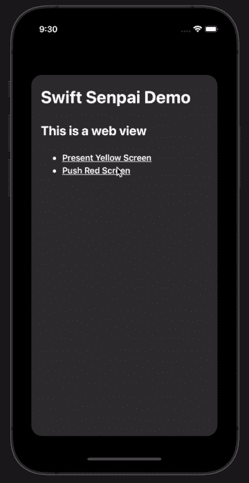

# 如何拦截 WKWebView 导航动作

> 原文：<https://betterprogramming.pub/how-to-intercept-wkwebview-navigation-actions-24def4ffb016>

## 为您的用户提供 web 视图和本机视图之间的无缝转换体验


照片由 [Rodion Kutsaev](https://unsplash.com/@frostroomhead?utm_source=medium&utm_medium=referral) 在 [Unsplash](https://unsplash.com?utm_source=medium&utm_medium=referral) 上拍摄

在使用混合移动应用时，确保我们的用户在 web 视图和原生视图之间拥有无缝转换体验是极其重要的。我们可以用来提供这种体验的一个非常常见的技术是劫持`WKWebView`导航动作。

在本文中，我将向您展示如何劫持`WKWebView`导航动作来触发您选择的自定义动作。下面的示例应用程序展示了您将从本文中学到的东西:



想知道更多？请继续阅读！

# 示例应用程序

正如您从动画 GIF 中看到的，示例应用程序是一个简单的 web 视图，显示一个静态 HTML 页面。当用户点击“呈现黄色屏幕”超链接时，应用程序将呈现一个黄色背景的视图控制器。

而当点击“*推红屏*”超链接时，应用程序会将红色视图控制器推送到导航堆栈。

以下是 web 视图中显示的 HTML:

注意，超链接的`href`值是一个定制的 URL，遵循特定的格式。这就是我们的示例应用程序如何知道当用户点击特定的超链接时应该采取什么动作。在下一节中，我将向您解释应该如何解释定制格式的 URL。

> 注意:
> 
> 如果你想学习如何使用 CSS 注入来设计 web 视图中的静态 HTML，使其符合你的应用程序的设计主题，请查看我的文章“[在 iOS 中注入 JavaScript 到 Web 视图](https://swiftsenpai.com/development/web-view-javascript-injection/)”。

# 了解 URL 格式

为了使我们的示例应用程序能够识别用户点击的超链接，我们必须定义一个包含以下信息的自定义格式的 URL:

*   动作类型——当用户点击超链接时，我们的示例应用程序应该采取的动作。对于我们的例子，我们将使用`navigate`来表示一个导航动作。
*   过渡类型—要使用的屏幕过渡类型，主要是`present`或`push`。
*   RGB 值—正在显示的屏幕的背景颜色。

对于我们的示例应用程序，我们将使用以下格式:

```
<action_type>://<transition_type>?<rgb_value>
```

下面是一个 URL 示例，它表示一个导航动作，该动作用黄色背景显示一个视图控制器。

```
navigate://present?r=255&g=255&b=0
```

> 注意:
> 
> 上面的 URL 格式是专门为示例应用程序设计的。因此，您可以根据自己的需要随意修改 URL 的格式和参数。

记住这一点，我们现在可以定义两个枚举来表示动作类型和转换类型:

我们将在下一节中使用这两个枚举。

# 劫持 WKWebView 导航操作

劫持`WKWebView`导航动作的方法非常简单。我们可以使用下面的`WKWebView`委托方法:

这个委托方法将在每次用户触发导航动作时触发，这使得它成为劫持`WKWebView`导航动作的最佳场所。

> 注意:
> 
> 如果委托方法没有被触发，请确保您已经导入了 WebKit 模块，并且将您的视图控制器设置为 web 视图的委托。

注意委托方法提供的`decisionHandler`。它是一个完成处理程序块，让 web 查看者知道您是想要取消还是允许导航操作。请确保在每个代码路径的末尾调用该处理程序，否则将会出现以下运行时错误:

```
***Terminating app due to uncaught exception 'NSInternalInconsistencyException', reason: 'Completion handler passed to -[SwiftSenpaiDemo.HijackViewController webView:decidePolicyForNavigationAction:decisionHandler:] was not called'***
```

在委托方法中，我们首先确保导航动作是由超链接触发的。之后，我们将从导航动作中提取超链接的 URL。

获得 URL 后，我们首先从 URL 中提取动作类型，并检查它是否是`.navigate`。如果不是`.navigate`，那么我们将照常加载 URL。

确认导航类型为`.navigate`后，我们可以继续从 URL 中提取过渡类型和 RGB 值，如下所示:

有了所有的信息，我们现在可以根据从 URL 获得的转换类型来执行定制导航。

就是这样！现在，您可以运行示例代码来查看运行中的一切！如果您发现执行上面的示例代码有任何困难，请在这里获得完整的示例代码[。](https://gist.github.com/LeeKahSeng/7f01d9ed7db4925debf24ba6bcf17dd9)

# 包扎

我希望这篇文章能让你很好地理解如何在 web 视图和本地视图之间无缝转换。如果你喜欢这篇文章，你可能会想看看我以前的文章“[在 iOS](https://swiftsenpai.com/development/web-view-javascript-injection/) 中将 JavaScript 注入 Web 视图”。

感谢阅读。

```
**Want to Connect?**Feel free to follow me on [Twitter](https://twitter.com/Lee_Kah_Seng) so that you won’t miss out on any of my upcoming iOS development-related articles.
```