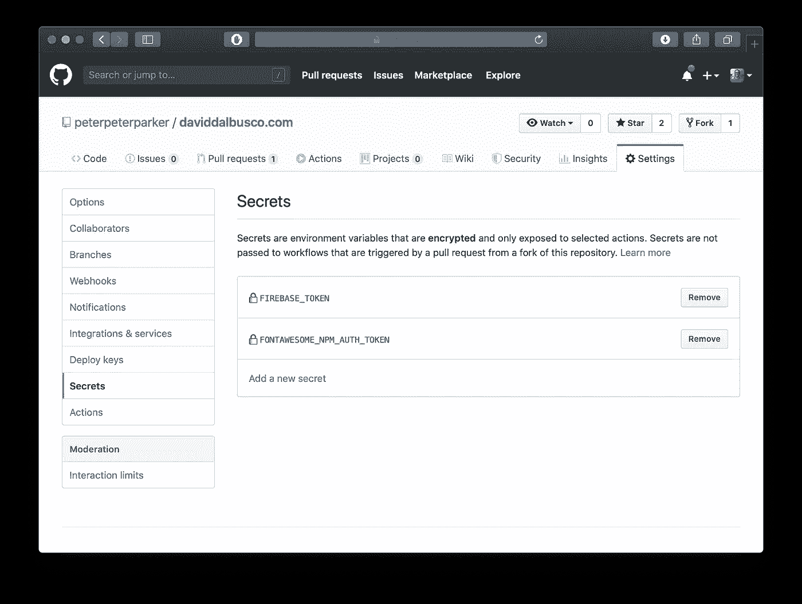
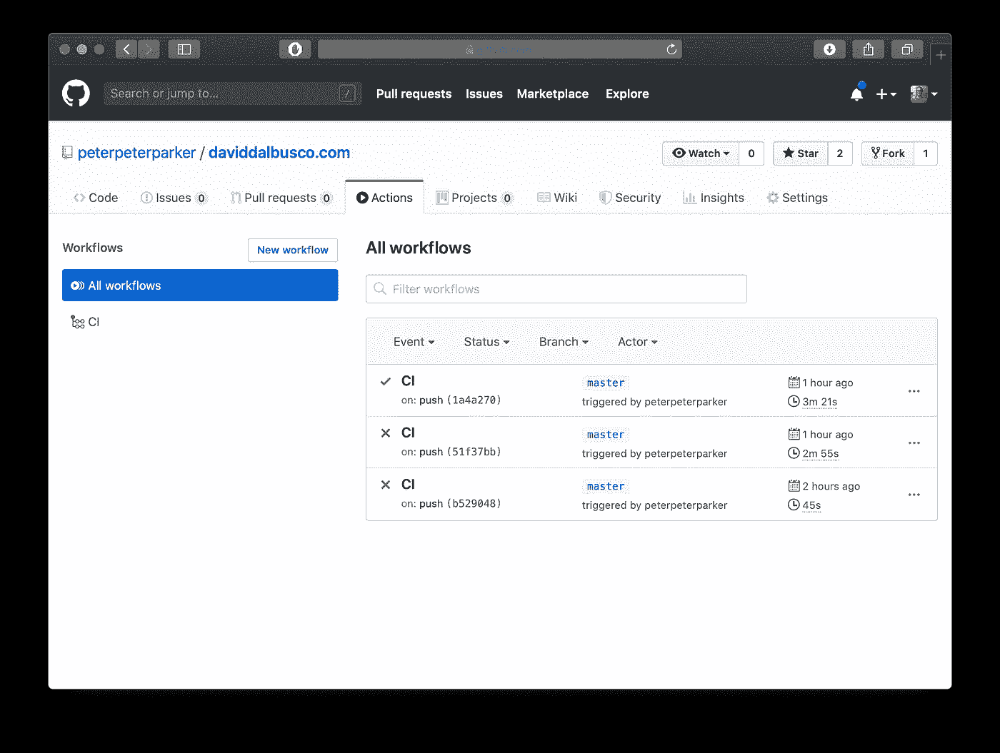

# 如何在公共 GitHub 动作中保持你的字体 Awesome Pro Secret 令牌

> 原文：<https://betterprogramming.pub/how-to-keep-secret-your-font-awesome-pro-token-in-public-github-actions-fd79792c510>

## 配置您的 GitHub 操作，使您的 npm 私有令牌保持秘密


塞尔坎·图尔克在 [Unsplash](https://unsplash.com/?utm_source=unsplash&utm_medium=referral&utm_content=creditCopyText) 上的照片

昨天， [Julien Renaux](https://twitter.com/julienrenaux) 发表了一系列[有趣的新博文。其中一次，他一步一步地展示了如何使用 GitHub 动作和 Firebase 主机](https://twitter.com/julienrenaux/status/1199322520815583233) *部署 StencilJS 应用。*

这个教程确实吸引了我的眼球，因为我们的 web 开源项目 [DeckDeckGo](https://deckdeckgo.com) 的所有应用程序都是用 [StencilJS](https://stenciljs.com) 开发的，并且托管在 [Firebase](https://firebase.google.com) 上。

当然，我不能等那么久，我必须试一试。

因为如果我使用一个 CI 来构建我们的演示编辑器，我将不得不做出一些改变，以不同的方式混淆生产令牌，所以我想我可以首先在当前的 [Ionic React](https://ionicframework.com/docs/react) 演示应用程序中尝试他的配方，我正在为下周的 [Meetup](https://www.meetup.com/fr-FR/Ionic-Zurich/events/265767496/) 开发这个应用程序。

结果，它只是无缝地工作。它运行得如此之好，设置如此之简单，以至于我认为我也可以快速地为我的网站设置另一个 CI 部署。

可惜没成。即使我的网站的技术和堆栈，用 [Gatsby](https://www.gatsbyjs.org) 构建的，在某种程度上真的很像这个小应用，CI 执行的构建失败了:

```
X Download Artifact
  1 Run actions/download-artifact@master
  2 with:
  3    name: build
  4 Download artifact 'build' to: '/home/runner/work/daviddalbusco.com/daviddalbusco.com/build'
  5 *##[error]Artifact build was not found for build 2.* 6 *##[error]Exit code 1 returned from process: file name '/home/runner/runners/2.161.0/bin/Runner.PluginHost', arguments 'action "GitHub.Runner.Plugins.Artifact.DownloadArtifact, Runner.Plugins"'.*
```

起初，我不明白错误。当然，我注意到一些工件无法下载，但我不知道这些是什么，根本原因是什么。

过了一会儿，我终于想起来我曾经面对过另一个 CI 的类似问题。

对于我的网站，我使用的是[字体 Awesome](https://fontawesome.com) ，特别是`@fortawesome/pro-light-svg-icons`图标，只有在配置了我的相关字体 Awesome Pro npm 令牌的情况下才能使用。

虽然文档清楚地解释了如何在本地配置令牌，但是它们没有(或者至少我一开始没有发现)提供一个示例来展示如何对公共存储库隐藏它。

所以，这篇博文的目的。

# 配置 npm 注册表

字体 Awesome npm 令牌既可以全局设置，也可以按项目设置。我们需要用配置项构建我们的项目的方法是最后一种，“每个项目”。

为此，我们在项目的根目录下创建一个新文件`.npmrc`。与文档相反，我们只在文件中分别添加一行，我们只添加对字体 Awesome 包管理器的引用。

我们故意忽略指定任何关于令牌的内容。

```
@fortawesome:registry=https://npm.fontawesome.com/
```

# 在 GitHub 中设置新的秘密

由于我们在前面的文件中没有提供令牌，我们必须以不同的方式将它提供给 GitHub 动作，否则它仍然无法下载依赖项。

幸运的是，GitHub 已经提供了对环境变量保密的选项。因此，我们充分利用这个选项，为我们的字体 Awesome npm 令牌创建一个新的秘密。

比如说，姑且称之为`FONTAWESOME_NPM_AUTH_TOKEN`。



为字体 Awesome npm 令牌设置 GitHub 秘密

# 使用 CI 中的秘密

如果您已经学习了 Julien 的教程，那么您的 CI 工作流可能已经包含了从 npm 安装应用程序依赖项的下列内容:

```
- name: Install Dependencies
    run: npm ci
```

这是我们问题的根源，因为 npm 不知道它必须用来下载特定工件的特定注册表和令牌。

因此，我们最终将通过在安装之前运行命令行来解决这个问题，用我们的秘密令牌配置 npm。

管道(`|`)让我们可以指定在同一个 shell 中运行的多个命令(参见[文档](https://help.github.com/en/actions/automating-your-workflow-with-github-actions/workflow-syntax-for-github-actions#jobsjob_idstepsrun))。

```
- name: Install Dependencies
  run: |
    npm config set '//npm.fontawesome.com/:_authToken' "${{ secrets.FONTAWESOME_NPM_AUTH_TOKEN }}"
    npm ci
```

瞧，我们的 CI 现在应该能够下载所需的依赖项，从而构建和部署我们的项目。



成功的词，快乐的词

# 结论

我的网站是开源的，可以在 [GitHub](https://github.com/peterpeterparker/daviddalbusco.com) 上找到，看看吧，用你自己的眼睛来验证这个解决方案。

到无限和更远的地方，

大卫