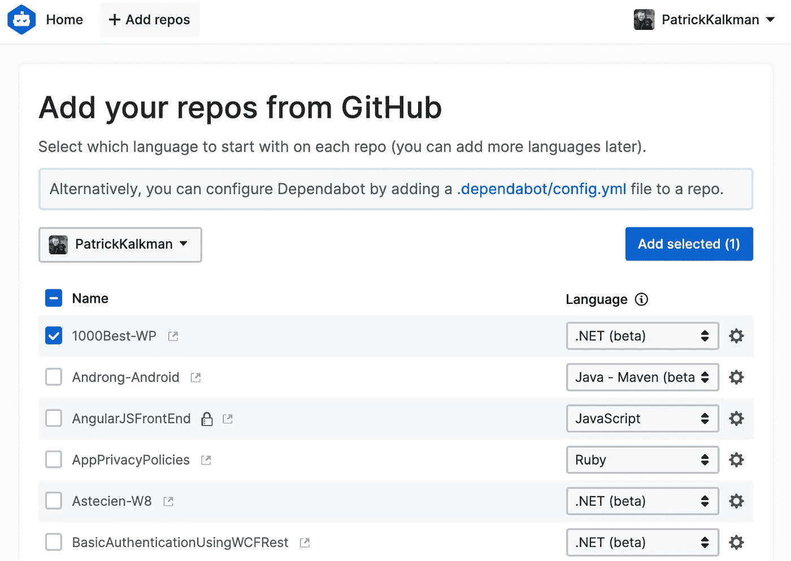

# 如何保持您的依赖关系安全和最新

> 原文：<https://betterprogramming.pub/how-to-keep-your-dependencies-secure-and-up-to-date-92578c7f3c9c>

## 使用 Dependabot 自动更新您的依赖关系

照片由[列宁·艾斯特拉达](https://unsplash.com/@lenin33?utm_source=unsplash&utm_medium=referral&utm_content=creditCopyText)在 [Unsplash](https://unsplash.com/s/photos/robot?utm_source=unsplash&utm_medium=referral&utm_content=creditCopyText) 上拍摄

几周前，我在 GitHub 上搜索关于[开闭原理](https://medium.com/better-programming/do-you-use-the-most-crucial-principle-of-object-oriented-design-9045dbd1321e)的最新文章的例子。当我浏览[的时候。NET 核心库](https://github.com/dotnet/core)，看到一个我不认识的文件夹。

这个文件夹`.dependabot`包含一个文件`config.yml`。我发现这是 GitHub 的一个名为[dependent bot](https://dependabot.com/blog/hello-github/)的新服务的配置文件。

我不知道这项服务。

经过一番调查，我发现 Dependabot 是一种扫描您的存储库的依赖关系的服务。扫描后，Dependabot 会验证您的外部依赖项是否是最新的。

这项服务的真正魅力在于:

*dependent bot 自动创建一个 pull 请求来更新依赖关系。*

我开始为我的大部分存储库使用 Dependabot。在本文中，我将向您展示如何使用和配置 Dependabot。

# 使用依赖机器人

如果您在 GitHub 上有一个公共存储库，您可能会看到下面的安全警告。GitHub 会自动扫描所有公共存储库，如果检测到安全漏洞，就会发出警报。

来自 Github.com 的安全警报

如果你想让 GitHub 扫描你的私有库，你必须通过启用安全通知来选择加入。GitHub 可以检测到的漏洞来自于 [GitHub 顾问数据库](https://github.com/advisories)。

除了警报，GitHub 还描述了如何修复它。

Dependabot 更进一步，自动为您的存储库创建一个 Pull Request (PR)。这个 PR 解决了安全漏洞。

## 从依赖机器人开始

想要使用 Dependabot，首先需要[注册](https://app.dependabot.com/auth/sign-up)。由于 GitHub 收购了 Dependabot，所以是免费的。

注册后，你必须给依赖机器人访问你的仓库。您可以通过 Dependabot 用户界面或者通过向您的存储库添加一个`config.yml`文件来实现这一点。

让 Dependabot 访问您的存储库

## 配置从属机器人

您可以通过将一个`config.yml`文件存储在您的存储库根目录下的文件夹`.dependabot`中来配置 Dependabot。

## 必需选项

以下配置文件来自我的一个存储库。它只包含必需的选项。

config.yml

这个配置文件只使用必要的 Dependabot 选项。因为我在这个存储库中有许多项目，所以我指定了两个更新配置。

*   `package_manager`指定您使用哪个包管理器。Dependabot 支持很多不同的包管理器，比如 JavaScript、 [Bundler](https://bundler.io/) 、 [Composer](https://getcomposer.org/) 、Python、 [Maven](https://maven.apache.org/) 等。完整列表见[文档](https://dependabot.com/docs/config-file/)。
*   `directory`指定了您的包配置的位置。通常，这是您的存储库的根目录。如果您在一个存储库中有许多项目，就像我在上面的例子中一样，您可以指定一个子文件夹。
*   在`update_schedule`中，您可以指定 Dependabot 检查更新的频率。住的意思是尽快。其他选项包括每日、每周和每月。

dependent bot*总是*尽快创建安全更新。

## 可选选项

Dependabot 有一些额外的选项，用于更改分支、提交消息和 pull 请求的受托人。完整列表见下文。

*   `target_branch` —创建拉取请求的分支。
*   `default_reviewers` —要在拉式请求上设置的审阅者。
*   `default_assignees` —放置在拉取请求上的工作负责人。
*   `default_labels` —放在拉取请求上的标签。
*   `default_milestone` —在拉请求上设置的里程碑。
*   `allowed_updates` —限制允许哪些更新。
*   `ignored_updates` —忽略特定的依赖关系或版本。
*   `automerged_updates`—dependent bot 应自动合并的更新。
*   `version_requirement_updates` —如何更新您的应用程序版本。
*   `commit_message` —添加到提交消息中的内容。

## 验证配置文件

在 Dependabot 网站上有一个[页面](https://dependabot.com/docs/config-file/validator/)，可以验证你的配置文件。确保您的配置文件是正确的。

# 结论

我已经用了几个星期了。我从“实时”更新时间表开始，但由于“实时”产生了太多的警报，所以改为“每周”。

我现在每周合并一次来自 Dependabot 的请求。

您必须保持您的依赖关系是最新的。如果不这样做，您使用的版本和最新版本之间的差异就会增加。这种不断增加的差异使得更新依赖关系变得更加困难。

感谢您的阅读。