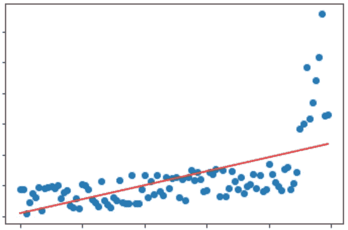
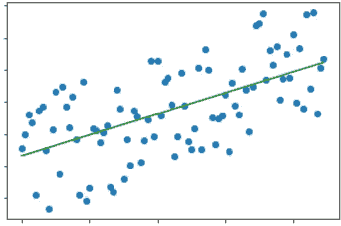
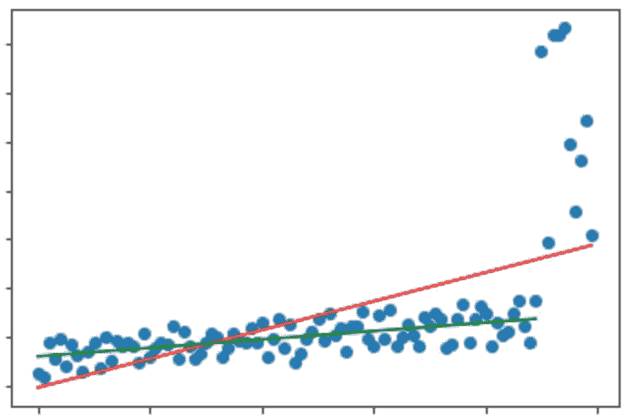
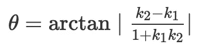

# 如何确定 API 减速

> 原文：<https://betterprogramming.pub/how-to-know-api-is-slowing-down-2957b9e1341d>

## 一个统计解决方案来知道是否是时候重构你的代码了


帕斯卡尔·范·德·万德尔在 [Unsplash](https://unsplash.com/photos/J3pkJFnpDkM) 上的照片

API 变慢对用户体验影响很大，甚至会失去信任，所以我们总想尽早知道延迟。

因此，将性能测试和度量基准集成到自动化测试中是很常见的。

但是慢这个概念很难评价。

*   它是偶然发生的吗？还是一种持续的状态？
*   是实验环境造成的吗？还是代码的副作用？
*   是功能增加的结果吗？还是一种缺陷？

这些问题很难有明确的答案。

假设我们有办法检测到“慢”，那么我们就会发出警报或报告。但如果这只是一个“巧合”或实验环境造成的虚惊，最终人们会试图忽略这些信号。

此外，预计随着功能的增加，API 会变慢。当我们有更多的参数，更多的业务逻辑，更多的`if-else`时，响应时间变慢也就不足为奇了。

再者，如果我们用 threshold 来避免上述问题，那么当我们真正认识到 API 变慢的时候，我们就不知道变慢的根本原因是什么了。

所有这些因素使得检测 API 变慢的任务变得极其困难。

# 是时候让统计学发挥作用了

为了解决提到的问题，让我们总结一下需求。

1.  为了能够明确知道问题何时发生
2.  为了能够允许意外的异常值
3.  为了能够避免缓慢上升的正常现象
4.  能够发出警报

首先，我们来看一个图表。



*   水平轴表示每个测试，它可以被认为是时间或发布版本，或者即使被集成到 CI/CD 管道中，也是每个提交。
*   纵轴是目标测试的延迟。
*   红线是这篇文章的主角，线性回归。

从图中我们可以知道，在某个时间之前，基本上延迟是缓慢增加的，但是在某个时间之后，整个延迟是快速增加的。而那个时间点就是我们想知道的问题。

也许你会说，每次看数字就很容易用肉眼发现？毕竟还是挺直观的。

关键是延迟的规模。如果下面一组的数据点平均值是 0.1 秒，后面一组是 0.2 秒，你还会觉得很直观吗？

所以我们需要一个脑友好的标准，即线性回归。

通过线性回归，我们可以知道数据集的整体趋势是上升的。然而，这还不够，因为仅仅知道趋势是上升的并不意味着我们可以判断它是正常的还是异常的。

前面那组密密麻麻的数据点也是涨的，那么怎么确定趋势不正常，前面正常呢？

让我们看另一张图。



问题:这个图的延迟是正常的还是异常的？

看起来和前面的图很像，有明显的上升趋势，所以应该是不正常的吧？真的吗？

让我们添加一些参考点，并缩小一点。



你找到了吗？上图其实是原图的正常部分，只是上升比较慢。

简单的对单个数据集做线性回归分析，可能会因为没有比较的基准，分不清是特性增加导致的自然现象还是缺陷导致的问题，而得出错误的结论。

# 解决办法

回到我们的问题，如何在不出现误报的情况下尽早发现问题？

首先，我们需要选择一个参考点，例如一天前。然后，我们对整个数据进行线性回归，得到一条红线。当然，我们还需要对参考点之前的数据进行一次线性回归，就会得出绿线。

红线和绿线的斜率用来计算角度作为判断依据。换句话说，当红线和绿线之间的角度越大，那么就越有可能是异常的。

所以设置报警的阈值既不是潜伏期本身，也不是斜率，而是两条线的夹角。

给定两条线的斜率为 k1 和 k2，则角度θ的公式如下。



在 Python 中，应该是:

```
import math
thera = math.degrees(math.atan2(abs(k2 - k1), abs(1 + k1 * k2)))
# atan2 does not need to handle denominator zero error cases
# If we use atan
# we need to solve the case where k1 * k2 is equal to -1 first
```

我们可以用模拟值做几次实验，以获得理想的报警阈值。

最后，除了角度阈值，我们还需要另一个告警指标，它是允许延迟的上限。

为什么我们需要设定一个上限？

因为如果我们的延迟以绿线趋势不断增加，总有一天会达到不可接受的值，但如果我们只是设置角度阈值，我们永远不会知道情况有多糟糕，直到我们在生产上遇到灾难。

最后，下面是如何在 Python 中计算线性回归的示例。

```
import numpy as np
from sklearn.linear_model import LinearRegression

# raw_x and raw_y are the results of each test
# raw_x can be a time, version or commit normalization
# raw_y are latencies
x = np.array(raw_x)[:, np.newaxis]
y = np.array(raw_y)[:, np.newaxis]

bfl = LinearRegression()
bfl.fit(x,y)
y_pred = bfl.predict(x)

slope = bfl.coef_[0, 0]
```

# 结论

那么，我们如何知道 API 是否变慢了呢？我们需要两个警告。

1.  线性回归后当前数据线与参考点数据线之间的角度。
2.  延迟的最大上限。

当我们有这两个警报时，我们可以准确地知道代码什么时候引起问题，以及是否到了重构系统的时候了。

事实上，这是一种实现目标的统计方法，但这种方法仍有一些弊端。比如如何设置倾斜角的阈值？参考点怎么选？要选择的统计范围是什么？所有这些问题都需要实验来寻找答案。

因此，最有效的方法是将机器学习引入到潜伏期分析的系统中，通过预测模型来判断当前结果是正常还是异常，而不是通过人为的设置。人类比机器更难做出判断。

但是，构建机器学习模型需要相应的领域知识和技能，这可能不适合小型组织，因此线性回归是一种可靠且低成本的解决方案。