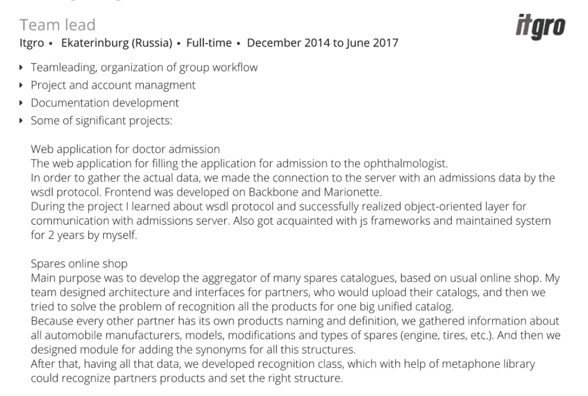
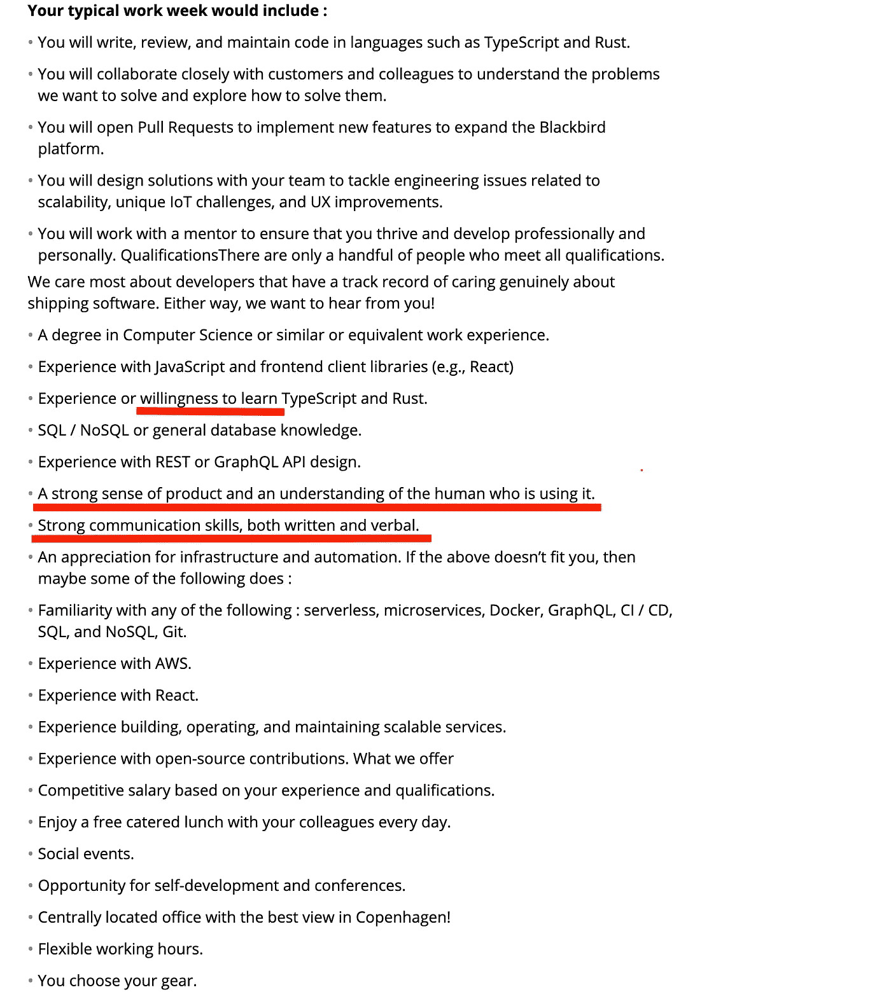

# 如何在软件工程面试中表现好自己

> 原文：<https://betterprogramming.pub/how-to-land-a-perfect-software-engineer-interview-981e617aae1a>

## 获得一次完美面试并得到这份工作

照片由[钉子吉尔法诺夫](https://unsplash.com/@ngilfanov?utm_source=unsplash&utm_medium=referral&utm_content=creditCopyText)在 [Unsplash](https://unsplash.com/s/photos/laptop-nature?utm_source=unsplash&utm_medium=referral&utm_content=creditCopyText) 上拍摄。

在这篇文章中，我想谈谈个人面试的过程。很长一段时间以来，我只是在这个过程中的一方——我认为做得相当好。

但是大约五个月前，我开始为我的公司(杜塞尔多夫的地铁市场)面试前端工程师。

在这篇文章中，我想谈谈:

*   如何为面试做准备，为什么你可能想这样做。
*   你不应该忘记展示哪些领域。
*   作为一名面试官，在这个过程中最重要的是。

# **简介**

我真的相信一次面试不足以理解一个工程师的价值，不足以决定他们是否会致力于团队。

我认为只有在工程师在团队中工作几个月之后，才能做出明确的评估。

然而，在当前的商业世界中，很难进行这种评估。在很短的时间内，面试官必须评估候选人，候选人必须尽可能给人留下最好的印象。

# **面试准备**

在个人面试中，你需要让面试官知道你将如何融入这个团队和这个角色。

你在整个过程中被评估，所有的例子和以前的经验都被考虑在内。

这就是为什么你可能会想弄清楚你到底想展示什么样的自己，以及你想如何展示。

这里有一个简单的例子:

*   我:请说说你职业生涯中的亮点和你真正喜欢的项目。
*   候选人:我和一个优秀的工程师团队一起在电子商务网站“A”工作，在那段时间里，我学到了一个新的框架。这是一个大项目，我认为它做得很好。利益相关者对结果相当满意。

这个答案说明了什么？

*   这位候选人喜欢在团队中工作。也许他们是很好的团队成员。
*   他们加入了一个项目，学习了一个新的框架。他们可能渴望学习，勇于接受挑战。
*   他们关心结果，并与利益相关者保持联系以了解结果。

这是一个完全正确的答案。老实说，没有有效和无效的答案。

但到目前为止，我上面提出的观点只是面试官的假设，需要事后的确认。作为候选人，你可以帮助面试官了解你的心态和品质。

如果你真的喜欢团队合作、学习，并关心业务，它可以是这样的:

*   我:请说说你职业生涯中的亮点和你真正喜欢的项目。
*   候选人:我和一个优秀的工程师团队一起在电子商务网站“A”工作。我真的很喜欢我们的团队工作流程，以及我们相处得很快的事实。此外，我加入了一个项目，因为我知道堆栈中有一项新技术是我从未使用过的。我挑战自己，从一开始就开始研究这个框架。这是一次有趣的旅行。这是一个大项目，我认为它做得很好。我与利益相关者一起检查业务的 KPI，以了解对业务的最终影响。

这个答案已经让你作为候选人的心态更加透明了。

正如你可能猜到的那样，这个想法是想通你的经历，因为这将是面试中首先讨论的话题之一。

不要把它做得像上面的例子一样机械，因为如果你的答案看起来都是过度排练的，那就没用了。

你不需要作弊，写一些笔记，把所有可能的问题的答案都写下来。并且在交流中尽量做到坦诚和开放。会留下更好的印象。

我建议分析你自己——了解你是什么样的团队成员，你工作的动力是什么，你喜欢什么，你不喜欢什么，等等。

现在让我们更深入地探讨一下吧！

# **分析你自己，准备你的简历**

我建议从撰写或修改你的简历开始。

如今，一份公司名称和你在那里工作的时间不会告诉面试官任何事情。对在那里完成的项目、使用的技术以及最终结果的简要描述。

从放下之前的工作岗位和之前的项目开始。对于每个项目，考虑:

*   挑战是什么。
*   你是如何解决的。
*   对用户、利益相关者和工程师来说，结果是什么。
*   你知道你的工作对商业的影响吗？太好了，放进去。
*   您的解决方案是否改进了代码库并增加了可维护性？
*   您是否简化了复杂的服务并降低了运行成本？

把它放在你的简历上，用你喜欢的例子更新你的 LinkedIn。

我以前简历中的例子来说明。

但最重要的是，你可以在面试时轻松描述那些例子和案例。

即使是你认为很小的事情，试着从不同的角度去观察它，并且总是试着理解你的工作的影响。

最后，你需要确定自己的优势和成就，并在面试中讨论这些。

# **准备好你的技术知识**

不管你的经验水平如何，我建议你从谷歌搜索“前端工程师面试问题/交响乐面试问题/等等”开始找工作

浏览它们只是为了了解最新的技术主题/框架/概念是什么。

你可以创建一个这些主题的列表，并把重点放在你想了解的主题上。首先，当然，它会帮助你感到更加自信，但它也可能有助于以后的系统设计问题。这类问题给你一些背景和一个问题，你需要为自己设计一个解决方案，并解释你将如何解决它，包括你会从哪里开始，以及什么是你想要的结果。

示例:

> 想象一个有几层楼的大停车场。司机们走进去，从机器里取票。一旦他们离开，他们需要付钱，并在出口处把票放回机器里。
> 
> 你将如何设计一个信息系统来控制票的发行和付款的检查？

这是我在一次后端工程师职位的面试中被问到的一个真实的问题。我的解决方案主要与数据库设计有关，因为我们一致认为不需要深入研究请求如何到达数据库并返回硬件的细节。

所以主要是说，我们将有存储表，当司机来时，我们将把这些记录放在那里，等等。

但是，例如，现在了解了 Apache Kafka 和 RabbitMQ 等技术，我会将它们添加到我的答案中，并详细说明它们如何帮助构建可伸缩的解决方案，或者如果有几个开发团队，并且我们希望减少他们之间的依赖性，它们会有所帮助。

因此，我在这里的建议是谷歌一下那些该死的问题，浏览一下技术话题，但是另外读一些技术博客，听听播客，以了解哪些技术正在兴起，哪些话题在社区中很热门。

了解这些主题和技术将有助于你展示你不仅是一个专注的 FE/BE 工程师，而且你对这个行业也很感兴趣并有学习的动力。

# **分析公司**

为了增加你的机会和别人对你的印象，我建议你分析一下公司和工作描述。

首先，浏览一下职位描述，看看里面提到了哪些软技能。可能有一些关于团队工作、快速学习和理解产品的东西。

随机工作机会描述示例

然后你可以看看你以前的一些例子，想想如何在你的简历中(以及在面试过程中)表明你是这个职位的合适人选。

逻辑很简单:如果公司提到他们希望看到一个快速学习者，你可以提到一个你必须快速学习一项技术的项目，以及你是如何应对这一挑战的。

这样，你就能把面试的叙述掌握在自己手中，并以最好的方式展示自己。这将有助于增加你的总体机会，并在薪资谈判中帮助你。

# **准备问题**

此外，我强烈建议你提前准备好向面试官/招聘人员提出的问题。

通过问一些问题，你向面试官展示了你的价值观和优先考虑的事情。

如果你询问公司对课程和会议的支持，这可能意味着你对学习感兴趣并有动力这样做。

如果你问的是产品、客户、工作流程，或者是对产品的提炼，那么你很可能对产品感兴趣。

这对于了解一家公司是否适合你非常重要。

不要羞于问这样的问题:

*   你不喜欢公司的什么？
*   你会对当前的流程做什么改变？

# **我在面试中问的问题**

作为一名面试官，我总是关注这些话题:

硬技能:

*   对语言/框架基础的理解:即使你不会在日常生活中使用某些东西，我相信理解基础对于高性能和无错误的软件是至关重要的。
*   架构技能:不管申请人的水平如何，我总是会问一个系统设计问题，以了解他们是如何思考和构建解决方案的。
*   关于网页如何工作的问题。我也总是要求候选人告诉我，从用户在浏览器输入中键入地址并按下回车键，到页面被加载并准备好交互之间发生了什么。如果候选人自称资深，他们会提到浏览器如何呈现页面，如何从地址中找到 IP，服务器端可能会发生什么等等。

软技能:

*   候选人具有团队精神吗？在现代软件中，这种特性是增长和增加你对产品和业务的影响的关键。
    不管你的代码有多复杂和完善，如果你不能解释它，分享知识，并与产品所有者交流，它将毫无价值。
*   工程师对产品感兴趣吗？我希望看到改进产品的工程师——而不是在吉拉关门大吉。
*   渴望学习和自我发展。如今，技术进步很快，每个工程师都应该保持更新。

# **结论**

我希望这个对面试过程的快速介绍——或者至少我是这样看的——对你有所帮助，增加你得到想要的工作的机会。

做好准备，准备向你选择的公司推销你的经验和知识。祝你好运！