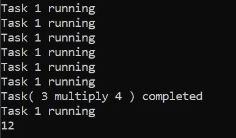
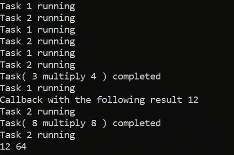
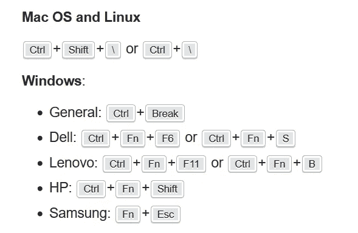

# 如何在 Python 中启动并行任务

> 原文：<https://betterprogramming.pub/how-to-launch-parallel-tasks-in-python-dd5735fb52c3>

## 利用 concurrent.futures，一个异步执行调用的高级接口


[杰米街](https://unsplash.com/@jamie452?utm_source=unsplash&utm_medium=referral&utm_content=creditCopyText)在 [Unsplash](https://unsplash.com/s/photos/parallel?utm_source=unsplash&utm_medium=referral&utm_content=creditCopyText) 上拍照。

通过阅读这篇文章，您将了解如何使用`[concurrent.futures](https://docs.python.org/3/library/concurrent.futures.html)`库在 Python 中异步运行任务。它是 Python 中的`threading`和`multiprocessing`类的更好替代，因为它用相同的接口实现了`Thread`和`Process`，这是由抽象的`Executor`类定义的。官方文件揭示了`Thread`的一个主要问题:

> “在 CPython 中，由于`Global Interpreter Lock`，一次只有一个线程可以执行 Python 代码(尽管某些面向性能的库可能会克服这一限制)。”

此外，`threading`类不允许你从除`null`之外的可调用函数中返回值。`concurrent.futures`模块的主要概念在于`Executor`类。它是一个抽象类，提供异步执行调用的方法。我们将使用从它继承的子类，而不是直接使用它:

*   `ThreadPoolExecutor`
*   `ProcessPoolExecutor`

让我们进入下一节，开始编写一些 Python 代码。

# 1.ThreadPoolExecutor

## 导入

在 Python 文件的顶部添加以下导入声明:

```
from concurrent.futures import ThreadPoolExecutor
import time
```

## 可调用函数(目标)

让我们定义一个新函数，作为异步调用的可调用函数。我将只定义一个简单的函数，它休眠两秒钟，然后返回两个输入参数相乘的结果:

```
def wait_function(x, y):
    print('Task(', x,'multiply', y, ') started')
    time.sleep(2)
    print('Task(', x,'multiply', y, ') completed')
    return x * y
```

## 单一任务

下一步是创建一个`ThreadPoolExecutor`对象。强烈建议将它包装在`with`上下文管理器中，因为它会自己调用`shutdown`函数，并在完成执行后释放资源。它接受以下输入参数。

*   `max_workers` —该实例的工作线程数。对于 3.5 以上版本，它将默认为机器上的处理器数量乘以 5。从版本 3.8 开始，默认值更改为`min(32, os.cpu_count() + 4)`。
*   `thread_name_prefix` —允许用户控制由池创建的工作线程的`threading.Thread`名称，以便于调试。
*   `initializer` —在每个工作进程开始时调用的可选可调用程序。
*   `initargs` —传递给`initializer`的一组参数。

在本教程中，我将只使用`max_workers`参数。让我们创建一个`ThreadPoolExecutor`并用`wait_function`作为输入可调用函数来调用`submit`函数。记住`wait_function`接受两个输入参数。我将把它们作为单独的参数传递，而不是一个元组:

```
with ThreadPoolExecutor(max_workers=1) as executor:
    future = executor.submit(wait_function, 3, 4)
```

`submit`函数将返回一个`Future`对象，该对象封装了一个可调用对象的异步执行。`Future`对象最常用的功能有:

*   `cancel` —试图取消执行。返回一个 boolean 值，该值指示呼叫是否已成功取消。
*   `running` —检查呼叫是否正在执行。返回一个布尔值。
*   `done` —检查通话是取消还是完成。返回一个布尔值。
*   `result` —返回调用返回的值。如果调用尚未完成，则该方法将等待输入参数`timeout`给出的 *n* 秒。强烈建议在调用结果之前使用`done`函数进行检查，因为`timeout`会阻止当前的执行。
*   `add_done_callback` —将可调用函数附加到`Future`对象上。当`Future`被取消或结束运行时，这个函数将被调用，唯一的参数是`Future`。

将下面的代码添加到`submit`函数的正下方。这只是一个简单的循环，在线程运行时打印一个字符串。完成后，它将打印出结果:

查看 GitHub 上的完整代码[:](https://gist.github.com/wfng92/f8a677d74fce8bb752290de4f64f966d)

运行 Python 文件时，您应该会看到以下结果:



作者图片

## 多重任务

接下来，我们将向它添加另一个任务，这样它们将并行运行。将 Python 文件中的代码更改为以下内容:

现在，先将`max_workers`设置为 1。运行它，您应该注意到任务不是并行运行的。它将运行第一个任务，然后运行第二个任务。这主要是因为池中只有一个工人。让我们将`max_workers`增加到 2，您应该能够看到两个任务并行运行。

## 回调函数

您可以给`Future`对象附加一个回调函数。一旦执行被取消或完成，它将调用附加的函数。如果您打算在成功连接到数据库或完成 URL 请求后继续更新 UI，这将非常有用。现在让我们创建一个简单的回调函数:

```
def callback_function(future):
    print('Callback with the following result', future.result())
```

在`submit`函数的正下方添加以下代码:

```
future.add_done_callback(callback_function)
```

查看 GitHub 上的完整代码[:](https://gist.github.com/wfng92/4a7c3993dc4873c6dc2aeb7ea11007f3)

运行 Python 文件时，控制台中将显示以下结果:



作者图片

# 2.进程池执行器

`ProcessPoolExecutor`类的工作方式与`ThreadPoolExecutor`完全相同，但是有一些小的不同。它使用`multiprocessing`模块，这允许它绕过`Global Interpreter Lock`。然而，这也意味着只能执行和返回可选择的对象。

此外，它不能在交互式解释器中工作，必须有一个可由工人子进程导入的`__main__`函数。`max_workers`将机器中的进程数。在 Windows 操作系统上，`max_workers`必须等于或小于 61。

您必须导入`ProcessPoolExecutor`才能使用它:

```
from concurrent.futures import ProcessPoolExecutor
```

可以重用之前的代码，修改为`ProcessPoolExecutor`而不是`ThreadPoolExecutor`。将代码包装在一个函数内，直接从`__main__`调用。在 GitHub 上查看以下[中的完整代码:](https://gist.github.com/wfng92/d840c3a2ec5f72c3fb87c4364021283a)

# 3.键盘中断

如果您打算在进程在线程中运行时通过`Ctrl+C`停止执行，编译器很可能会挂起并卡在`KeyboardInterupt`异常处。这主要是因为`Ctrl+C`命令产生`SIGINT`，不会停止或中断执行。你需要生成`SIGBREAK`来结束执行，返回终端。根据操作系统和计算机型号，使用以下命令生成`SIGBREAK`:



来自[堆栈溢出](https://stackoverflow.com/questions/1364173/stopping-python-using-ctrlc)的图像。

# 4.结论

让我们回顾一下今天所学的内容。

我们从简单解释`concurrent.futures`模块开始。

之后，我们深入探讨了基本的`ThreadPoolExecutor`类和`Future`类。我们尝试用不同数量的`max_workers`并行运行多个任务。我们还测试了如何设置一个回调函数，该函数将在任务完成时执行。

我们转到了`ProcessPoolExecutor`，它与`ThreadPoolExecutor`相似，只有一些小的不同。

感谢你阅读这篇文章。希望下一篇文章能再见到你！

# 参考

1.  [期货文件](https://docs.python.org/3/library/concurrent.futures.html)
2.  [线程文档](https://docs.python.org/3.8/library/threading.html)
3.  [中断信号的快捷方式](https://stackoverflow.com/questions/1364173/stopping-python-using-ctrlc)