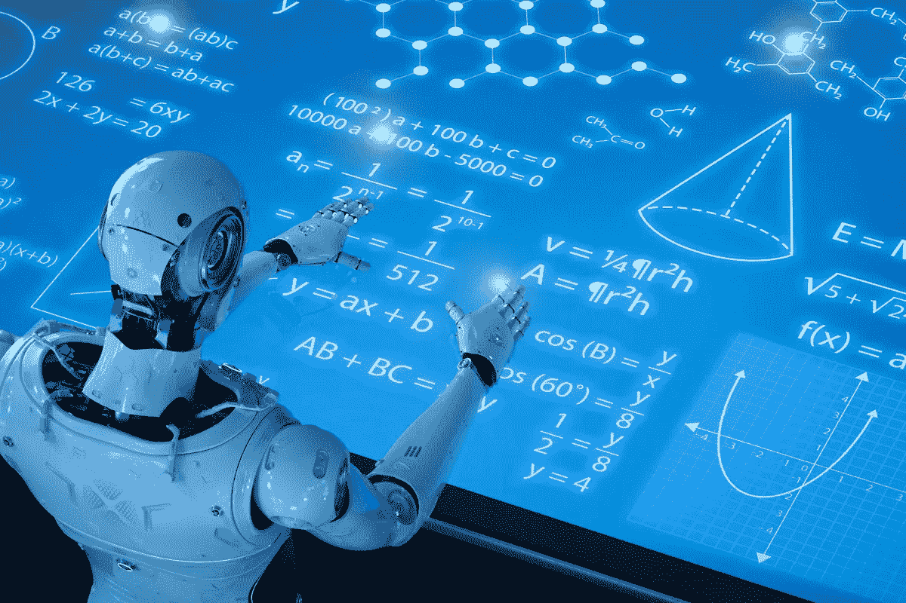
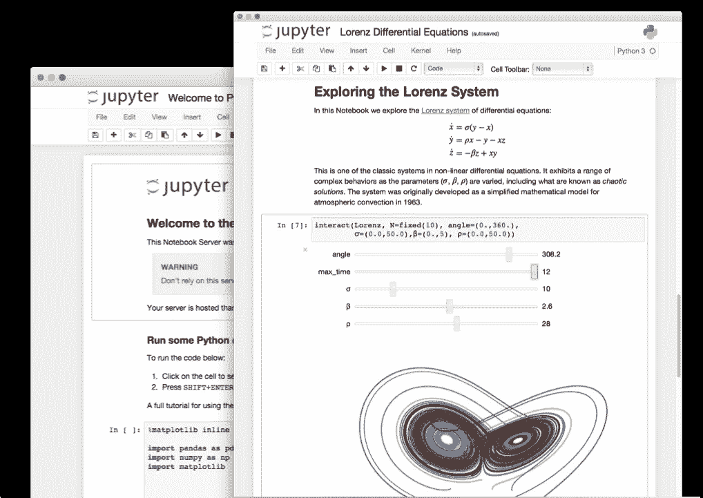
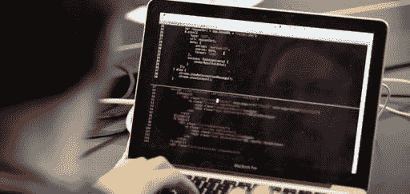

# 高中生如何学习 AI

> 原文：<https://betterprogramming.pub/how-to-learn-ai-as-a-high-schooler-9166cadcf4f4>

## *从高中生开始学习人工智能的指导方针*

由 [J .凯利·布里托](https://unsplash.com/@hellokellybrito?utm_source=medium&utm_medium=referral)在 [Unsplash](https://unsplash.com?utm_source=medium&utm_medium=referral) 上拍摄的照片。

随着人工智能的发展速度比以往任何时候都快，许多学生和开发人员开始进入该领域。然而，许多对计算机科学的未来感兴趣的高中生想学习人工智能，但被高度复杂的概念推开了。如今，许多高中生正在通过可汗学院或 AP 计算机科学的在线课程学习如何编程，但创建人工智能项目则完全是另一回事。

我面临着同样的困境。在我大二开始的时候，我对编码有很强的理解，因为我知道 Java 和一些 Swift，但我几乎不知道 AI 是什么。在参加了一个黑客马拉松并仅仅通过遵循一些文档创建了一个人工智能项目之后，我真的不知道我在做什么，我被迷住了。我花了差不多六个多月的时间才真正学会自己在做什么，但回过头来看，作为一名高中生，要学习人工智能，需要采取几个关键步骤。

作为一名高中生学习人工智能可以建立基础，这将让你在大学或职业生涯中占据优势，所以如果你感兴趣，不要错过机会。只要遵循几个基本步骤，确保你能全部消化。

# **1。学习 Python**

了解 Python 将是你 AI 之旅中最精彩的部分。照片由[沙哈达特·拉赫曼](https://unsplash.com/@hishahadat?utm_source=medium&utm_medium=referral)在 [Unsplash](https://unsplash.com?utm_source=medium&utm_medium=referral) 上拍摄

学习或温习你的 Python 技能将是学习 AI 和 ML 的基础。几乎没有其他语言可以用来编写人工智能代码，如果不了解 Python 的基本语法，当你可以调试实际的人工智能错误时，你会陷入试图修复语法错误的困境。

我假设如果你想学习人工智能，你理解基本的编码概念。如果没有，先学那些！不知道如何编码，你就无法学习人工智能——更不用说创建人工智能项目了。但是如果你懂 Java，JavaScript，甚至 Swift，就没问题了。只要上一堂 Python 语法的速成课，就没问题了。任何在线课程或播放列表都可以。不过，这是第一步。不了解 Python，肯定会纠结。

# 2.**从传统 ML 开始**

人工智能可能会变得非常复杂，所以从机器学习的基础开始是关键。来自[专家系统](https://www.google.com/url?sa=i&url=https%3A%2F%2Fexpertsystem.com%2Fmachine-learning-definition%2F&psig=AOvVaw2mk1rt9Q-WCoYiG3qAiOzv&ust=1598515758522000&source=images&cd=vfe&ved=0CAIQjRxqFwoTCNDguLK1uOsCFQAAAAAdAAAAABAD)的照片。

当我开始学习 AI 时，我的一个错误是直接跳到深度学习和建立神经网络。这可能是高中生的一个普遍问题，因为许多人陷入了深度学习的宣传中。学习人工智能几个月后，我知道如何编写神经网络，但我不知道什么是线性回归。这是一个问题，因为学习基础知识总是比直接跳到更高级的主题要好。

真正理解深度学习需要对标准机器学习有很强的理解，因此所有高中生都应该确保他们采取从头开始的方法，而不是过度扩展自己。

我建议高中生从普通数据集的基本线性和逻辑回归模型开始，以真正理解机器学习是如何工作的。线性回归基本上是一条“最佳拟合线”，几乎所有高中生都很熟悉。线性回归非常简单地解释了损失函数是如何工作的，这是人工智能和深度学习的最基本的概念之一。我认为学习决策树和随机森林等其他算法可能没有那么有用，因为它们不能很好地转化为深度学习，而这正是大多数高中生感兴趣的。

不管怎样，如果你想真正进入 AI 和 DL，先学基础。仅仅为了表明你了解 DL 而阻碍你的长期发展是不值得的。

# 3.**不要担心数学**

AI 和 DL 背后的数学会变得非常困难，但是不要为此而紧张。图片来自[信息世界](https://www.google.com/url?sa=i&url=https%3A%2F%2Fwww.infoworld.com%2Farticle%2F3448551%2Fgoogle-dex-language-simplifies-array-math-for-machine-learning.html&psig=AOvVaw1oYa0Tr5jAHr9Ra5eOe1wV&ust=1598515913748000&source=images&cd=vfe&ved=0CA0QjhxqFwoTCICpiP61uOsCFQAAAAAdAAAAABAD)。

我认为学生眼中最大的障碍是认为他们必须学习 AI 和 DL 背后的数学。我今年大三才开始学微积分，AI 和 DL 的数学我还是不太懂。我认为理解数学被高估了。在不知道梯度下降和反向传播如何工作的情况下，你仍然可以创建伟大的项目，并对人工智能有足够的了解。要创建好的模型，您真正需要知道的是反向传播优化了模型中的权重。

显然，知道微积分和高等数学最终将是重要的，但对于高中生来说，我认为只知道代数 II 就足够了。

如果你懂微积分，并且能够理解深度学习背后的数学，大多数人肯定会去学。但是如果你没有，不要为此感到压力。你仍然可以很好地理解深度学习是如何工作的。如果你坚持不懈，继续留在这个领域，你最终会学会数学——要么在高中结束前，要么在大学早期。

# 4.**使用 Jupyter 笔记本/Google Colab**

Jupyter 笔记本是高中生的一个很好的工具，因为它很熟悉。

另一个重要的技巧是用笔记本格式编写所有项目的代码。 [Jupyter Notebooks](https://jupyter.org/) 是一款数据科学工具，包含单元格格式的代码和文本，允许即时编译和保存笔记和结果。首先，笔记本和它们在单元格之间的降价功能可以让每段代码更清晰、更容易理解。当你回去检查你写的代码时，markdown 允许你直观的组织和简单的修改你用代码写下的笔记或概念。脚本中的注释可能足够了，但是它们很难保持有组织，并且为代码段编写大量注释真的很难，因为这只会变得混乱。

大多数高中生习惯在课堂上记笔记，所以使用 Juypter 笔记本学习新概念将是一种熟悉的体验。

笔记本还允许即时测试和反馈。这对高中生和初学者来说非常好，因为你的代码中通常会有错误。能够快速记下 markdown 中的错误，编辑一行，然后按下 run 快捷键简化了这个过程。

此外，笔记本允许代码和数据的可视化，对于可能不擅长消化硬数字和数据的高中生来说，笔记本使这个过程变得容易得多。最后，使用 Google Colab 允许免费使用 GPU，而大多数高中生没有本地 GPU 或大学水平的计算，因此使用 Colab 中的免费 GPU 可以轻松进行 DL 培训。

# 5.**继续编码项目**

确保你没有停止编写项目代码，否则你会忘记你所学到的东西。图片来自 [codingSupply](https://www.google.com/url?sa=i&url=http%3A%2F%2Fcodingsupply.com%2Fbest-programming-projects-college-students%2Fprogramming-project-college-student%2F&psig=AOvVaw3-x1xcxLlJ-NO8LYnBmiAT&ust=1598516176820000&source=images&cd=vfe&ved=0CAIQjRxqFwoTCJjfnfu2uOsCFQAAAAAdAAAAABAK) 。

这似乎是显而易见的，但我不能强调实践的重要性。学习理论是重要的，但如果不付诸实践，那么早就学习人工智能真的没有价值。创建一个项目会产生一种认同感和自豪感，因为你可以把你所学到的东西拿出来，并看到它的表现。而且功能性强、有价值的项目可以在 GitHub 上、作品集里展示，可以帮助你展示自己的作品。最重要的是，编写项目代码总是刷新你所学的内容，就像高中的任何其他课程一样，如果不做练习题，你会忘记你所学的内容，并将不得不浪费时间重新学习。

创造你想要的任何东西——也许去参加黑客马拉松或参加 Kaggle 比赛，或者甚至开始你自己的人工智能创业。只要确保你将所学付诸实践。

# 结论

说到底，作为一个高中生，你并不能真正了解多少人工智能。我几乎每天都为人工智能项目编写代码，并且已经做了将近一年，但我仍然只接触了这个领域的皮毛。作为高中生学习人工智能应该是一种有趣的体验。不要把自己累垮了。实践概念和创建有趣的项目让你保持专注，当你在一个如此严格的领域时，确保你喜欢你正在做的事情是最好的实践。休息一下，不要超越自己的极限。仅仅因为你的项目没有专业数据科学家的好，并不意味着你所做的没有价值。

如果你和我一样是高中生，想学 AI，我为你鼓掌。这并不容易，但如果你准备好迎接挑战，只要确保你遵循这些基本准则。它们会让你的经历更加轻松和丰富。