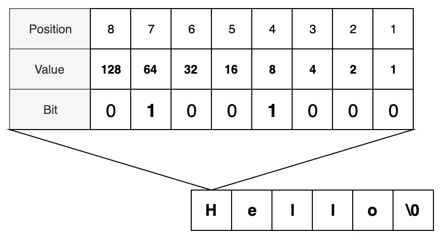

# 如何快速学习任何新的编程语言

> 原文：<https://betterprogramming.pub/how-to-learn-any-new-programming-language-quickly-94996895669b>

## 基本要素的基本清单

照片由[克莱门特·H](https://unsplash.com/@clemhlrdt?utm_source=medium&utm_medium=referral)在 [Unsplash](https://unsplash.com?utm_source=medium&utm_medium=referral) 上拍摄

本文假设您已经知道至少一种编程语言；但是，这里的概念将帮助您开始编程。

当我在学校的时候，一位老师告诉我一些我与新开发人员分享的事情:**你将学习的最难的编程语言将是你的第二语言。**

不要因此而沮丧——这意味着当你第一次学习如何编程时，你已经对编程有了所有这些先入为主的想法。你最终会做出比你应该做的更多的语法连接和假设。正因为如此，当你学习第二语言时，你必须“忘却”这些假设。如果你试图学习你的第二语言甚至第三语言，请记住这一点。

# 编程剖析

编程语言很多，[轻松过 5000](https://codelani.com/posts/how-many-programming-languages-are-there-in-the-world.html)，但是 [TIOBE 指数](https://www.tiobe.com/tiobe-index/)列出了前 250。所有不是特例的前 20 种语言都有相似的标准库。

我认为思考编程的最好方法是去掉所有多余的“东西”，这样你就只剩下必要的东西了。

# 原子

每种语言的每个方面都可以归结为**真**和**假**。为什么？因为电是这样工作的——你要么带电荷，要么不带电荷。存储器以 **0** s 和 **1** s 的形式存储值，这个*位* 要么带电，要么不带电。

八位相当于一个*字节*，足以列出 [ASCII 表](http://www.asciitable.com/)上的任意字符。这些位以这样的顺序翻转，以提供字符的十进制表示。计算机理解如何将这种表达翻译成字母。

基本的二进制表示，显示单词 Hello 是如何创建的。

理解了“为什么”这一个概念，接下来的事情就容易多了。

# 工具

弗勒在 [Unsplash](https://unsplash.com?utm_source=medium&utm_medium=referral) 上的照片

这些工具都是一样的，虽然它们可以以任何顺序学习，但这是我通常采用的顺序。

## **变量**

这看起来很简单，但是说真的，如何创建一个变量呢？

## **运算符**

什么是运算符，它们是如何使用的？你可以假设你有基本的数学操作符，但是逻辑操作符呢？“and”运算符是否拼写为“AND”或“AND”，或者是否使用诸如“&&”之类的符号

## **条件句**

令人惊讶的是，我在 Swift 和 Python 上阅读最多的文章都与决策有关。接下来你需要知道的是你如何在你的程序中做决定。你想学的语言是用传统的“if/else if/else”还是更 Pythonic 化的比如“if/elif/else？”你的语言有“开关”或“守卫”的说法吗？

## **循环**

你如何循环重复的任务？该语言是否包含 for 循环、while 循环、do-while 循环或 for-each 语句？

## **功能**

有可能创造功能吗？如果有，你是怎么做的？如何在这些函数中包含参数？知道如何正确使用函数将会节省您的时间，让您的生活变得更加轻松。

## **类和结构**

这种语言理解类或结构的概念吗？这听起来像是一个愚蠢的问题，但是有些语言两者都没有，或者只有一个。如果有，如何创建一个类或结构？这个类需要构造函数或者初始化方法吗？

## **错误处理**

错误是不可避免的。当它们发生时，这种语言有健壮的错误处理解决方案吗？你如何使用它？是“试/抓”、“试/除”，还是别的？是否有其他子句如“else”或“finally”允许错误的其他选项？

## **测试**

你如何测试你的代码？有内置的测试库吗，还是需要下载一个单独的工具？

所有这些工具都应该是最现代的编程语言。甚至像 COBOL 这样的老语言也有大部分，但它们可能被称为不同的东西，比如段落或抄写本。

照片由[大流士·苏德和](https://unsplash.com/@dsoodmand?utm_source=medium&utm_medium=referral)在 [Unsplash](https://unsplash.com?utm_source=medium&utm_medium=referral) 上拍摄

# 变好

一旦你理解了这些工具，接下来你需要做的就是使用它们并编写一个应用程序。你可以通过阅读文档来了解一种语言，但是除非你用它编写了一些应用程序，否则你并不了解这种语言。

通过编写应用程序，你被迫像一个 *X* 程序员一样思考。我可以说我了解 C++，因为我上过 C 语言的课，也读过 C++的文档，但是我真的不了解它，直到我用 C++编写了一个应用程序，使用了该语言特有的特性。

21 点是一个很好的起步项目。21 点需要变量、运算符、条件、循环(基于玩家数量)、函数、类/结构和错误处理。您可以包含潜在失败的测试案例，例如卡片用完。

其他好的起步项目可能包括滑道和梯子、Yahtzee 或老虎机。

对于更高级的东西，尝试再造一个像大富翁这样的游戏。多考虑一下机制，让它基于文本。

重要的是要记住，如果你低估了任务的难度(比如跳过 21 点的双倍下注或拆分功能)，你只会限制你对语言的理解。

# 还有什么？

我知道上面的列表并不是一门语言所能提供的全部。事实上，您可以使用上面列出的工具编写任何东西，但是标准库中包含的额外功能使它变得更加容易。大多数标准库都包含相同的函数，所以你可以依赖不同语言间相似的名字。

你使用一门语言越多，你就越能发现标准库，但是一定要提前学习这些工具。

当你使用一种语言时，试着找出它的长处和短处。这些将有助于您理解针对特定问题应该使用哪种语言。

需要快速做一些数据科学？看几个 Python 包或者 r .需要写一个快速的服务？看 C 还是走。网络服务器怎么样？看看 Java 或者 Python。

我不只是通过看语言来了解这一点。我通过*使用*这些语言学到了这一点。

由于这可能是我迄今为止最短的一篇文章，我将留给你一个挑战，让你学会一门新的语言。祝你好运！