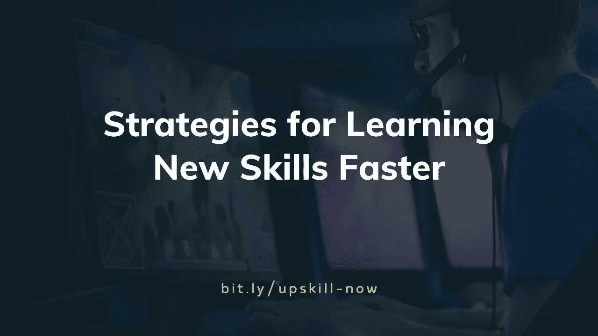
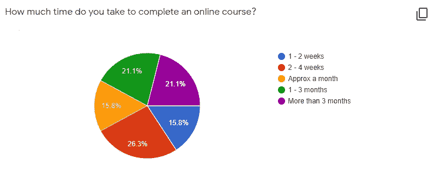

# 更快学习新技能的策略

> 原文：<https://betterprogramming.pub/how-to-learn-anything-faster-40b54235f0d6>

## 比如编程

由于有了互联网，学习任何新技能变得比以往任何时候都容易。我们只需点击几下鼠标就能获得任何信息。

你知道吗，大多数人平均需要 25-30 天来完成 Coursera/Udemy 上 30 小时的课程。在线 MOOCs 的完成率不到 15%，这意味着在 1000 名注册课程的人中，有 850 人从未完成课程，并辍学。

但是为什么有人会中途退出呢？原因可能是什么？是课程不好，还是我们没有足够的动力继续下去？

我对大约 200 人进行了调查，以下是他们的回答。

调查回应— 1

调查回应— 2

一些关键见解:

*   超过 55%的人说他们需要一个月以上的时间。
*   超过 70%的人的课程完成率约为 50%或更低。

现在，让我们看看有什么方法可以更快地学习新技能。

# 1.第一个 20 小时规则

人们不知道如何构建的原因之一是*教程地狱*。

教程地狱基本上是一个阶段，当你在看一个课程视频或反复阅读多个博客，而没有应用这些知识。因此，你永远不会对自己的技能有信心。

你可以通过遵循前 20 小时规则来避免这个问题。

拿起纸笔，解构技巧。当你完成后，决定你到底想要建立什么。

将你的学习分解成多个部分进行练习。收集你可以从中学习的资源。然后接下来的 20 个小时专注学习。

学到足够的知识，知道从哪里开始建设。在建造的时候解决剩下的问题。

这个过程被称为通过构建来学习*。*

# 2.记录你的学习，并在公共场合学习

取得进步的最好方法是跟踪你的进步。记录你的学习将有助于你步入正轨。

记录你的旅程

我一直在经营一个封闭的社区，帮助学生学习编码和构建东西。我们有每周更新博客的传统。你可以[点击这里](https://medium.com/frontbench-tech)查看博客。

# 3.**在社区中学习**

找一群能帮助你挑战极限的人。基本上，在社区中的学习变得更像一个游戏，你们互相推动以达到你们的目标。

# 4.教别人

当你学习教别人时，你会格外专注，这样你就不会在讲课时感到尴尬。

即使你没有人教，也要假装学得像要教人一样。

使用空的 Google meet/zoom 来记录您的会话并亲自查看。

在推特上关注我！

感谢阅读！