# 用 Python 学吉他

> 原文：<https://betterprogramming.pub/how-to-learn-guitar-with-python-978a1896a47>

## 用列表、字典和 matplotlib 展示音阶


安德鲁·亚德利在 [Unsplash](https://unsplash.com?utm_source=medium&utm_medium=referral) 上拍摄的照片

Python 能帮我们演奏什么乐器？

在本教程中，我们将从头开始，看看我们如何使用列表、字典和 matplotlib 来构建一个可以帮助我们弹吉他的工具。但是在我们开始之前，让我们先上一堂速成课，学习一些我们以后会用到的音乐原理。如果你很好奇，可以看看[这款交互式的 colab 笔记本](https://colab.research.google.com/github/diegopenilla/PythonGuitar/blob/master/How_to_learn_guitar_with_Python.ipynb)来亲自体验一下。

# 背景资料

音乐理论是一门由许多部分组成的复杂学科。为了这篇文章的目的，我们将这里的事情简化一些，所以如果你是一个音乐家，不要太认真。

假设你能想象出可听见的声音的频谱，试着把它分成一个对你和你周围的每个人都有意义的音乐系统。这可不容易！经过几个世纪的斗争，人类已经提出了一个看起来像这样的系统(但仍有争议在进行):

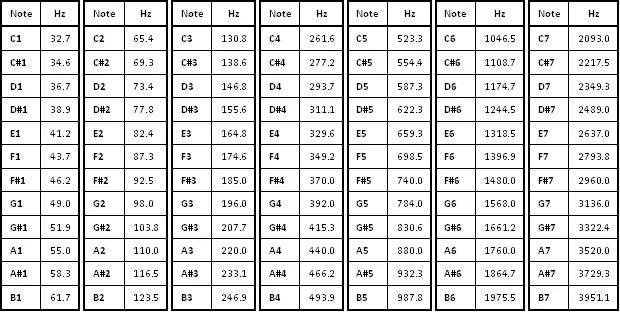

音符及其频率

如果你检查这些行，你会注意到音符是相同的，但是频率不同。你这样看到的被称为八度音程:一个音乐[音高](https://en.wikipedia.org/wiki/Pitch_(music))和另一个两倍于其频率的音高之间的[音程。听到这种比例如何让这些不同的声音感觉如此相似和相关，真是令人惊讶。事实上:](https://en.wikipedia.org/wiki/Interval_(music))

> 由于密切相关的谐波，人耳倾向于听到这些基本上“相同”的声音。

在这篇文章中，我们不会为实现频率而烦恼，而只会考虑一个八度音程内的不同音符，也就是你在每一栏中看到的那些:

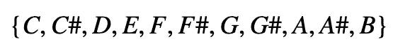

在这一点上，有些事情我必须提一下:

*   C 和 C#之间或 C#和 D 之间(彼此紧挨着)的音程称为**半音**或**半音。**
*   C 与 D 之间或 F 与 G 之间的音程称为**音**或**音级。**

但是我为什么要说这些呢？原来你习惯听到的音乐是基于一套[音阶](https://en.wikibooks.org/wiki/Music_Theory/Scales_and_Intervals)的。而这些无非是你选择弹奏的音符之间的*音程*。或者更苛刻地说，它们只是模式。

最简单的音阶可能是[半音音阶](https://en.wikipedia.org/wiki/Chromatic_scale)，其中你将一个八度音程之间的所有半音(字面上所有不同的音符)。让我们创建一个变量来保存半音音阶:

```
A = ['A','A#', 'B', 'C','C#','D','D#','E','F','F#' ,'G','G#']
```

音阶的第一个音符被称为**根音**，而给出了音阶的名字。它也是您弹奏时手指休息的地方(因为它感觉像是将所有东西结合在一起的基础音)。让我们来看另一个半音音阶，以 C 调的根音开始(C 半音音阶):

```
C = ['C','C#','D','D#','E','F','F#' ,'G','G#','A','A#', 'B']
```

有趣的是，即使这两个音阶有完全相同的音符，因为它们从不同的根音开始，单个音符和根音之间的音程完全不同，这使得这些音阶彼此没有任何相似之处。

关于半音音阶已经说得够多了(把所有半音都拿走听起来并不那么令人愉快)。在美感的引导下，人类想出了许多演奏这些音符的方法。经过漫长的选择过程，一些音阶已经融入并发展成为我们今天所熟知的音乐。如果你听到这些传说中的音阶，你会注意到它们听起来非常独特。让我们来看看 c 大调音阶，并与上面显示的 C 半音音阶进行比较。

```
C_major_scale = ['C', 'D', 'E', F', 'G', 'A', 'B']
```

通过仅取特定的音程，我们创建了如下所示的大调音阶:

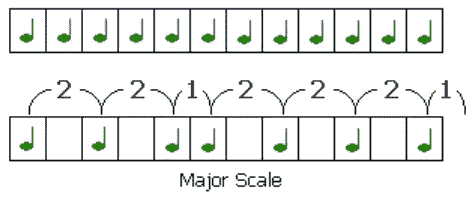

大调音阶的音程:t *一、调、半音、调、调、调、半音。*

如果我们从 C 半音音阶开始，按照这个模式，我们得到 C 大调音阶。如果我们从 A 半音音阶开始，按照这些音程，我们得到 A 大调音阶，以此类推。

*通过将这些区间转换成索引*，我们可以相当容易地在 Python 中实现这一点。我们所要做的就是使用索引来访问列表中的值。我们来看看 c 大调的音符是怎么得到的:

```
C = ['C','C#','D','D#','E','F','F#' ,'G','G#','A','A#', 'B']# intervals of the major scale as indexes:
major_scale = [0, 2, 4, 5, 7, 9, 11]# select elements with these indexes into a list
notes = [C[i] for i in major_scale]print(notes)
```

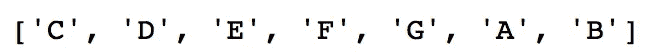

总之:利用给定音阶的音程作为索引，我们可以检索组成音阶的音符。这就是你需要理解的全部。我们将一遍又一遍地应用这一原则来提取组成给定音阶的音符。利用这些信息，我们将绘制出这些音符在吉他中的位置。

# 概观

本教程的目的是创建一个程序，用它你可以找到给定音阶的音符在吉他中的位置。为此，我们必须想办法:

*   提取组成给定音阶的音符。
*   找到它们在吉他琴弦上的位置。
*   沿着音阶的音符画出吉他的弦和品。

开始吧！

## 提取笔记

创建半音音阶的一种简单方法(无需明确键入)是将一个列表与其中的所有音符连接起来，并对所需的元素进行切片。让我们看看如何:

```
whole_notes = ['C','C#','D','D#','E','F',
               'F#','G','G#','A','A#','B']*2
```

我们将两个八度音阶的音符连接在一起，并将其存储为`whole_notes`。有了这样的列表，我们可以从任何根音开始，轻松地分割半音音阶。让我们看一个 B 的例子:

```
# index where element 'B' is located.
root = whole_notes.index('B')# starting from this index, slice twelve elements
B = whole_notes[root:root+12]
print(B)
```

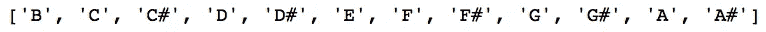

b 半音阶

现在我们有了一个从`B`开始的八度音程，我们可以使用我们定义的大调音阶音程来检索 B 大调音阶(就像我们之前做的一样):

```
notes = [B[i] for i in major_scale]
print(notes)
```

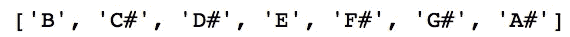

如果我们想要检索包含在另一个音阶中的音符，那么:

```
another_scale = [0, 2, 5, 10, 11]
notes = [B[i] for i in another_scale]
print(notes)
```

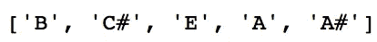

希望现在你能看到这一切的走向。为了方便起见，我们最好把它写成一个函数(这里总结了我们到目前为止实现的所有代码):

*   我们从一个给定的根音开始创建一个半音音阶(`octave`)。
*   然后提取`intervals`指定的音符(待演奏音符的索引)并以列表形式返回。

现在，让我们创建一个具有通用音阶的字典，使其更加有用:

使用这本字典，我们现在有一个简单的方法来访问任何音阶的音符，从任何词根开始，如下所示:

```
get_notes('A', scales['minor'])
```

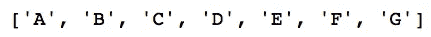

小音阶

```
get_notes('E', scales['harmonic_minor'])
```

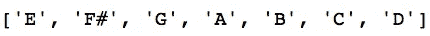

e 和声小调音阶

```
get_notes('F', scales['minor_blues'])
```

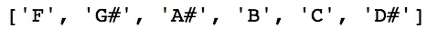

f 小调蓝调音阶

诸如此类…

我只能想象手工做这件事需要多少时间。[来源](http://gph.is/2wuZSAs)

# 创作吉他

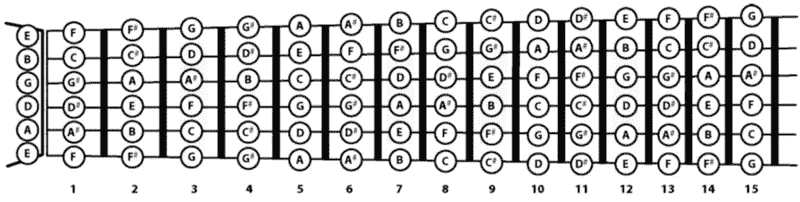

[前 15 品的吉他音符](http://www.simplifyingtheory.com/guitar-notes-piano/)。我们看到吉他的六根弦:低 E、A、D、G、B 和高 E。

我们快完成了！现在我们有了一种访问音阶音符的方法，让我们创建一个吉他来可视化它们。这将涉及到把吉他的弦表示成一个字典。让我们看看如何实现这一点:

正如我们之前通过获取 12 个列表元素的切片来创建八度音阶一样，这里我们从每个字符串的第一个音符开始获取 20 个元素的切片，并将它们放入字典中

```
print(string.keys())
```

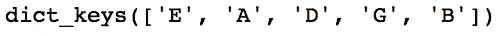

```
print(string['E'])
```

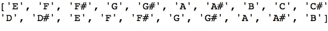

E 弦中 20 个第一品的音符

通过以这种方式将音符放在琴弦上，我们现在能够将它们与音阶的音符相匹配，以找到它们的位置。

## 在吉他中查找音符

为了记录音符的位置，我们将创建另一个字典。对于给定音阶中的每个音符，我们将添加它在吉他每根弦中的位置(索引)。为此，我们将做我们到目前为止一直在做的事情:使用索引访问列表元素。

我们需要注意的唯一一个小细节是，因为我们的琴弦包含 20 个音符，而不是 12 个，所以有些音符是重复的。正如我们之前通过打印`strings['E']`看到的，从 E 到 B 的所有音符都重复了两次。要重复的最后一个音符 B 在索引 7 和 19 处。因此，对于在索引为 7 或更小的字符串中找到的所有音符，我们必须添加它的重复索引。

调用该函数将返回一个字典，其中字符串的名称作为键，音符在指定音阶中的位置作为值。

```
# finding notes in a scale:
C_minor_blues = get_notes('C', scales['minor_blues'])# finding positions of these notes in the guitar, as a dict
positions = find_notes(C_minor_blues)
print(positions)
```

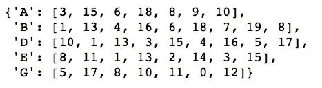

C 小调蓝调音阶的音符在吉他中的位置

```
# accessing note positions in string E
print(positions['E'])
```

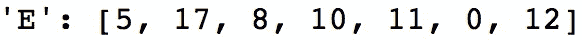

现在我们可以很容易地获得这些信息，我们终于能够在吉他中绘制这些信息了！

# 画吉他

展示吉他包括几个步骤:

*   在不同高度 y=1，2，3，4，5，6 处，将弦 E，A，D，G，B 和 high E 绘制成 2D 图中的水平线。(用于环线 9)。
*   将吉他的品标绘为垂直线。(用于环线 12)。
*   使用之前的函数`find_notes`找到我们想要的音阶的音符位置，并将它们保存为字典`to_plot`。
*   创建内部带有标签的圆圈来表示音符及其在吉他中的位置。(嵌套用于循环线 28、29)。

我还添加了一些非必要的代码，让它看起来更酷。好奇的话一定要查看评论。

这是这个小冒险的最终结果:通过调用函数`plot`并指定根音和音阶，我们可以显示一个 *matplotlib 吉他*和我们需要一起演奏的信息。

```
plot('C', scales['major'])
```

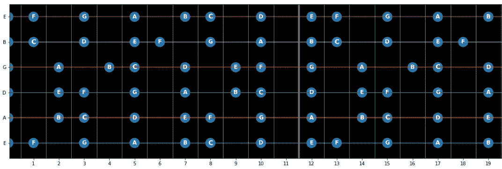

c 大调音阶

```
plot('F', scales['lydian'])
```

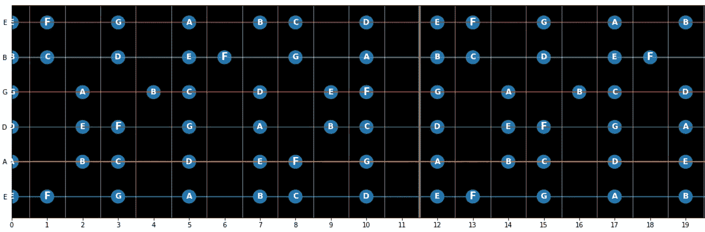

吕底亚音阶

```
plot('D', scales['minor_blues'])
```

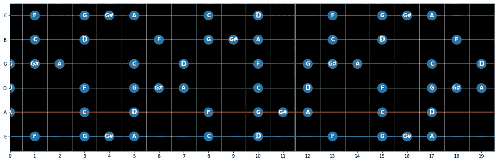

d 小调蓝调音阶

现在我们可以随心所欲地演奏任何音阶，而不必一直用谷歌搜索。如果你想演奏你自己定制的音阶，就把它们添加到`scales`字典中。

[来源](https://giphy.com/gifs/guitar-rip-bb-king-xTiTnJbISZfeB5JjyM)

## 感谢阅读！

就是这样！我希望你能从阅读这些想法中获得一些乐趣——并且你真的能用它来弹吉他！

在 collab notebook 中，我实现了一些下拉菜单以使其更容易使用，所以请随意查看。

(对于所有的音乐家，请原谅我没有考虑升半音阶或降半音阶，或者只使用升半音而不用一个 flat♭to 来代表音符，但这让事情变得更简单了！)