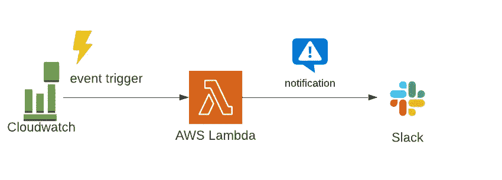
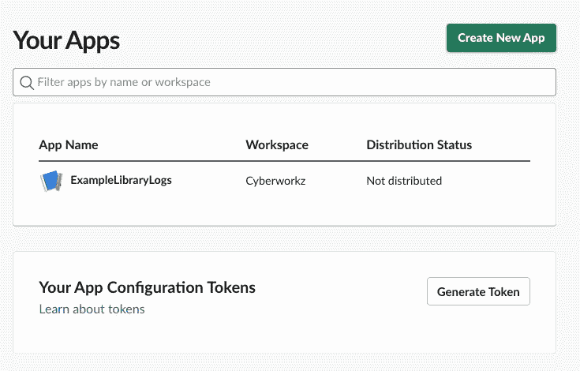
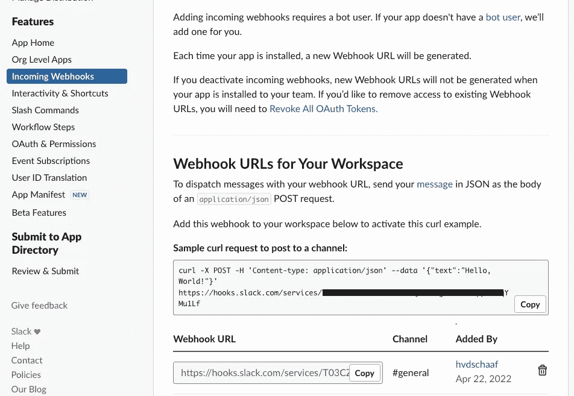
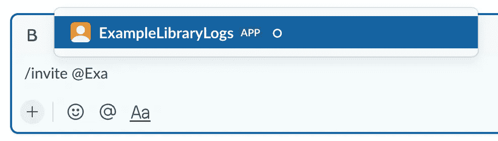
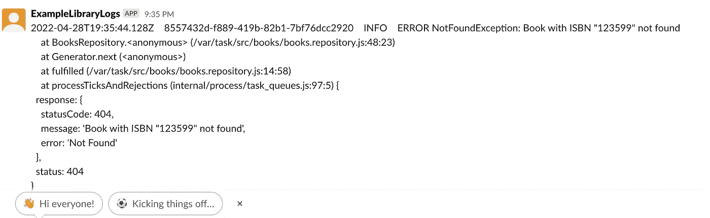

# 如何使用 AWS Lambda 让 Slack 通知您 Cloudwatch 错误

> 原文：<https://betterprogramming.pub/how-to-let-slack-notify-you-on-cloudwatch-errors-with-aws-lambda-c98f1193ce59>

## 不要寻找错误，让他们给你打电话


由[鲁拜图·阿扎德](https://unsplash.com/@rubaitulazad?utm_source=unsplash&utm_medium=referral&utm_content=creditCopyText)在 [Unsplash](https://unsplash.com/@rubaitulazad?utm_source=unsplash&utm_medium=referral&utm_content=creditCopyText) 上拍摄的照片

出问题时得到通知不是很好吗？如果它运行在 AWS 上，你很幸运，因为 AWS Lambda 可以监听 Cloudwatch 日志流。在这个故事中，我将演示如何使用 AWS Lambda 处理 Cloudwatch 日志流中的错误，然后向 Slack 发送通知。



**先决条件:**

1.  无服务器 CLI [已安装](https://serverlesscorner.com/your-first-serverless-project-cbf1deee29f7)。
2.  打字稿的基础知识。
3.  AWS 帐户。

## 设置闲置应用程序

在 Slack 上创建一个[账户，如果你还没有的话。接下来，使用这些](https://slack.com/get-started#/createnew)[指令](https://slack.dev/node-slack-sdk/tutorials/local-development#create-an-app)创建一个 Slack 应用程序。我已经创建了应用程序“示例库日志”。



创建一个 Slack 应用程序

下一步是激活一个传入的 webhook，您可以用它来发布通知。使用左侧菜单导航至“Incoming Webhooks”菜单项。添加一个网钩并选择一个松弛通道。我选择了*#通用*频道。



传入 webhook

导航到菜单项“OAuth & Permissions”并记下“ *Bot 用户 OAuth 令牌*”。应该以' *xoxb-* '开头。

使用 webhook，您现在可以在所选的 Slack 频道上发布消息。这里要做的最后一件事是通过键入`/invite @[appname]`邀请您的应用程序进入 Slack 中选定的频道



在 Slack 频道邀请 APP

## 无服务器设置

我们将在前面的[故事](https://blog.devgenius.io/how-to-build-a-serverless-rest-api-with-nestjs-and-dynamodb-7b58b5b59bf6)中讨论创建一个在线图书馆服务，并为该服务创建一个监视器。监控服务将在日志记录中出现异常时触发。

> 本文的完整项目可以在 https://github.com/cyberworkz/examples 的 Github [的 online-library-monitor 文件夹中找到。](https://github.com/cyberworkz/examples)

让我们使用这里找到的预定义模板[https://github.com/cyberworkz/serverless-templates](https://github.com/cyberworkz/serverless-templates)来设置无服务器项目。

使用以下命令创建项目:

```
sls create --template-url https://github.com/cyberworkz/serverless-templates/tree/main/aws-nodejs-typescript-cloudwatch-log --path online-library-monitor
```

我们来看看创建的项目的`serverless.yml`文件。

Lambda 函数通过一个自定义属性监听来自已定义的 cloudwatchLog 的事件，您可以在该属性中定义您的 cloudwatch `logGroup`名称。

```
events:      
   - cloudwatchLog:           
       logGroup: ${self:custom.logGroup}          
       filter: '?ERROR ?Exception'
```

此外，我们还定义了一个可选的过滤器，根据字符串“ERROR”或“Exception”过滤 cloudwatch 日志事件。详见[亚马逊 Cloudwatch 过滤器语法](https://docs.aws.amazon.com/AmazonCloudWatch/latest/logs/FilterAndPatternSyntax.html)。

## 密码

现在我们已经建立了项目，让我们深入代码。首先，我们需要安装 Slack [web-api 包](https://www.npmjs.com/package/@slack/web-api)。使用以下命令安装它:

```
npm i @slack/web-api
```

安装完成后，导航到创建的项目中的`processor.ts`文件，并使用您之前记下的令牌创建一个`WebClient`。您可以将令牌设置为 AWS Lambda 上的环境变量。

```
// Read a token from the environment variables
const token = process.env.SLACK_TOKEN;
const web = new WebClient(token);
```

来自已创建项目的`processor.ts`文件已经处理了输入的`CloudWatchsLogEvent`，并对其进行解压缩和解码。您只需添加以下代码片段来将 CloudWatch 消息发送到 Slack:

```
// message Slack 
try {
  const result  = await web.chat.postMessage({
     text: logEvent.message,
     channel: '#general'
});
console.log(result);
}
catch (error) {
...
```

产生的`processor.ts`文件应该如下所示:

# 部署

现在我们已经准备好部署 Lambda 函数了。使用以下命令将其部署到您的 AWS 帐户。

```
serverless deploy
```

现在，您所要做的就是创建一些错误，以便在 Slack 中得到通知。根据我的例子，如果你使用的是[在线图书馆服务](https://github.com/cyberworkz/examples/tree/master/online-library)，你可以用 Postman 获得一个不存在的书的 URL `[https://[your-api-endpoint].execute-api.eu-west-1.amazonaws.com/dev/books/123599](https://vkt7okkt9c.execute-api.eu-west-1.amazonaws.com/dev/books/123599).`

触发错误后，您应该会在 Slack 中看到如下内容:



发布到时差的错误消息

# 完成的

所以，这就结束了。我希望这对你的无服务器之旅有所帮助。同样，这个项目的代码可以在 Github:[https://github.com/cyberworkz/examples](https://github.com/cyberworkz/examples)的`online-library-monitor` 文件夹中找到。

# 海科·范德沙夫

*   ***如果你喜欢这个，请跟随 Serverlesscorner.com 上***[](https://serverlesscorner.com/about)****。****
*   ****爱情*** ❤️ ***阅读*** ***我的故事和其他关于媒？*** [***成为会员***](https://serverlesscorner.com/membership) ***如果你还不是会员。****
*   ****想阅读更多无服务器？报名参加我的*** [***月刊***](https://serverlessconsulting.org/newsletter) ***📬关于无服务器技术和使用案例的启发性和深刻的故事。****