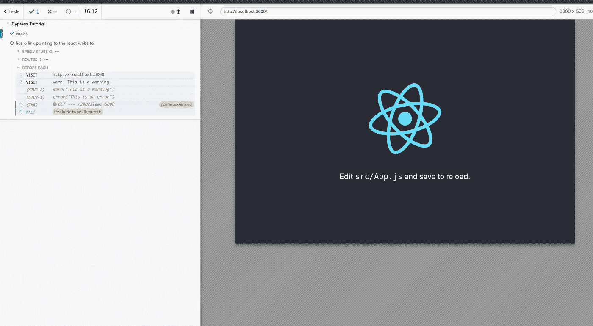
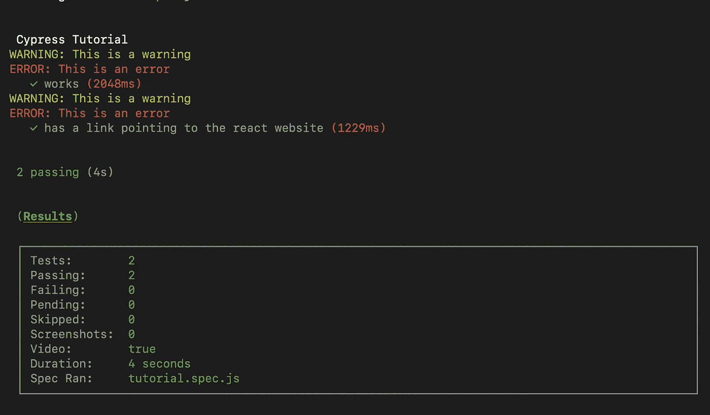

# 如何提高你的 Cypress 测试水平

> 原文：<https://betterprogramming.pub/how-to-level-up-your-cypress-testing-b37fbdb9d6b3>

## 等待网络请求、定制命令、将控制台日志传送到终端输出，以及在出现控制台错误时测试失败



用于端到端测试的 Cypress 非常棒，也很容易上手。但是一旦你写了很多测试，你就会开始意识到改进你的测试基础设施和实现的方法。以下是我学到的五种技术，它们极大地改善了我的 Cypress 测试。

# 我们将介绍五种技术

1.  使用 cypress 测试库
2.  明确等待网络请求
3.  将常见动作转化为命令
4.  在终端输出中记录浏览器警告和错误
5.  出现未知控制台错误时测试失败

# 设置测试项目

用 create-react-app 和`cd`创建一个新的 React 项目。

```
npx create-react-app cypress-tutorial 
cd cypress-tutorial
```

安装柏树。

```
npm i -D cypress
```

第一次打开开发 GUI，初始化项目中的 Cypress。

```
npx cypress open
```

删除示例测试目录。

```
rm -R ./cypress/integration/examples
```

在终端窗口中运行应用程序，并在整个教程中保持在`http://localhost:3000`运行。

```
npm start
```

## 加入埃斯林特和赛普拉斯林挺规则

为了避免在您的 IDE 中使用 Cypress 时出现恼人的林挺问题，让我们设置林挺，以便它能够理解 Cypress 的全局`cy`对象。

```
npm i -D eslint eslint-plugin-cypress
```

创建一个`.eslintrc.json`。

```
touch .eslintrc.json
```

将这段代码粘贴到您的`.eslintrc.json`中，以便您的 IDE 能够理解 Cypress 代码和现代 JavaScript。

```
{
  "plugins": ["cypress"],
  "env": { "es6": true }
}
```

## 编写一个基本测试

为了有一个实现更高级技术的起点，让我们编写一个超级基本的测试。

创建一个名为`tutorial.spec.js`的新测试文件。

```
touch ./cypress/integration/tutorial.spec.js
```

将下面的 Cypress 测试代码粘贴到`tutorial.spec.js`文件中。所有这些测试都是通过寻找 CRA 样板文件“学习反应”链接来确保应用程序正常工作。

**注意:通常情况下，你会在** `**cypress.json**` **中设置** `**baseUrl**` **！**

通过使用`npx cypress open`打开 GUI 运行测试，并查看测试是否通过。

# 技术 1:使用 cypress 测试库

你可能听说过 Kent C. Dodds 和他的测试库，比如 dom-testing-library 和 react-testing-library。嗯，还有一个为 Cypress 设计的叫做[Cypress-testing-library](https://testing-library.com/docs/cypress-testing-library/intro)。以一种更接近用户实际与你的应用程序交互的方式来轻松编写测试是非常好的，这意味着你的测试更好。

安装库。

```
npm install -D @testing-library/cypress
```

根据文档，我们需要将这个库导入到`cypress/support/commands.js`中，这样它才能工作。因此，用以下内容更新该文件...

```
import "@testing-library/cypress/add-commands";
```

现在我们可以像普通命令一样从`cy`对象中访问 cypress-testing-library 中令人敬畏的命令。让我们在现有的`tutorial.spec.js`测试中使用一个。

变化不大，但现在我们不再寻找`a`标签，仅仅是页面上有`Learn React`的任何东西。这种寻找它的方式更接近于用户阅读和与屏幕交互的方式。你可以在这里阅读更多关于这个概念的内容。

为了确保我们的测试实际工作，并在应该的时候中断，更改文本以搜索`Learn Vue`，并在 GUI 中查看测试中断。

# 技术 2:明确等待网络请求

我发现网络请求是测试失败的最大原因。有时它们很快，但其他时候它们会超过您的默认超时，导致您的测试失败。虽然您可以增加超时时间，但这会使您的测试比实际需要的时间更长。有更好的方法。

## 向 React 应用程序添加网络请求

我们需要一个网络请求来测试，所以让我们在`App.js`文件中添加一个虚拟请求。此外，由于某种原因，原生的`fetch` API 不能与 Cypress route 一起工作，所以让我们安装并使用 axios。

```
npm i axios
```

现在将这个粘贴到`App.js`中。

通过以上更新，该应用程序现在不会显示“学习反应”链接，直到网络请求在五秒钟后完成。在`[http://localhost:3000](http://localhost:3000.)`重新加载您的应用程序，亲自查看一下。

因为“Learn React”链接在五秒钟内没有显示，这比 Cypress 的默认超时时间要长，所以测试现在失败了。

## 坏的解决方法:增加超时

“修复”测试的一个次优方法是增加`findByText`命令的默认超时，如下所示。

```
describe("Cypress Tutorial", function() {
  it("Makes sure the app is working", function() {
    cy.visit("http://localhost:3000");
    cy.findByText("Learn React", { timeout: 10000 });
  });
});
```

现在您的测试通过了，但是它在每次运行测试时等待网络请求 10 秒钟——即使网络只需要两秒钟。这是添加到您的测试套件中的大量时间——乘以您使用该策略的次数！

## 更好的解决方法:别名和等待

Cypress 有一个叫做[别名](https://docs.cypress.io/guides/core-concepts/variables-and-aliases.html#Aliases)的东西，它可以让你在测试中显式地引用各种东西，比如元素、设备，在我们的例子中，还有[网络请求](https://docs.cypress.io/guides/core-concepts/variables-and-aliases.html#Requests)！

让我们通过别名化网络请求并在寻找“学习文本”链接之前等待它来改进我们的测试。

关于上述内容的一些解释/注意事项:

*   `cy.server`允许您“启动服务器，开始将响应路由到 cy.route()并更改网络请求的行为。”
*   `cy.route`允许您管理网络行为，并采用显式 url 或 glob 来匹配某些请求模式。你也可以通过一个配置对象得到更多的细节，这就是我在上面选择做的。

现在我们的测试通过了，只要需要就等待，即使你增加了`App.js`中的`secondsToWait`！

# 技巧 3:将常见动作转化为命令

当你写越来越多的测试时，你会发现你在重复使用很多相同的逻辑来进行普通的交互，比如…

*   登录您的应用程序
*   选择奇怪的元素
*   导航到页面
*   在页面上准备一些数据/状态
*   多得多…

我们的教程应用程序和测试非常简单——但是如果没有复杂的例子来展示一些技术，这就不是一个教程了！

因此，让我们编写一个新的测试来检查" Learn React" href 是否为" [https://reactjs.org."](https://reactjs.org%22) 。在这个测试中，我们将使用一些我们创建的可重用命令。

## 编写新的测试，还没有命令

在与第一个测试相同的`describe`块中，添加这个。很明显，它与第一个非常相似，所以我们将很快提取出共同的部分。

在 GUI 中运行测试以确保它通过。

## 我们的第一个命令

我们可能有理由在其他测试中验证链接的`href`，我们可以将其提取到一个漂亮的定制 Cypress 命令中。

很明显，你现实世界中的应用和测试将为编写可重用的命令提供更合理的理由。

打开`cypress/support/commands.js`,添加下面的代码——也就是我们的定制命令。

```
import "@testing-library/cypress/add-commands"; //same as before for cypress-testing-library

Cypress.Commands.add("verifyLink", (linkText, href) => {
  cy.findByText(linkText).should("have.attr", "href", href);
});
```

所以我们只是添加了一个命令`verifyLink`,它带有两个参数——要查找的`linkText`和链接应该有的`href`。

回到`tutorial.spec.js`并使用该命令！

## 额外好处:使用 beforeEach 可以在同一个测试套件中重用测试代码

有时候，测试代码只是在一个规范文件/套件中重复，我们可以用`beforeEach`、`afterEach`这样的选项提取出来，有时候只是好的 ole 风格的 JavaScript 函数。

在`tutorial.spec.js`，我们将利用`beforeEach`。下面是我们测试套件的最新版本。

# 技术 4:在 Headless/Terminal 输出中记录浏览器警告和错误

当您在 headless 模式下运行 Cypress 测试套件时，能够看到控制台警告和错误很好，这可能有助于您调试测试失败的原因。默认情况下，终端输出中不会出现这种情况，所以让我们让它发生。

## 向应用程序添加控制台警告和错误

首先，我们需要将错误和警告传递到终端。所以用下面的代码更新`App.js`:

在您的浏览器控制台中检查这三条消息。

## 在无头模式下运行测试

要在显示控制台警告和错误之前查看终端测试输出，请运行以下命令。

```
npx cypress run
```

## 日志控制台输出

对于如此简单的东西来说，这看起来有点复杂，但这是值得的，并且揭示了 Cypress 中的一些可能性。

打开`cypress/commands/index.js`，将下面的代码添加到文件的底部。

这里发生了一些不寻常的事情——让我们来分析一下。

*   `Cypress.on`是监听[柏树事件](https://docs.cypress.io/api/events/catalog-of-events.html#Event-Types)的一种方式。
*   我们在`window:before:load`事件上运行一个函数(基本上是在测试运行之前)。
*   为了拦截控制台方法，我们[存根](https://docs.cypress.io/api/commands/stub.html#Syntax)它们。
*   `cy.now`是我在这里[这里](https://github.com/cypress-io/cypress/issues/300)和[这里](https://stackoverflow.com/questions/53898085/check-if-an-error-has-been-written-to-the-console)学到的东西，似乎是为了避免和`cy.task`发生争执，并承诺赛普拉斯不喜欢的事情。我希望有更好的方法，所以如果你知道任何让我知道！

我们需要再更新一个文件`cypress/plugins/index.js`，才能让事情正常进行。下面是您在该文件中需要的代码，它监听我们刚刚在`cypress/commands/index.js`中设置的`tasks`，并登录到[内部 Cypress 进程](https://docs.cypress.io/guides/tooling/plugins-guide.html#Using-a-plugin)(包括带有漂亮颜色的终端输出)。

现在用`npx cypress run`在 headless 模式下运行测试，您应该会在终端输出中看到日志！



# 技术 5:当出现未知的控制台错误时，测试失败

Cypress 测试已经在未捕获的异常上失败了，这基本上就是你的应用崩溃了。但是有时候，当测试过程中浏览器出现`console.error`时，我们可能希望测试失败。

幸运的是，我们可以很容易地将这种行为添加到我们的 Cypress 测试中，只需对预览部分的代码做一点小小的添加。打开`cypress/support/index`并更新`Cypress.on`监听器块以匹配下面的代码，它只有一行多余的代码。

现在重新运行测试套件，看看它失败了！

## 奖励—忽略已知错误

有时我们知道控制台错误，但我们无法摆脱，但我们仍然希望测试失败，因为*未知的*错误。这是一个简单的修复方法，只需在我们没有识别出错误消息时抛出`Error`。见下文，了解我们如何忽略当前应用程序的控制台错误。

重新运行测试套件，控制台错误将不再使您的测试失败！

# 就是这样！

我有更多的 Cypress 技术(比如让它与 react-router 等现代 SPA 应用程序/工具一起工作，并添加到 CI /CD 管道中)我在本教程中没有篇幅介绍，所以这些将很快[推出](https://www.ryanjyost.com/subscribe)！