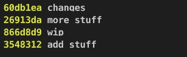
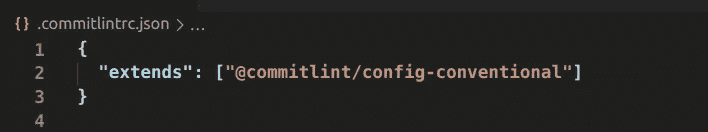
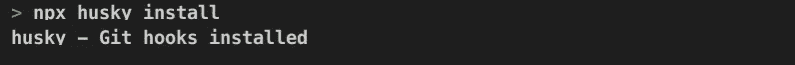
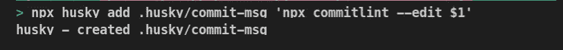
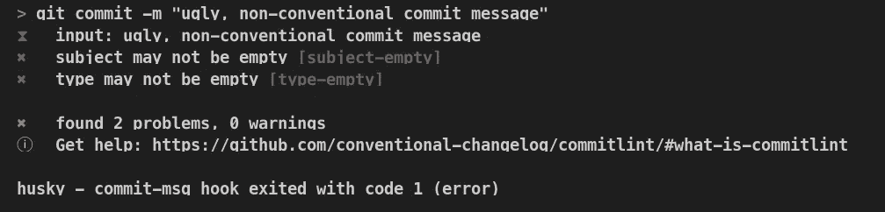
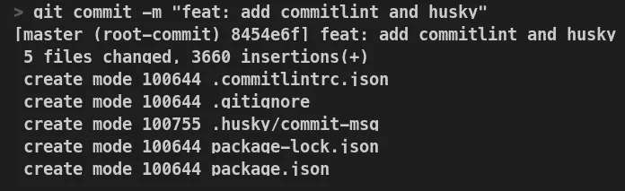

# 如何用 Husky 和 CommitLint 提交消息

> 原文：<https://betterprogramming.pub/how-to-lint-commit-messages-with-husky-and-commitlint-b51d20a5e514>

## 使用 CommitLint 将您的提交提升到下一个级别


由[布雷特·乔丹](https://unsplash.com/@brett_jordan?utm_source=medium&utm_medium=referral)在 [Unsplash](https://unsplash.com?utm_source=medium&utm_medium=referral) 上拍摄的照片

# 介绍

您遇到过多少次类似这样的 git 日志？



git 日志—单行

比你想象的要多，对吧？我们开发人员往往会变得懒惰，不会在我们认为不重要的事情上投入太多精力(这些事情通常是我们代码之外的事情)。然而，从这些不可理解的提交来理解我们的存储库中发生了什么是绝对不可能的。这使得团队很难有效地合作。

那么，如果维护一个干净的 git 日志如此重要，我们该如何做呢？如何才能逼自己写出更好、更干净、语义更明确、一目了然的提交？

请看，终极提交林挺工具:[commit list](https://commitlint.js.org/#/)。

本教程将向您展示如何安装和配置 CommitLint，以及 [Husky](https://typicode.github.io/husky/#/) 。

## 索引

*   安装 CommitLint
*   安装 Husky
*   测试

# 安装 CommitLint

CommitLint 是一个提交林挺工具，它将迫使我们写出漂亮的提交。它是怎么做到的？

CommitLint 使用一种叫做约定的东西，它基本上是我们提交需要遵循的一系列规则。如果我们试图做出一个不遵循我们选择的约定的承诺，它将会失败。您可以在这里找到所有可用约定的列表[。对于本教程，我将使用基于](https://github.com/conventional-changelog/commitlint#shared-configuration)[角度约定的](https://github.com/angular/angular/blob/22b96b9/CONTRIBUTING.md#-commit-message-guidelines)[常规提交规范](https://www.conventionalcommits.org/en/v1.0.0/)。看起来是这样的:

```
type(scope?): message
```

要安装 CommitLint 和 config-conventi on，让我们运行以下命令:

```
npm i -D [@commitlint](http://twitter.com/commitlint)/{cli,config-conventional}
```

要在 CommitLint 中使用配置常规规则，我们有两个选项:

1.  在您的应用程序根目录中创建一个`.commitlintrc.json`文件，这将扩展配置常规规则。

2.创建一个`commitlint.config.js`文件，该文件将导出配置常规规则。

*注意:我通常会选择第一个选项，但任何一个都可以，只要你不两个都做！*

## 选项 1:创建一个. commitlintrc.json 文件

首先，我们在应用程序的根目录下创建文件:

```
touch .commitlintrc.json
```

然后，我们扩展配置常规规则:

```
{
  "extends": ["[@commitlint/config-conventional](http://twitter.com/commitlint/config-conventional)"]
}
```

您的`.commitlintrc.json`文件应该如下所示:



. commitlintrc.json 文件

## 选项 2:创建 commit link . config . js 文件

首先，我们在应用程序的根目录下创建文件:

```
touch commitlint.config.js
```

我们导出配置常规规则:

```
module.exports = {
  extends: ['[@commitlint/config-conventional](http://twitter.com/commitlint/config-conventional)'],
};
```

仅此而已！CommitLint 已经设置好了。该装哈士奇了。

# 安装 Husky

Git 为我们提供了一个叫做钩子的小东西，我们可以用它来进入 git 工作流的不同阶段。因为我们想让 CommitLint 解析我们的提交消息，所以我们可以使用 commit-msg 钩子，它会在我们每次添加提交消息时运行。如果消息不符合约定，CommitLint 将出错，我们将不得不重试。

我们要做的第一件事是安装哈士奇。我们可以通过运行以下命令来实现这一点:

```
npm i -D husky
```

接下来，我们需要启用 Husky 的 git 挂钩，我们可以使用以下命令来完成:

```
npx husky install
```

或者，如果您在全球范围内安装了 Husky:

```
husky install
```

*提示:如果你得到如下错误:* `*fatal: not a git repository (or any parent up to mount point '')*` *，说明你还没有初始化 git，你要通过运行* `*git init*` *命令来完成。*

如果一切顺利，您将在终端中看到以下消息:



Husky 安装正确

运行命令后，您应该在应用程序根目录中有一个新的隐藏目录，名为`.husky`，其中包含 Husky 的配置。一旦我们确定它在那里，我们就可以忘记它，因为我们不需要自己编辑它。

最后，我们需要添加 commit-msg 挂钩:

```
npx husky add .husky/commit-msg 'npx commitlint --edit $1'
```

*注意:使用单引号来指定命令非常重要，因为如果使用双引号，* `*$1*` *将被转义。*

如果一切顺利，您的终端应该有以下输出:



哈士奇的提交消息挂钩添加正确

我们完了！是时候检验是否有效了。

# 测试

让我们试着不遵循惯例做些事情:



提交失败

如您所见，我们的提交失败了。让我们用一个遵循约定的提交再试一次:



传递提交

干得好！您已经成功地将 CommitLint 和 Husky 添加到您的项目中！

# 结论

那都是乡亲们！如果遵循本教程一切顺利，你的 git 日志将会变得非常漂亮和干净(你的团队成员会因此而喜欢你)。

你可以在这里找到这个回购[的源代码。](https://github.com/puntotech/husky-commitlint-setup)

感谢阅读。