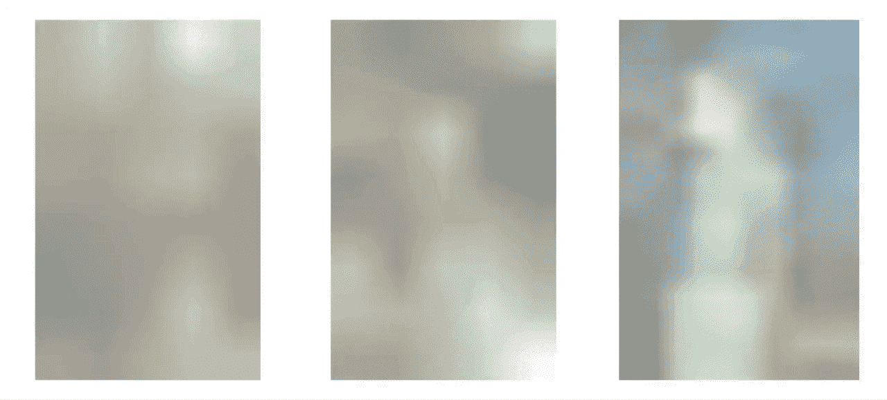

# 如何在 React 中渐进加载图像

> 原文：<https://betterprogramming.pub/how-to-load-images-progressively-in-react-a320e5572c15>

## 像流行的网络和移动应用程序那样加载图像


杰克·威里克在 [Unsplash](https://unsplash.com/s/photos/photos?utm_source=unsplash&utm_medium=referral&utm_content=creditCopyText) 上的照片

我们都喜欢中载图像的方式。我一直希望我的网站上的图片能够以同样的方式加载。我花了一段时间才明白这是怎么做到的，但是一旦我深入了解，我意识到创建一个渐进加载的图像是很简单的。



看它有多酷！

渐进式图像加载也提供了更好的用户体验，减少了网站的加载时间。在本文中，我将为渐进式图像加载制作一个可重用的 react 组件。

# 这是怎么做到的

最初，我们将图像的`src`设置为占位符图像，即原始图像的低分辨率版本。同时，我们开始异步加载原始图像。当加载原始图像时，我们将图像的`src`从占位符图像替换为原始图像。


我们可以通过调整原始图像的大小来制作占位符图像，同时保持其纵横比。在我的例子中，`image.jpg`的尺寸是 2848x4288 像素。我把它的大小调整为 5x8 像素，这导致了一个只有几个字节的占位符图像。


在 Windows 中调整图像大小很容易

# 制作组件

现在我们知道了制造组件更容易的理论。我将我的组件命名为`ProgressiveImage`，并执行了以下操作:

ProgressiveImage.js

## 下面是组件中发生的情况

首先，组件的`constructor`被调用，它将图像的当前`src`设置为低分辨率的占位符图像。然后调用组件的`render`方法，呈现占位符图像。此时，用户会看到模糊的图像。

之后，我们最喜欢的生命周期方法`componentDidMount`被调用，我们开始加载原始图像。一旦加载了原始图像，就会调用一个函数，告诉组件原始图像已加载，并将图像的 src 更新为状态中的原始图像。

结果，组件被重新渲染，图像的`src`被原始图像替换。此时，模糊图像被原始图像取代。

# 组件使用

导入`ProgressiveImage`，使用方法如下:简洁明了:

```
<ProgressiveImage
  src="original-image.jpg"
  placeholder="image-placeholder.jpg"
/>
```

如果需要可以给一个`alt`道具，默认为`''`。

## 一个工作实例

# 包扎

正如承诺的那样，在介质上制作渐进加载图像并不困难。另外一个可以添加的功能是延迟加载，图像只有在浏览器的视窗中才会被加载。让我知道，如果你想让我修改这篇文章，以包括懒惰加载图像。

我希望你能从这篇文章中得到一些有用的东西。