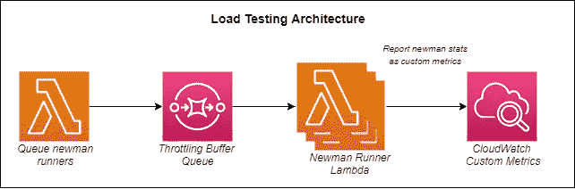
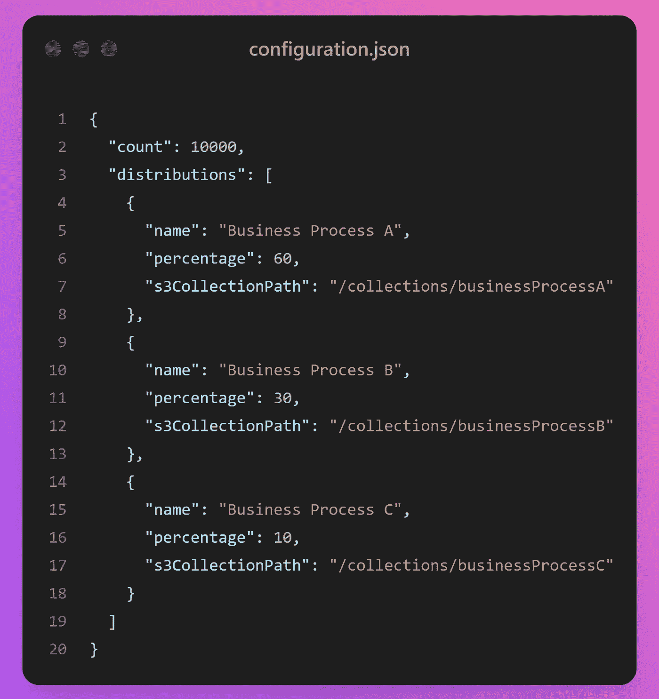
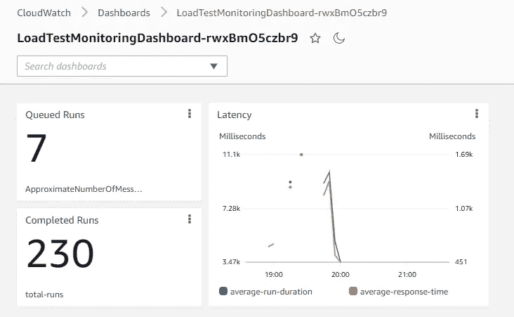

# 如何通过无服务器免费加载测试你的应用程序

> 原文：<https://betterprogramming.pub/how-to-load-test-your-apps-for-free-by-going-serverless-66524d904d09>

## 对你的系统进行压力测试，对你和你的应用程序来说都是一样的压力。但是使用无服务器，您可以通过最少的设置快速、轻松地运行经济高效的负载测试


埃米尔·卡利布拉多夫在 [Unsplash](https://unsplash.com/s/photos/wallet?utm_source=unsplash&utm_medium=referral&utm_content=creditCopyText) 上的照片

没有什么比推出一款新产品更糟糕的了，因为你无法满足需求，所以它很快就走下坡路了。从表面上看，一切都很好。你的 QAs 运行了一整套回归测试。你浏览了所有你能想到的用例。

应用程序在唱歌。但是你没有大规模地运行它。任何时候都有 3-5 个人同时在那里。这不是生产负载。

随着您的应用程序的上线，您必须确保您的应用程序能够处理预期的流量。负载测试是确保您为上线做好准备的好方法。

负载测试是应用程序的模拟流量，它超过了站点的预期使用量。如果我预计我的站点每小时会收到 10，000 个请求，我可能会尝试通过每小时抛出 30，000 个请求来进行负载测试。

我以前写过关于[无服务器负载测试](/how-to-easily-load-test-serverless-apps-with-postman-and-aws-912de7f1f7e0)和[负载测试清单](/the-5-step-checklist-for-serverless-load-testing-346f4a60841d)的文章。今天我们要谈论一些新的东西。一种新的无服务器负载测试机制。

*TL；DR —您可以在 GitHub* 上获得 [*无服务器负载测试器的源代码*](https://github.com/allenheltondev/serverless-load-testing)

# 它是如何工作的

这个负载测试解决方案是一个小型的无服务器应用程序，它在 Lambda 函数中运行 [Postman](https://www.postman.com) 集合。Lambda 运行 [newman](https://www.npmjs.com/package/newman) 、Postman CLI，并在 CloudWatch 中记录执行的指标。



*无服务器负载测试 app 的架构*

触发 Lambda 函数将采用负载测试的配置设置，创建一组代表单次收集运行的事件，然后将事件放入 SQS 队列。另一个 Lambda 监视该队列并提取事件细节，通过 newman 执行收集运行，并记录细节。

# 无服务器优势

当您想到无服务器时，会想到一些事情。*、【现收现付】、【高可扩展性】、*、*、【分布式】、*是我脑子里最先想到的东西。想想负载测试工具，这似乎是一个完美的匹配。

对于负载测试，获得一个水平扩展的平台是至关重要的。您需要向您的应用程序中注入大量数据，而这正是我们使用这款[无服务器负载测试应用](https://github.com/allenheltondev/serverless-load-testing)所能做到的。

为了传递大量的请求，我们使用从 SQS 队列到 Lambda 的事件源映射。当 Lambda 看到队列中的项目时，它会自动扩展以处理所有请求。

以这种方式处理事件的一个巨大好处是，如果您过于热心，事件源映射会自动调节。这意味着 Lambda 不会试图贪婪地运行超过 AWS 帐户允许的更多实例。

默认情况下，一个 AWS 账户允许[1000 个并发 Lambda 执行](https://docs.aws.amazon.com/lambda/latest/dg/gettingstarted-limits.html)。如果你加入一个需要运行 10，000 次的负载测试，SQS 方法将确保 Lambda 只在有并发可用时运行。

负载测试将自动分布在一个区域的所有可用性区域中。因此，您也可以开箱即用地进行地理上分布的负载测试。

# 负载测试场景

当测试您的应用程序是否可以大规模运行时，您必须确定主要的业务流。系统的所有用户很可能不会同时执行相同的任务。

一组用户可能正在执行*业务流程 A* ，而另一组用户可能正在执行*业务流程 B* 。第三，更小的一组用户可能正在进行*业务流程 C* 。

当一起完成时，对系统的影响可能与这些业务流程单独完成时完全不同。这意味着*业务流程 B* 可能会在*业务流程 A* 运行时与任一流程单独运行时争用不同的资源。

因此，同时在多个业务流程上提供负载将使我们更真实地了解系统在压力下的表现。

在我们的无服务器负载测试工具中，我们可以创建一组`distributions`来模拟这种加权流量。

每个业务流程由一个分布表示，每个分布包含一个邮递员集合和一个要模拟的流量百分比。

在上面的例子中，我们可以通过向我们的负载测试人员提供以下配置来准确地模拟真实世界的用例:



根据上述配置，*业务流程 A* 将获得 60%的流量，*业务流程 B* 将获得 30%的流量，*业务流程 C* 将获得 10%的流量。

由于我们总共运行 10，000 个集合，这意味着:

*   *业务流程 A* 将运行**6000 次**
*   *业务流程 B* 将运行**3000 次**
*   *业务流程 C* 将运行**1000 次**

通过在整个系统中提供业务流程的分布，我们对应用程序的强调与一次运行一个不同(理想情况下更现实)。

# 突发负载与长期负载

有人描述突发负载与长时间负载的最佳方式是[用一个关于超级碗的比喻](https://allenheltondev.medium.com/the-mighty-metaphor-your-new-secret-weapon-in-tech-a483957d72f0)。

> 比赛期间，每个人都坐下来观看。但是比赛一暂停，每个人都跑起来去上厕所。当他们完成后，他们冲水(我们都这样做)。冲水马桶的突然涌入被称为 ***爆裂*** *因为它远远超过了标准冲水量。每个人都拿着它，终于有机会同时去了。*

下水道不习惯同时这么多冲水，但我们最好希望它能应付。

这个概念适用于软件和你网站的流量。95%的时间里，你有标准的日常使用量。但是可能会有一些时候你的流量突然激增，你的网站最好能够处理它。

有了负载测试器，我们可以选择两者都做。如果您想看看您的应用程序如何处理大量的流量，Lambda runners 可以水平扩展到数万个并发收集运行。您可能需要首先[请求增加并发执行的配额](https://docs.aws.amazon.com/servicequotas/latest/userguide/request-quota-increase.html)。

您还可以选择运行长时间的负载。通过在执行 newman 的 Lambda 函数上更改*保留并发*，您可以[设置同时运行的最大实例数量](https://docs.aws.amazon.com/lambda/latest/dg/configuration-concurrency.html)。这将在一段时间内向您的系统提供受控的负载，因为它不允许 Lambda 水平扩展到您的服务限制。

*此时，在运行负载测试之前，必须在 AWS 控制台中手动配置。*

# 监视

没有监控就不能进行负载测试。您必须能够观察您的系统在满足新需求时的伸缩和增长。幸运的是，我们的无服务器负载测试应用覆盖了我们。

每次 newman 运行后，它会将自定义指标推送到 CloudWatch，这样您就可以跟踪总持续时间、平均请求延迟、断言失败的数量等…



部署时会创建一个仪表板，以便在负载测试进行过程中对其进行跟踪。您还可以查看业务流程分布和失败的饼图。这将允许您查看分布式负载是否会导致一个进程失败，而不会导致另一个进程失败。

*注意——这是一个负载测试本身和业务流程成功率的监控仪表板。您将需要构建另一个仪表板来监控您的系统负载。*

# 费用

*这个古老的问题可能正在你的脑海中回响。[λ成本](https://aws.amazon.com/lambda/pricing/)基于两件事:执行量和消耗的 GB/s。这意味着运行收集所需的时间会直接影响成本。*

*我们举个例子。*

*如果您运行 100，000 个集合的负载测试，并且在配置的 128MB 内存上运行平均需要 30 秒。那么负载测试成本可以通过以下等式来计算(在 us-east-1 中使用 ARM 架构):*

```
*(100,000 / 1M) x $.20 + (30,000ms x $.0000000017 x 100,000) = $5.12*
```

*因此，在您的系统中运行 100，000 个业务流程的负载测试只需要花费大约 5 美元。不算太寒酸。*

*如果你考虑 Lambda 中的免费层，其中包括每月 100 万次免费调用和 400，000 GB/秒，成本下降到 0.00442 美元——这意味着**它免费运行**！*

*无服务器负载测试解决方案的美妙之处在于，它只在运行时花费你的钱。因此，如果您将解决方案部署到您的 AWS 帐户并使用一次，您只需为它运行的一次付费。没有许可证。没有预拨成本。现收现付。*

*有了免费层，在上述情况下，您实际上每月只能免费运行一次。但是如果您的测试运行时间更短，或者负载明显少于 100，000 次运行，您可以免费运行多次。*

*当然，如果您的系统也是无服务器的，您将为应用程序的运行付费。但是我们只是分析负载测试运行程序本身的成本。*

# *结论*

*如果您正在寻找一种机制来对您的应用程序进行负载测试，那就别再找了。你可以将负载测试应用从 GitHub 部署到你的 AWS 账户，并立即投入使用。*

*将您的业务流程构建为邮递员集合对您的好处不仅仅是负载测试。完成后，您可以使用这些集合进行[主动监控](/the-challenges-of-stateless-architecture-and-how-to-monitor-your-serverless-application-94c0e8b8dd1)，以确保您的系统保持健康状态。*

*无服务器有广泛的用例，谁知道负载测试会是其中之一呢！这是对系统进行压力测试的一种快速、可伸缩、廉价的方式。*

*编码快乐！*