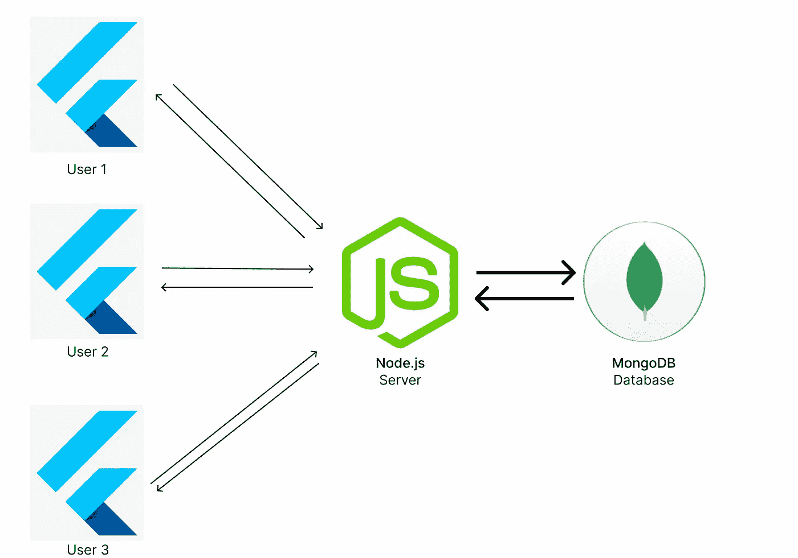

# 如何使用后端登录用户——使用 Flutter、Node.js 和 MongoDB

> 原文：<https://betterprogramming.pub/how-to-login-users-with-a-backend-using-flutter-node-js-and-mongodb-1c27e018e3a9>

## 关于当 Flutter 遇到 Node.js 时所发生的魔法的教程


创建应用程序时，您可能需要创建登录功能。在这篇文章中，我们将学习如何准确地创建它！我们将使用 Flutter 作为应用程序，Node.js 作为后端，至少使用 MongoDB 来存储用户信息。这是我们建筑的样子:



我们登录应用的架构。

这就是数据通过我们的应用传递的方式。因此，假设用户 1 正在登录，这意味着数据将转到 Node.js，如果一切正确，它将从 MongoDB 获取数据。完成后，Node.js 将向我们的用户发回一条消息。所以让我们开始创建我们的应用程序。

# 节点. js

让我们从创建一个新项目开始。以及一个命令，该命令将完全创建一个新项目并为您安装所有的包。

```
mkdir server && cd server && npm init && npm install express && npm install ws && npm install mongoose && npm install crypto && touch index.js
```

我们还创建了一个名为`**index.js**`的新文件。让我们在您最喜欢的 IDE 中打开该文件。首先，让我们像这样定义我们已经安装的所有包。

我们也在使用 Mongoose，为了充分利用它，我们需要创建另一个文件。姑且称之为`user.js`。我们将在那里创建一个新的`Schema`。请以此为例。您可以在以后自己更改所有内容，但现在，我们将把它用于学习目的。

现在我们已经创建了一个新的`Schema`，我们希望连接到我们的数据库，并创建更多的后端。让我们像下面这样做:

请确保将您的连接目标更改为 MongoDB 不然就不行了。如果你有任何问题，请随时联系我。

既然我们已经创建了一个基本的后端，我们想开始注册用户。我们还将检查用户名和电子邮件是否已经存在，并散列用户的密码。

这可能看起来很多，但是代码非常容易理解。让我来解释一下这里发生了什么。

首先，它将检查命令是否等于`signup`。如果这是真的，它会在我们的数据库中寻找一封电子邮件。当它找不到选择的邮件时，就会返回`null`。用户名也是如此。然后我们将散列用户的密码，之后，我们将在我们的数据库中插入一个新用户。

现在我们已经创建了一个注册函数，让我们也创建一个用户登录的方法。

这是我们完全完成后端所需的最后一点代码。所以现在这已经完成了，我们可以开始使用我们的 Flutter 应用程序了。

# 摆动

为了创建一个新项目，我们将使用这个命令来确保所有的东西都将被立即安装，这样我们就不会浪费你的时间。

```
flutter create login_app && cd login_app && flutter pub add shared_preferences && flutter pub add web_socket_channel
```

现在，如果已经创建了一个新项目，让我们打开`lib/main.dart`，请删除该文件中的所有内容。我们将在`main.dart`中创建一个自动登录功能，让用户自动登录。`Main.dart`会是这个样子。

在你把这个粘贴到`main.dart`之后，你可能会遇到一些问题。这是因为我们还没有创造出`LoginOrSignup()`和`MyHomePage()`。所以，让我们从创建`LoginOrSignup()`开始。我们还想创建一个名为`login_or_signup.dart`的新文件。`LoginOrSignup`会看起来很基础。

当将它粘贴到您的项目中时，您可能会遇到更多的问题。这一切都很好；我们会一步一步来。所以，让我们进入下一步，`MyHomePage()`。我们想创建另一个名为`homepage.dart`的文件。`Homepage.dart`将是可以看到我们已经登录的地方。

所以，让我们创建一个可以注册的地方。我们还将检查电子邮件是否有效，并让用户填写两个密码以确保相同。之后，我们会将数据发送到服务器。

我们将创建一个名为 `login.dart`的新文件。这是我们将要登录的地方。这是为完成我们的应用程序而创建的最后一个文件。`Login.dart`看起来会有点像`signup.dart`。它看起来会像这样:

现在，如果您正确地遵循了本教程，一切都会很好。如果你有任何问题，请随时提问。还有，一定要跟着我，千万不要错过什么。