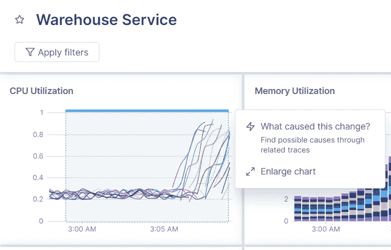
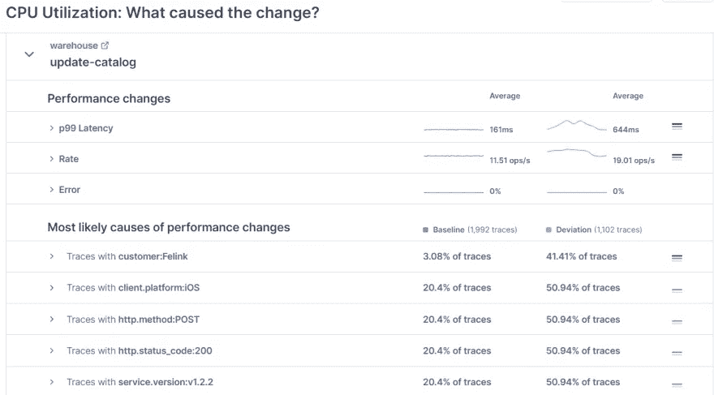
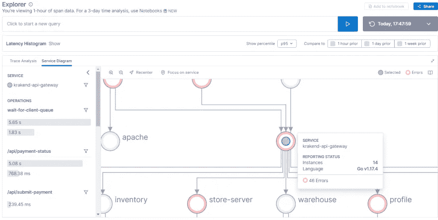
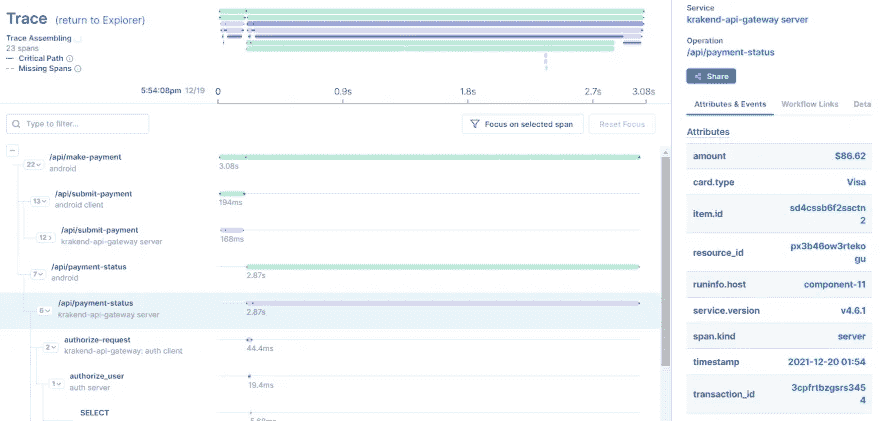

# 从整体服务过渡到微服务时如何保持质量

> 原文：<https://betterprogramming.pub/how-to-maintain-quality-when-transitioning-from-monolith-to-microservices-9cd9e4b03154>

## 您的监控系统是否回答了这 4 个问题？

约翰·施诺布里奇在 Unsplash[上的照片](https://unsplash.com?utm_source=medium&utm_medium=referral)

遗留的单块应用程序正在一点一点地被打破，并被微服务所取代。大大小小的组织都在进行转型，但这并不意味着转型很容易。直到最近，顺利过渡的挑战一直困扰着许多组织，但是有一些选项可以使这变得更容易。在本帖中，我们将看看在进行过渡时需要监控的一些关键指标，以及帮助您从整体服务过渡到微服务的有用工具。

# 为什么和如何

组织转向微服务有几个原因。当一个应用程序被分成小块时，这些小块更容易测试，部署也更快。随着这种模块化，开发人员和团队的职责范围也更加清晰。

然而，即使是最积极、最有能力的公司也需要提出重要的“如何”问题，以确保成功过渡:

*   我们如何通过大量的代码重写来保持质量？
*   我们如何理解所有运动的部分？
*   我们如何观察我们的环境？
*   我们如何监控影响？

这些问题的答案归结为两个主要方面:可观察性和监控。虽然许多开发人员将这两个术语混为一谈，但它们之间还是有一些细微的差别。

可观察性是第一位的。一个系统或应用程序*在被监控之前必须*是可观察的。实际上，这可能意味着安装操作系统级的服务或代理，或者在应用程序的情况下，公开一个`/metrics`端点。一旦关键信息暴露，就可以对其进行监控。监控告诉你什么被破坏了(或者即将被破坏),以及它是如何达到那个状态的。

当您从整体服务过渡到微服务时，您应该观察和监控什么，您将使用什么工具来完成？

# 当你进行转变时要注意什么

您从整体服务到微服务的过渡应该对您的用户透明。为了实现这一目标，您的监控系统应该能够回答某些关键问题。

*   我们是否通过提供足够的正常运行时间和可用性来满足客户的需求？
*   我的应用程序响应速度够快吗？
*   我们能多快发现问题并进行故障排除？
*   开发人员是如何管理变更的？

让我们更详细地看一下这些问题，以及我们如何回答它们:

# 我们是否通过提供足够的正常运行时间和可用性来满足客户的需求？

在大多数情况下，对于您当前的 monolith 应用程序，您已经有了这个问题的答案。您将知道面向客户的应用程序的正常运行时间，并且您将知道部署或计划外停机造成的停机时间。

在微服务的情况下，跟踪正常运行时间是类似的，但在开发“关键路径”微服务时，将需要更多的数据点来确定。比如把你的登录逻辑提取为一个单独的微服务，前端微服务的可用性可能会上去。但是，登录服务停机将对您的用户产生重大影响。

换句话说，对于微服务来说，这个问题的答案更复杂，但是适当的工具和从头到尾跟踪请求的能力将帮助您实现这个目标。

# 我的应用程序响应速度够快吗？

在 monolith 应用程序中，移动的部分靠得更近——所有的意大利面都在同一个碗里。向分布式微服务的过渡将会影响应用程序的响应能力，因为一个请求不再通过一个整体来传递，而是可能向不同的微服务产生多个请求。

为了回答这个问题，您需要监控您的应用程序和基础设施，重点是监控您的技术管理结构中的智能和可视化。拥有从请求到结果的度量，并通过多个微服务和系统跟踪它，将为您提供所需的洞察力和答案。

# 我们能多快发现问题并进行故障排除？

monolith 应用程序中的一个突发问题会使整个系统陷入瘫痪。然而，对于建立在分离的模块化微服务上的系统来说，一个微服务中的问题可能是潜在的且不被注意。

最终，快速识别问题的能力归结为可观察性和监控的交集。微服务的正确部分需要是可观察的，这样它们才能被监控。警报需要包含相关信息，以加快故障排除和解决时间。例如，没有其他信息的“高 CPU”警报几乎没有用。如果有一个警告说“高 CPU 在[系统]上维持了[时间段]”，并有一个在过去几分钟内使用大量 CPU 的进程的快照，会有多大用处？这种警报会大大缩短解决问题的时间。

# 开发人员是如何管理变更的？

这与上面提到的高水平的速度、稳定性和健全性联系在一起。开发者的情绪可能不太容易衡量，但它非常重要。虽然在业务生命周期的任何阶段，自然减员都是一种风险，但当您处于重大转型过程中时，它可能会成为业务杀手。

回答这个问题最简单的方法是通过与相关团队的非正式对话，或者对您的开发人员进行更正式的调查。即使你的开发团队——感受到了巨大的痛苦——被激励去做这个转变，保持与他们的感受一致仍然很重要。

# 使用工具帮助

工装很重要。毫无疑问。工具有助于确定和测量服务级别指标(sli ),这些指标从本质上影响您的服务级别目标(SLO)。有了好的工具，您就可以快速启动并运行，同时减少麻烦。

过渡到微服务应该会对您的 SLIs/SLO 产生积极的净影响，但要确定这一点，唯一的方法是通过具有良好可观察性的环境的整体视图，甚至更好的监控。

# 自己滚还是开源？

在决定使用哪些工具时，许多组织的反应是构建自己的工具。毕竟，谁比您自己的开发人员或 SRE 团队更了解您的可观察性和监控需求呢？诚实的事实是,“开发自己的”工具——特别是为了有效和准确——非常具有挑战性，并且容易出错。大多数组织发现这不值得，并且他们后悔发现这一点。

下一个最好的选择是走开源路线。一个[普罗米修斯](https://prometheus.io/) + [耶格](https://www.jaegertracing.io/) + [格拉法纳](https://grafana.com/)栈会给你在过渡期间需要的很大一部分。

在这个设置中，您将使用安装在您的系统上的 Prometheus 客户端，或者作为库包含在您的应用程序代码中。客户端捕获指标，并将其暴露给 Prometheus 服务器，以便收集并存储在时序数据库中。

Jaeger 执行分布式跟踪，为通过微服务系统的交易捕获指标和数据。

同时，Grafana 与 Prometheus 和 Jaeger 数据源合作，提供可视化和仪表板。

这种开源设置让您有机会根据自己的需要修改和配置工具。它还可能涵盖一些开箱即用的一般用例。当然，这里的缺点是，对于每个工具，您都需要跟上版本、安全补丁和配置变化，更不用说教团队中的每个人如何使用和维护每个工具了。此外，开源解决方案通常会带来扩展方面的挑战。随着更多微服务的建立，管理软件和存储遥测数据的成本开始急剧上升。

# 遵循经过检验的真理

对于如此重要的任务，拥有一个具有监控和观察能力的知名供应商可能是更好的选择。一些选项包括:

*   Splunk:一个“与数据源无关”的数据平台，能够接收指标、日志和跟踪，支持混合云和多云架构。
*   AppDynamics(思科):一个全栈可观察性平台，提供分布式应用程序每个组件的可见性，支持自动化问题缓解的集成。
*   Dynatrace:一个“一体化”平台，处理基础设施监控、应用程序和微服务监控和安全，以及云自动化。
*   AppOptics(网络安全管理软件产品):AppOptics 是一款针对混合环境和云环境的应用性能和基础设施监控工具。
*   Lightstep:一个监控和可观察性平台，特别关注变更管理，连接代码或基础设施变更如何影响应用程序性能。

为了探究这在整体服务到微服务的转变中是如何进行的，让我们来看一个使用上述工具之一 Lightstep 的实际实现。

[Lightstep](https://lightstep.com/) 在设计产品时特别关注从整体服务到微服务的转变。Lightstep 将可观察性和监控结合到一个可见性窗格中，提供了整体到微服务之旅的整体画面。有很多功能直接适用于微服务。我们将讨论几个关键特性，并使用[沙箱](https://lightstep.com/sandbox)来看看我们如何回答一些关于保持质量的问题。

## 改变智能

更改智能特性帮助您将应用程序中的问题与引入该问题的特定代码更改联系起来。您可以查看一个指标，并确定与该指标相关联的相关跟踪(甚至部署)。

假设您看到一个 CPU 利用率峰值，并希望深入了解细节。你可以这么做:

第一步:识别异常并突出显示。

这给了你“是什么导致了这种变化？”提示。出现提示时，点按它。

步骤 2:检查仓库服务中的变更。

我们可以在最后一行看到，在这组跟踪中捕获的服务版本发生了变化，这与 CPU 利用率的峰值相一致。

该功能易于理解。有了 Lightstep，您不再需要手动关联因果关系，或者希望您已经正确编写了警报或日志记录规则。您将能够看到所有微服务的踪迹，并将错误率和资源峰值与环境变化直接关联起来。

## 基础设施和应用监控

使用仪表板可以更容易地看到所有移动部件。服务图支持您的微服务的整体视图。它显示流量的方向、是否出现错误，以及服务之间流量的一般度量。

## 分布式跟踪

另一个值得注意的特性是分布式跟踪，它可以帮助您将所有微服务集中到一个视图中。这将向您显示每个阶段的长度，它到达了什么端点，以及许多其他信息，这些信息将有助于了解哪里出了问题以及如何修复它。

# 包裹

如果您的组织从整体服务到微服务的转变还没有发生，它可能很快就会发生。

每个组织面临的挑战是确保无缝过渡，同时从头到尾保持(或提高)应用程序的质量。

可观察性和监控是保持质量的关键，如果没有一个全面的工具来提供对您在过程中所做的变化的洞察力和整体视图，这是很难实现的。幸运的是，像 Lightstep 这样的工具为开发人员提供了鸟瞰图，允许更好的连续性和更平滑的过渡。