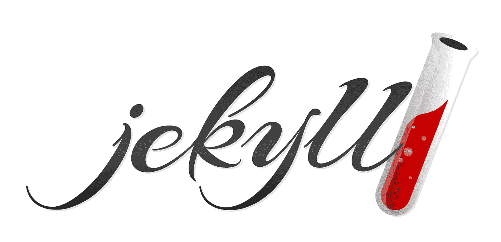
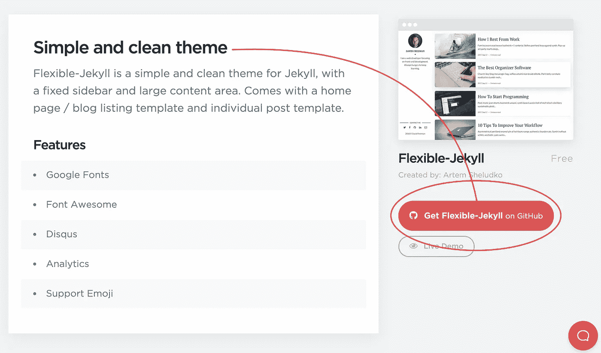
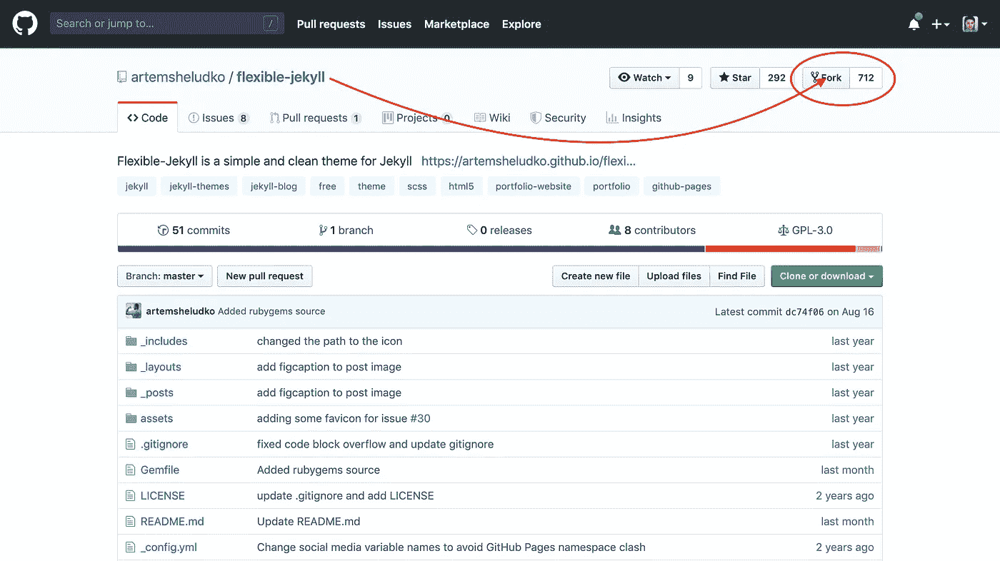
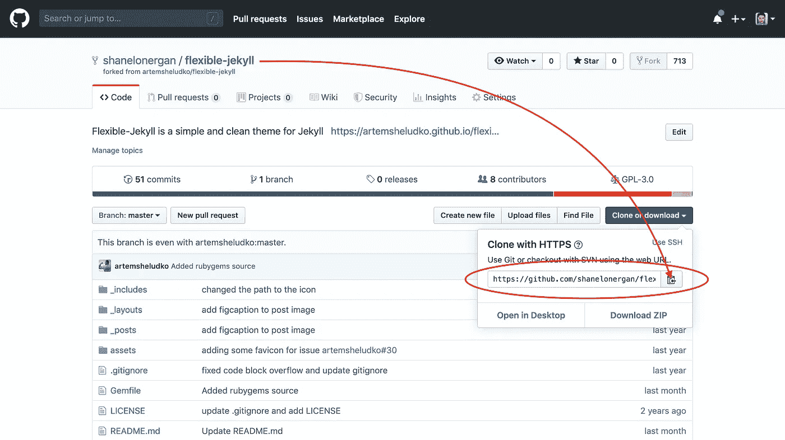

# 如何快速制作一个漂亮的个人网站

> 原文：<https://betterprogramming.pub/how-to-make-a-beautiful-personal-website-quickly-cab115866134>

## 免费使用 Jekyll 和 Github 页面创建和托管一个漂亮的网站



jekyll 标志:小写草书的 Jekyll 一词，右侧有一个红色的冒泡试管

**TL；博士:** [Jekyll](https://jekyllrb.com/) 是一个红宝石宝石，允许你创建自定义静态网站。它简单且可定制，为博客、个人网站、作品集等提供了各种各样的主题。你可以结合使用 Jekyll 和 Github Pages 来免费、快速地创建和托管你自己的网站。

**在你开始**之前:本指南假设你有一些基本的 Ruby、HTML/CSS 和 Git 经验。没有它仍然是可能的，但是它可能需要一点额外的研究。首先按照下面“设置您的环境”下的说明进行操作。如果你被卡住了，我在文章的最后添加了一些我认为对进一步阅读有帮助的文章。

创建你的个人网站通常是一项艰巨的任务。从使用 Wix 或 WordPress 模板到从头开始编写一个模板，各种技能水平都有大量的选择。从头开始构建让您对最终产品拥有最大的控制权；使用模板可以让你以最低的学习曲线快速上手。如果你有一点编码经验，中间的东西可能是最好的选择。

快速创建一个简单、漂亮的网站的一个方法是使用 Jekyll，然后在 GitHub 页面上免费部署它。Jekyll 是一个 ruby gem，非常适合创建个人网站和博客，我用它来创建自己的博客网站。它提供了各种各样的主题，非常可定制，最重要的是，它很快！

在这篇文章中，我将带您使用 Jekyll 和 Github 页面创建和部署您自己的个人网站。

# 设置您的环境(可选)

**注意:**我在本文中用`$`指定终端命令。如果直接复制这些命令，只复制`$`后面的文本。

1.  如果你还没有文本编辑器，下载一个。我使用 Atom，但是很多人也非常喜欢 Visual Studio 代码。
2.  创建一个 GitHub 帐户。Git 是一个版本控制软件
3.  安装[自制软件](http://osxdaily.com/2018/03/07/how-install-homebrew-mac-os/)

```
$ /usr/bin/ruby -e "$(curl -fsSL https://raw.githubusercontent.com/Homebrew/install/master/install)"
```

4.安装 Ruby 和 Bundler

```
$ brew install ruby
$ gem install bundler
```

Jekyll 是一个 Ruby 宝石，它本质上是一个由一群专注的程序员创建的代码库，并免费向我们发布。它是开源的，这意味着它是由更多了不起的程序员来维护的，他们自愿贡献自己的时间来保持优秀软件的自由和可访问性。

Jekyll 入门超级简单。在制作自定义站点之前，先制作一个示例站点可能会有所帮助。为此，请在终端中输入以下命令:

现在，打开 web 浏览器，进入 http://localhost:4000。TaDa！你有一个网站运行起来了！浏览一下这个网站，熟悉一下基本的哲基尔主题。

# 制作自定义 Jekyll 项目

现在你已经创建了你的第一个 Jekyll 站点，你将会想要看一看主题并且决定你想要使用哪一个作为你自己的。你可以在 [jekyllthemes.io](https://jekyllthemes.io/) 找到所有可用的主题。有各种各样漂亮的免费和付费主题，为博客、作品集、登陆页面等设计。一旦你决定了你的主题，是时候投入进去了。

## 第一步。在本地计算机上打开主题

1.  导航 GitHub 页面，找到您选择的主题(描述中应该有一个链接):



一个 Jekyll 主题网站的截屏，有一个箭头指向一个标有“get Flexible-Jekyll on GitHub”的按钮

2.派生存储库:



Flexible-Jekyll GitHub 页面截图，右上角有一个箭头指向“fork”按钮

3.复制克隆链接:



分叉的 Flexible-Jekyll 存储库的屏幕截图，在“克隆或下载”按钮的下拉列表中有一个指向克隆链接的箭头

4.将回购克隆到您的本地文件夹中:

```
$ cd ..
$ cd jekyll-projects
$ git clone "paste-your-link-here"
```

5.导航到项目文件夹:

```
$ cd theme-name-here
```

6.运行您的服务器:

```
$ jekyll serve
```

现在您可以在 http://localhost:4000 上浏览您的模板。

## 第二步。用您自己的信息自定义项目

在您的项目目录中，您应该看到一个名为`_config.yml`的文件。单击该文件将其打开，您将看到一个包含所有股票信息的文档。您可以用您所有的个人信息替换此占位符文本，它将显示在您的网页上。如果您想添加任何图像，请将其拖放到`img`文件夹中。然后只需在配置文件中提供文件名，就可以开始了！

如果你有 HTML/CSS 技能，你还可以深入到`_layouts`或`css`文件夹中进行进一步定制。例如，我想给我的帖子添加一个副标题，但对它在 markdown 中的外观不满意，所以我添加了一些自定义 HTML。

## 第三步。添加您的内容

如果你正在创建一个个人博客，应该会有一些样本文章。要创建新帖子，请在`_posts`文件夹中创建一个新文件。你将不得不在 markdown 中写你的文章，这可能是新的。但是，不要绝望！Markdown 实际上是创建漂亮文本文件的一种奇妙而简单的方法。查看[减价备忘单](https://www.markdownguide.org/cheat-sheet/)开始吧。接下来，从一个示例帖子中复制并粘贴标题，并用帖子的信息更新它。现在，剩下的就是最简单的部分:写你的帖子！

# 在 GitHub 页面上托管您的网站

所以，你已经写完了你的文章，添加了你所有的内容，你的网站在你的本地浏览器上看起来棒极了。恭喜你！这是一个不小的壮举。现在是时候让世界看到它了。托管你的网站看起来是一个复杂的过程，但是 GitHub 让它变得超级简单。

## 第一步。重命名您的项目

为了让一个项目托管在 github 页面上的个人网站上，它需要遵循特定的标题语法:*用户名* .github.io，其中*用户名*是您的 GitHub 用户名。您可以在文本编辑器中直接更改标题，方法是按住 control 键点按项目文件夹，然后选择“重命名”。

## 第二步。将您的更改提交并推送到 Github

如果您还不熟悉 git，请按照以下步骤将这个版本的项目保存到 GitHub 概要文件中:

## 第三步。查看您的实时网站！

去 [www。 *username* .github.io](http://www.*username*.github.io) 查看您的网站。恭喜你！您已经创建并托管了自己的个人网站。这并不容易，所以要为自己感到骄傲，并把链接发给你所有的朋友！

一旦完成，你还可以做更多的事情来定制你的网站。您可以添加自定义网址，自定义错误页面，等等！查看下面参考资料中的 GitHub pages 文档以了解更多信息。此外，如果你喜欢 Jekyll，考虑[贡献](https://opencollective.com/jekyll/contribute)来帮助他们的团队保持运转。

感谢您的阅读！

# 参考

*   [杰基尔](https://jekyllrb.com/)
*   [杰基尔主题](https://jekyllthemes.io/)
*   [GitHib 页面](https://pages.github.com/)

# 进一步阅读

*   [原子](https://atom.io/)
*   [如何在 Mac 上安装家酿](http://osxdaily.com/2018/03/07/how-install-homebrew-mac-os/)
*   [安装 Ruby](https://www.ruby-lang.org/en/documentation/installation/)
*   [什么是宝石？](https://guides.rubygems.org/what-is-a-gem/)
*   [什么是饭桶？](https://opensource.com/resources/what-is-git)
*   [降价备忘单](https://www.markdownguide.org/cheat-sheet/)