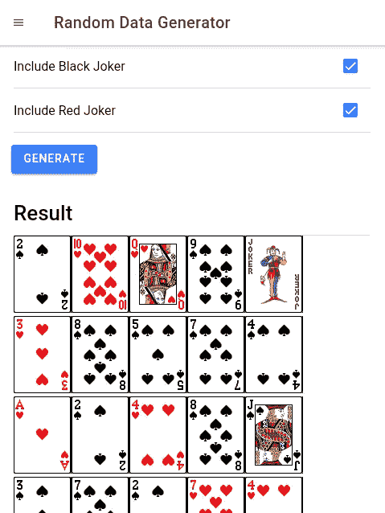

# 如何制作一个有多副牌和过滤器的洗牌机应用程序

> 原文：<https://betterprogramming.pub/how-to-make-a-card-shuffler-app-with-multiple-decks-and-filters-924ebd09e381>

## 用 Ionic 构建一个用于洗牌的 Android 应用程序


阿曼达·琼斯在 [Unsplash](https://unsplash.com/search/photos/cards?utm_source=unsplash&utm_medium=referral&utm_content=creditCopyText) 上拍摄的照片

洗牌不是一件容易的事，尤其是如果你有多副牌需要一起洗。你需要洗牌，然后把它们放回它们自己的盒子里。这是一项痛苦的工作，可以通过我们开发的应用程序轻松解决。

在这一块，我们将建立一个洗牌的 Android 应用程序。它可以一次洗牌多副牌，你可以在洗牌前选择你可以过滤掉的牌。

我们将使用 [Ionic](https://ionicframework.com/) 来构建应用程序，因为它不需要太多的处理器能力，而且它是一个简单的应用程序。

# 开始建造

要开始构建，我们需要通过运行`npm install -g ionic`来安装 Ionic CLI。然后，我们运行`ionic start card-shuffler-app sidenav`。

`card-shuffler-app`是我们应用程序的名称，`sidenav`意味着我们在应用程序的左侧包含了一个侧菜单。

这将创建我们快速构建应用程序所需的样板代码。默认情况下，Ionic 允许开发者使用 Angular 框架来构建他们的应用，这就是我们将要使用的。

接下来，我们为我们的应用程序创建组件。我们运行`ionic g component cardShufflerPage`来添加一个新页面来构建我们的洗牌页面。然后，在应该由前面的命令生成的`card-shuffler-page.component.ts`中，我们放入:

```
import { Component, OnInit } from '[@angular/core](http://twitter.com/angular/core)';
import { NgForm } from '[@angular/forms](http://twitter.com/angular/forms)';
import { Random, nativeMath } from "random-js";
import { ToastController } from '[@ionic/angular](http://twitter.com/ionic/angular)';const cardTypes = {
  aces: [1, 2, 3, 4],
  kings: [5, 6, 7, 8],
  queens: [9, 10, 11, 12],
  jacks: [13, 14, 15, 16],
  tens: [17, 18, 19, 20],
  nines: [21, 22, 23, 24],
  eights: [25, 26, 27, 28],
  sevens: [29, 30, 31, 32],
  sixes: [33, 34, 35, 36],
  fives: [37, 38, 39, 40],
  fours: [41, 42, 43, 44],
  threes: [45, 46, 47, 48],
  twos: [49, 50, 51, 32],
  blackJoker: [53],
  redJoker: [54],
  clubs: [1, 5, 9, 13, 17, 21, 25, 29, 33, 37, 41, 45, 49],
  spades: [2, 6, 10, 14, 18, 22, 26, 30, 34, 38, 42, 46, 50],
  hearts: [3, 7, 11, 15, 19, 23, 27, 31, 35, 39, 43, 47, 51],
  diamonds: [4, 8, 12, 16, 20, 24, 28, 32, 36, 40, 44, 48, 52]
}[@Component](http://twitter.com/Component)({
  selector: 'app-card-shuffler-page',
  templateUrl: './card-shuffler-page.component.html',
  styleUrls: ['./card-shuffler-page.component.scss'],
})
export class CardShufflerPageComponent implements OnInit {
  cardOptions: any = <any>{};
  results: number[] = [];
  mappings: any = <any>{};
  showResult: boolean;
  selectAll: boolean;constructor(
    public toastController: ToastController
  ) { } ngOnInit() { } async presentToast() {
    const toast = await this.toastController.create({
      message: 'More cards are set to be drawn than the number of cards available.',
      duration: 5000
    });
    toast.present();
  } getIncludedCards() {
    let includedCards = [];
    Object.keys(this.cardOptions).forEach(o => {
      if (o == 'spades' || o == 'hearts' || o == 'diamonds' || o == 'clubs') {
        return;
      }
      if (!this.cardOptions[o]) {
        return;
      } if (Array.isArray(cardTypes[o])) {
        includedCards = includedCards.concat(cardTypes[o]);
      }
    }) if (!this.cardOptions.clubs) {
      includedCards = includedCards.filter(c => !cardTypes.clubs.includes(c));
      } if (!this.cardOptions.spades) {
      includedCards = includedCards.filter(c => !cardTypes.spades.includes(c));
    } if (!this.cardOptions.hearts) {
      includedCards = includedCards.filter(c => !cardTypes.hearts.includes(c));
    }if (!this.cardOptions.diamonds) {
      includedCards = includedCards.filter(c => !cardTypes.diamonds.includes(c));
    }
    includedCards = Array.from(new Set(includedCards));
    return includedCards;
  } getMaxCards() {
    const numIncludedCards = Array.from(new Set(this.getIncludedCards())).length;
    return numIncludedCards * this.cardOptions.numDecks;
  } generate(generateForm: NgForm) {
    this.results = [];
    if (generateForm.invalid) {
      return;
    } if (this.getMaxCards() < this.cardOptions.numCards) {
      this.presentToast();
      return;
    } let includedCards = this.getIncludedCards(); this.mappings = {};
    includedCards.sort((a, b) => (a - b)).forEach(c => {
      this.mappings[c] = c;
    });
    for (let i = 2; i <= this.cardOptions.numDecks; i++) {
      includedCards.forEach(c => {
        if (c * i > 54) {
          this.mappings[c * i] = c;
        }
      });
    }
    const finalIncludedCards = Object.keys(this.mappings).map(m => +m);
    const random = new Random(nativeMath);
    for (let j = 1; j <= this.cardOptions.numCards; j++) {
      const index = random.integer(0, finalIncludedCards.length - 1);
      this.results.push(finalIncludedCards[index]);
      finalIncludedCards.splice(index, 1);
    }
    this.showResult = true;
  } getCard(cardNum: string) {
    return this.mappings[cardNum];
  } pickAll() {
    if (this.selectAll) {
      Object.keys(cardTypes).forEach(t => {
        this.cardOptions[t] = true;
      })
    }
    else {
      Object.keys(cardTypes).forEach(t => {
        this.cardOptions[t] = false;
      })
    }
  }
}
```

对象中的数组对应于卡片的文件名。

我们根据他们的服装和号码给他们编号。

*   1 号是梅花 a。
*   2 是黑桃 a。
*   3 是红桃 a。
*   4 是方块 a。
*   5 到 8 是同花色顺序的王。
*   9 到 12 是花色顺序相同的皇后。
*   13 到 16 是相同花色顺序的插孔。
*   17 到 20 是相同花色顺序的 10。
*   21 到 24 是相同花色顺序的 9。
*   依此类推，直到数字 52，也就是方块 2。
*   那么，53 是黑色小丑，54 是红色小丑。

将这些卡片图片文件放在`cards`文件夹中，在`assets`文件夹中。

我们有一个`presentToast`函数来显示一个错误，如果用户试图抽取比过滤后可用的牌更多的牌。

在`getIncludedCards`函数中，我们根据用户的选择进行过滤。我们过滤掉所有用户没有选择的选项。

`getMaxCards`用于获取过滤后可用的卡数。`generate`功能生成卡片。

我们检查过滤器，并为大于 54 的卡号创建一个映射，如果有不止一副牌需要混洗在一起，那么我们可以将任何大于 54 的卡号映射回 1 到 54。

洗牌也在这个函数中完成。我们有一个`pickAll`功能，让用户选择所有的卡洗牌。

在`card-shufflter-page.component.html`中，我们输入:

```
<ion-content [scrollEvents]="true">
  <form #generateForm='ngForm' (ngSubmit)='generate(generateForm)'>
    <ion-list>
      <ion-item no-padding>
        <h1>Draw Cards</h1>
      </ion-item>
      <ion-item no-padding>
        <ion-label text-wrap>Number of cards to Draw</ion-label>
        <ion-input [(ngModel)]='cardOptions.numCards' name='numCards' #numCards='ngModel' [min]='1'
          [max]='getMaxCards()' required pattern='^\d+$'>
        </ion-input>
      </ion-item>
      <ion-item no-padding>
        <ion-label text-wrap>Number of decks to Draw From</ion-label>
        <ion-input [(ngModel)]='cardOptions.numDecks' name='numDecks' #numDecks='ngModel' [min]='1' [max]='10' required
          pattern='^\d+$'>
        </ion-input>
      </ion-item>
      <ion-item no-padding>
        <ion-label>Include all</ion-label>
        <ion-checkbox [(ngModel)]='selectAll' name='all' #all='ngModel' (ngModelChange)='pickAll()'>
        </ion-checkbox>
      </ion-item>
      <ion-item no-padding>
        <ion-label>Include Spades</ion-label>
        <ion-checkbox [(ngModel)]='cardOptions.spades' name='spades' #spades='ngModel'>
        </ion-checkbox>
      </ion-item>
      <ion-item no-padding>
        <ion-label>Include Hearts</ion-label>
        <ion-checkbox [(ngModel)]='cardOptions.hearts' name='hearts' #hearts='ngModel'>
        </ion-checkbox>
      </ion-item>
      <ion-item no-padding>
        <ion-label>Include Diamonds</ion-label>
        <ion-checkbox [(ngModel)]='cardOptions.diamonds' name='diamonds' #diamonds='ngModel'>
        </ion-checkbox>
      </ion-item>
      <ion-item no-padding>
        <ion-label>Include Clubs </ion-label>
        <ion-checkbox [(ngModel)]='cardOptions.clubs' name='clubs' #clubs='ngModel'>
        </ion-checkbox>
      </ion-item>
      <ion-item no-padding>
        <ion-label>Include Aces </ion-label>
        <ion-checkbox [(ngModel)]='cardOptions.aces' name='aces' #aces='ngModel'>
        </ion-checkbox>
      </ion-item>
      <ion-item no-padding>
        <ion-label>Include Twos </ion-label>
        <ion-checkbox [(ngModel)]='cardOptions.twos' name='twos' #twos='ngModel'>
        </ion-checkbox>
      </ion-item>
      <ion-item no-padding>
        <ion-label>Include Threes </ion-label>
        <ion-checkbox [(ngModel)]='cardOptions.threes' name='threes' #threes='ngModel'>
        </ion-checkbox>
      </ion-item>
      <ion-item no-padding>
        <ion-label>Include Fours </ion-label>
        <ion-checkbox [(ngModel)]='cardOptions.fours' name='fours' #fours='ngModel'>
        </ion-checkbox>
      </ion-item>
      <ion-item no-padding>
        <ion-label>Include Fives </ion-label>
        <ion-checkbox [(ngModel)]='cardOptions.fives' name='fives' #fives='ngModel'>
        </ion-checkbox>
      </ion-item>
      <ion-item no-padding>
        <ion-label>Include Sixes </ion-label>
        <ion-checkbox [(ngModel)]='cardOptions.sixes' name='sixes' #sixes='ngModel'>
        </ion-checkbox>
      </ion-item>
      <ion-item no-padding>
        <ion-label>Include Sevens </ion-label>
        <ion-checkbox [(ngModel)]='cardOptions.sevens' name='sevens' #sevens='ngModel'>
        </ion-checkbox>
      </ion-item>
      <ion-item no-padding>
        <ion-label>Include Eights </ion-label>
        <ion-checkbox [(ngModel)]='cardOptions.eights' name='eights' #eights='ngModel'>
        </ion-checkbox>
      </ion-item>
      <ion-item no-padding>
        <ion-label>Include Nines </ion-label>
        <ion-checkbox [(ngModel)]='cardOptions.nines' name='nines' #nines='ngModel'>
        </ion-checkbox>
      </ion-item>
      <ion-item no-padding>
        <ion-label>Include Tens </ion-label>
        <ion-checkbox [(ngModel)]='cardOptions.tens' name='tens' #tens='ngModel'>
        </ion-checkbox>
      </ion-item>
      <ion-item no-padding>
        <ion-label>Include Jacks </ion-label>
        <ion-checkbox [(ngModel)]='cardOptions.jacks' name='jacks' #jacks='ngModel'>
        </ion-checkbox>
      </ion-item>
      <ion-item no-padding>
        <ion-label>Include Queens </ion-label>
        <ion-checkbox [(ngModel)]='cardOptions.queens' name='queens' #queens='ngModel'>
        </ion-checkbox>
      </ion-item>
      <ion-item no-padding>
        <ion-label>Include Kings </ion-label>
        <ion-checkbox [(ngModel)]='cardOptions.kings' name='kings' #kings='ngModel'>
        </ion-checkbox>
      </ion-item>
      <ion-item no-padding>
        <ion-label>Include Black Joker </ion-label>
        <ion-checkbox [(ngModel)]='cardOptions.blackJoker' name='blackJoker' #blackJoker='ngModel'>
        </ion-checkbox>
      </ion-item>
      <ion-item no-padding>
        <ion-label>Include Red Joker </ion-label>
        <ion-checkbox [(ngModel)]='cardOptions.redJoker' name='redJoker' #redJoker='ngModel'>
        </ion-checkbox>
      </ion-item>
    </ion-list>
    <ion-button type='submit'>Generate</ion-button>
    <ion-list *ngIf='showResult'>
      <ion-item no-padding>
        <h1>Result</h1>
      </ion-item>
      <ion-item no-padding>
        <ion-row>
          <div *ngFor='let r of results'>
            
          </div>
        </ion-row>
      </ion-item>
    </ion-list>
  </form>
</ion-content>
```

我们有一个表单来显示洗牌的所有选项，并显示洗牌后的结果。表格验证包括被洗牌的牌的数量。

接下来，我们在主页上工作。我们运行`ionic g component homePage`。

在`home-page.component.ts`中，我们放入:

```
import { Component, OnInit } from '[@angular/core](http://twitter.com/angular/core)';
import { Router } from '[@angular/router](http://twitter.com/angular/router)';[@Component](http://twitter.com/Component)({
  selector: 'app-home-page',
  templateUrl: './home-page.component.html',
  styleUrls: ['./home-page.component.scss'],
})
export class HomePageComponent implements OnInit {constructor(
    private router: Router
  ) { } ngOnInit() { } goTo(route: string) {
    this.router.navigate([route]);
  }}
```

然后，在`home-page.component.html`中，我们放入:

```
<ion-content [scrollEvents]="true">
  <ion-list>
    <ion-item (click)='goTo("home")'>
      <ion-icon slot="start" name="home"></ion-icon>
      <ion-label>Home</ion-label>
    </ion-item>
    <ion-item (click)='goTo("card-shuffler")'>
      <ion-icon slot="start" name="list"></ion-icon>
      <ion-label>Card Shufflter</ion-label>
    </ion-item>   
  </ion-list>
</ion-content>
```

这是我们在主页上显示的菜单，让用户可以访问他们想要的页面。

在`app.component.ts`中，我们把:

```
import { Component } from '[@angular/core](http://twitter.com/angular/core)';import { Platform } from '[@ionic/angular](http://twitter.com/ionic/angular)';
import { SplashScreen } from '[@ionic](http://twitter.com/ionic)-native/splash-screen/ngx';
import { StatusBar } from '[@ionic](http://twitter.com/ionic)-native/status-bar/ngx';
import { environment } from 'src/environments/environment';[@Component](http://twitter.com/Component)({
  selector: 'app-root',
  templateUrl: 'app.component.html'
})
export class AppComponent {
  public appPages = [
    {
      title: 'Home',
      url: '/home',
      icon: 'home'
    },
    {
      title: 'Card Shuffler',
      url: '/card-shuffler',
      icon: 'list'
    },

  ]; constructor(
    private platform: Platform,
    private splashScreen: SplashScreen,
    private statusBar: StatusBar
  ) {
    this.initializeApp();
  } initializeApp() {
    this.platform.ready().then(() => {
      this.statusBar.styleDefault();
      this.splashScreen.hide();
    });
  }
}
```

这是我们在左侧菜单中显示项目的地方。在模板中，`app.component.html`，我们放入:

```
<ion-app>
  <ion-split-pane>
    <ion-menu type="overlay">
      <ion-header>
        <ion-toolbar>
          <ion-title>Menu</ion-title>
        </ion-toolbar>
      </ion-header>
      <ion-content>
        <ion-list>
          <ion-menu-toggle auto-hide="false" *ngFor="let p of appPages">
            <ion-item [routerDirection]="'root'" [routerLink]="[p.url]">
              <ion-icon slot="start" [name]="p.icon"></ion-icon>
              <ion-label>
                {{p.title}}
              </ion-label>
            </ion-item>
          </ion-menu-toggle>
        </ion-list>
      </ion-content>
    </ion-menu>
    <div class="ion-page" main>
      <ion-header>
        <ion-toolbar>
          <ion-buttons slot="start">
            <ion-menu-button>
              <ion-icon name="menu"></ion-icon>
            </ion-menu-button>
          </ion-buttons>
          <ion-title>Random Data Generator</ion-title>
        </ion-toolbar>
      </ion-header>
      <ion-content>
        <ion-router-outlet main></ion-router-outlet>
      </ion-content>
    </div>
  </ion-split-pane>
</ion-app>
```

显示菜单和标题。

最后，在`app.module.ts`中，我们放入:

```
import { NgModule } from '[@angular/core](http://twitter.com/angular/core)';
import { BrowserModule } from '[@angular/platform-browser](http://twitter.com/angular/platform-browser)';
import { RouteReuseStrategy } from '[@angular/router](http://twitter.com/angular/router)';import { IonicModule, IonicRouteStrategy } from '[@ionic/angular](http://twitter.com/ionic/angular)';
import { SplashScreen } from '[@ionic](http://twitter.com/ionic)-native/splash-screen/ngx';
import { StatusBar } from '[@ionic](http://twitter.com/ionic)-native/status-bar/ngx';import { AppComponent } from './app.component';
import { AppRoutingModule } from './app-routing.module';
import { BirdieHolePageComponent } from './birdie-hole-page/birdie-hole-page.component';
import { CardShufflerPageComponent } from './card-shuffler-page/card-shuffler-page.component';
import { CoinFlipperPageComponent } from './coin-flipper-page/coin-flipper-page.component';
import { DecimalFractionGeneratorPageComponent } from './decimal-fraction-generator-page/decimal-fraction-generator-page.component';
import { DicePageComponent } from './dice-page/dice-page.component';
import { HomePageComponent } from './home-page/home-page.component';
import { IntegerGeneratorPageComponent } from './integer-generator-page/integer-generator-page.component';
import { KenoPageComponent } from './keno-page/keno-page.component';
import { ListRandomizerPageComponent } from './list-randomizer-page/list-randomizer-page.component';
import { LotteryPageComponent } from './lottery-page/lottery-page.component';
import { PasswordGeneratorPageComponent } from './password-generator-page/password-generator-page.component';
import { SequenceGeneratorPageComponent } from './sequence-generator-page/sequence-generator-page.component';
import { StringGeneratorPageComponent } from './string-generator-page/string-generator-page.component';
import { FormsModule } from '[@angular/forms](http://twitter.com/angular/forms)';
import { AutosizeModule } from 'ngx-autosize';
import { CustomFormsModule } from 'ngx-custom-validators';
import { AdMobFree } from '[@ionic](http://twitter.com/ionic)-native/admob-free/ngx';[@NgModule](http://twitter.com/NgModule)({
  declarations: [
    AppComponent,
    CardShufflerPageComponent,
    HomePageComponent,
  ],
  entryComponents: [],
  imports: [
    BrowserModule,
    IonicModule.forRoot(),
    AppRoutingModule,
    FormsModule,
    AutosizeModule,
    CustomFormsModule    
  ],
  providers: [
    StatusBar,
    SplashScreen,
    { provide: RouteReuseStrategy, useClass: IonicRouteStrategy },
  ],
  bootstrap: [AppComponent]
})
export class AppModule { }
```

我们需要这段代码在模块中包含应用程序所需的组件。

最后，我们有:

