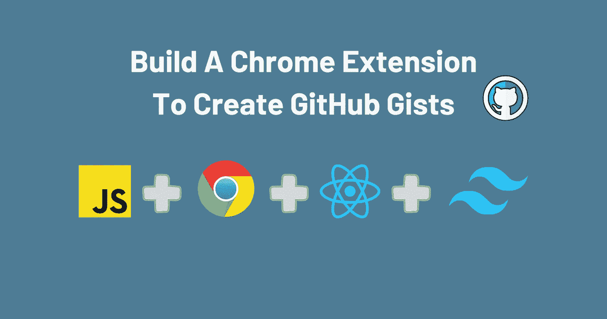
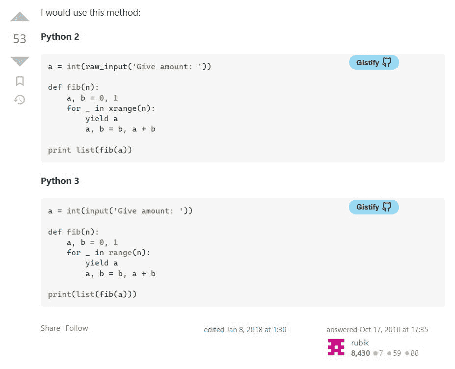

# 如何做一个 Chrome 扩展用 Vite，React 和 TailwindCSS 创建 GitHub Gists

> 原文：<https://betterprogramming.pub/how-to-make-a-chrome-extension-to-create-github-gists-with-vite-react-and-tailwindcss-86d962654777>

## 这一省时功能的深入指南



图片来自作者

大家好。在本文中，我将改进我们以前的 gist 命令行脚本。

Auto Gistify chrome 扩展向页面上的每个代码块添加一个按钮。单击该按钮将创建一个新的 gist，其文件扩展名由 HTML 元素类名给出。

举例来说，假设我们有以下 HTML:

我们的扩展将把按钮注入到文档中，如下所示:

# 创建 Vite 应用程序

运行以下命令在您的目录中生成一个 Vite + React 模板:

```
npm create vite@latest auto-gistify -- --template react
```

# 安装尾翼 CSS

现在，我们将为我们的项目安装 Tailwind CSS。这一步不是绝对必要的，但是使用 TailwindCSS 可以快速开发样式。

你可以从他们的[网站](https://tailwindcss.com/docs/guides/vite)上阅读指南来开始。

# Manifest.json

清单文件定义了扩展运行所需的信息。在项目的顶层目录中创建它。

请注意，可通过网络访问的资源包括我们可以参考的所有文件。

# 了解我们的项目结构

我们的 Auto Gistify 扩展由三部分组成:一个弹出窗口、一个内容脚本和一个服务人员。

*   弹出窗口是用户单击扩展时看到的显示
*   内容脚本注入了“Gistify”按钮
*   服务人员处理授权

当我们构建项目时，只有弹出窗口的代码会出现在输出中。因此，为了允许 bundler 包含我们的其他文件，我们需要将它们放到 public 文件夹中。

# 批准

以前，我们使用 NPM 的`@octokit/auth-oauth-device`来处理授权。由于我们不能在内容脚本中使用 NPM 模块，我们必须自己添加授权。

在顶层目录的 public 文件夹中，创建一个名为`oauth.js`的文件。下面是 Javascript 的实现，参考了 GitHub API 文档。

# 服务行业人员

当用户单击“Authorize”按钮时，弹出窗口会发出一个事件，服务人员会处理这个事件。首先，它生成一个验证码，并将其返回给弹出脚本。接下来，它等待，直到用户获得授权并保存访问令牌。在`scripts`文件夹中创建一个名为`background.js`的文件:

# 内容脚本

我们需要使用动态导入将代码导入到我们的内容脚本中。如清单所示，在`public`文件夹中创建一个`scripts`文件夹。然后创建一个名为`content_script.js`的文件:

首先，我们需要检索访问令牌。接下来，我们必须找到所有的代码块，并注入按钮。在同一文件夹中创建一个名为`content_main.js`的文件:

我们需要定义一个从代码块中获取编程语言的函数。我们将利用在`code`元素上设置的类名。或者，您可以提示用户输入文件名。

现在，我们需要一个函数来接受我们的`code`元素和目标语言。然后它会创建一个按钮并设置一个`onclick`处理程序。

注意我们给按钮一个类名，这样所有的按钮都可以被设计。我们还使用`object`元素来导入我们的 SVG GitHub 图标。你可以在这里从羽毛下载图标[并添加到`public`文件夹。](https://feathericons.com/?query=github)

我们还需要实现一个函数来使用我们的访问令牌创建一个 gist。在`public`文件夹中创建一个名为`gists.js`的文件，并添加以下代码:

# 风格

在与`content_script.js`相同的文件夹中创建一个名为`content_script.css`的文件。添加以下样式:

# 扩展弹出窗口(反应)

我们创建一个 React 组件来显示我们的弹出窗口。它存储了`authData`，其中保存了要显示的验证码和 URL。还有`authorized`处理授权状态。

我们现在可以添加生命周期效果来从存储中检索访问令牌。

此外，我们可以为服务工作者发出的`AUTH_RESPONSE`事件设置一个监听器。然后我们将更新我们的状态变量。

这是我们组件的所有标记，使用了 Tailwind 类。

# 的。环境文件

在顶层目录中，将这一行添加到一个新的`.env`文件中，以避免 Chrome 出现问题:

```
INLINE_RUNTIME_CHUNK=false
```

现在我们可以扩展了。

# 构建扩展

运行`npm run build`将构建输出放到`dist`文件夹中。

在基于 Chromium 的浏览器的新标签中进入`chrome://extensions`。启用开发者模式，点击“加载解压”，然后选择`dist`文件夹。

# 测试它

打开任何带有代码块的页面；您应该会看到注入的按钮。点击一个，链接到一个新的要点应该被复制到剪贴板。



来自作者的图片展示了扩展的作用

# 结论

仅此而已！你可以在 GitHub 的这里找到整个项目。感谢[https://docs . github . com/en/developers/apps/building-oauth-apps/authoring-oauth-apps # device-flow](https://medium.com/u/a2e6187cebee#device-flow)

[https://stack overflow . com/questions/48104433/how-to-import-es6-modules-in-content-script-for-chrome-extension # answer-53033388](https://stackoverflow.com/questions/48104433/how-to-import-es6-modules-in-content-script-for-chrome-extension#answer-53033388)

[https://geeks forgeeks . org/how-to-import-a-SVG-file-in-JavaScript](https://www.geeksforgeeks.org/how-to-import-a-svg-file-in-javascript/)

[https://developer.chrome.com/docs/extensions/mv3/manifest](https://developer.chrome.com/docs/extensions/mv3/manifest/)

*原发布于*[*https://cs 310 . hash node . dev*](https://cs310.hashnode.dev/chrome-extension-to-create-gists-with-vite-react-and-tailwindcss)*。*