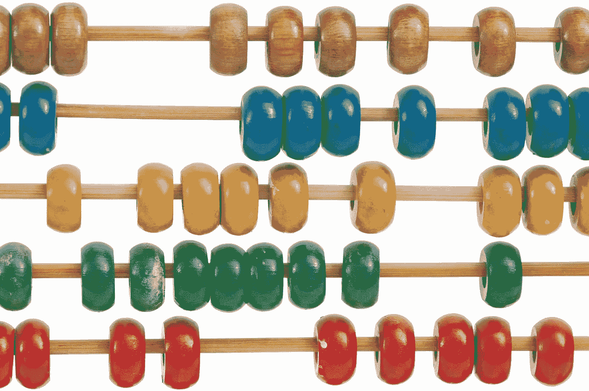
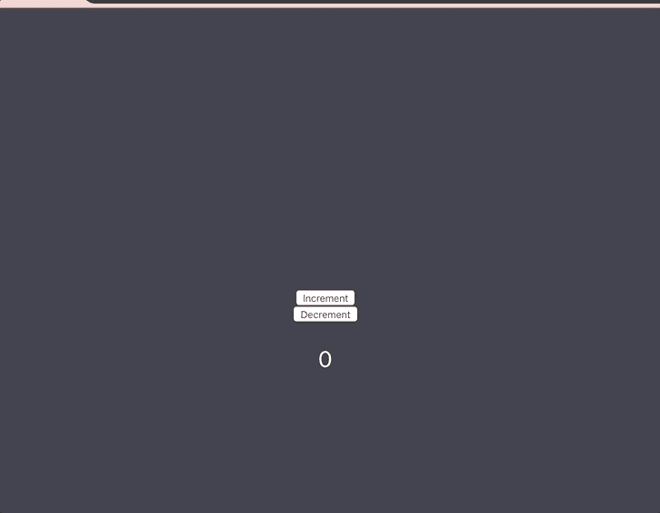

# 如何使用 Redux 构建计数器

> 原文：<https://betterprogramming.pub/how-to-make-a-counter-using-redux-3e6630871524>

## 通过制作一个小小的计数 app 来学习 Redux 的基础知识



照片由克里斯·贾维斯在 [Unsplash](https://unsplash.com/s/photos/counting?utm_source=unsplash&utm_medium=referral&utm_content=creditCopyText) 上拍摄

这是一个关于如何使用 Redux 实现递增/递减计数器的教程。

对于本教程，了解以下基本知识会有所帮助:

*   java 描述语言
*   反应

# Redux 到底是什么？

Redux 是管理状态的各种代码库的状态容器。在这种情况下，我们将它与 React 一起使用。就是否在您的应用程序中实现它而言，这更像是一个选择的问题。我刚刚开始了解 Redux，并考虑在我正在从事的一个项目中实现它。我花了很长时间才理解它(理解，我的意思是理解它的 30%)。我想过开发一个小应用来帮助我掌握基础知识，因为练习是学习新东西的关键。

我通过运行命令`npm install -g create-react-app my-project-client`和安装两个 Redux 包`npm i redux && npm i react-redux`开始创建我的应用程序。完成所有这些后，运行`npm i && npm start`，它将安装所有其他必需的包并启动您的服务器。

现在你的应用框架已经构建好了，我们可以开始编码了！

# 建一个柜台

我首先在我的`src`文件夹中创建一个 Redux 文件夹，并创建了两个名为`actions.js`和`reducers.js`的文件。接下来，我将`createStore()`函数导入到我的`index.js`文件中。`createStore()`是 Redux 给你的一个函数。当它被调用时，它返回 Redux 存储的一个*实例*。

```
import { createStore } from 'redux'
```

酷！现在`index.js`知道了`createStore()`，我们必须创建一个名为`store`的变量，并将其设置为等于`createStore()`函数。第一个参数`createStore()`是一个 reducer 函数，所以在括号内，我们将传入一个我们还没有编写的函数，名为`reducerFunc()`，我们也必须在页面顶部导入它。

接下来我们要导入的是`{ Provider } from 'react-redux`。`Provider`用于将道具发送给包装在`connect()`函数中的其他组件，我们稍后会讲到。我们将把 store 变量作为道具传递给我们的应用程序，因为大多数功能都将在那里发生。

现在我们已经成功创建了商店，让我们创建一些操作。Redux 中的一个`action`对象描述了它将如何操纵状态。在本例中，我们制作了两个按钮，用于增加和减少页面上显示的数字(我们的计数器)。因此，将两个动作定义为增量和减量是有意义的，如下所示:

太棒了。现在我们已经设置好了我们的动作，我们可以编写我们的 reducer 函数了。reducer 函数接受两个参数，前一个状态和动作。我们建立`reducerFunc()`的方式是有条件的。我们将实现一个 switch 语句，因为 switch 语句有默认值，所以如果不满足任何条件，将总是返回一个默认值。

这个语句是说“嘿，如果这个动作的类型键等于`'INCREMENT'`，那么增加我的状态的值，如果是`'DECREMENt'`，那么减少我的状态的值。如果这两个条件都不满足，就返回我现在的状态。”如果这很难理解，那也没关系。我将在下面加入一些链接，这些链接更深入地探讨了动作、减少器等概念的含义和用法。我们已经成功了一半！

让我们转到我们的`App.js`文件，并导入我们之前提到的`connect()`函数。`connect()`是由`'react-redux'`提供的一个函数，它将您的状态连接到您正在导入`connect()`的组件。我们还应该`console.log(props)`看看目前我们的道具是什么。在创建这个应用程序的最开始，我们使用`Provider`将`store`作为道具发送给`App.js`。

如果您在浏览器中进入控制台(cmd + opt +j)，您应该会看到以下内容:

```
{store: {…}, dispatch: ƒ}
```

酷，所以我们的店在传承，我们的派单也在传承，但是我们的州在哪里？为了将我们的状态传递下去，我们需要实现一个函数，这个函数由`connect`提供，名为`mapStateToProps()`，也是`connect()`接受的第一个参数。您可以给这个函数起任何名字，但是为了清楚起见，我坚持使用`mapStateToProps()`。这个函数的主要目的是返回我们的状态。在我们写完函数后，我们把它传入`connect()`，这样它就和`App.js`连接了。

如果我们现在在控制台中检查我们的道具，我们的`count`应该已经被添加了！我们现在可以在`App.js`中访问我们的状态。因为我们在应用程序中使用了按钮功能，所以让我们将它们添加到我们的返回中。

两个按钮都有一个`onClick`事件，这两个事件都指向两个我们还没有写的不同函数，一个用于处理增量，一个用于减量。它们上面也有文字说明哪个按钮做什么。我们的函数应该是这样的:

由于我们的应用程序是一个函数组件，我们必须将函数声明为变量。两者都有一个`props.dispatch({})`功能。`dispatch()` 分派动作并从`reducerFunc()`中触发状态的变化，所以这两个函数都触发对我们的计数器进行的不同的变化。您的成品应该是这样的:



恭喜你！您已经使用 Redux 成功构建了一个计数器。如果你愿意，可以查看一下 GitHub repo 。

编码快乐！

[](https://redux.js.org/introduction/getting-started) [## 为 JS 应用程序还原一个可预测的状态容器

### Redux 是 JavaScript 应用程序的可预测状态容器。它帮助您编写行为一致的应用程序…

redux.js.org](https://redux.js.org/introduction/getting-started) [](https://www.sohamkamani.com/blog/2017/03/31/react-redux-connect-explained/) [## React-redux“连接”解释🔗

### Redux 是一个非常简单的状态管理库，它使得使用 React 对每个人来说都更容易管理…

www.sohamkamani.com](https://www.sohamkamani.com/blog/2017/03/31/react-redux-connect-explained/)