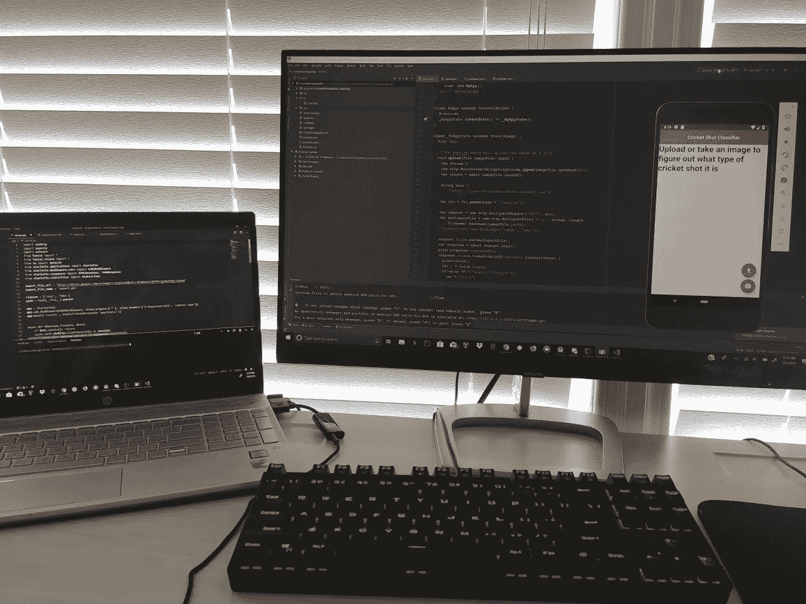
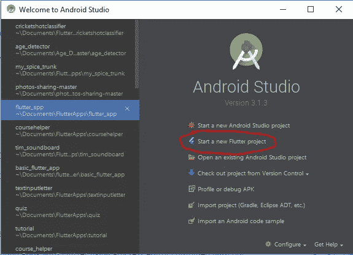
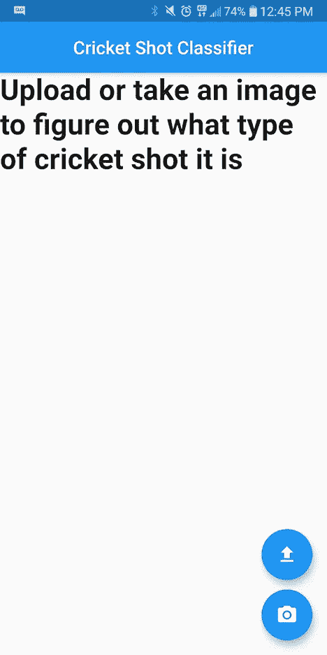

# 如何用 Flutter 和 Fastai 做一个跨平台的图片分类 App

> 原文：<https://betterprogramming.pub/how-to-make-a-cross-platform-image-classifying-app-with-flutter-and-fastai-2a6af6701535>



我的工作站，而建立这个应用程序。

在本文中，我将解释如何使用 API 来构建跨平台的移动应用程序，该应用程序使用神经网络对图像进行分类。我将使用我在以前的一篇文章中构建的模型，但本教程将适用于任何单标签图像分类模型。

[](https://medium.com/better-programming/how-i-used-a-convolutional-neural-network-to-classify-cricket-shots-d44197e79aff) [## 我如何使用卷积神经网络对板球击球进行分类

### 我最近深入研究了深度学习的世界，更具体地说，是图像分类。完成后…

medium.com](https://medium.com/better-programming/how-i-used-a-convolutional-neural-network-to-classify-cricket-shots-d44197e79aff) 

这个应用程序有两个组件:一个是我们创建的 API，它也将作为一个 web 应用程序，另一个是 Flutter 移动应用程序本身。所以我们开门见山吧。

# 准备构建 Web 应用程序

*   [我们将使用这个 GitHub 存储库，所以请将它转到您的 GitHub 帐户。](https://github.com/render-examples/fastai-v3)
*   上传你的模型的 pickle 文件(。pkl)到 Google Drive 并复制该文件的共享链接。
*   [转到该网站将共享链接转换为下载链接。将下载链接保存在安全的地方；我们很快就会需要它。](https://www.wonderplugin.com/online-tools/google-drive-direct-link-generator/)

# 构建 Web 应用程序

在构建 web 应用程序时，我们将主要关注存储库中已经分叉的`server.py`文件。

server.py 代码是应用程序的核心。

我们关注的行如下:

```
export_file_url = 'DOWNLOAD_URL'#Download_url for the .pkl file
export_file_name = 'export.pkl'
classes = ['sweep', 'coverdrive', 'straightdrive', 'helicopter', 'scoop', 'pull']
```

在显示 DOWNLOAD_URL 的地方，只需粘贴 export.pkl 文件的下载 URL，并用您自己模型的标签替换这些类。该应用程序现在可以部署了！

但是，还是有一些整容的东西需要改变。在`view`文件夹中，编辑`index.html`文件来代表你的模型和你的模型是做什么的，大概不是泰迪熊的分类吧！

# 代码中的其他内容是什么？

既然我们已经确保了应用程序可以运行，那么在告诉您如何部署它之前，我将带您了解代码的实际含义。我们已经介绍了 export_file 和 classes 代码，这些导入是不言自明的。我们将从检查以下代码块开始:

虽然这看起来需要消化很多东西，但是它做的事情非常简单。首先，它初始化应用程序，然后挂载静态文件夹以获取 web 应用程序的所有 CSS 和 Javascript，最后，它定义了两个函数。这两个功能对于整个 web 应用程序来说都非常重要。第一个，`download_file,`将用于下载您的机器学习模型，而第二个，`setup_learner,`将设置您创建的机器学习模型。

继续下一个代码块:

该代码块定义了应用程序的两条*路径*。一个是主页，它将`index.html`文件作为 HTML 响应返回。下一条路线，`/analyze,`非常重要，因为这是所有魔法发生的地方。它通过`index.html`文件中的表单收集图像，将模型应用于图像，保存预测，最后将预测作为 JSON 响应返回。这将使我们在开发移动应用程序时变得更加容易。

# 部署 Web 应用程序

现在，我们不能将我们创建的 web 应用程序作为 API 使用，除非我们部署它，所以让我们开始吧！

1.  [前往 render.com](https://dashboard.render.com/)并使用您的 GitHub 帐户登录。
2.  创建一个新的 web 服务，并使用我们在本教程中一直使用的存储库。
3.  选择 Docker 作为环境，并命名您的服务。
4.  单击保存 web 服务。

耶！我们已经完成了部署—非常简单，对吗？现在，当您等待 Render 启动并运行您的 web 应用程序时，让我们开始处理移动应用程序。当然，如果您不想构建移动应用程序，如果您想使用移动应用程序，您可以在这里停下来，然后再回来！

# 准备构建 Flutter 应用程序

## 你需要什么:

*   安卓工作室
*   颤振 SDK
*   AVD 管理器(安装在 Android Studio 旁边)

如果你还没有为 flutter 开发准备好 Android Studio，请遵循本教程:

[](https://flutter.dev/docs/get-started/editor?tab=androidstudio) [## 设置编辑器

### 您可以使用任何文本编辑器结合我们的命令行工具来构建 Flutter 应用程序。但是，我们建议使用…

颤振. dev](https://flutter.dev/docs/get-started/editor?tab=androidstudio) 

好了，是时候开始了！

# 设置相关性

打开 Android Studio*开始新的 Flutter 项目。*



创建新的颤振项目

现在打开`pubspec.yaml`文件，编辑依赖部分，如下所示:

```
**dependencies:
  flutter:
    sdk:** flutter
  **image_picker:
  http:**
```

现在打开终端并运行以下命令:

```
flutter pub get
```

这将确保安装所有必需的包，并且代码不会有任何导入错误。

# 制作应用程序

要创建应用程序，我们需要编辑`main.dart`文件。用以下代码替换`main.dart`中的当前代码:

将基本 URL 更改为您之前创建的渲染服务的 URL，并根据需要自定义应用程序的其余部分。

在您的 android 虚拟设备上运行上面的代码，它应该运行良好！

这是代码在我屏幕上的样子；显然，您可能需要编辑文本来更好地表示您的模型:



我们完了！你刚刚建立了一个跨平台的移动应用程序，可以对图像进行分类！

如果你喜欢这篇文章，考虑注册我的时事通讯，每周日都能收到精彩内容:[https://mailchi.mp/35c069691d2c/newsletter-signup](https://mailchi.mp/35c069691d2c/newsletter-signup)。