# 如何在 CSS 中的任何元素上制作一个弯曲的剪切块

> 原文：<https://betterprogramming.pub/how-to-make-a-curved-cutout-to-any-element-74dbdc6bab56>

## 这一强大功能的深入教程

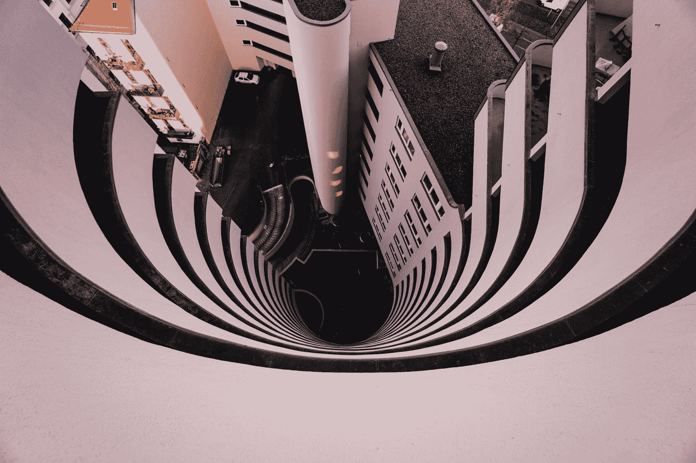

照片由[丹尼·吉比](https://unsplash.com/@solonomade?utm_source=medium&utm_medium=referral)在 [Unsplash](https://unsplash.com?utm_source=medium&utm_medium=referral) 上拍摄

在许多应用程序中，出于风格的原因，我们需要从一个元素中截取一部分。大多数时候，制作一个剪切块是很容易的，但是当涉及到一个弯曲的剪切块时，事情开始变得有点复杂，因为没有简单/直接的方法来做这样的事情，所以让我们来讨论一下！

我们将讨论一个具体的例子，以及如何创建它，但这并不意味着这是唯一的形状。你可以用这种方法开始画你喜欢的任何形状，因此有无限多种可能的剪切形状。

我们今天要讨论的是如何制作一个像这样的弧形剪影:

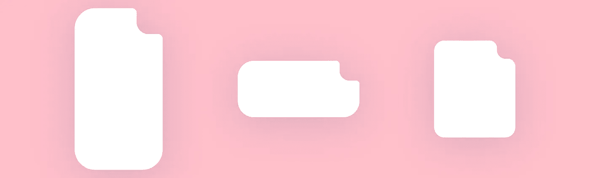

# 有哪些挑战？

我们有两个重大挑战，可能会阻止我们制作这张卡片。

## 弯道挑战

正如你们中的许多人可能已经发现的那样，剪切部分的曲线将是最具挑战性的部分，因为它有许多以不同方式连接的曲线——这使得不可能用一组简单的 CSS 规则来创建这样的曲线。

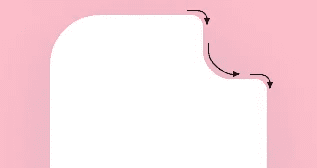

## 阴影挑战

如果我们使用`box-shadow`,它会因为弯曲的切口而给我们带来一些问题，看起来像这样:

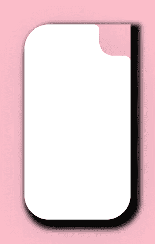

发生这种情况是因为框阴影为元素的框架添加了阴影效果。这里的框架，正如我们所见，不包括我们挖出来的曲线。

> box-shadow CSS 属性在元素的框架周围添加阴影效果。您可以设定多个效果，用逗号分隔。框阴影由相对于元素的 X 和 Y 偏移、模糊和扩散半径以及颜色来描述。
> […阅读更多](https://developer.mozilla.org/en-US/docs/Web/CSS/box-shadow) — MDN 网络文档

# 如何接近它？

既然我们知道我们的挑战，我们需要解决它们。

## 曲线逼近

至于曲线问题，我们可以通过制作一个类似这样的 SVG 并将其用作背景来解决。问题是(在大多数情况下), SVG 将有一个固定的长宽比，这意味着如果我们试图对它施加任何自定义的宽度和高度，它将会变形。也就是说，这可以用 SVG 来实现，但是我们不会在本文中讨论。

处理这个问题的另一种方法是使用渐变。

等等！什么？渐变？

是的，有些人只认为渐变是两种或更多种颜色之间的渐进过渡，在渐变的颜色之间，是所选颜色的模糊混合。他们是对的，但不完全对。

> *`*<gradient>*`*CSS 数据类型是一种特殊类型的* `*<image>*` *，由两种或多种颜色之间的渐进过渡组成。* [*…阅读更多*](https://developer.mozilla.org/en-US/docs/Web/CSS/gradient) — MDN 网络文档*

*在 CSS 渐变中，你可以定义任何不透明的颜色，并把它们放在停止点。这些停止点让你知道颜色在渐变中的开始和结束。这里有两个我们可以利用的技巧:*

*   *我们可以在对方身上叠加停止点，形成一条粗糙的线。那有什么用呢？好吧，如果停止点彼此远离，这将在两种选择的颜色之间创建一个渐进颜色的光谱，但是如果我们将两个停止点堆叠在彼此之上，我们将在两种颜色之间有一条粗糙的线，这意味着我们可以用这些渐变来绘制。例如，如果我们想要一个圆，我们可以用这个技巧做一个径向渐变，它会画一个圆供使用。*

*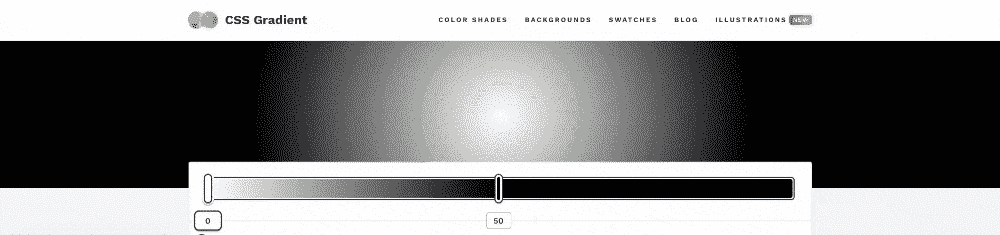*

*   *我们可以使用任何不透明的颜色。这非常重要，因为我们可以在想要的颜色和透明的颜色之间有一个渐变，而不是在两种不透明的颜色之间有一个渐变。这将打开绘制任何我们想要的形状的可能性，并使它有一个透明的背景(当我们开始应用它时，一切都有意义)。*

*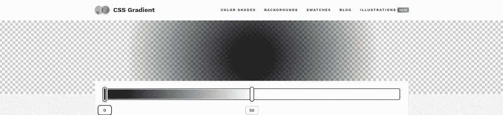*

> ****注:*** *1。上面 gif 中使用的工具是*[*https://cssgradient.io/*](https://cssgradient.io/) *2。您也可以使用任何 CSS 颜色关键字，如* `*transparent*` *，我们将在本教程中使用，但是您可以随意使用* `*rgba()*` *或* `*hsla()*` *函数，并将* `*alpha*` *值设置为* `*0*` *，或者根据您的喜好使用它的数字，或者使用任何首选的 CSS 颜色函数。**

## *影子方法*

*幸运的是，由于 CSS `filter`属性的广泛支持，如今`box-shadow`问题可以很容易地解决。*

*现在，我们可以使用`filter`属性中的`drop-shadow()`函数来添加内容感知阴影。*

*这意味着它不跟随元素的框架，而是跟随堆叠在一起的内容的轮廓。因此，如果我们使用渐变来创建一种特殊的图像，正如我们前面提到的，那么`drop-shadow()`将跟随生成的图像的轮廓。如果这个图像有透明部分，它将被`drop-shadow()`函数考虑，不像`box-shadow`属性。*

*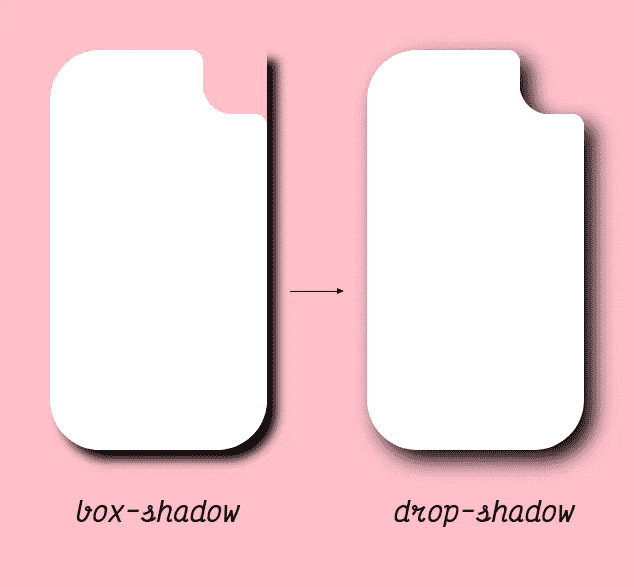*

> **`*drop-shadow()*`*CSS 函数对输入图像应用投影效果。其结果是一个* `*<filter-function>*` *。
> —* [*MDN Web 文档*](https://developer.mozilla.org/en-US/docs/Web/CSS/filter-function/drop-shadow)**

# **让我们开始画画吧**

**我们讨论了我们可能面临的挑战以及如何应对这些挑战，然后除了开始应用这一点来澄清一切之外，就没剩下什么了。**

**知道我们有这样简单的几何图形可以画，这样的曲线需要先分解成这些简单的图形。**

**所以，让我们开始把它分解成这些形状。**

## **简单的圆角**

**首先，我们看到其他三个角上的曲线。**

**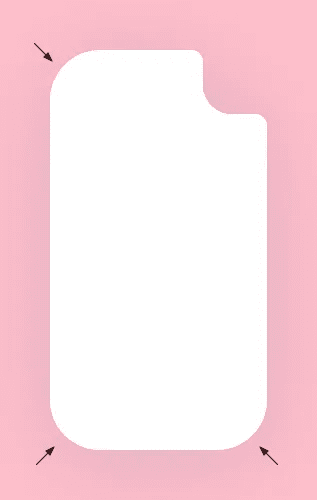**

**我们将在过程中忽略它们，因为这些很简单，用一个`border-radius`属性就可以完成。**

## **小圆圈**

**如果我们仔细观察，我们会看到两个小圆圈代表剪切的左上和右下曲线。**

**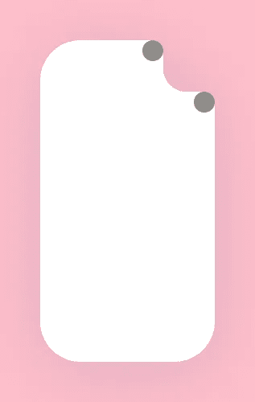**

## **大圆圈切口**

**此外，我们可以看到，有一个大正方形的角上有另一个更大的圆形切口。**

**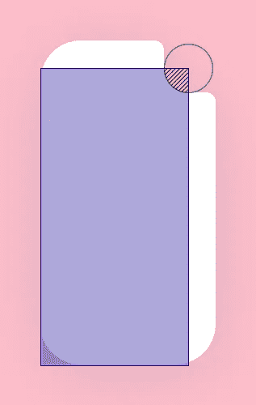**

## **填充框**

**然后，我们会很快注意到我们没有考虑顶部和右侧，所以让我们也添加这一点。请记住，这不可能只用一个盒子来完成，因为如果它是一个盒子，它会隐藏后面的圆的曲线，所以我们必须制作两个盒子，跨越到边缘并在中心停止，这样我们仍然会有圆的曲线。**

**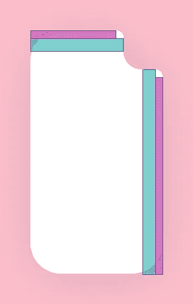**

## **最终分割**

**因此，将大图形分割成更小、更简单的图形的最终结果应该是这样的:**

**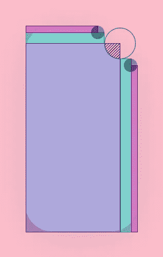**

**既然我们已经将复杂的形状分割成简单的几何形状，我们终于可以开始编码了。让我们开始一个接一个地画这些形状。**

## **画一个大圆抠图**

**在这里，我将从最复杂的形状开始，在我看来——[大圆切口](#c12f)**

**幸运的是，多亏了我之前提到的技巧，稍微调整一下，我们就可以做出只有一种渐变的形状。**

**那么，我们将如何做到这一点？**

**首先，让我们画一个简单的渐变，应该是这样的:**

```
**background: radial-gradient(
  */* gradient shape */* circle,
  */* first color */* transparent */* first color stop point */* 30px,
  */* second color */* #fff */* second color stop point */* 31px
);**
```

> *****备注:*** *1。我将使用 CSS 变量来存储将来可以再次使用的值，所以从现在开始，你将在 Pens 中看到所有的变量，而不是普通的数字。***
> 
> ***2。你会看到我将* `*1px*` *添加到渐变停止点中使用的任何变量或数字，例如:* `*calc(var(--circle-r) + 1px)*` *。这是因为如果两个停止点完全相同，浏览器会绘制一条不消除锯齿的粗糙线条，所以为了解决这个问题，我们使用这个技巧，在每隔一个停止点添加* `*1px*` *来添加一点模糊，使渐变颜色之间的线条更加平滑。***

**我们会注意到两件事:**

1.  **圆形切口位于中心。**
2.  **白盒显示了元素的整个高度和宽度。**

**幸运的是，为了在径向渐变中解决这个问题，我们可以通过执行以下操作来指定圆心(渐变开始的位置)的位置:**

```
**background: radial-gradient(
  circle at */* x-position */* 100% */* y-position */* 0%,
  transparent 30px,
  #fff 31px
);**
```

**这里我们将做一个右上角的剪切，所以我们将使用`100% 0%`值来实现这一点，但是你可以摆弄这些数字来获得你想要的任何位置或曲线，同时记住这些值不一定要在`%`中，它可以是任何 [CSS 度量单位](https://developer.mozilla.org/en-US/docs/Learn/CSS/Building_blocks/Values_and_units)。**

**现在让我们移动带有圆形切口的大框，为小圆和填充框留出空间，就像我们之前展示的那样。**

**所以，这应该是这样的:**

```
**background:*/* The gradient "special" image */* radial-gradient(
  circle at 100% 0%,
  transparent 30px,
  #fff 31px
);
*/* bg-image x-position */* 0px */* bg-image y-position */* 34px / */* bg-image width */* calc(100% - 34px) */* bg-image height */* 100% */* bg-image repeat-x */* no-repeat */* bg-image repeat-y */*no-repeat**
```

**你可以在这里阅读更多关于背景速记属性[的内容。](https://developer.mozilla.org/en-US/docs/Web/CSS/background)**

**现在，这看起来像[我们早先分开的大圆切口](#c12f)！**

## **画小圆圈**

**现在，这真的很容易画，我们只需要简单的`radial-gradient`来画两个圆，但是为了正确地定位它们，我们需要做一些数学(简单的几何)。**

**不要害怕；这是简单的数学，但如果你不喜欢它，你可以开始玩数字，直到你击中你喜欢的东西。我会用一点数学知识解释在这种情况下如何定位圆圈，因为这会节省我一些时间。**

**已知两个圆心之间的距离与两个圆的相同边之间的距离相同，我们可以如下计算小圆[与](#2ca6)圆心之间的距离:**

**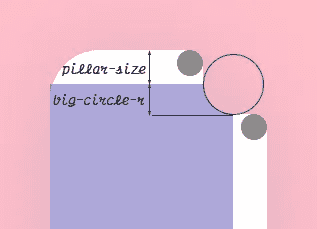**

**圆圈之间的距离`circles-space`等于`pillar-size`和`big-circle-r`。**

**因此，我们可以像这样应用这个简单的数学等式:**

```
**--circles-space: calc(var(--big-circle-r) + var(--pillar-size));**
```

> *****注意事项****:* `*pillar-size*`*是大圆抠图的右上插图，是我们在* [*绘制大圆抠图*](#c32b) *时用来将方框向左下方移动的值。* `*pillar-size*` *绝对不能少了那个小小的* `*circle-r*` *。***

**现在我们知道了两个圆之间的距离，并且我们知道它们需要画在边上，我们可以如下画圆:**

**注意，为了画一个完美的圆，我是这样写的:**

```
**background: radial-gradient(
  circle closest-side,
  var(--card-color) 100%,
  transparent calc(100% + 1px)
);**
```

**我们需要将`closest-side`参数添加到径向梯度中，以计算最近边的百分比。你可以在这里阅读更多关于那个[的内容。](https://developer.mozilla.org/en-US/docs/Web/CSS/gradient/radial-gradient#size)**

## **绘制填充框**

**现在结果有了空白空间，它们应该用[填充框](#6302)来完成我们的绘图。**

**请注意，在上面的[填充框](#6302)部分中，看起来框在顶部很小，以填充间隙，但在实际实现中，我将使它们的高度或宽度分别与其他组件重叠。**

**这将防止由于位置或尺寸计算中的分数而在填充框和其他组件之间显示透明线。**

**现在让我们在相应的位置用`linear-gradient`画出简单的方框，就像我们在上面的[填充方框部分](#6302)中所做的一样。**

## **最后润色**

**现在卡片开始变得完整了。但是我们还缺少两样东西来完成我们的设计:**

1.  **简单的圆角**
2.  **卡片阴影**

**幸运的是，这两点真的很容易实现，因为我们可以使用普通的`border-radius`属性来实现圆角，我们可以对阴影使用`drop-shadow()`函数，就像我们之前在[中讨论的阴影方法](#0cf6)一样。**

**这应该是这样的:**

```
**filter: drop-shadow(0 10px 48px rgba(21, 44, 115, 0.15));
border-radius: 50px 0 50px 50px;**
```

**我们完成了卡片的制作，它看起来和图片一模一样。此外，我做了一个彩色的变体来显示渐变绘制了和我们之前创建的相同的形状。**

# **结论**

**我们用渐变制作了一张带有复杂曲线的卡片，通过将曲线分割成可以绘制的更小的形状，我们得到了最终的结果。**

**知道了我在这篇文章中谈到的技巧和方法，你就可以利用它们从卡片的任何一面或一个角做出任何形状或曲线。**

**事实上，您可以疯狂地进行设计，画出您需要的任何东西，并且仍然让背景与您的元素的高度和宽度动态地反应，而没有固定的纵横比。**

# **相关话题及启示**

1.  **[https://CSS-tricks . com/cut-corners-using-CSS-mask-and-clip-path-properties](https://css-tricks.com/cut-corners-using-css-mask-and-clip-path-properties)**
2.  **[https://stack overflow . com/questions/57440523/CSS-transparent-curved-shape-with two-rounded-sides](https://stackoverflow.com/questions/57440523/css-transparent-curved-shape-with-two-rounded-sides)**
3.  **[https://stack overflow . com/questions/61443008/how-to-create-a-curve-on-the-top-a-a-background](https://stackoverflow.com/questions/61443008/how-to-create-a-curve-on-the-top-of-a-background)**