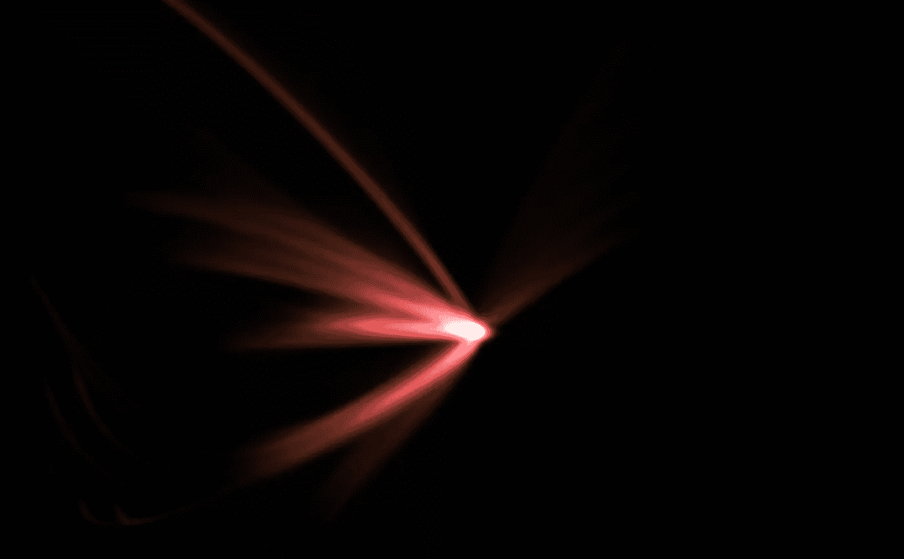
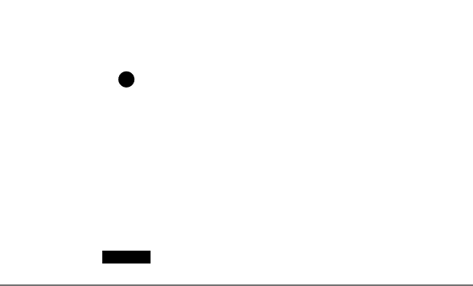
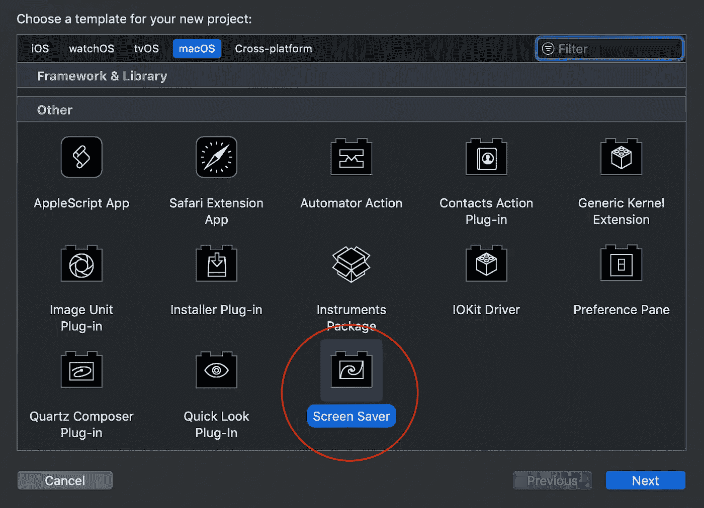
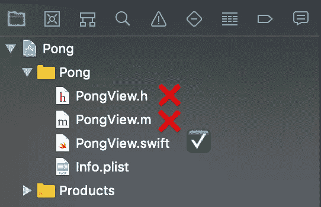
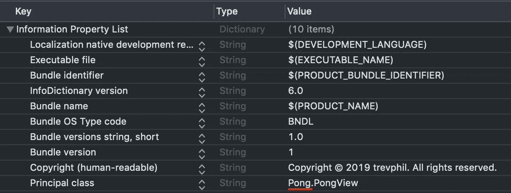
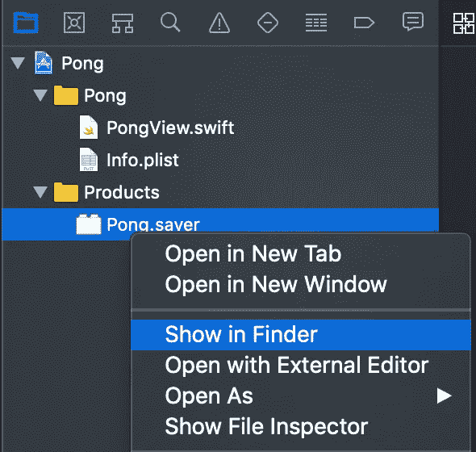
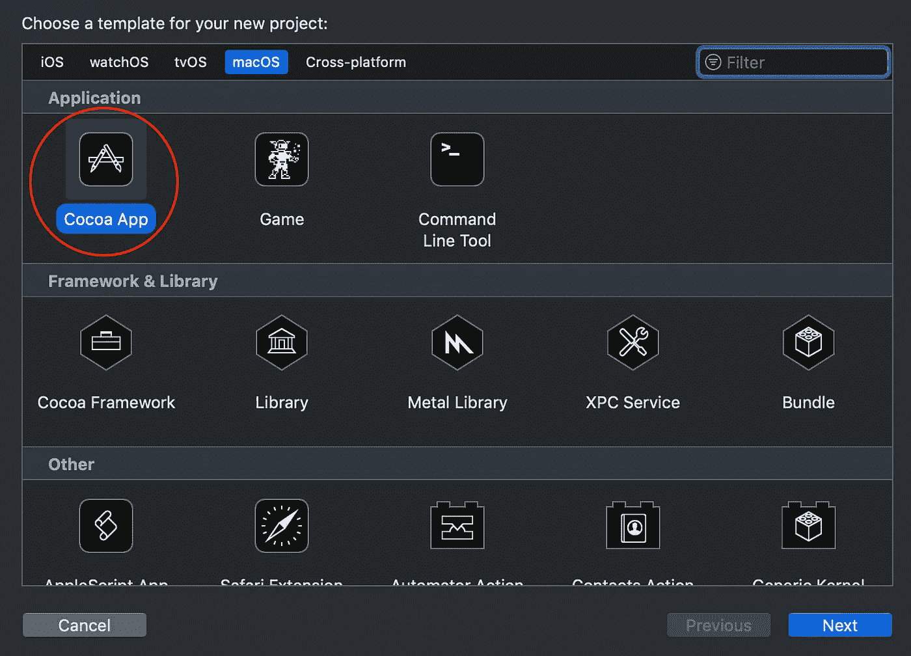

# 如何为 Mac OS X 制作自定义屏幕保护程序

> 原文：<https://betterprogramming.pub/how-to-make-a-custom-screensaver-for-mac-os-x-7e1650c13bd8>

## 了解编写自己的 Mac OS X 屏幕保护程序的基础知识

“Wirbel”屏幕保护程序

苹果 Mac OS X 的默认屏保很好，但过一会儿就变得无趣了。当这种情况发生时，任何真正的书呆子都会自己解决问题！

如果你想让自己的*为 Mac OS X 定制*屏保，这篇文章就是为你准备的。我们将浏览一个制作模拟游戏 [Pong](https://en.wikipedia.org/wiki/Pong) 的屏幕保护程序的教程。这将会非常简单——这只是让你开始如何制作一个屏幕保护程序。最后，它看起来会像这样:

如果你想获得灵感来制作其他东西，这里有更复杂的屏保。

# 步骤 1:项目设置

Mac OS X 的屏幕保护程序是用 Xcode 开发的。您需要做的第一件事是创建一个新的 Xcode 项目，类别为“屏幕保护程序”

我将我的项目命名为 **Pong** ，但是你可以随意命名你的项目。从 Xcode 10.2.1 开始，Xcode 会生成一些文件:`PongView.h`、`PongView.m`、`Info.plist`。

由于 Objective-C 不是最漂亮的语言，而 Swift 正变得越来越主流，我们将删除这些自动生成的 Objective-C 文件，并创建一个新文件，`PongView.swift`。

这个 Swift 文件的结构非常简单。您可以从下面复制粘贴模板:

我们将使用函数`draw()`来渲染屏保动画的每一帧内容。

我们将使用函数`animateOneFrame()`在每次动画定时器触发时更新屏保的“状态”(这个定时器由操作系统自动创建和处理)。在这个函数的末尾调用`setNeedsDisplay(bounds)`很重要，这样操作系统就知道要重新绘制屏幕。

**重要提示**:由于我们去掉了 Objective-C 的东西，使用 Swift，所以项目的`Info.plist`文件需要更新。在关键字“Principal class”的值前面加上 Xcode 项目的*名称。比如我的 Xcode 项目叫做 *Pong* ，所以我把值从`PongView`改成了`Pong.PongView`。*

# 步骤 2:实现逻辑

我们的 pong 屏幕保护程序的状态将通过几个简单的变量来跟踪:

在`init()`函数中，我们将配置球的初始位置和速度。我们将初始位置设置为屏幕的中心，并将初始速度设置为一个大小为`10`的随机向量。

现在我们需要一些辅助函数来确定球何时接触到屏幕的边缘和/或球拍。以下两个函数将完成这一任务:

我知道，`ballHitPaddle()`功能并不是 100%可靠地验证球和桨之间的接触。但是对于我们的目的来说，已经足够好了。

现在，我们将使用这些辅助函数来更新`animateOneFrame()`中我们的屏保的“状态”。

桨保证跟踪球的 x 位置。因此，在球弹到屏幕底部之前，它总是会与球接触(除非你将球的速度设置得很高，在这种情况下，它可能会“跳过”球拍)。

# 步骤 3:绘制动画

剩下唯一要做的就是在`draw()`函数中画出球和桨。请注意，在绘制任何其他东西之前，我们先重新绘制背景**再绘制**，否则球在屏幕上反弹时会留下“轨迹”。

我们还定义了更多的辅助函数来划分绘图逻辑:

# 步骤 4:安装和调试

此时，屏保已经准备好了。你可以在这里找到所有的代码。

要安装屏保，按 Xcode 上的“运行”按钮，在 Finder 中打开构建产品`Pong.saver`，双击它。“设置”应用程序应该会打开，并提示您安装屏幕保护程序。

如果您更改了屏幕保护程序并想要重新安装它，在尝试重新安装屏幕保护程序之前关闭设置应用程序是很重要的。

# 附加调试

使用在 Finder 中打开构建产品、关闭设置应用程序、重新安装屏保等繁琐的过程来测试屏保并不理想。

而且，这个方法不允许你设置断点，与`lldb`交互，或者查看控制台输出。**但是有办法！**

你的屏保类继承自`ScreenSaverView`，而 T7 又继承自`NSView`。这意味着它可以被添加到一个常规的旧 Mac OS X 应用程序的子视图中。

只需创建一个“Cocoa App”类型的新 Xcode 项目然后，添加你的屏保作为 Xcode 生成的主`NSViewController`视图的子视图。我们需要为动画循环人工创建一个计时器，但这是一个非常简单的修复。

当您从 Xcode 运行这个 Cocoa 应用程序时，所有的普通工具(如断点和控制台日志)都将可供您调试，并且开发您的屏幕保护程序将会容易得多！

# 资源

这只是一个开发 Mac OS X 屏幕保护程序的介绍。你的可能性只受到苹果 API 的限制，还有很多事情可以做。

*   https://trevphil.com/screensavers 的[有更多的例子。](https://trevphil.com/screensavers)
*   `PongView.swift`的完整代码可从[这里](https://gist.github.com/trevphil/58d3cbbfdefc2ec71e986b28aaf29f32)获得。