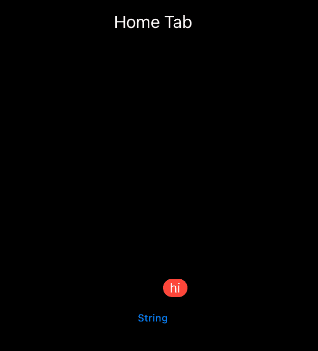

# 如何制作带有徽章的动态 SwiftUI 标签视图

> 原文：<https://betterprogramming.pub/how-to-make-a-dynamic-tabview-with-badges-7f4fc3b31801>

## 如何将 badge(_:)修饰符应用于 TabView 并动态驱动选项卡项目内容的分步说明

*照片由 390097 发自* [*Pixabay*](https://pixabay.com/)

有许多文章指导开发人员如何使用静态内容应用`badge(_:)`修饰符。然而，没有一个演示如何实际使用动态内容的徽章。

# 徽章修饰词的一般用法

徽章对于 iOS 开发者来说并不是一个新概念。然而，随着 SwiftUI 在 2021 年 WWDC 的第三次发布，实现变得更加容易，苹果在该发布中引入了新的徽章 API，提供了原生支持。

SwiftUI 的`badge(_:)`修饰符有助于向用户传达相关信息，比如未读消息、电子邮件和其他通知。

例如，可以使用`badge(_:)`修饰符在选项卡项目上显示硬编码的 Int:

字符串也可以用作参数。

然而，静态内容不适合或不适合用于通知用户重要更改或更新的选项卡项目。

# 动态徽章

这就需要实现额外的代码来显示动态通知。为了使选项卡视图项目能够在我们的视图上呈现动态内容，我们将构建一个基本的消息应用程序。我们将通过创建以下内容来公布一条消息被喜欢的次数:

## **1。型号**

遵循模型-视图-视图模型(MVVM)设计模式，我们的模型将保存消息数据。模型不包含任何逻辑，因为它仅用于表示视图模型所使用的数据结构。

## **2。查看模型**

ViewModel 负责模型数据，并将这些数据传递给视图。我们的 MessageViewModel 将管理消息数据。

## **3。状态变量**

状态属性包装器存储属性类型，并根据其值的任何变化重新计算视图。在我们的`MessageTabView`结构中，我们创建了一个`likeCountBadge`属性来显示点击 like 按钮的次数。

# 模型

首先，让我们定义一个新的 Swift 类型:

这个结构只是保存我们的消息数据，特别是点击 like 按钮的次数。

# 视图模型

接下来，我们将创建一个`MessageViewModel`来管理我们的数据:

我们的类符合`ObservableObject`协议。该协议确保当任何发布的改变发生时，用户界面被更新。

我们需要`ViewModel`来监控并通知我们赞数的变化。因此，我们使用`@Published`属性包装器创建了一个`Message(messageText:likeCount:)`的实例。当更新和检索`likeCount`的值时，这个消息实例分别由`addOneLike()`和`fetchLikes()`函数调用。

可以向代码库添加额外的功能来执行进一步的任务，例如重置`likeCount`值、更改消息等。

# 视角

首先，让我们创建一个视图来显示我们的只读消息和一个按钮。通过创建这个独特的视图结构，我们不仅降低了`MessageTabView`(接下来将讨论)的复杂性，而且使为预览窗口重新编译我们的内容和隔离我们的更改的影响变得更加容易。

在这个视图中，每次点击“Like”按钮，这个动作都会触发`addOneLike()`功能。我们需要将`MessageViewModel`作为`@EnvironmentObject`传入，以便访问它的函数。

现在我们已经创建了一个视图来显示我们的消息和按钮，我们可以修改前面给出的`TabView`。

我们新改进的`MessageTabView`会在每次赞数有变化时更新。

我们将添加我们的`MessageButtonView`作为下面的选项卡项目:

您会注意到我们为了实现动态徽章而对最初的`TabView`做了一些修改。

1.  `@State`属性包装器——为了跟踪`likeCountBadge`的状态，我们使用了`@State`属性包装器。每次更新属性时，视图都会相应地更新。
2.  `@EnvironmentObject`属性包装器——这个包装器让我们可以访问 ViewModel 函数，也就是到目前为止记录的点赞数。
3.  `onChange(of:perform:)` —这个修饰符的作用类似于属性观察器，当属性的状态改变时，它执行代码。这里，我们想在每次点击 Like“Like”按钮时更新我们的`likeCountBadge`属性。

# 包扎

现在，您可以通过使用 MVVM 方法、SwiftUI 属性包装器和应用视图修饰符，向您的选项卡栏项目添加动态标记，从而使您的用户保持最新。

从我的 GitHub 库下载完整的源代码:[https://github.com/codingcartooningcpa/BadgeTutorial](https://github.com/codingcartooningcpa/BadgeTutorial)

感谢阅读！