# 如何用 React 制作一个假的聊天机器人

> 原文：<https://betterprogramming.pub/how-to-make-a-fake-chat-bot-with-react-a0ab7f3fee7b>

## 数据、设计和组件渲染的简单演练


丹尼尔·科尔派在 [Unsplash](https://unsplash.com?utm_source=medium&utm_medium=referral) 上的照片

制作我的个人网站，我想要比纯文本更个性化的东西。我决定拼凑一个聊天机器人，来谈谈我在自己的网站上链接过的各种项目(Figma、Medium、Github、Instagram 等。).

您可以在下面的[我的网站](https://zaavin.com/)或[演示链接中查看我是如何使用该应用的！](https://react-chatapp-nivaaz.netlify.app/)

## 资源

*   [创建-反应-应用](https://reactjs.org/docs/create-a-new-react-app.html):如何创建反应应用
*   [网站现场演示](https://react-chatapp-nivaaz.netlify.app/)
*   [聊天应用的 Github repo](https://github.com/nivaaz/chatBot/tree/master/chatbot)
*   [我如何在我的网站上使用它](https://zaavin.com/)
*   Netlify : [我部署应用的地方](https://www.netlify.com/)

我将按照以下几个阶段讲述我是如何在几个小时内组装聊天机器人的:

*   设计
*   用户流量
*   数据结构
*   反应渲染

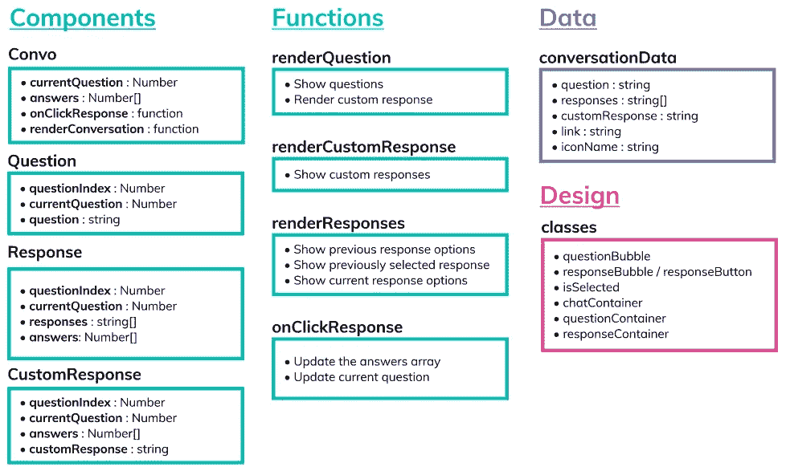

应用程序的概要

# 设计

我们从设计开始，因为我们大多数人都熟悉某种形式的聊天。

## 概述流程

有两个人在交谈——你和你与之交谈的人。所以一个典型的设计大概是这样的:

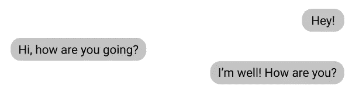

Nivaaz 的聊天应用概述

## 让我们添加色彩。

大多数聊天应用都坚持一种颜色。

为了确保我们有良好的用户设计，我们需要以下内容:

*   一种主色
*   其余保持单色(黑色、白色或灰色)。
*   颜色和所选文本的颜色之间应该有很高的对比度。这使得文本易于阅读。
*   保持简单——谈话的内容比外表更重要！

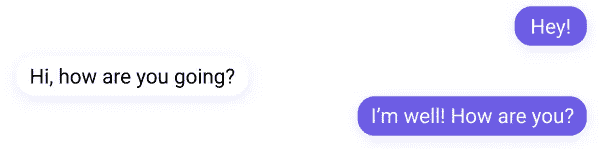

Nivaaz 的彩色聊天应用程序概述

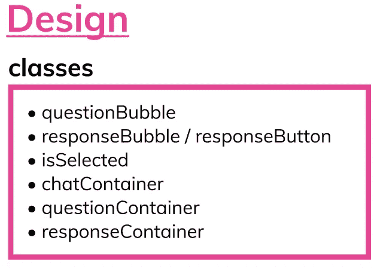

## 添加样式

*   `Bubble`

对于响应、问题和自定义响应，这将是相同的代码。

```
border: none; to override the button default border.border-radius: 2em. To give it round edges.padding: 1em. To make it bubble-like.max-width: fit-content. This makes the bubble to fit the text.margin: none; We’ll add margin from the parent container.box-shadow: 0px 2px 10px rgba(162, 155, 254, 0.25); to add a glow around the bubble.
```

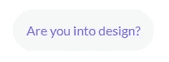

气泡式/问题气泡

*   `questionBubble`

```
background: WhiteSmoke; // this is purplecolor: #a29bfe;
```

*   `responseBubble` **(** `.s.bubble` **)**

当这些被渲染时，它们将属于`s bubble`类

我们想让颜色与`questionBubble`相反。

```
background: #a29bfe;color: white;
```

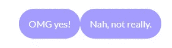

响应气泡样式

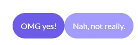

选定气泡和正常气泡

所选气泡将添加类别`selected`。这个班级将会是`selected s bubble`。

所选气泡的背景较暗。

```
background-color: #6c5ce7;
```

当按钮悬停在上方时，它们会有一个框形阴影。

```
box-shadow: 0px 0px 15px 0px #6c5ce7b0;
```

*   `Custom Response Bubble`

这将与问题气泡样式相同。

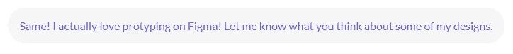

自定义响应气泡

*   `questionContainer`

这将使文本向容器的左边对齐，并且容器应该跨越父容器的整个宽度。

```
text-align: -webkit-left;
```

*   `responseContainer`

这将使文本向容器的右边对齐，并且容器应该跨越父容器的整个宽度。

```
text-align: -webkit-right;
```

*   `chatContainer`

根据可能继承到这个 div 中的任何样式，您可能希望在这里更改样式。我没有任何有趣的东西，所以我没有在这里添加任何样式。

但是您可能希望将宽度设置为 80vw，并确保高度随内容动态变化！

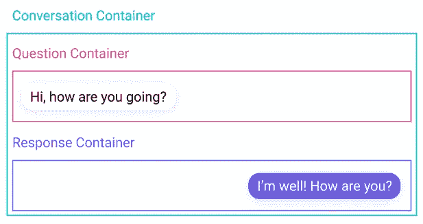

所有的风格都可以在这里看到:

Nivaaz 聊天机器人的风格

# 用户流量

简单来说:

*   我们问第一个问题。
*   用户单击我们之前设置的一个响应。
*   我们用一个定制的响应来回复用户的选择。

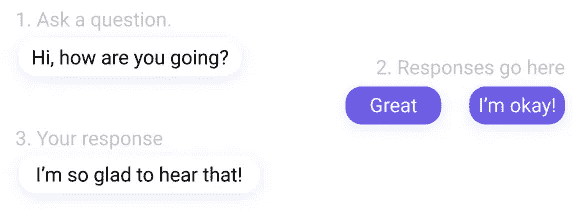

图示视图中的步骤— Nivaaz

# 数据

我使用了一个 JSON 文件，但是您可以很容易地使用一个实际的数据库或后端来保存这些数据，并使用一个更复杂的算法。理想的情况是，我将来会从事这项工作。

我的 JSON 文件有如下结构，并放在我的“数据”文件夹中。

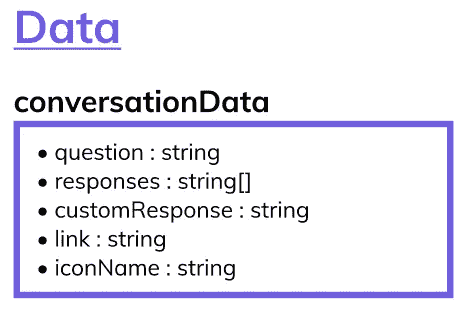

Nivaaz 概述数据结构

## 结构

每个问题和回答的条目数组。每个数组条目都有:

*   问题字符串。
*   字符串的响应数组。
*   `customResponse`弦。

最后，因为我使用了字体很棒的图标，所以我还添加了图标名称和图标的相关链接。

以下是我在 JSON 文件中的两个回答:

会话数据的 JSON 文件。

# 密码

这些是我们将要制造的组件:

*   Convo(父组件)。
*   问题(呈现问题)。
*   响应(呈现响应按钮)。
*   自定义响应(呈现与按下的响应按钮相关的客户回复)。

我将使用 [create-react-app](https://create-react-app.dev/docs/getting-started/) 来启动一个新的 react 应用。接下来，我将添加一个组件文件夹，每个组件的文件夹，以及一个 JavaScript 和 CSS 文件。确保为每个组件导入 React:

```
*import* React *from* "react"
```

每个 JavaScript 文件看起来都很相似。这里有一个`customResponse`组件的例子:

```
export const CustomResponse = (props) => {return (<p> {props.customResponse} </p>)
}
```

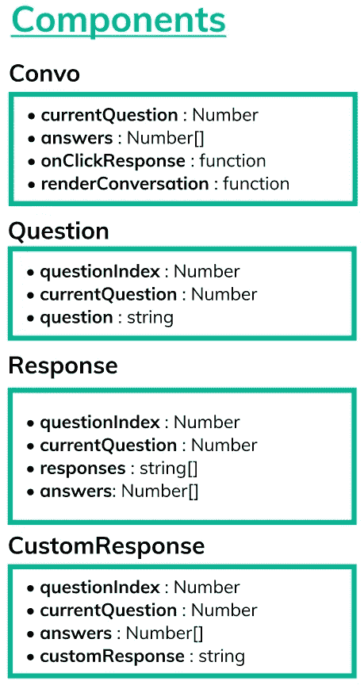

应用程序中的组件由 Nivaaz 制造

## 会话

Convo 是父组件，它将映射数据并呈现组件`Question`、`Response`和`CustomResponse`。

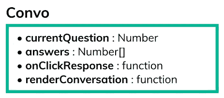

## 进口

首先，使用下面的代码从存储数据的地方导入 JSON 文件:

```
*import* convo *from* "../data/convo.json";*import* React *from* "react"*import* { Question } *from* "../Question/Question";*import* { Response } *from* "../Response/Response";*import* { CustomResponse } *from* "../CustomResponse/CustomResponse";*import* convo *from* '../../data/convo.json';*import* "./convo.css";
```

接下来，我们要导入其他组件和 CSS 文件。

## 使卷积成为类组件

我们将把 Convo 的定义改为 React 组件。我们还将添加状态。国家将保持:

*   `currentQuestion`:数字
*   `answersArray`:编号[]

```
*export* *class* Convo extends React.Component {state = {currentQuestion: 0,answers: []};render () {return (<p> Convo Component </p>)
  }
}
```

## `RenderConversation`功能

该函数将映射对话数据，然后呈现子组件`Question`、`Response`和`Custom Response`。每个子组件还被传递了其名称的属性。

renderConversation 函数

## 问题

`Question`需要额外道具。我们将把它们添加到 Convo.js 中的声明中。现在，问题将有以下属性:

```
<Question
   question={key.question}
   questionIndex={index}
   currentQuestion={this.state.currentQuestion}
 />
```

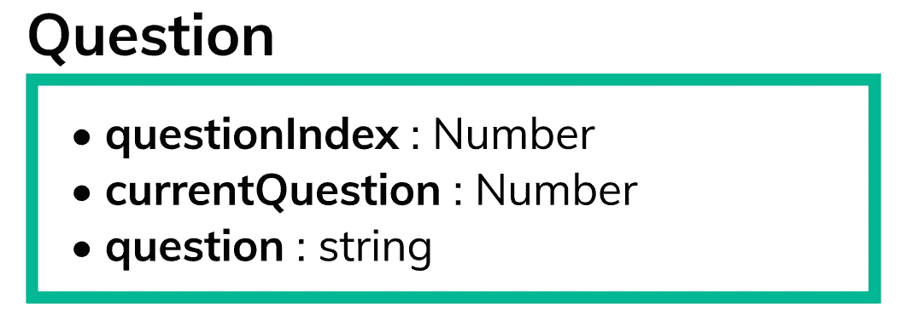

现在，让我们添加一些代码来根据状态中的`currentQuestion`呈现问题。只有当`questionIndex`小于或等于`currentQuestion`时，问题才会呈现。

这意味着只呈现当前问题或已回答的问题。

## 反应

Response 还需要额外的属性，所以我们将更新 Convo.js。注意，Convo 数据键被称为“responses”而不是“response”

```
<Response*responses*=*{*key.responses*}**currentQuestion*=*{*this.state.currentQuestion*}**answers*=*{*this.state.answers*}**questionIndex*=*{*index*}*/>
```

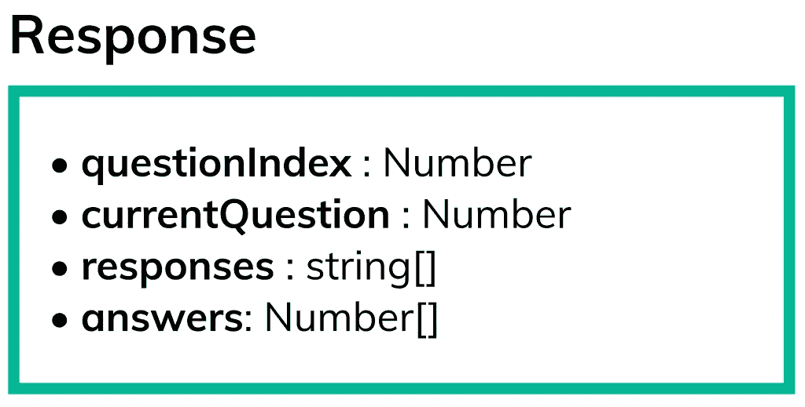

## `renderBubble`

为了使代码更容易阅读，更简短，我添加了一个函数来呈现响应按钮 renderBubble。这需要参数值、名称、键和 selected。

## `handleResponseClick`

这是当按下响应时将触发的功能。这将在 Convo.js 文件中声明，并将更新状态中的`currentQuestion`和答案。

该功能将通过 props 传递给`Response`组件。

因此，Convo.js 中的`Response`现在看起来是这样的(这将连接到`response`按钮中的`onClick`):

```
<Response*responses*=*{*key.responses*}**currentQuestion*=*{*this.state.currentQuestion*}**answers*=*{*this.state.answers*}**questionIndex*=*{*index*}**handleResponseClick*=*{*this.onClickResponse*}*/>
```

## `onClickResponse`(在 Convo.js 中)

```
onClickResponse = (e) => {const questionIndex = Number(e.target.name);const answerResult = Number(e.target.value);let ans = this.state.answers;ans[questionIndex] = answerResult;this.setState({currentQuestion: questionIndex + 1,answers: ans},console.log( "state", this.state.answers, this.state.currentQuestion));}
```

## 功能

`responses`不是一个数组，所以我们要映射它。

对于何时呈现或不呈现响应，我们有三种情况:

*   当`questionIndex`小于`currentQuestion`时，那么就会出现一个选中和未选中的答案。
*   当`questionIndex`等于`currentIndex`时，两个响应都被渲染，不选择任何响应。
*   如果`questionIndex`大于`currentQuestion`，则不应显示任何内容。

对于选定的按钮，我刚刚添加了一个选定的类。所选按钮根据答案数组中的值呈现，即`answers[questionIndex]`。

## `CustomResponse`

最后一个组件！


## 在 Convo.js 中添加道具

```
<CustomResponse*questionIndex*=*{*index*}**currentQuestion*=*{*this.state.currentQuestion*}**answers*=*{*this.state.answers*}**customResponse*=*{*key.customResponse*}*/>
```

## 功能

*   自定义响应应该只呈现小于`currentQuestion`的 questionIndexes。
*   自定义响应将仅在所选答案为 0 时呈现(因为这是我编写响应按钮和自定义响应的方式。)

所以代码看起来有点像这样:

最后，我们的代码应该工作了！你可以在这里看到聊天机器人的现场演示。GitHub 库的[链接也可以在这里找到。](https://github.com/nivaaz/chatBot)