# 如何使用 Swift 5 在 iOS 中制作类似 Dribbble 的侧菜单

> 原文：<https://betterprogramming.pub/how-to-make-a-nice-side-menu-for-your-ios-app-using-swift-5-8868adafbee0>

## 为你的应用程序设计漂亮的侧菜单界面！

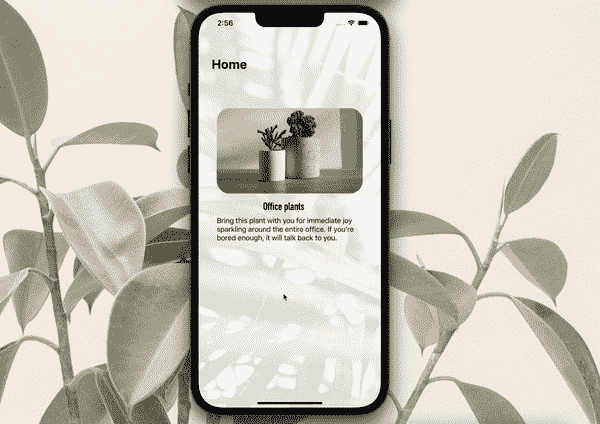

在 2010 年代，配菜曾经是一件大事。尤其是那些曾经从屏幕的右边滑出来的。那些有多酷？

但是时代变了。设计在发展。对于我们的现代图形来说，滑动菜单并不总是看起来很酷，对吗？我的意思是，想象一个设计精美的应用程序，只有一个常规的滑动菜单。呃。过时了。

坏消息是，有时我们仍然需要一个菜单来为用户导航。那么，我们能不能让它适合我们的应用程序，而不要让它看起来像是十年前发布的？我觉得可以！如果你喜欢我的侧边菜单的外观，请继续阅读，用你的应用程序实现我的代码，看看它看起来怎么样，并让我知道你的反馈！

如果你想浏览视频教程，请打开下面的链接:

# 步骤 1:创建菜单

首先，我们需要设置一系列我们希望包含在侧边菜单中的选项。每个选项都应该有一个用户可以看到的标题和一个相应的选择执行顺序:

该列表将是侧菜单上的可用选项。

这是它们将在教程结束时出现的位置:

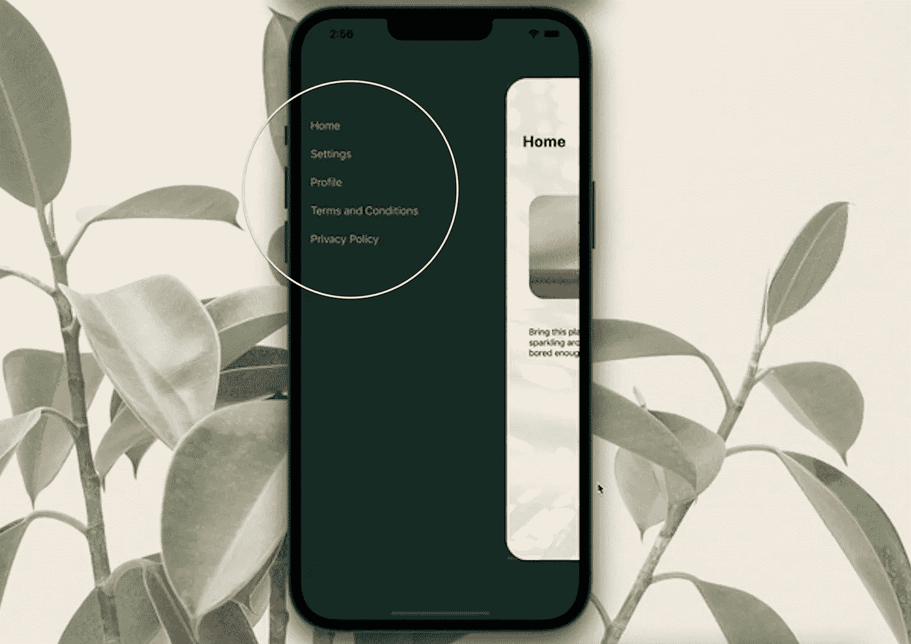

将视图的背景颜色设置为您想要的颜色，并在其中添加一个表格视图。这是我们的菜单选项将出现的地方，因此，你应该将它对齐到屏幕的左侧，并使它的宽度超过屏幕大小的一半，以确保当主视图移动到右侧时，它是完全可见的。

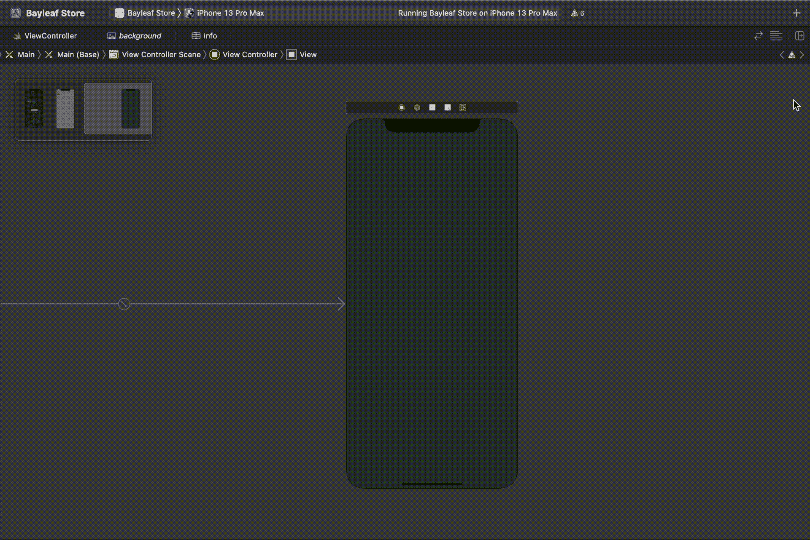

**在表格视图中添加表格视图单元格**。

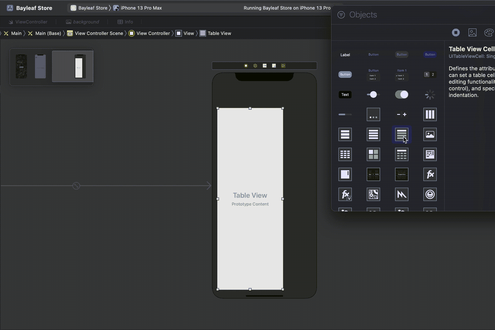

将表格视图连接到视图控制器，并将其命名为`menuTableView`。

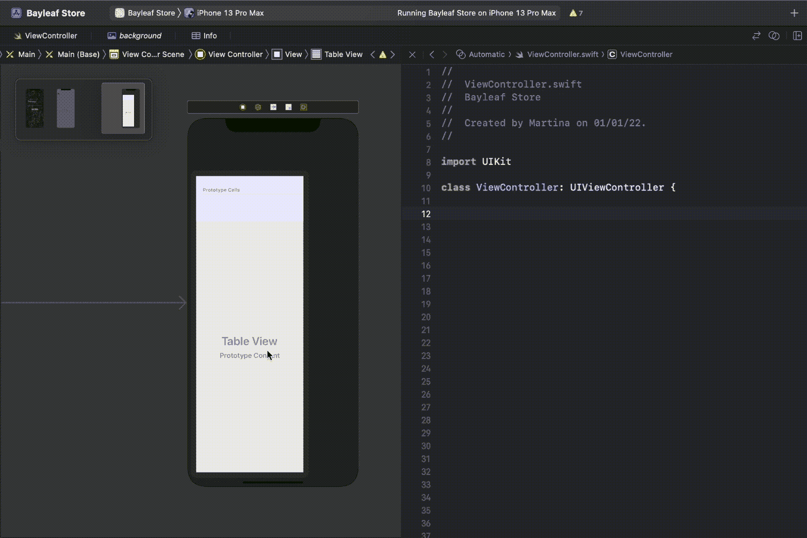

用类型`UITableViewCell`创建一个名为`tableViewCell`的类，并为你的菜单添加任何你可能需要的元素。我将只使用一个标签来显示选项的名称。

将该类分配给表格视图单元格*。*

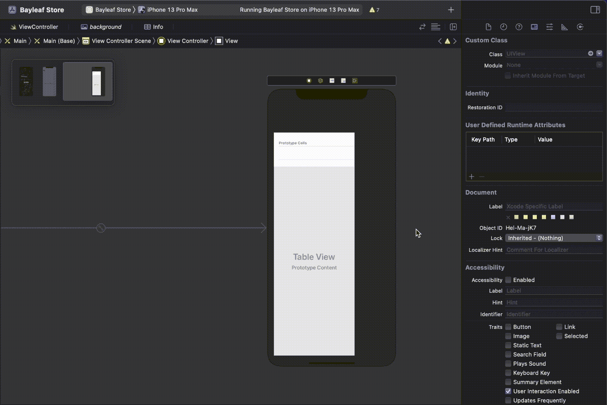

就在表格视图单元格的标识符下面，有一个选择选项。它会自动设置为“默认”。这意味着您的单元格的背景将在选择时变成白色。我决定不使用它，稍后设置我自己的自定义选择动画，因此，我将选择从“默认”改为“无”以避免不必要的自动动画。

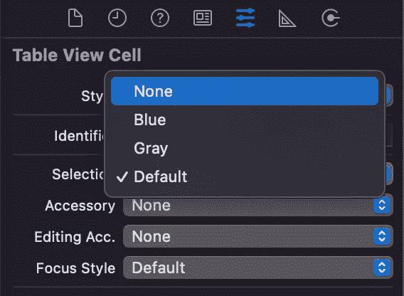

选择“无”作为您的选择动画，并设置自定义动画。

接下来，在您的视图控制器中，在`viewDidLoad()`函数中添加以下代码:

```
menuTableView.delegate = **self** menuTableView.dataSource = **self** menuTableView.backgroundColor = .clear
```

现在，我们需要做的就是设置表视图，这可以通过使用以下代码向视图控制器的类添加扩展来完成:

构建项目并确保您的结果类似于以下内容:

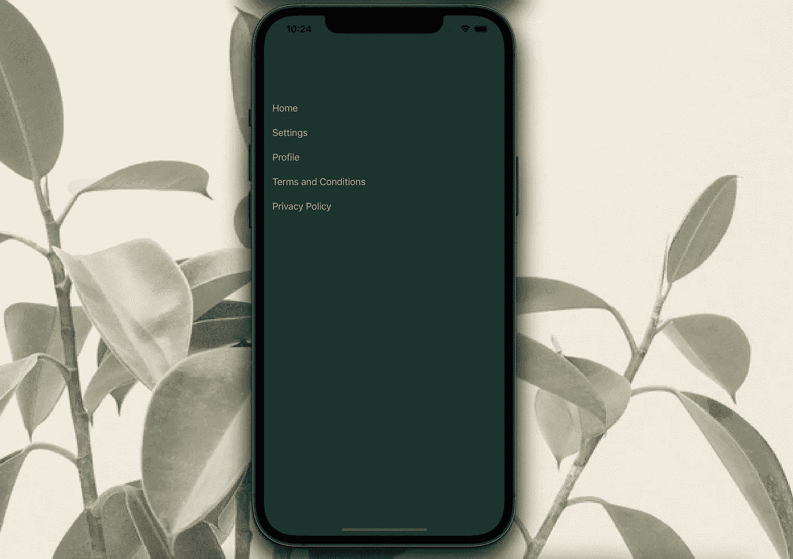

# 步骤 2:设置主视图

现在我们已经创建了侧菜单，是时候创建我们的主视图了。我们需要做的第一件事是向故事板添加一个视图，并使它适合整个屏幕。确保还将其顶部、底部、前导和尾随约束设置为零。

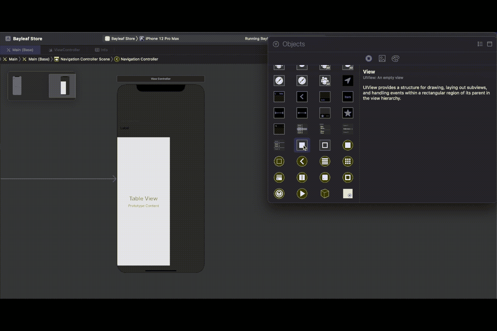

根据应用的用途定制您的视图。我的视图将包含一个植物图像和阿尔法设置为 0，15 和虚拟图像和标签作为演示背景的大小的图像视图。

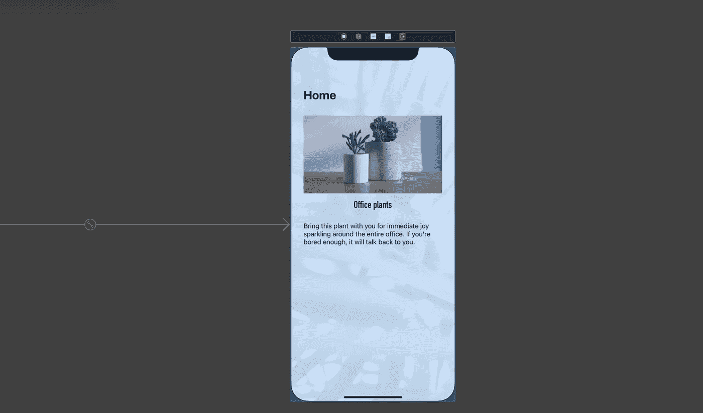

将容器视图连接到视图控制器，并将其命名为`containerView`。

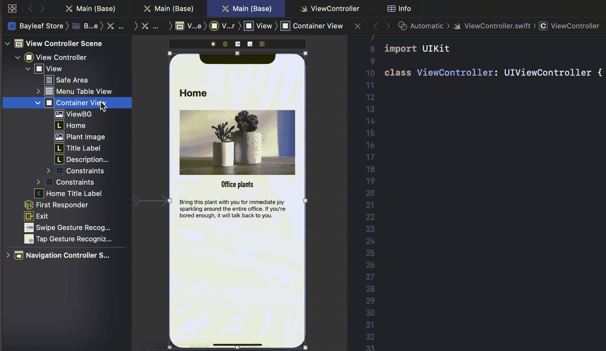

下一步是添加手势识别器，我们将使用它来识别用户何时试图显示或隐藏侧菜单。打开库，在容器视图中添加一个点击手势识别器。

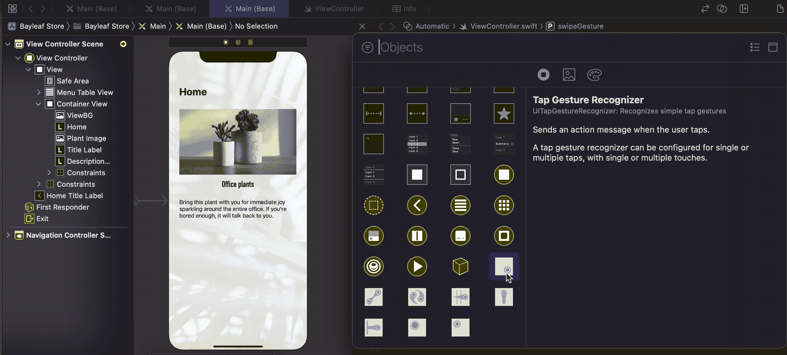

使用同样的方法，给你的容器视图添加一个滑动手势识别器，只是这次你要把它连接到 ViewController 并命名为`swipeGesture`。

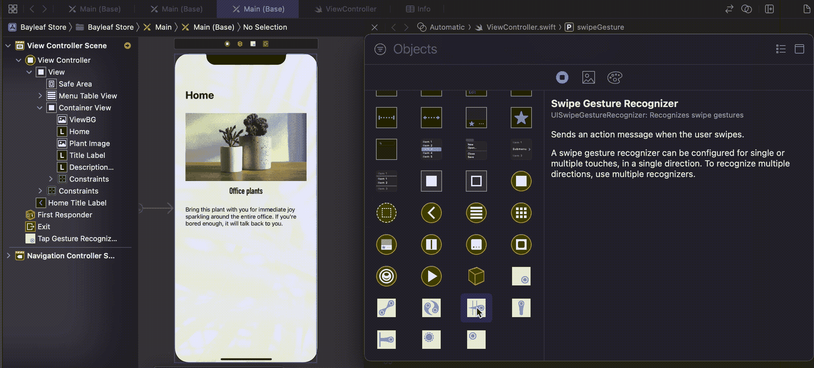

一旦你的视图都设置好了，你就为动画代码做好了准备！

# 步骤 3:动画代码

我们要做的第一件事是设置一个布尔值来决定我们的菜单何时显示。现在，我们将它设置为 false，直到用户滑动以显示侧菜单:

```
var menu = **false**
```

我们还将为屏幕边界设置一个快捷方式，以使我们的代码更加简洁:

```
let screen = UIScreen.main.bounds
```

为了记住视图的初始位置，我们还需要设置一个属性，这样我们就可以很容易地回到它:

```
var home = CGAffineTransform()
```

在`viewDidLoad()`中，home 将对应于容器视图的当前位置:

```
home = self.containerView.transform
```

我们现在已经为动画做好了准备。我创建了两个不同的函数，一个叫做`showMenu()`，另一个叫做`hideMenu()`。我将使用`CGAffineTransform()`来缩放视图，并在一个持续 0.7 秒的动画中将视图的 x 位置移动 0.8，我将使用`home`属性将视图快速移回其初始位置:

将滑动手势识别器连接到视图控制器以创建动作。这将是触发菜单显示的手势。

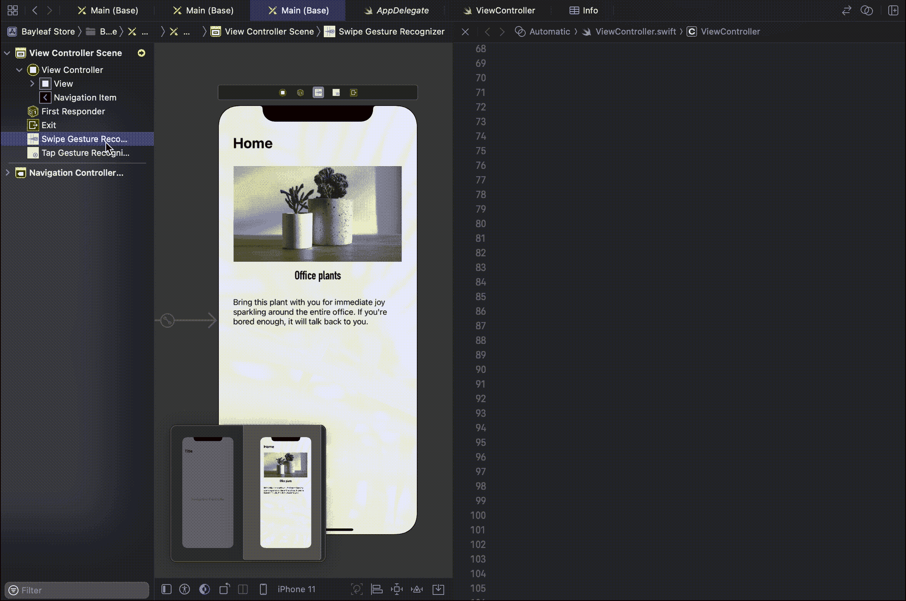

其次，将轻击手势识别器连接到视图控制器，以创建关闭侧边菜单的动作。

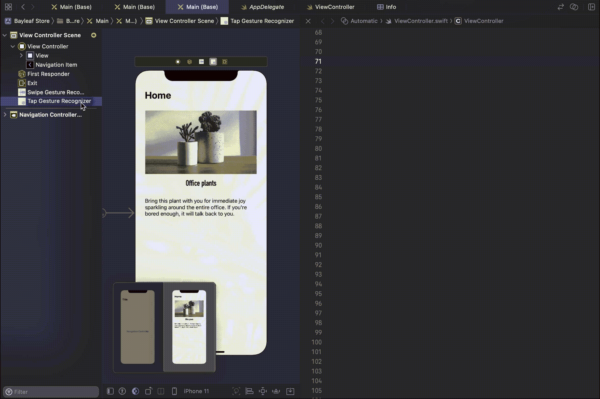

快好了！

我们的最后一步:当`menu`属性设置为`false`时，每当用户向右滑动时，我们的滑动手势识别器动作应该被触发，这意味着菜单还没有显示。当这种情况发生时，我们的`showMenu()`函数将执行，我们的`menu`属性将被设置为 *true* 。

相反，当我们的用户在菜单显示时点击视图，我们的点击手势识别器将触发一个动作来执行我们的`hideMenu()`功能，并将我们的`menu`属性设置回 *false* 。

我们都完成了！现在构建您的项目并进行测试:


你可以在 [GitHub](https://github.com/Margels/swift-side-menu) 上下载完整代码！

你喜欢这个教程吗？它和你的项目合作得好吗？感谢阅读。

```
**Want to Connect?**Follow me on…
❤️ [YouTube](https://www.youtube.com/channel/UC5hqYiHxie458KSO1PAnA8Q)
💖 [Dribbble](https://dribbble.com/margelss)
💜 [Instagram](https://www.instagram.com/itsmargels/)
💙 [Ko-Fi](https://ko-fi.com/margelss)
🖤 [GitHub](https://github.com/Margels)
```