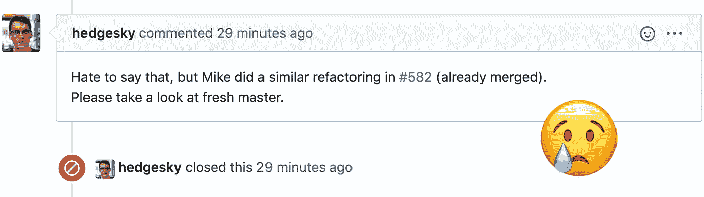
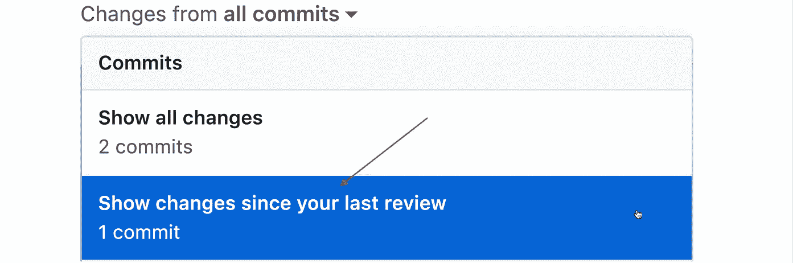
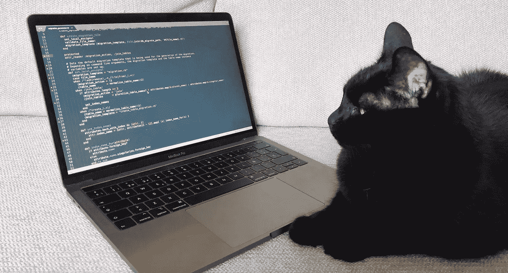

# 如何提出完美的拉动式请求

> 原文：<https://betterprogramming.pub/how-to-make-a-perfect-pull-request-3578fb4c112>

## 完美的代码是不够的。帮助人们复习它

由 [chuttersnap](https://unsplash.com/@chuttersnap?utm_source=unsplash&utm_medium=referral&utm_content=creditCopyText) 在 [Unsplash](/s/photos/future?utm_source=unsplash&utm_medium=referral&utm_content=creditCopyText) 上拍摄

我决定提高团队的绩效，第一步是找到瓶颈。

事实证明，编码速度不是限制因素——代码审查才是。因此，为了加快审查速度，我比较了两种类型的拉式请求:

*   那些收到很少评论并很快被合并的网站。
*   那些得到很多评论并需要几轮审核的。

以下是结果:九种让拉取请求更容易审核的方法。

# 1.添加“为什么”代码注释

当你写一个新的特性时，你有很多关于它的信息。需求、第三方系统的限制、与遗留代码库的交互——您编写代码时会考虑所有这些因素。然而，当有人阅读该代码时，他们没有上下文，所以他们会问“它为什么在这里？”以及“你为什么选择这种方法？”。

通过添加解释性注释，提前给他们“为什么”的答案。

有些人宣扬评论是有害的，应该避免，我不同意这种观点。

有不同类型的评论。那些描述代码做什么的确实是多余的。提取一个具有精心挑选的名称的方法可以消除它们。

另一方面，当你解释为什么用一种特殊的方式编写代码时，你给了读者额外的信息。这些评论提高了认识水平，理想情况下达到与作者相同的水平。他们帮助人们理解代码。

我通常在里面放一个类存在的理由，相关资源的链接，或者一些历史背景。

# 2.让你的 PRs 变小

这是一项如此强大的技术，以至于 Google 甚至创建了一篇单独的文章[,介绍小型拉取请求的好处。以下是我最喜欢的四个。
小型 PRs 包括:](https://google.github.io/eng-practices/review/developer/small-cls.html)

*   复习得更彻底了。
*   复习得更快。
*   更容易合并(频繁的合并导致更少的冲突)。
*   如果被拒绝，浪费的工作会更少。

以下是一些使制作小型 PRs 更容易的方法:

*   将重构提取到一个单独的 PR。
*   将大功能分割成小部分(即使它们不是面向用户的)。
*   学习一些 git 技巧是有帮助的。让`git add --patch`和`git rebase --interactive`成为你的朋友。
*   对于长期运行的特性分支，将该分支设置为您的 PRs 的目标，而不是`master`:

# 3.做一个清晰的描述

PR 的描述为审查者提供了任务的初始背景。包括:

*   票证的链接。
*   已经完成的工作的总结(如果从 PR 的标题看不明显的话)。
*   相关拉请求的链接(例如，另一个服务中的相关变更)。

如果你认为理解代码需要一些信息，不要把它放在公关的描述中。相反，做一个代码注释:它们更突出，会帮助未来的读者。

# 4.注释您自己的拉动式请求

为某些变更(例如删除和重构)添加解释性代码注释是没有意义的。考虑对您自己的拉请求进行注释，以便为审阅者提供额外的上下文。

# 5.在实现整个特性之前，先讨论整体方法

这是一个巨大的时间节省。当你准备开始一个更大的重构或特性时，事先和同事讨论你的方法。与几个开发伙伴聊天，解释任务和你的想法。他们可能会赞同你的方法，或者推荐一个更好的方法。

很多次我都面临缺乏初步协调的情况，导致几天工作的浪费。想象一下，你连续做了五天的事情，却听到“对不起，但我们实际上不需要那个，因为…”。

让自己免于失望。尽早获得反馈。

# 6.在创建 PR 之前，重新基于新的母版

这有几个好处:

*   测试可能在您的本地分支中通过，但在应用最新更新时会失败。
*   您将能够使用最近添加的功能(例如，一个新的实用程序类)。
*   如果审阅者没有发现最近的更改，他们可能会感到困惑。

比起合并，我更喜欢 rebases，因为 rebases 的分支只包含相关的提交。

# 7.快速回复评论

通常，处理评审意见需要一些时间。修复一个错别字，添加一个缺失的测试用例，重命名一个方法。如果你做得很快，你的同事就不必花太多时间去记住公关的内容。更少的合并时间意味着更快乐的同事，这意味着更多的利润！

这种方法的缺点是增加了上下文切换的次数。一个变通的办法是使用[番茄工作法](https://en.wikipedia.org/wiki/Pomodoro_Technique):每 25 分钟工作一次，中间有短暂的休息。这项技术的主要目标是变得更专注、更有效率、更健康、更少疲劳。但是也有一个好的副作用:在休息之后，上下文切换会更自然地发生。它们不会消失，但它们的负面破坏性作用会大大降低。

# 8.不要修改已审核的提交—发送新的提交

在单独的提交中处理评审意见，而不是修改或压缩您的更改。这使得审阅者更容易检查自上次审阅以来发生了什么变化:

# 9.感谢评论者的建议

深入理解他人的变化并提出有用的建议[需要付出巨大的努力](https://medium.com/swlh/a-code-review-your-colleagues-would-thank-you-for-b569fea0e3e1)——欣赏这一事实并与他人交流。

记住:代码变更是短暂的——与队友的关系才是最重要的。

我的猫 Ryzhik 在紧张的复习后累了。我用一盘他最喜欢的食物来感谢他

名单到此为止。总结一下:

*通过减少花在代码评审上的时间来提高团队的绩效。将这些建议应用到你的下一个拉动请求中，你很可能会立即得到积极的结果。*

如果你喜欢这篇文章，你可能想看看我最近写的另一篇:[你的同事会感谢你的代码评审:更好的代码评审的 11 个技巧。](https://medium.com/swlh/a-code-review-your-colleagues-would-thank-you-for-b569fea0e3e1)

资源:

*   [小 CLs](https://google.github.io/eng-practices/review/developer/small-cls.html) 。谷歌关于小拉请求好处的文章。
*   [番茄 _ 技术](https://en.wikipedia.org/wiki/Pomodoro_Technique)。时间管理技巧:将工作分成由休息时间隔开的间隔。