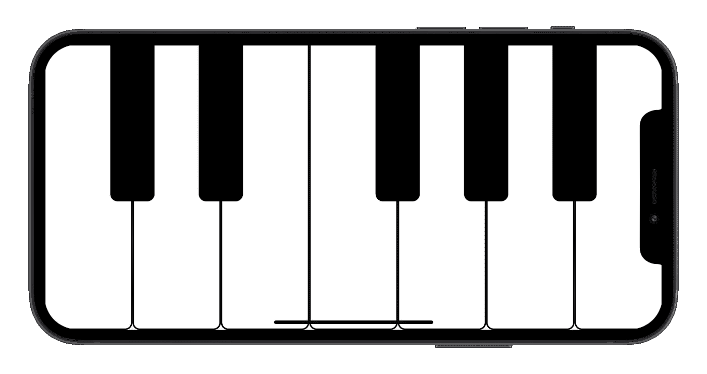

# 如何在 Flutter 中制作一个钢琴 App

> 原文：<https://betterprogramming.pub/how-to-make-a-piano-app-in-flutter-8989d989056>

## 探索 MIDI 和音乐制作之美

从我们出生的那一刻起，直到我们变老，音乐一直围绕着我们。它是人类的通用语言。

但是我们中的许多人没有一种奇特的乐器或天生的嗓音。我们被限制在只能用别人的感受来点击，而不能通过音乐来表达自己的感受。我们觉得创造出比简单的脚敲拍子更多的东西是令人生畏的。

事实上，制作音乐比看起来容易。你甚至不需要有一个音乐的耳朵来开始。

在本教程中，您将学习如何创建自己的虚拟仪器。
我们的目标不仅是创造它，还要了解它是如何工作的。

# 什么是 MIDI？

MIDI 代表“乐器数字接口”，是一个允许电子乐器和计算机相互发送指令的系统。

既然我们是程序员，我们可以把 MIDI 看作一种简化的编程语言，只有`NOTE ON` 和`NOTE OFF`语句。

## MIDI 信息的结构

MIDI 信息是一个普通的三字节二进制数。

第一个字节代表以下信息:

*   MIDI 信息类型:`NOTE ON` ( `1001`)或`NOTE OFF` ( `1000`)。
*   MIDI 通道:`0CCC`，其中`CCC`为二进制数，范围从`0`到`15`。

第二个字节指定弹奏音符的音高，范围从`0`到`127` ( `0PPP PPPP`)。

最后一个字节表示弹奏的音符的力度(即音符的响度)。范围从`0`到`127` ( `0VVV VVVV`)。

例如，如果您要在 0 声道上演奏一个中等音量的 C4 音符，您必须发送以下消息:`1001`(音符开)`0000` (0 声道)`0011 1100` (60 音高)`0101 0000` (80 力度)。

# 钢琴应用程序

现在你已经看到了 MIDI 是如何工作的，让我们将这些知识付诸实践。

为了简单起见，我们的应用程序将只显示一个八度音程(七个白音和五个黑音)，但您可以根据自己的喜好自由定制。

## 1.创建键盘布局

键盘最基本的元素是钢琴键，所以让我们创建一个名为`PianoKey`的简单小部件。

这里的`midiNote`对应于相关 MIDI 信息的`pitch`。

您可以将此 widget 用于白键和黑键，因为它们的功能是相同的，只是音高不同。

现在你有了基本的积木，是时候组装你的钢琴了。让我们创建一个有状态的`Piano`小部件，您可以在其中放置我们的钢琴键。

由于一个八度包含 12 个音符，`octaveStartingNote`给出了`octaveNumber`八度中第一个 C 音符的索引。

[灵感声学](https://www.inspiredacoustics.com/en/MIDI_note_numbers_and_center_frequencies)列出了所有可能音符的代码。

在你的单八度钢琴中，你会有七个白键和五个黑键。因此，让我们创建`_buildWhiteKeys`和`_buildBlackKeys`方法，将这些键放在钢琴上。

如您所见，白键的代码非常简单。
你只是在为它们设置正确的 MIDI 音符时，将它们一个接一个地水平放置。

然而对于黑键，你也必须考虑它们之间的间距。

这是您最终的`Piano`小部件布局:

## 2.设置 MIDI 插件

你已经看到了什么是 MIDI 以及它是如何工作的。现在，你必须将这些知识付诸实践，并发出那些`NOTE ON`和`NOTE OFF`信息。

为此，您将使用 [flutter_midi](https://pub.dev/packages/flutter_midi) 插件。

将 flutter_midi 插件添加到您的`pubspec.yaml`后，在线搜索一个声音字体(`.sf2`)文件并将其添加到您的资源中。

现在，您已经准备好在您的`Piano`小部件中设置插件了。

## 3.将 MIDI 插件连接到钢琴

在您的`PianoKey`小部件中，您已经有了需要播放的 MIDI 音符。剩下的就是使用 MIDI 插件在按键时播放那个音符。

当按下该键时，必须发送`NOTE ON`消息。释放按键后，发送`NOTE OFF`消息。

不要忘记将`flutterMidi`从`Piano`小工具发送到`PianoKey`。

## 4.扩展到你喜欢的程度

应用程序现在已经完成。当你敲击琴键时，你可以听到扬声器中播放的音符。

通过扩展功能或改进用户界面，您可以发挥自己的想象力，让它变得更有趣。

例如，当按键被按下时，你可以在按键上添加一个录音按钮或者一个漂亮的阴影。

# 演示

# 结论

即使创作音乐的想法似乎令人生畏，但你已经看到它并不一定如此。在完成一个简短的教程后，你能够直接从智能手机扬声器中听到钢琴音符(或任何你选择作为`.sf2`文件的乐器)。

想象一下，如果你每天都在这上面投入时间，你还能取得什么成就。

如果你在学习本教程时遇到困难，给我留言，我会非常乐意帮助你。

如果您已经完成了本教程，并进一步扩展了应用程序，请在评论部分分享它。

下次见！