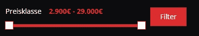
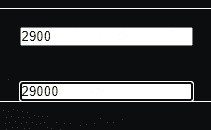
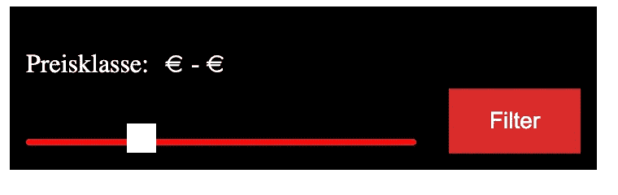
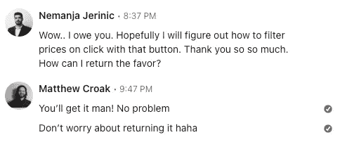

# 如何用 RC-Slider 制作一个范围组件

> 原文：<https://betterprogramming.pub/how-to-make-a-range-component-with-rc-slider-526651c412ca>

## 这一切都始于一个 LinkedIn DM


由[劳塔罗·安德烈亚尼](https://unsplash.com/@lautaroandreani?utm_source=unsplash&utm_medium=referral&utm_content=creditCopyText)在 [Unsplash](https://unsplash.com/s/photos/react?utm_source=unsplash&utm_medium=referral&utm_content=creditCopyText) 上拍摄的照片

tk 权限

最近，当有人在 LinkedIn 上给我发消息时，我正在做自己的事。Nemanja Jerinic 伸出手，说他看到了我在 [Stack Overflow](https://stackoverflow.com/questions/60379304/implementing-slider-with-range-binded-with-the-number-input/60379926#60379926) 上发布的关于如何动态更新 Ant Design Slider 上的值的答案。

Nemanja 正在用 rc-slider 做类似的工作，想看看他如何将自己的类与 slider 结合起来。他还在设置滑块的范围部分时遇到了麻烦，并且不能让两个手柄都可见。随后，滑块值没有正确设置。

下面是预期的结果。



这是没有 CSS 时的样子。



我有一些空闲时间，决定看看他的代码。

# CSS

原来他让他的班级使用 RC-slider；他只需要以不同的方式应用 CSS。我将下面的代码(粗体)添加到他的 CSS 中，它似乎满足了他的要求。

```
.rc-slider-rail { 
  position: absolute; 
  width: 100%; 
 **background-color:** [**#f50c0c**](https://www.linkedin.com/feed/hashtag/?keywords=%23f50c0c) **!important; 
  /* height: 100%; */** 
  border-radius: 6px; 
} .rc-slider-track {
  position: absolute;
  height: 100%;
  border-radius: 6px;
  background-color: var(--color-red) **!important**;
  opacity: 100% !important;
}.mka__range-alignment { 
  display: flex; 
  flex-direction: column; 
  justify-content: 
  flex-start; float: left; 
  **background-color: black; 
  padding: 10px;** 
} .mka__range-text { 
  display: flex; 
  gap: 10px; 
 ** color: white;** 
}
```

除了一些需要`!important`的地方和一些其他颜色和填充的变化，他的 CSS 非常漂亮！

最难的是反应。

# 的反应

他的 React 代码看起来非常简单，尽管行为并不像预期的那样。下面是他的组件的渲染方法。

下面是`handleChange`的样子。

```
handleChange = (sliderValues) => {
  this.setState({ sliderValues });
};
```

这是初始状态值。

```
state = { sliderValues: [2900, 29000] };
```

一切似乎都是对的，但出于某种原因，有两件事是行不通的。

首先，滑块上只有一个手柄，而实际上应该有两个。一个控制范围的下限；另一个控制高端。

> 通过创建一个[中型合作伙伴计划账户](https://matt-croak.medium.com/membership)和[订阅我的电子邮件](https://matt-croak.medium.com/subscribe)，获取我所有的最新内容。:)

第二，当我拖动手柄时，渲染值会发生这种情况…



正如您所看到的，应该是范围端点的值是空的。

为什么？

嗯，在查看`handleChange`中的`sliderValues`时，我注意到只有一个整数，而不是一个整数数组。所以状态被设置为一个整数，而不是一个整数数组。

这意味着试图访问`sliderValues[0]`和`sliderValues[1]`的代码是`undefined`。滑块没有被视为一个范围。

在看了[医生](https://slider-react-component.vercel.app/)和 [NPM](https://www.npmjs.com/package/rc-slider) 之后，我想不出哪里出了问题。为什么`Range`没有被当作一个系列？为什么没有办法得到两个把手？


嗯，在以前的版本中，简单地给`defaultValue`提供一个整数数组会告诉组件它应该作为一个范围。但现在，它只是没有削减它。出于某种原因，我在文件或 NPM 上找不到任何解决方案或参考资料。

但我在 Github 上找到了解决方案。

我偶然发现的这个 [Github 线程](https://github.com/react-component/slider/issues/825#issuecomment-1084416952)显示，就在 4 月份，人们还在困惑，试图修复我遇到的同样的问题。原来，对于 rc-slider 的版本 10，[解决方案](https://github.com/react-component/slider/issues/825#issuecomment-1084416952)是给组件添加一个新的道具:`range`。

参见下面更新的`Range`代码。

```
<Range  
  **range**
  onChange={this.handleChange}
  defaultValue={[2900, 29000]}
  min={2900}
  max={29000}
/>
```

通过包含这个属性(并且不将它的值指定为除了`true`之外的任何值)，一切都按预期工作。

下面是最终结果。


对于代码来说，困难的解决方案往往是如此简单。

他将需要添加更多的样式修正，使它看起来更像他正在做的，但这似乎大大减轻了负担。



这里的一切总是让我开心

他想回报这个人情，但老实说，受托在 LinkedIn 上帮助一个完全陌生的人，并找出一个错误的根源，这已经足够了。

虽然，当我告诉他我正在写一篇关于它的帖子时，他确实提出在社交媒体上分享它，这总是令人感激的(提示提示)。

亲爱的读者，如果你需要任何与代码相关的帮助，请随时在 LinkedIn 上给我发消息！我很乐意尽我所能提供帮助:)。


还有，一定要在 LinkedIn 上和 [Nemanja 联系！](https://www.linkedin.com/in/nemanjajerinic/)

> 这个项目的源代码可以在[这里](https://codesandbox.io/s/unruffled-lumiere-pt80w6)找到。

你有什么需要另一双眼睛盯着的代码吗？请在评论中告诉我！

[*升级您的免费 Medium 会员资格*](https://matt-croak.medium.com/membership) *并接收来自各种出版物上数千名作家的无限量无广告故事。这是一个附属链接，你的会员资格的一部分帮助我为我创造的内容获得回报。*

*您也可以通过电子邮件* [*订阅，当我发布新内容时，您会收到通知！*](https://matt-croak.medium.com/subscribe)

# 参考

[](https://www.linkedin.com/in/nemanjajerinic/) [## 波斯尼亚和黑塞哥维那塞尔维亚共和国多博伊大学

### 我一直对电脑很着迷，我的梦想是坐在笔记本电脑上一边喝咖啡，一边为小…

www.linkedin.com](https://www.linkedin.com/in/nemanjajerinic/) [](https://stackoverflow.com/questions/60379304/implementing-slider-with-range-binded-with-the-number-input/60379926#60379926) [## 实现范围与数字输入绑定的滑块

### 我修改了您确定输入的最大/最小值的方式，并添加了 ant 提供的范围属性…

stackoverflow.com](https://stackoverflow.com/questions/60379304/implementing-slider-with-range-binded-with-the-number-input/60379926#60379926) [](https://www.npmjs.com/package/rc-slider) [## rc 滑块

### React npm 的滑块 UI 组件开始，然后转到 http://localhost:8000 在线示例…

www.npmjs.com](https://www.npmjs.com/package/rc-slider)  [## 遥控滑块遥控滑块

### 编辑描述

slider-react-component . vercel . app](https://slider-react-component.vercel.app/) [](https://github.com/react-component/slider/issues/825#issuecomment-1084416952) [## 模块“rc-slider”没有导出的成员“Range”问题#825 反应组件/滑块

### 此时您不能执行该操作。您已使用另一个标签页或窗口登录。您已在另一个选项卡中注销，或者…

github.com](https://github.com/react-component/slider/issues/825#issuecomment-1084416952)