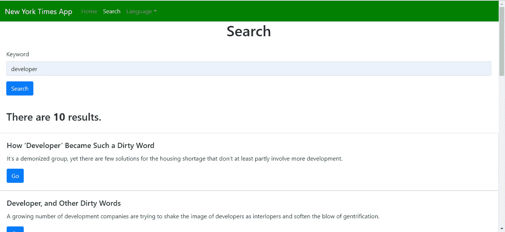
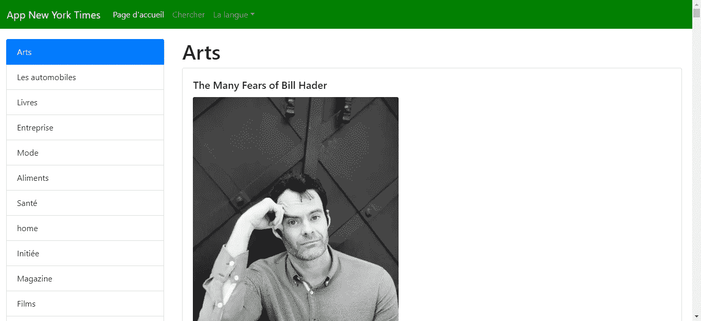

# 如何用 React 和 Bootstrap 制作响应式 App

> 原文：<https://betterprogramming.pub/how-to-make-a-responsive-app-with-react-and-bootstrap-938a22dac9d4>


图片由 [Taras Shypka](https://unsplash.com/@bugsster) 在 [Unsplash](https://unsplash.com/photos/iFSvn82XfGo) 上拍摄

React 是构建交互式 web 应用程序的一个很好的框架。它附带了一套最基本的功能。它可以在您更新数据时呈现您的页面，并为您轻松编写代码提供方便的语法。我们可以通过 Bootstrap 等 UI 框架让我们的应用程序对移动设备友好。

Bootstrap 附带了 CSS 类，我们可以将它们应用于我们的元素，以选择性地在不同的屏幕宽度上显示它们，这给了我们在处理不同屏幕大小的显示项目时很大的灵活性。

在这个故事中，我们将构建一个应用程序，它使用具有多语言功能的纽约时报 API。您可以在应用程序中查看英语或法语的静态文本。该应用程序可以从不同的部分获取新闻，也可以进行搜索。

在构建应用程序之前，您需要在[https://developer.nytimes.com/](https://developer.nytimes.com/)注册一个 API 密钥。

为了开始构建应用程序，我们使用 Create React App 命令行实用程序来生成搭建代码。为了使用它，我们运行`npx create-react-app nyt-app`在`nyt-app`文件夹中创建代码。

之后，我们需要安装一些库。我们需要 Axios HTTP 客户端、将对象转换为查询字符串的库、使一切看起来更好的引导库，以及使用 Formik 和 Yup 轻松路由和创建表单的 React Router。

对于翻译和本地化，我们使用 React-i18next 库将我们的文本翻译成英语和法语。为了安装这些库，我们运行`npm i axios bootstrap formik i18next i18next-browser-languagedetector i18next-xhr-backend querystring react-bootstrap react-i18next react-router-dom yup`。

现在我们已经安装了所有的库，我们可以开始编写代码了。为了简单起见，我们将所有内容都放在`src`文件夹中。我们从修改`App.js`开始。我们将现有代码替换为:

```
import React from "react";
import { Router, Route, Link } from "react-router-dom";
import HomePage from "./HomePage";
import TopBar from "./TopBar";
import { createBrowserHistory as createHistory } from "history";
import "./App.css";
import SearchPage from "./SearchPage";
import { useTranslation } from "react-i18next";
import { useState, useEffect } from "react";
const history = createHistory();function App() {
  const { t, i18n } = useTranslation();
  const [initialized, setInitialized] = useState(false);
  const changeLanguage = lng => {
    i18n.changeLanguage(lng);
  };useEffect(() => {
    if (!initialized) {
      changeLanguage(localStorage.getItem("language") || "en");
      setInitialized(true);
    }
  });return (
    <div className="App">
      <Router history={history}>
        <TopBar />
        <Route path="/" exact component={HomePage} />
        <Route path="/search" exact component={SearchPage} />
      </Router>
    </div>
  );
}export default App;
```

这是我们应用程序的根组件，也是应用程序首次加载时加载的组件。

我们使用`useTranslation`函数，`react-i18next`库返回一个带有`t`属性和`i18n`属性的对象。这里，我们将返回对象的属性析构到它自己的变量中。

我们将使用带有翻译键的`t`，根据语言设置获取英语或法语文本。在这个文件中，我们使用`i18n`函数通过提供的`i18n.changeLanguage`函数来设置语言。我们还从提供的本地存储中设置语言，以便在每次刷新后保留所选的语言。

我们还在这里为我们的页面添加了路由，供 React 路由器使用。

在`App.css`中，我们输入:

```
.center {
  text-align: center;
}
```

这会使文本居中。

接下来，我们制作主页。我们创建`HomePage.js`，在文件中，我们放入:

```
import React from "react";
import { useState, useEffect } from "react";
import Form from "react-bootstrap/Form";
import ListGroup from "react-bootstrap/ListGroup";
import Card from "react-bootstrap/Card";
import Button from "react-bootstrap/Button";
import { getArticles } from "./requests";
import { useTranslation } from "react-i18next";
import "./HomePage.css";const sections = `arts, automobiles, books, business, fashion, food, health,
home, insider, magazine, movies, national, nyregion, obituaries,
opinion, politics, realestate, science, sports, sundayreview,
technology, theater, tmagazine, travel, upshot, world`
  .replace(/ /g, "")
  .split(",");function HomePage() {
  const [selectedSection, setSelectedSection] = useState("arts");
  const [articles, setArticles] = useState([]);
  const [initialized, setInitialized] = useState(false);
  const { t, i18n } = useTranslation(); const load = async section => {
    setSelectedSection(section);
    const response = await getArticles(section);
    setArticles(response.data.results || []);
  }; const loadArticles = async e => {
    if (!e || !e.target) {
      return;
    }
    setSelectedSection(e.target.value);
    load(e.target.value);
  }; const initializeArticles = () => {
    load(selectedSection);
    setInitialized(true);
  }; useEffect(() => {
    if (!initialized) {
      initializeArticles();
    }
  }); return (
    <div className="HomePage">
      <div className="col-12">
        <div className="row">
          <div className="col-md-3 d-none d-md-block d-lg-block d-xl-block">
            <ListGroup className="sections">
              {sections.map(s => (
                <ListGroup.Item
                  key={s}
                  className="list-group-item"
                  active={s == selectedSection}
                >
                  <a
                    className="link"
                    onClick={() => {
                      load(s);
                    }}
                  >
                    {t(s)}
                  </a>
                </ListGroup.Item>
              ))}
            </ListGroup>
          </div>
          <div className="col right">
            <Form className="d-sm-block d-md-none d-lg-none d-xl-none">
              <Form.Group controlId="section">
                <Form.Label>{t("Section")}</Form.Label>
                <Form.Control
                  as="select"
                  onChange={loadArticles}
                  value={selectedSection}
                >
                  {sections.map(s => (
                    <option key={s} value={s}>{t(s)}</option>
                  ))}
                </Form.Control>
              </Form.Group>
            </Form>
            <h1>{t(selectedSection)}</h1>
            {articles.map((a, i) => (
              <Card key={i}>
                <Card.Body>
                  <Card.Title>{a.title}</Card.Title>
                  <Card.Img
                    variant="top"
                    className="image"
                    src={
                      Array.isArray(a.multimedia) &&
                      a.multimedia[a.multimedia.length - 1]
                        ? a.multimedia[a.multimedia.length - 1].url
                        : null
                    }
                  />
                  <Card.Text>{a.abstract}</Card.Text>
                  <Button
                    variant="primary"
                    onClick={() => (window.location.href = a.url)}
                  >
                    {t("Go")}
                  </Button>
                </Card.Body>
              </Card>
            ))}
          </div>
        </div>
      </div>
    </div>
  );
}export default HomePage;
```

在这个文件中，我们显示了一个响应式布局，当屏幕较宽时，左边有一个栏，如果没有，右边有一个下拉菜单。

当我们在所选部分显示项目时，我们从左窗格或下拉列表中进行选择。

为了显示项目，我们使用 React Bootstrap 中的 Card 小部件。

我们还使用由`react-i18next`提供的`t`函数从我们将要创建的翻译文件中加载我们的文本。

为了加载最初的文章条目，我们在`useEffect`函数的回调中运行一个函数，以显示从*纽约时报* API 加载一次条目。我们需要`initialized`标志，这样回调函数就不会在每次重新渲染时加载。在下拉列表中，我们添加了每当选择发生变化时加载文章的代码。

为了做出响应性布局，我们使用 Bootstrap 的显示实用程序根据屏幕大小显示左侧窗格和下拉菜单。通过添加`d-none d-md-block d-lg-block d-xl-block`类，左窗格仅在较宽的屏幕上显示，通过添加`d-sm-block d-md-none d-lg-none d-xl-none`类，下拉菜单在较窄的屏幕上显示。

这里列出了`sm`、`md`、`lg`和`xl`的断点[。`sm`小于 576px 宽，`md`为 576px 到 767px 宽，`lg`为 768px 到 991px 宽，`xl`为 992 到 1200px 宽。](https://getbootstrap.com/docs/4.3/layout/overview/#responsive-breakpoints)

[引导文档](https://getbootstrap.com/docs/4.3/utilities/display/)列出了不同类型屏幕显示和隐藏的所有类。

然后我们创建`HomePage.css`，添加:

```
.link {
  cursor: pointer;
}.right {
  padding: 20px;
}.image {
  max-width: 400px;
  text-align: center;
}.sections {
    margin-top: 20px;
}
```

我们更改了 Go 按钮的光标样式，并在右窗格中添加了一些填充。

接下来，我们创建一个文件来加载翻译和设置默认语言。创建一个名为`i18n.js`的文件，并添加:

```
import i18n from "i18next";
import { initReactI18next } from "react-i18next";
import { resources } from "./translations";
import Backend from "i18next-xhr-backend";
import LanguageDetector from "i18next-browser-languagedetector";i18n
  .use(Backend)
  .use(LanguageDetector)
  .use(initReactI18next)
  .init({
    resources,
    lng: "en",
    fallbackLng: "en",
    debug: true,interpolation: {
      escapeValue: false,
    },
  });export default i18n;
```

在这个文件中，我们从一个文件中加载翻译，并将默认语言设置为英语。由于`react-i18next`逃避一切，我们可以设置`escapeValue`为`interpolation`的`false`，因为它是多余的。

我们需要一个文件来存放发出 HTTP 请求的代码。为此，我们创建一个名为`requests.js`的文件，并添加:

```
const APIURL = "[https://api.nytimes.com/svc](https://api.nytimes.com/svc)";
const axios = require("axios");
const querystring = require("querystring");export const search = data => {
  Object.keys(data).forEach(key => {
    data["api-key"] = process.env.REACT_APP_APIKEY;
    if (!data[key]) {
      delete data[key];
    }
  });
  return axios.get(
    `${APIURL}/search/v2/articlesearch.json?${querystring.encode(data)}`
  );
};
export const getArticles = section =>
  axios.get(
    `${APIURL}/topstories/v2/${section}.json?api-key=${process.env.REACT_APP_APIKEY}`
  );
```

我们从位于根文件夹的`.env`文件中的环境变量提供的`process.env.REACT_APP_APIKEY`变量中加载 API 密钥。你必须自己创造它。在那里，放上:

```
REACT_APP_APIKEY='you New York Times API key'
```

用你在*纽约时报* API 网站注册后得到的 API key 替换右边的值。

接下来，我们创建搜索页面。创建一个名为`SearchPage.js`的文件，并添加:

```
import React from "react";
import { useState } from "react";
import { useTranslation } from "react-i18next";
import "./SearchPage.css";
import * as yup from "yup";
import { Formik } from "formik";
import Form from "react-bootstrap/Form";
import Col from "react-bootstrap/Col";
import Button from "react-bootstrap/Button";
import { Trans } from "react-i18next";
import { search } from "./requests";
import Card from "react-bootstrap/Card";const schema = yup.object({
  keyword: yup.string().required("Keyword is required"),
});function SearchPage() {
  const { t } = useTranslation();
  const [articles, setArticles] = useState([]);
  const [count, setCount] = useState(0);const handleSubmit = async e => {
    const response = await search({ q: e.keyword });
    setArticles(response.data.response.docs || []);
  };return (
    <div className="SearchPage">
      <h1 className="center">{t("Search")}</h1>
      <Formik validationSchema={schema} onSubmit={handleSubmit}>
        {({
          handleSubmit,
          handleChange,
          handleBlur,
          values,
          touched,
          isInvalid,
          errors,
        }) => (
          <Form noValidate onSubmit={handleSubmit} className="form">
            <Form.Row>
              <Form.Group as={Col} md="12" controlId="keyword">
                <Form.Label>{t("Keyword")}</Form.Label>
                <Form.Control
                  type="text"
                  name="keyword"
                  placeholder={t("Keyword")}
                  value={values.keyword || ""}
                  onChange={handleChange}
                  isInvalid={touched.keyword && errors.keyword}
                />
                <Form.Control.Feedback type="invalid">
                  {errors.keyword}
                </Form.Control.Feedback>
              </Form.Group>
            </Form.Row>
            <Button type="submit" style={{ marginRight: "10px" }}>
              {t("Search")}
            </Button>
          </Form>
        )}
      </Formik>
      <h3 className="form">
        <Trans i18nKey="numResults" count={articles.length}>
          There are <strong>{{ count }}</strong> results.
        </Trans>
      </h3>
      {articles.map((a, i) => (
        <Card key={i}>
          <Card.Body>
            <Card.Title>{a.headline.main}</Card.Title>
            <Card.Text>{a.abstract}</Card.Text>
            <Button
              variant="primary"
              onClick={() => (window.location.href = a.web_url)}
            >
              {t("Go")}
            </Button>
          </Card.Body>
        </Card>
      ))}
    </div>
  );
}export default SearchPage;
```

这是我们创建一个搜索表单的地方，其中包含用于搜索 API 的关键字字段。当用户点击搜索时，它将使用关键字搜索*纽约时报* API 中的文章。

我们使用 Formik 来处理表单值的更改，并使`e`对象中的值在`handleSubmit`参数中可供我们使用。我们对按钮、表单元素和卡片使用 React Bootstrap。点击 Search 后，`articles`变量被设置并加载商品的卡片。

我们使用由`react-i18next`提供的`Trans`组件来翻译包含一些动态组件的文本，就像上面的例子一样。我们在文本中有一个变量来表示结果的数量。每当你有这样的东西时，你就把它包装在`Trans`组件中，然后像上面的例子一样通过把变量作为道具传入来传入变量。然后你将在文本中显示变量在`Trans`标签之间。

我们还将通过将`“There are <1>{{count}}</1> results.”`放在英文翻译中，将`“Il y a <1>{{count}}</1> résultats.”`放在法文翻译中，使插值在翻译中可用。

`1`标签对应于`strong`标签。在这种情况下，数量是任意的。只要模式与组件的模式一致，它就能工作。所以在这种情况下，`strong`标记应该总是翻译字符串中的`1`。

要添加上面提到的翻译和其他翻译，创建一个名为`translations.js`的文件，并添加:

```
const resources = {
  en: {
    translation: {
      "New York Times App": "New York Times App",
      arts: "Arts",
      automobiles: "Automobiles",
      books: "Books",
      business: "Business",
      fashion: "Fashion",
      food: "Food",
      health: "Health",
      home: "Home",
      insider: "Inside",
      magazine: "Magazine",
      movies: "Movies",
      national: "National",
      nyregion: "New York Region",
      obituaries: "Obituaries",
      opinion: "Opinion",
      politics: "Politics",
      realestate: "Real Estate",
      science: "Science",
      sports: "Sports",
      sundayreview: "Sunday Review",
      technology: "Technology",
      theater: "Theater",
      tmagazine: "T Magazine",
      travel: "Travel",
      upshot: "Upshot",
      world: "World",
      Search: "Search",
      numResults: "There are <1>{{count}}</1> results.",
      Home: "Home",
      Search: "Search",
      Language: "Language",
      English: "English",
      French: "French",
      Keyword: "Keyword",
      Go: "Go",
      Section: "Section",
    },
  },
  fr: {
    translation: {
      "New York Times App": "App New York Times",
      arts: "Arts",
      automobiles: "Les automobiles",
      books: "Livres",
      business: "Entreprise",
      fashion: "Mode",
      food: "Aliments",
      health: "Santé",
      home: "Maison",
      insider: "Initiée",
      magazine: "Magazine",
      movies: "Films",
      national: "Nationale",
      nyregion: "La région de new york",
      obituaries: "Notices nécrologiques",
      opinion: "Opinion",
      politics: "Politique",
      realestate: "Immobilier",
      science: "Science",
      sports: "Des sports",
      sundayreview: "Avis dimanche",
      technology: "La technologie",
      theater: "Théâtre",
      tmagazine: "Magazine T",
      travel: "Voyage",
      upshot: "Résultat",
      world: "Monde",
      Search: "Search",
      numResults: "Il y a <1>{{count}}</1> résultats.",
      Home: "Page d'accueil",
      Search: "Chercher",
      Language: "La langue",
      English: "Anglais",
      French: "Français",
      Keyword: "Mot-clé",
      Go: "Aller",
      Section: "Section",
    },
  },
};export { resources };
```

在这个文件中，我们有上面提到的静态文本翻译和插入文本。

最后，我们通过创建`TopBar.js`并添加:

```
import React from "react";
import Navbar from "react-bootstrap/Navbar";
import Nav from "react-bootstrap/Nav";
import NavDropdown from "react-bootstrap/NavDropdown";
import "./TopBar.css";
import { withRouter } from "react-router-dom";
import { useTranslation } from "react-i18next";function TopBar({ location }) {
  const { pathname } = location;
  const { t, i18n } = useTranslation();
  const changeLanguage = lng => {
    localStorage.setItem("language", lng);
    i18n.changeLanguage(lng);
  };return (
    <Navbar bg="primary" expand="lg" variant="dark">
      <Navbar.Brand href="#home">{t("New York Times App")}</Navbar.Brand>
      <Navbar.Toggle aria-controls="basic-navbar-nav" />
      <Navbar.Collapse id="basic-navbar-nav">
        <Nav className="mr-auto">
          <Nav.Link href="/" active={pathname == "/"}>
            {t("Home")}
          </Nav.Link>
          <Nav.Link href="/search" active={pathname.includes("/search")}>
            {t("Search")}
          </Nav.Link>
          <NavDropdown title={t("Language")} id="basic-nav-dropdown">
            <NavDropdown.Item onClick={() => changeLanguage("en")}>
              {t("English")}
            </NavDropdown.Item>
            <NavDropdown.Item onClick={() => changeLanguage("fr")}>
              {t("French")}
            </NavDropdown.Item>
          </NavDropdown>
        </Nav>
      </Navbar.Collapse>
    </Navbar>
  );
}export default withRouter(TopBar);
```

我们使用 React Boostrap 提供的`NavBar`组件，并添加一个下拉菜单供用户选择语言，当他们点击那些项目时，他们可以设置语言。

请注意，我们用`withRouter`函数包装了`TopBar`组件，因此我们用`location`属性获得了当前路线的值，并通过设置`Nav.Link`组件中的`active`属性来使用它来设置哪个链接是活动的。

最后，我们用以下代码替换`index.html`中的现有代码:

```
<!DOCTYPE html>
<html lang="en">
  <head>
    <meta charset="utf-8" />
    <link rel="shortcut icon" href="%PUBLIC_URL%/favicon.ico" />
    <meta name="viewport" content="width=device-width, initial-scale=1" />
    <meta name="theme-color" content="#000000" />
    <meta
      name="description"
      content="Web site created using create-react-app"
    />
    <link rel="apple-touch-icon" href="logo192.png" />
    <!--
      manifest.json provides metadata used when your web app is installed on a
      user's mobile device or desktop. See [https://developers.google.com/web/fundamentals/web-app-manifest/](https://developers.google.com/web/fundamentals/web-app-manifest/)
    -->
    <link rel="manifest" href="%PUBLIC_URL%/manifest.json" />
    <!--
      Notice the use of %PUBLIC_URL% in the tags above.
      It will be replaced with the URL of the `public` folder during the build.
      Only files inside the `public` folder can be referenced from the HTML.Unlike "/favicon.ico" or "favicon.ico", "%PUBLIC_URL%/favicon.ico" will
      work correctly both with client-side routing and a non-root public URL.
      Learn how to configure a non-root public URL by running `npm run build`.
    -->
    <title>React New York Times App</title>
    <link
      rel="stylesheet"
      href="[https://maxcdn.bootstrapcdn.com/bootstrap/4.3.1/css/bootstrap.min.css](https://maxcdn.bootstrapcdn.com/bootstrap/4.3.1/css/bootstrap.min.css)"
      integrity="sha384-ggOyR0iXCbMQv3Xipma34MD+dH/1fQ784/j6cY/iJTQUOhcWr7x9JvoRxT2MZw1T"
      crossorigin="anonymous"
    />
  </head>
  <body>
    <noscript>You need to enable JavaScript to run this app.</noscript>
    <div id="root"></div>
    <!--
      This HTML file is a template.
      If you open it directly in the browser, you will see an empty page.You can add webfonts, meta tags, or analytics to this file.
      The build step will place the bundled scripts into the <body> tag.To begin the development, run `npm start` or `yarn start`.
      To create a production bundle, use `npm run build` or `yarn build`.
    -->
  </body>
</html>
```

这将添加引导 CSS 并更改应用程序的标题。

所有工作完成后，当我们运行`npm start`时，我们得到:

