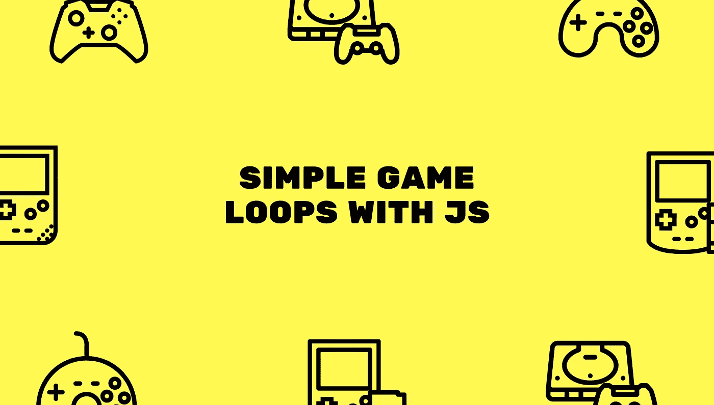
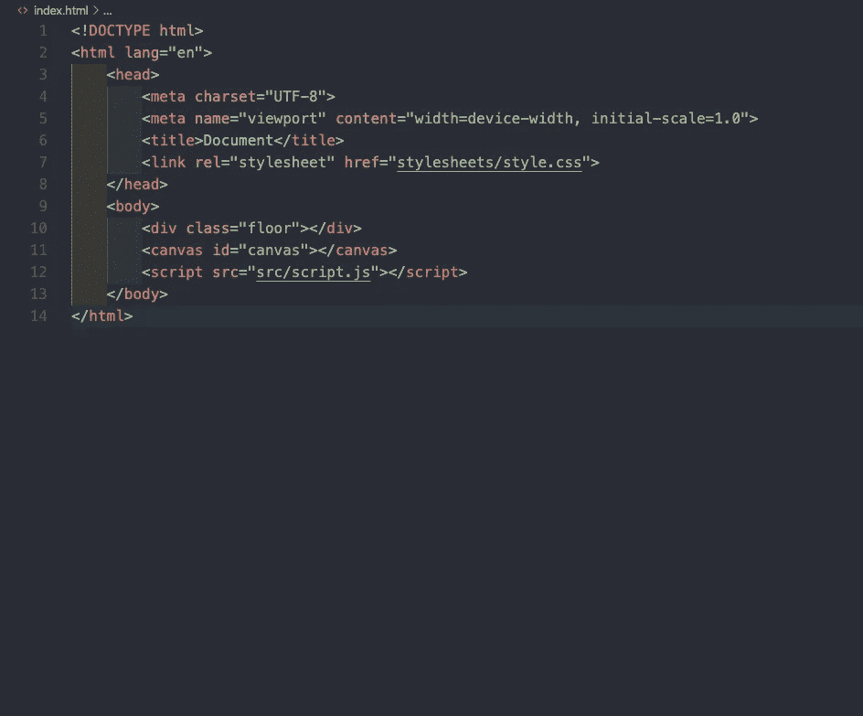
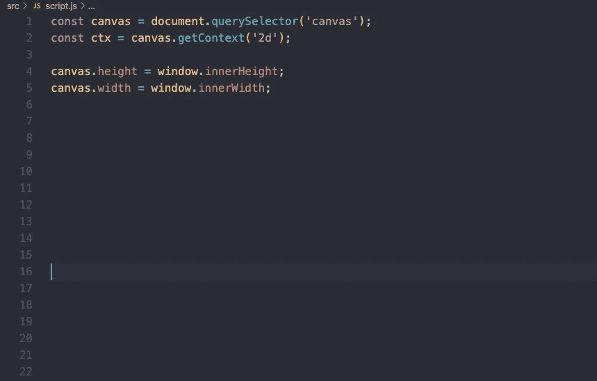
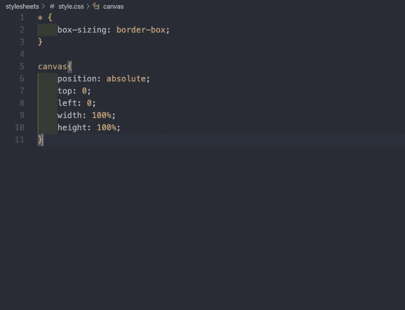
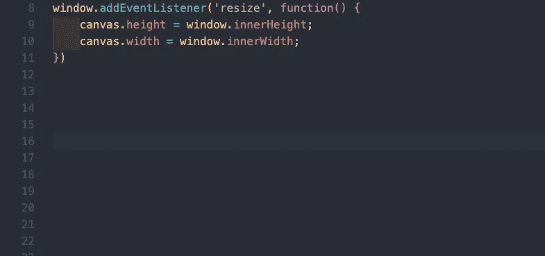
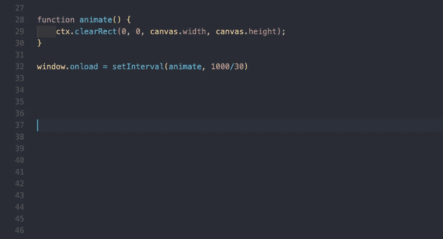

# 如何使用普通 JavaScript 制作一个简单的游戏循环

> 原文：<https://betterprogramming.pub/how-to-make-a-simple-game-loop-using-vanilla-javascript-f7f6360f68a2>

## 今天就创建你的第一个游戏

图片来源:作者

嘿大家好！今天我想谈谈如何只用普通的 JavaScript 创建一个简单的游戏循环。最近，我和我的朋友决定做一个小游戏项目来提高我们的 JS 技能，我们不得不重新启动几次，直到我们可以正常运行游戏。所以我决定为所有开始有点困难的初学游戏程序员写一个快速教程。

# 搭建你的画布

为了遵循本教程，您将需要设置三个文件。第一个是`index.html`文件，第二个是`script.js`文件，最后你需要一个`style.css`文件。

重要的事情先来。如果我们在做一个游戏，我们不可避免地会想在页面上画一些东西。最好的方法是在 HTML 中使用一种叫做`canvas`标签的东西。

`<canvas> id="canvas"></canvas>`

`canvas`标签只是使用 JavaScript 和 HTML 在屏幕上绘制图形的一种方式。为了在我们的新游戏中使用它，我们将把它添加到我们的 HTML 文件中，如下所示。

既然我们已经处理好了 HTML，我们将使用 JavaScript 来访问我们的`canvas`标签，并修改它。为此，我们将这样做:

我们在这里做的是将我们的`canvas`标签存储到一个名为“canvas”的变量中，然后我们将它的上下文设置为 2D，因为我们将在屏幕上绘制 2D 图形。之后，我们设置画布的高度和宽度等于窗口的高度和宽度。

在我们继续之前，让我们跳到我们的 CSS，并快速样式化我们的画布:

好了，快好了。希望我还没有失去你。我们要做的最后一件事是设置一个事件监听器，这样如果我们的用户最终调整了我们的屏幕，我们也可以调整我们的画布。我们会这样做:

# 让游戏循环

为了进行游戏循环，我们需要清空画布，并在游戏的每一帧重新绘制。这是因为为了让物体连续移动，我们必须在每一帧的新位置绘制它们，我们不希望之前绘制的精灵或形状停留在周围。所以我们将创建一个`animate`函数，它将清空我们每一帧的画布，就像这样:

那我们在这里做什么？首先，我们创建一个名为`animate`的函数来清空我们的画布。这基本上是我们的游戏循环，在这里你将结束绘制你的精灵到屏幕上。然后我们使用`clearRect`函数来完全擦除我们的画布。然后，当我们的窗口加载时，我们希望开始运行我们的游戏循环。

为此，我们调用`setInterval`函数，它接受两个参数。第一个是回调函数，这将是您希望它执行的函数。第二个是你希望它发射的时间间隔。时间间隔是以毫秒为单位的，所以我用 1000/30，这样我们的函数每秒运行 30 次。如果你以前玩过视频游戏，你可能听说过术语*每秒 30 帧*。这正是我们在这里所做的！

# 结论

仅此而已。你现在是一个真正的游戏开发者。恭喜你！现在你有一个简单的游戏循环，你可以在其中创建精灵，形状，平台和各种各样的酷东西。祝你好运，编程愉快。

# 来源

 [## HTML 标签

### 组织良好，易于理解的网站建设教程，有很多如何使用 HTML，CSS，JavaScript 的例子…

www.w3schools.com](https://www.w3schools.com/tags/tag_canvas.asp)