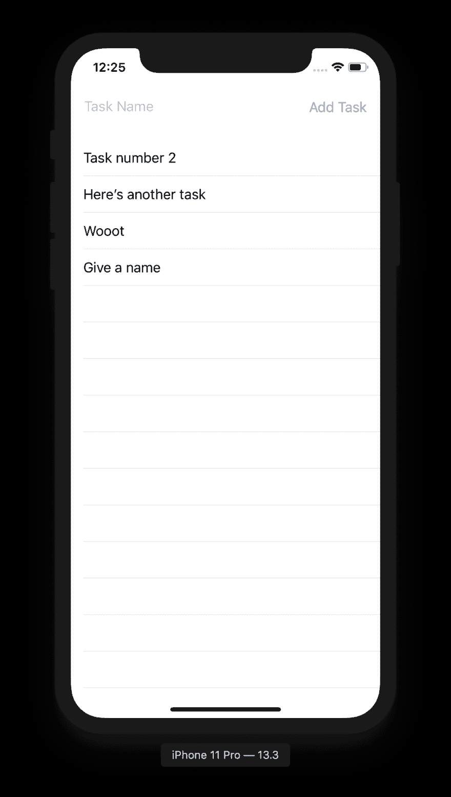
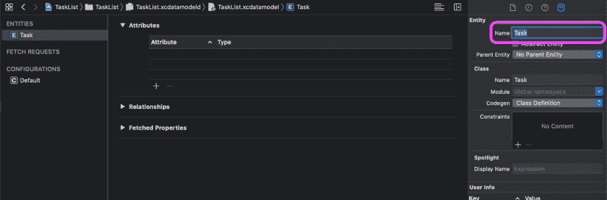
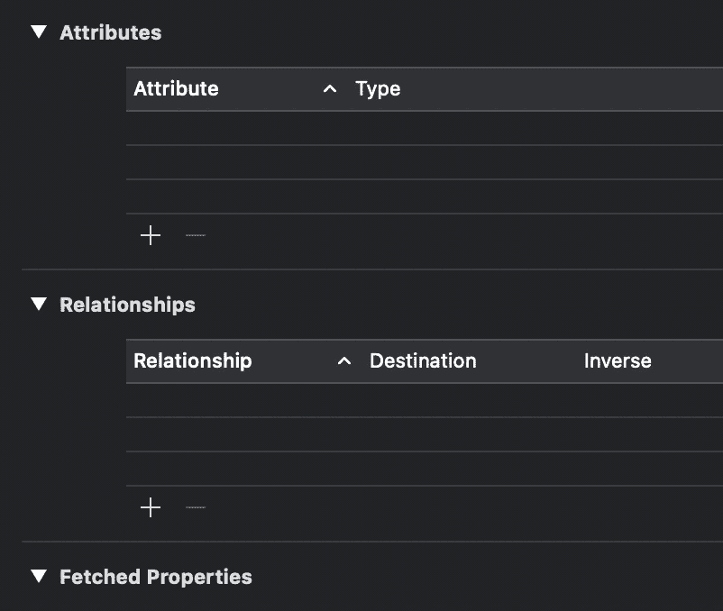
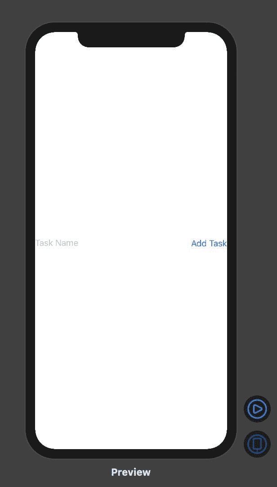
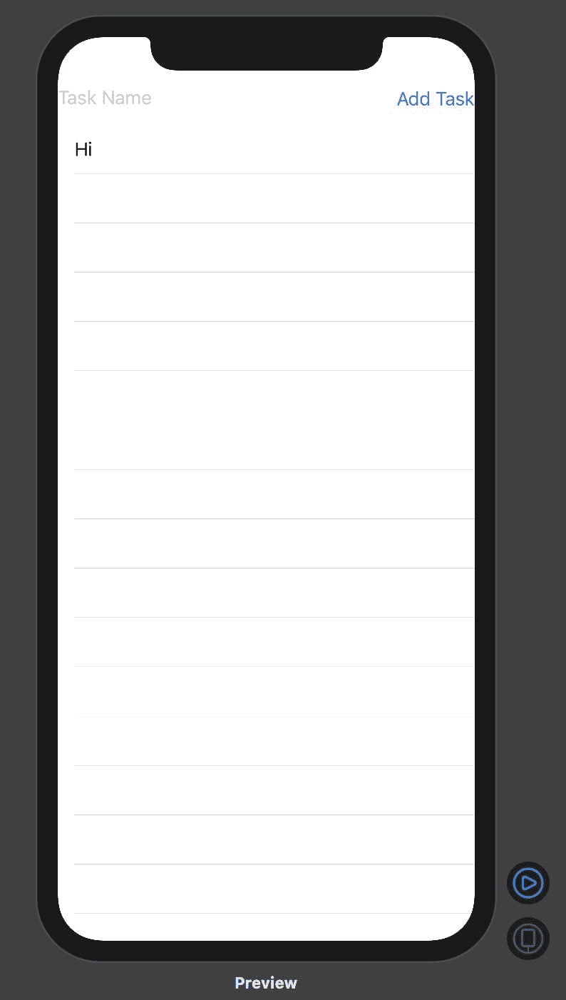
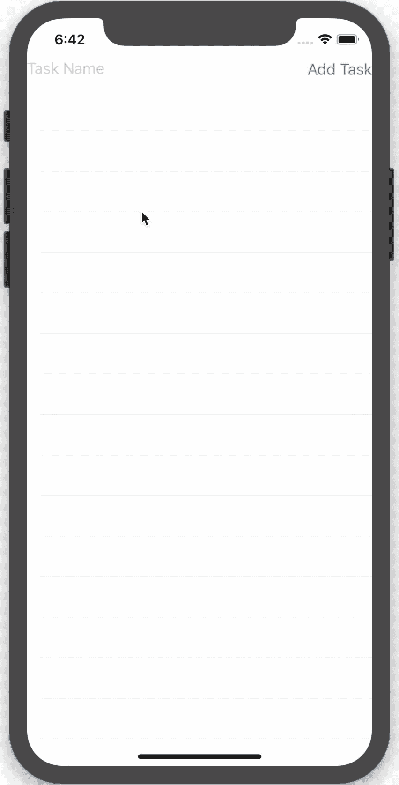

# 如何使用 SwiftUI 和核心数据制作任务列表

> 原文：<https://betterprogramming.pub/how-to-make-a-task-list-using-swiftui-and-core-data-a8ab6eaf0f58>

## 构建一个在核心数据中存储任务的任务列表应用程序


照片由[艾玛·马修斯数字内容制作](https://unsplash.com/@emmamatthews?utm_source=unsplash&utm_medium=referral&utm_content=creditCopyText)在 [Unsplash](https://unsplash.com/s/photos/to-do-list?utm_source=unsplash&utm_medium=referral&utm_content=creditCopyText) 拍摄

该应用程序将具有以下功能:

*   添加任务
*   完成任务
*   删除任务
*   如果应用程序关闭，则保留数据

这是完成后的应用程序的外观:



完成的 app 可以在这个 [GitHub repo](https://github.com/maeganjwilson/taskList) 上找到。

# 1.创建新的单页 iOS 应用程序

为单视图 iOS 应用程序创建新的 Xcode 项目。

选中 SwiftUI 框和使用核心数据框。

# 2.核心数据实体和属性

我们需要做的第一件事是向核心数据模型添加一个实体。为此，打开`ProjectName.xcdatamodeld`，其中`ProjectName`是您在步骤 1 中调用的项目，并单击窗口底部的 Add Entity。将新实体命名为`Task`。

下图高亮显示了检查器中要更改名称的位置。



## 2.1 向任务实体添加属性

接下来，我们需要`Task`实体拥有存储以下信息的属性:

*   `id`:用作每个任务的唯一标识符
*   `name`:用户将调用的任务
*   `isComplete`:定义任务是否完成
*   `dateAdded`:知道任务是什么时候添加的

要给`Task`添加属性，点击属性部分的+号，并给属性一个名称和类型。下面的 GIF 展示了如何做到这一点。



下表描述了每个属性以及与该属性关联的类型。

*   `id` : UUID
*   `name`:字符串
*   `isComplete`:布尔
*   `dateAdded`:日期

`ProjectName.xcdatamodeld`现在看起来应该如下图所示。


## 2.2 添加新的 Swift 文件

现在，我们正在添加一个新的 Swift 文件，它将使`Task`可识别，使任务列表更容易调用。

添加一个新的 Swift 文件，命名为`Task+Extensions`。

在文件中，添加以下内容:

```
extension Task: Identifiable {
}
```

通过添加上面的代码，`Task`类现在符合`Identifiable`类。

## 2.3 将核心数据添加到`ContentView.swift`

我们需要添加一个变量来访问我们的`ContentView.swift`文件中的`managedObjectContext`。

为此，打开`ContentView.swift`文件，并在`body`变量前添加`@Environment(.\managedObjectContext) var context`。`ContentView`现在应该是这样的:

```
struct ContentView: View {
    @Environment(\.managedObjectContext) var context var body: some View {
        Text("Hello world!")
    }
}struct ContentView_Previews: PreviewProvider {
    static var previews: some View {
        ContentView()
    }
}
```

我们做了什么？

我们将 context 声明为一个环境变量，这意味着该值将来自视图的环境。在这种情况下，它将来自第 23 到 27 行的`SceneDelegate.swift`，在这里`context`被声明，然后被赋予`ContentView()`。

# 3.是时候让 UI 工作了

我们现在将致力于`ContentView.swift`中的用户界面。

## 3.1 添加一个`TextField`

让我们从给应用程序添加一个`TextField`开始。

将`Text(HelloWorld)`改为`TextField(title: StringProtocol, text:Binding<String>)`。

`TextField`需要两个属性:一个`StringProtocol`和一个`Binding<String>`。对于`StringProtocol`，赋予其属性`"Task Name"`。当`TextField`为空时，任务名称将以浅灰色显示。

现在，我们仍然需要一个`Binding<String>`。这可不像`TextField`那么简单。我们需要为它声明一个变量。

在`body`变量声明前添加`@State private var taskName: String = ""`，然后做`TextField`的第二个属性`$taskName`。

`ContentView.swift`现在应该是这样的:

```
struct ContentView: View {
    @Environment(\.managedObjectContext) var context // this is the variable we added
    @State private var taskName: String = "" var body: some View {
        // this is the TextField that we added
        TextField("Task Name", text: $taskName)
    }
}struct ContentView_Previews: PreviewProvider {
    static var previews: some View {
        ContentView()
    }
}
```

由于我们使用的是 SwiftUI，如果你使用画布，你可以看到 UI 是什么样子，而不必在模拟器中运行应用程序。

我们做了什么？

我将解释一下`@State private var taskName: String = ""` 的各个部分，以及为什么我们需要这样做。

首先，这是通过使用`@State`属性包装器声明一个[状态](https://developer.apple.com/documentation/swiftui/state)属性，因此`taskName`是一个绑定值。一个状态属性将把值存储在`taskName`中，并允许视图在值改变时进行观察和更新。

## 3.2 将任务添加到核心数据

首先，我们需要添加一个按钮，这样当用户完成输入后，他们就可以将任务添加到他们的列表中。

为此，我们将把`TextField`包装在`HStack`中，然后添加一个`Button()`。添加按钮时，动作应该是`self.addTask()`，按钮中的标签应该是`Text("Add Task)`。

下面是`body`中的代码现在应该是什么样子。

```
var body: some View {
    HStack{
        TextField("Task Name", text: $taskName)
        Button(action: {
            self.addTask()
        }){
            Text("Add Task")
        }
    }
}
```

现在，这导致 Xcode 给出错误“类型' ContentView '的值没有成员' addTask '”，所以这意味着我们必须添加函数`addTask()`。

在`body`变量后，添加以下内容:

```
func addTask() {
    let newTask = Task(context: context)
    newTask.id = UUID()
    newTask.isComplete = false
    newTask.name = taskName
    newTask.dateAdded = Date() do {
        try context.save()
    } catch {
        print(error)
    }
}
```

我们做了什么？

在`addTask()`中，我们创建了一个新的`Task`对象，然后赋予`newTask`值各自的属性。然后，我们使用上下文中的`save()`将其添加到核心数据中。

这是目前为止用户界面的样子。



## 3.3 创建任务列表

终于到了创建任务列表的时候了。

首先，我们需要发出一个获取请求来添加任务。下面是我们需要添加到`ContentView`中的内容。

```
@FetchRequest(
    entity: Task.entity(),
    sortDescriptors: [NSSortDescriptor(keyPath: \Task.dateAdded, ascending: false)],
    predicate: NSPredicate(format: "isComplete == %@", NSNumber(value: false))
) var notCompletedTasks: FetchedResults<Task>
```

现在，我要把它分解一下。

*   `entity`声明我们正在检索的核心数据实体
*   `sortDescriptors`描述我们希望如何对实体进行排序
*   `predicate`充当过滤器

所以在上面的代码中，我们要求所有未完成的任务都按照日期排序——从最新到最早。

接下来，我们需要列出任务清单。让我们将`HStack` 嵌入到`VStack`中。它应该是这样的:

```
VStack {
    HStack {
        // TEXTFIELD CODE HERE
    }
}
```

现在，我们可以添加一个列表。在`HStack`之后，添加以下内容:

```
List {
    Text("Hi")
}
```

这在`TextField`下面添加了一个列表，使 UI 看起来像这样。



接下来，无论我们有多少任务，我们都要重复“嗨”。像这样将`Text("Hi")`嵌入`ForEach`中:

```
ForEach(notCompletedTasks){ task in
    Text("Hi")
}
```

我们不必在`ForEach` 中为`notCompletedTasks`指定`id`，因为`Task`符合`Identifiable`，这要感谢我们在步骤 2.3 中的工作。

如果你运行应用程序，然后输入一个任务名称。点击添加任务将会产生另一行“嗨”

让我们为`TaskRow`视图创建一个新的`struct`，它将接受`ContentView.swift`中的任务。在`ContentView()`上方，添加以下内容:

```
struct TaskRow: View {
    var task: Task var body: some View {
        Text(task.name ?? "No name given")
    }
}
```

在`Text`中，你会看到我们必须使用零合并操作符`??`来给出一个默认值。我们这样做的原因是因为`Task` 属性的值是可选的，可能没有值。

现在，在`ForEach`内部，用`TaskRow(task)`替换`Text`。`ContentView.swift`应该有以下代码。

```
import SwiftUIstruct TaskRow: View {
    var task: Task var body: some View {
        Text(task.name ?? "No name given")
    }
}struct ContentView: View {
    @Environment(\.managedObjectContext) var context @FetchRequest(
        entity: Task.entity(),
        sortDescriptors: [NSSortDescriptor(keyPath: \Task.dateAdded, ascending: false)],
        predicate: NSPredicate(format: "isComplete == %@", NSNumber(value: false))
    ) var notCompletedTasks: FetchedResults<Task> @State private var taskName: String = "" var body: some View {
        VStack {
            HStack{
                TextField("Task Name", text: $taskName)
                Button(action: {
                    self.addTask()
                }){
                    Text("Add Task")
                }
            }
            List {
                ForEach(notCompletedTasks){ task in
                    TaskRow(task: task)
                }
            }
        }
    } func addTask() {
        let newTask = Task(context: context)
        newTask.id = UUID()
        newTask.isComplete = false
        newTask.name = taskName
        newTask.dateAdded = Date() do {
            try context.save()
        } catch {
            print(error)
        }
    }
}struct ContentView_Previews: PreviewProvider {
    static var previews: some View {
        ContentView()
    }
}
```

这是应用程序现在应该如何工作。



# 4.将任务标记为完成

现在，我们将任务标记为完成，这将使任务从列表中消失。

首先，我们将把`TaskRow`嵌入到一个`Button`中，按钮的动作将是`self.updateTask(task)`。现在看起来像这样。

```
Button(action: {
    self.updateTask(task)
}){
    TaskRow(task: task)
}
```

接下来，我们需要创建一个名为`updateTask`的函数，这样我们就可以更新任务并将其标记为完成。

在`addTask`之后，让我们加上`func updateTask(_ task: task){}`。使用`_`表示我们可以在调用函数时忽略参数标签。如果你想了解更多关于参数标签的内容，点击这里阅读我的帖子。接下来，让我们添加函数的内部。

```
let isComplete = true
let taskID = task.id! as NSUUID
let fetchRequest: NSFetchRequest<NSFetchRequestResult> = NSFetchRequest(entityName: "Task")
fetchRequest.predicate = NSPredicate(format: "id == %@", taskID as CVarArg)
fetchRequest.fetchLimit = 1
do {
    let test = try context.fetch(fetchRequest)
    let taskUpdate = test[0] as! NSManagedObject
    taskUpdate.setValue(isComplete, forKey: "isComplete")
} catch {
    print(error)
}
```

让我们深入研究一下。我们做的第一件事是为任务的新值`isComplete`设置一个常数。然后，我们将任务的`id`设置为一个常量，以便在谓词中使用。接下来，我们需要创建一个获取我们正在更新的特定任务的 fetch 请求。然后，我们执行更新。

现在，如果你运行应用程序，应用程序将允许你添加一个任务，然后点击它以将其标记为完成。因为我们只使用列表中未完成的任务，所以已完成的任务会从列表中消失。

下面的 GIF 展示了最终的 app。

