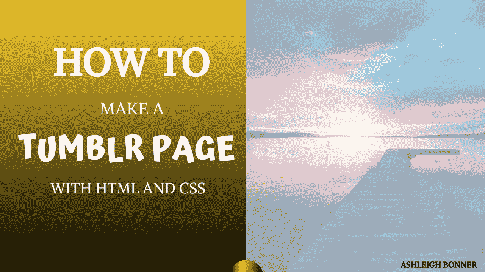
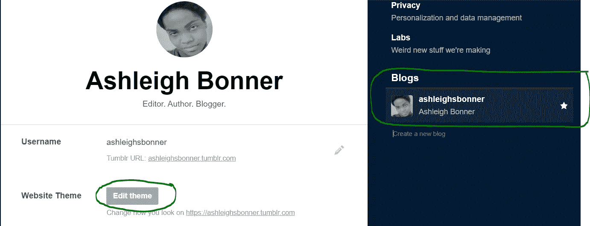
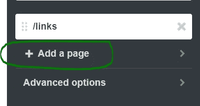
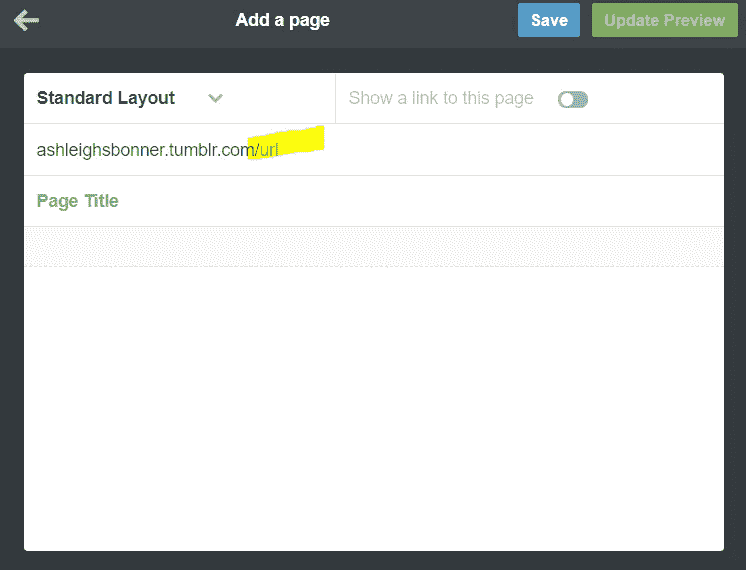
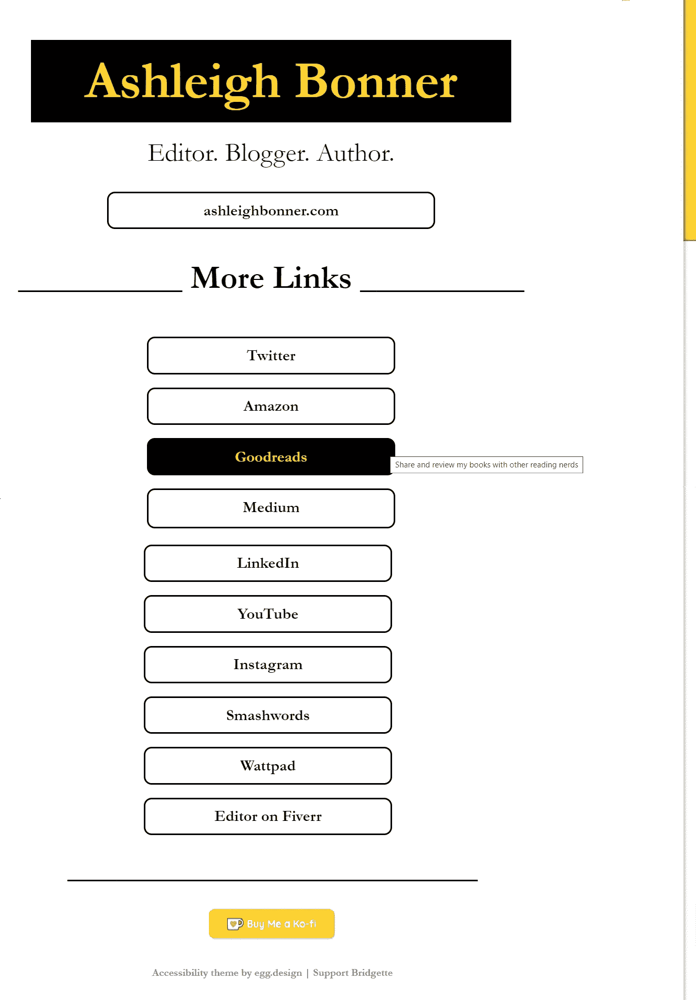
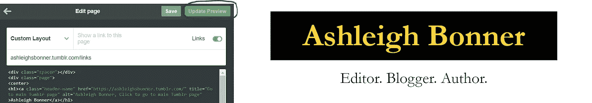
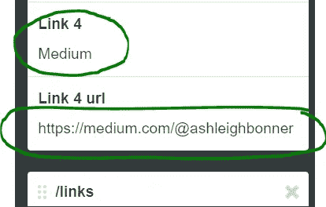
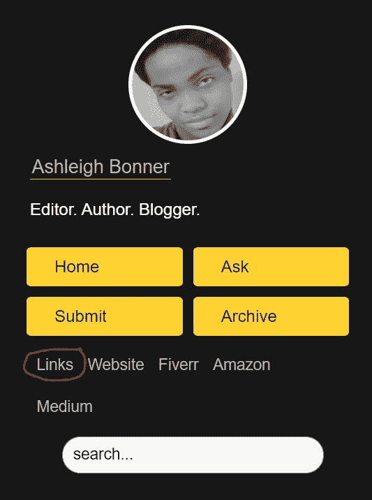

# 如何为你的 Tumblr 制作一个链接树

> 原文：<https://betterprogramming.pub/how-to-make-a-tumblr-page-573fb3420a4>

## 使用 HTML 和 CSS



右图由[安德斯·吉尔登](https://unsplash.com/@andersjilden?utm_source=unsplash&utm_medium=referral&utm_content=creditCopyText)在 [Unsplash](https://unsplash.com/s/photos/tumblr?utm_source=unsplash&utm_medium=referral&utm_content=creditCopyText) 拍摄

假设你想在 Tumblr 上做一个自定义页面。你是怎么做到的？更好的是，你如何从一张白纸开始做这件事？我正在学习 HTML 和 CSS，我想向你展示一些我一步一步学到的东西。

# 开始吧

1.  登录您的 Tumblr
2.  点击右上角的无头人图标
3.  选择“设置”


4.向下滚动并在右侧选择您的博客

5.点击“编辑主题”



6.滚动到“编辑主题”页面的底部

7.单击“添加页面”



该页面将打开一个空白页面，让您为正在创建的 Tumblr 页面添加一个 URL。我发誓，空白页是创造性的魔法。

您还可以为页面添加标题并选择布局(不同的选项包括标准、自定义和链接)。在这里，您还将添加 HTML 和 CSS 来创建页面。



# 创建链接页面

我决定跳过链接树，创建我自己的…链接树。这是学习的证明，因为 Linktree 是免费的。

但是，因为我喜欢学习，狄莺，也喜欢托管我自己的东西(咳，在 Tumblr 上)，所以我很乐意做一个毫无歉意的抄袭。

因此，这个定制的 Tumblr 页面将显示我的社交媒体链接。我把这个页面做得很简单，但是你可以添加很多选项，比如图片、动画等等。

我计划添加这些功能，这样我就可以更多地练习 HTML 和 CSS。

这个版本的最后一页是这样的:



他们说，你不能有太多的社交媒体账户，但我认为 12 是推动它。Lol！

我用 W3Schools 创建了滚动条。这里有 W3Schools 的链接，你可以自己做一个。

# HTML 和 CSS

在 Tumblr 中，你可以将 HTML(基本框架)和 CSS(样式、颜色等)结合起来。)来获得您的最终页面。若要测试您的更改，请点按“更新预览”



以下是我的链接页面的代码:

> **注意:**79 版之前的 Firefox 或 Edge 不支持自定义滚动条— W3Schools

# 工具提示

当你悬停在我的链接上时，你会看到工具提示。Goodreads 的工具提示上写着“与其他书呆子分享和评论我的书。”

为了做出这些时髦的提示，在 HTML 中使用`title`标签，如下所示:

```
<h2><a class="links"  href="[https://www.goodreads.com/author/show/17476511.Ashleigh_Bonner](https://www.goodreads.com/author/show/17476511.Ashleigh_Bonner)
" **title="Share and review my books with other reading nerds"** alt="Goodreads link. Meet other reading nerds">Goodreads</a></h2>
```

# 重要:可访问性

web 开发的一个重要方面是可访问性。为了支持这一点，我使用 egg.design 的可访问性主题创建了我的 Tumblr 主页。

对于你的自定义页面，使用`alt`标签将替代文本添加到你的网站，这样盲人用户和开发者就可以享受你的内容。

```
<h2><a class="links"  href="[https://www.goodreads.com/author/show/17476511.Ashleigh_Bonner](https://www.goodreads.com/author/show/17476511.Ashleigh_Bonner)
" title="Share and review my books with other reading nerds" **alt="Goodreads link. Meet other reading nerds"**>Goodreads</a></h2>
```

从技术上来说，替代文本应该又好又短，但我想给盲人访问者一个类似的体验——时髦。大多数屏幕阅读器不会阅读工具提示。

# 收尾工作

创建了想要的 Tumblr 页面后，使用“显示指向此页面的链接”滑块，激活新页面。

在这个 Tumblr 辅助功能主题中，您还可以将自定义页面添加为主设置页面上的常规链接。非常酷！



对我来说，使用滑块将链接放在其他链接的前面，所以我需要移动它。我想明白后会再写一篇文章。



# 摘要

*   Tumblr 允许你定制页面
*   W3Schools 帮你制作[自定义滚动条](https://www.w3schools.com/howto/howto_css_custom_scrollbar.asp)
*   **无障碍很重要** —为盲人使用`alt`标签
*   添加带有`title`标签的工具提示
*   egg.design 为这个可访问的 Tumblr 页面提供了很多定制

谢谢你和我一起学习！我希望你在创建你的自定义 Tumblr 页面的时候玩得开心。

给你的设计留个链接，让我们看看。

**如果这篇文章对你有帮助，并且你想支持我的写作，** [**给一个中等会员试试**](https://ashleighbonner.medium.com/membership) **。只需 5 美元，你就可以无限制地访问成千上万个故事，而使用我的链接** **注册的** [**将会给我一小笔佣金。**](https://ashleighbonner.medium.com/membership)

[](https://ashleighbonner.medium.com/membership) [## 通过我的推荐链接加入 Medium——ash Leigh Bonner

### 作为一个媒体会员，你的会员费的一部分会给你阅读的作家，你可以完全接触到每一个故事…

ashleighbonner.medium.com](https://ashleighbonner.medium.com/membership)