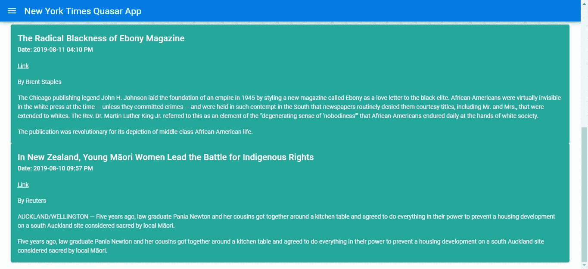
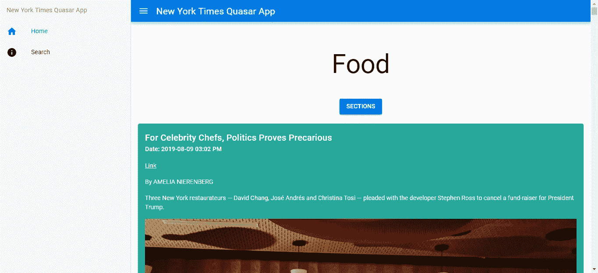
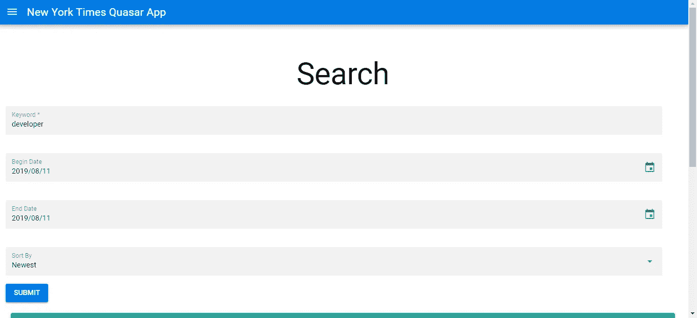

# 如何用 Quasar Widget 库制作一个 Vue.js App

> 原文：<https://betterprogramming.pub/how-to-make-a-vue-js-app-with-quasar-widget-library-c2e2f667f891>

## 构建显示来自纽约时报 API 的数据的应用程序



Quasar 是 Vue.js 应用程序的替代小部件库。它很容易集成到你的 Vue.js 应用程序中，而且结果也很吸引用户的眼球。

在这一部分，我们将构建一个显示来自纽约时报 API 的数据的应用程序。你可以在[https://developer.nytimes.com/](https://developer.nytimes.com/)注册一个 API 密匙。之后，我们可以开始构建应用程序。

# 构建应用程序

要开始构建应用程序，我们必须安装 Vue CLI。我们通过运行以下命令来实现这一点:

```
npm install -g @vue/cli
```

运行 Vue CLI 需要 Node.js 8.9 或更高版本。我没能让 Vue CLI 在 Windows 版本的 Node.js 上运行，Ubuntu 帮我运行 Vue CLI 没有问题。通过运行以下命令创建项目文件夹及其文件:

```
vue create quasar-nyt-app
```

在向导中，我们不使用默认选项，而是选择“手动选择功能”。然后，我们通过按空格键从选项列表中选择 Babel、Router 和 Vuex。如果它们是绿色的，那意味着它们被选中了。

现在我们需要安装一些库。我们需要安装一个 HTTP 客户端，一个用于格式化日期的库，一个用于从对象生成 GET 查询字符串，另一个用于表单验证。我们还需要安装 Vue 素材库本身。我们通过运行以下命令来实现这一点:

```
npm i axios moment querystring vee-validate 
```

`axios`是我们的 HTTP 客户端，`moment`用于操作日期，`querystring`用于从对象生成查询字符串，`vee-validate`是 Vue.js 执行验证的附加包。

然后我们运行`vue add quasar`为我们的应用程序添加 Quasar 样板代码。运行该命令后，我们应该会得到一个新的 Quasar 库的`Vue.use`语句和一个我们将定制的默认布局。

在运行`vue add quasar`产生的`quasar.js`中，我们放入:

这应该会导入我们将在应用程序中包含的所有小部件。

在应该生成的另一个文件`Default.vue`中，我们有:

现在我们已经安装了所有的库，我们可以开始构建我们的应用程序了。首先，我们创建一些组件。在`views`文件夹中，我们创建了`Home.vue`和`Search.vue`。这些是我们页面的代码文件。然后创建一个`mixins`文件夹，做一个名为`nytMixin.js`的文件。Mixins 是代码片段，可以直接合并到我们的 Vue.js 组件中，就像直接在组件中一样使用。

现在我们需要添加一些过滤器。过滤器是从一件事映射到另一件事的 Vue.js 代码。我们创建一个`filters`文件夹，并添加`capitalize.js`和`formatDate.js`。然后在`components`文件夹中，创建一个名为`SearchResults.vue`的文件。`components`文件夹包含不是页面的 Vue.js 组件。

为了使组件之间的数据传递更容易和更有组织，我们使用 Vuex 进行状态管理。因为我们在运行`vue create`时选择了 Vuex，所以我们的项目文件夹中应该有一个`store.js`。如果没有，就创建它。在`store.js`中，我们把:

`state`对象是存储状态的地方。`mutations`对象是我们可以操纵状态的地方。当我们在代码中调用`this.$store.commit(“setSearchResults”, searchResults)`时，假定`searchResults`已定义，那么`state.searchResults`将被设置为`searchResults`。然后我们可以用`this.$store.state.searchResults`得到结果。

我们需要添加一些样板代码到我们的应用程序中。首先，添加我们的过滤器。在`capitalize.js`中，输入:

这使我们能够利用在[https://developer . nytimes . com/docs/top-stories-product/1/routes/% 7 section % 7d . JSON/get](https://developer.nytimes.com/docs/top-stories-product/1/routes/%7Bsection%7D.json/get)中列出的纽约时报栏目名称。

在`formatDate.js`中，我们把:

这将我们的日期格式化为人类可读的格式。

在`main.js`中，我们输入:

请注意，在上面的文件中，我们必须通过对它们调用`Vue.use`来注册我们与 Vue.js 一起使用的库，以便它们可以在我们的应用程序模板中使用。我们在过滤器函数上调用`Vue.filter`,这样我们就可以在模板中使用它们，方法是在变量的右边添加一个管道和过滤器名称。

在`router.js`中，我们把:

这样，当我们输入列出的 URL 时，就可以进入页面。`mode: ‘history’`意味着在基本 URL 和我们的路线之间不会有散列符号。我们还将布局设置为我们在`DefaultLayout.js`中定义的`DefaultLayout`。如果我们部署我们的应用程序，我们需要配置我们的 web 服务器，这样所有的请求都将被重定向到`index.html`，这样我们在重新加载应用程序时就不会出错。

例如，在 Apache 中，我们做到了:

```
<IfModule mod_rewrite.c>
  RewriteEngine On
  RewriteBase /
  RewriteRule ^index\.html$ - [L]
  RewriteCond %{REQUEST_FILENAME} !-f
  RewriteCond %{REQUEST_FILENAME} !-d
  RewriteRule . /index.html [L]
</IfModule>
```

在 Nginx 中，我们放入:

```
location / {
  try_files $uri $uri/ /index.html;
}
```

请参阅您的 web 服务器文档，了解如何在您的 web 服务器中做同样的事情。

现在我们为组件编写代码。在`SearchResults.vue`中，我们把:

这是我们从 Vuex 商店获取搜索结果并显示它的地方。我们在应用程序的`computed` 属性的函数中返回`this.$store.state.searchResults`，这样当商店的`searchResults`状态更新时，搜索结果将自动刷新。

`q-card`是一个卡片小部件，用于在一个框中显示数据。`v-for`用于循环数组条目并显示所有内容。`q-list`是一个列表小部件，用于在页面上整齐地显示列表中的项目。`{{s.pub_date | formatDate}}`是我们应用`formatDate`过滤器的地方。

接下来，我们编写我们的 mixin。我们将在 mixin 中为 HTTP 调用添加代码。在`nytMixin.js`中，我们输入:

我们返回对 HTTP 请求的承诺，以在每个函数中获取文章。在`searchArticles`函数中，我们将传递给查询字符串的对象传递给请求。确保将 API 键放入`apiKey`常量，并删除任何未定义的内容:

```
Object.keys(params).forEach(key => {
  if (!params[key]) {
     delete params[key];
  }
})
```

接下来，在`Home.vue`中，我们放入:

该页面组件是我们获取所选部分文章的地方，默认为`home`部分。我们还有一个菜单，通过添加以下内容来选择我们想要查看的部分:

```
<q-btn color="primary" label="Sections">
  <q-menu>
    <q-list>
      <q-item
        clickable
        v-close-popup
        v-for="s in sections"
        :key="s"
        [@click](http://twitter.com/click)="selectSection(s)"
      >
        <q-item-section>{{s | capitalize}}</q-item-section>
      </q-item>
     </q-list>
   </q-menu>
</q-btn>
```

注意，我们在承诺代码中使用了`async`和`await`关键字，而不是使用`then`。它要短得多，并且`then`和`await`和`async`之间的功能是等效的。但是，它在 Internet Explorer 中不受支持。在`beforeMount`块中，我们运行`this.getNewsArticles`在页面加载时获取文章。

然后在`Search.vue`中，我们放入:

这是我们包含一个搜索文章的表单的地方。我们还有两个日期选择器来标记用户，设置开始和结束日期。我们只将日期限制在今天和更早，以便搜索查询有意义。我们还将`SearchResults`组件嵌套到`Search`页面组件中，包括:

```
components: {
  SearchResults
}
```

在模板中的`script`标签和`<SearchResults />`之间。

请注意，我们的输入字段中有一个`:rules`属性。这允许我们通过添加额外的包来进行表单验证。如果任何字段不符合表单验证标准，它将自动阻止您提交。你可以把任何你喜欢的函数或者你可以使用内置的验证规则在[https://github . com/quasar framework/quasar/blob/dev/ui/src/utils/patterns . js](https://github.com/quasarframework/quasar/blob/dev/ui/src/utils/patterns.js)

最后，我们通过在`App.vue`中输入以下内容来添加顶部栏和菜单:

如果你想要一个带有左导航抽屉的顶栏，你必须精确地遵循上面的代码结构。

# 结果

写完所有代码后，我们有以下代码:



**在推特上关注我:**[**https://twitter.com/AuMayeung**](https://twitter.com/AuMayeung)

**现在在**[**http://jauyeung.net/subscribe/**](http://jauyeung.net/subscribe/)订阅我的邮件列表