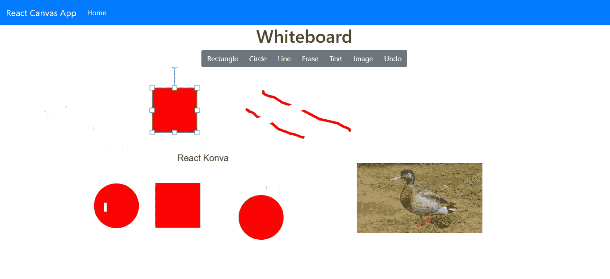

# 如何用 React Konva 制作白板 App

> 原文：<https://betterprogramming.pub/how-to-make-a-whiteboard-app-with-react-konva-8766a532a39f>


由[奥斯汀·迪斯特尔](https://unsplash.com/@austindistel)在 [Unsplash](https://unsplash.com/photos/wD1LRb9OeEo) 上拍摄的照片

HTML Canvas 是 HTML 规范的一部分，允许开发人员轻松地向他们的应用程序添加图形和交互性。

在 HTML 画布中，您可以添加具有不同颜色、填充和渐变的图像、文本和形状。几乎所有最新的浏览器都支持它。

要向画布添加内容，首先要向页面添加一个`canvas`元素。然后，您可以将线条添加到您想要的形状的画布上。

例如，要将一条线和一个圆添加到您的`canvas`元素中，在您的 HTML 文件中执行以下操作:

```
<canvas id="canvas" width="200" height="100" style="border:2px solid #000000;">
</canvas>
```

然后，在您的 JavaScript 文件中，您这样做:

```
let c = document.getElementById("canvas");
let ctx = c.getContext("2d");
ctx.moveTo(0, 0);
ctx.lineTo(50, 100);
ctx.stroke();
ctx.beginPath();
ctx.arc(1, 50, 40, 0, 2 * Math.PI);
ctx.stroke();
```

如果你想添加任何更复杂的东西，那就很难做到了。

因此， [Konva](https://konvajs.org/) 库抽象了向画布添加项目的艰苦工作。它允许您通过简单地编写几行代码来添加更多的形状。还有针对 Konva 的 React 绑定，它具有带附加功能的抽象。但是 React Konva 的功能集比较有限，所以为了满足大部分 app 的需求，React Konva 应该作为 Konva 的配套使用。

你也可以让用户轻松地移动和变换你的形状，如果你想在 [HTML Canvas API](https://developer.mozilla.org/en-US/docs/Web/API/Canvas_API) 中这样做，你必须自己编写。

Konva 的工作原理是创建一个舞台和一个舞台层，这将允许您添加所需的线条、形状和文本。

在本文中，我们将构建一个白板应用程序，允许用户向白板添加形状、文本、线条和图像。此外，用户可以撤销他们的工作，从屏幕上删除内容。

# 入门指南

首先，我们将使用 Create React app 命令行程序创建一个 React App。运行`npx create-react-app whiteboard-app`为我们的应用程序创建初始文件。

接下来，我们需要添加一些包。除了 Konva 包之外，我们还想使用 Bootstrap 来设计样式，并使用一个助手包来为我们的形状、线条和文本创建唯一的 id。我们还需要 React 路由器进行路由。

为了安装这些库，我们运行`npm i bootstrap react-bootstrap konva react-konva react-router-dom use-image uuid`。

`use-image`是一个将图像 URL 转换成可以在画布上显示的图像对象的包。UUID 包为我们的形状生成唯一的 ID。

安装好包之后，我们就可以开始编写代码了。首先从我们 app 的入口点开始，这个入口点就是`App.js`。将文件的现有代码替换为:

```
import React from "react";
import { Router, Route, Link } from "react-router-dom";
import HomePage from "./HomePage";
import TopBar from "./TopBar";
import { createBrowserHistory as createHistory } from "history";
import "./App.css";
const history = createHistory();function App() {
  return (
    <div className="App">
      <Router history={history}>
        <TopBar />
        <Route path="/" exact component={HomePage} />
      </Router>
    </div>
  );
}export default App;
```

我们所添加的是我们唯一的路线，这是主页，和一个顶栏。

接下来，我们添加形状的代码。React Konva 拥有矩形和圆形等常见形状的库。我们首先从圆圈开始。在`src`
文件夹中，创建一个名为`Circle.js`的文件，并添加:

```
import React from "react";
import { Circle, Transformer } from "react-konva";const Circ = ({ shapeProps, isSelected, onSelect, onChange }) => {
  const shapeRef = React.useRef();
  const trRef = React.useRef(); React.useEffect(() => {
    if (isSelected) {
      trRef.current.setNode(shapeRef.current);
      trRef.current.getLayer().batchDraw();
    }
  }, [isSelected]); return (
    <React.Fragment>
      <Circle
        onClick={onSelect}
        ref={shapeRef}
        {...shapeProps}
        draggable
        onDragEnd={e => {
          onChange({
            ...shapeProps,
            x: e.target.x(),
            y: e.target.y(),
          });
        }}
        onTransformEnd={e => {
          // transformer is changing scale
          const node = shapeRef.current;
          const scaleX = node.scaleX();
          const scaleY = node.scaleY();
          node.scaleX(1);
          node.scaleY(1);
          onChange({
            ...shapeProps,
            x: node.x(),
            y: node.y(),
            width: node.width() * scaleX,
            height: node.height() * scaleY,
          });
        }}
      />
      {isSelected && <Transformer ref={trRef} />}
    </React.Fragment>
  );
};export default Circ;
```

这段代码返回可以随意添加到画布上的`Circle`形状。在`React.useEffect`回调函数中，我们可以检测形状是否被选中，然后为形状绘制一个句柄，这样它就可以被调整大小和移动。

`return`语句中的组件是`Circle`的主要代码。我们有一个`onClick`处理程序，它获取所选形状的 ID。

`draggable`道具使`Circle`可拖动。

`onDragEnd`当用户停止拖动时处理事件。位置在那里被更新。

`onTransformEnd`当用户拖动可用的手柄时缩放形状。`width` 和`height`随着手柄的拖动而改变。

`{isSelected && <Transformer ref={trRef} />}`创建`Transformer`对象，这是一个 Konva 对象，如果您将它附加到形状上，当您选择它时，它允许您更改形状的大小。

接下来，我们为图像添加一个组件。在`src`文件夹中创建一个名为`Image.js`的文件，并添加以下内容:

```
import React from "react";
import { Image, Transformer } from "react-konva";
import useImage from "use-image";const Img = ({ shapeProps, isSelected, onSelect, onChange, imageUrl }) => {
  const shapeRef = React.useRef();
  const trRef = React.useRef();
  const [image] = useImage(imageUrl); React.useEffect(() => {
    if (isSelected) {
      // we need to attach transformer manually
      trRef.current.setNode(shapeRef.current);
      trRef.current.getLayer().batchDraw();
    }
  }, [isSelected]); return (
    <React.Fragment>
      <Image
        onClick={onSelect}
        image={image}
        ref={shapeRef}
        draggable
        onDragEnd={e => {
          onChange({
            ...shapeProps,
            x: e.target.x(),
            y: e.target.y(),
          });
        }}
        onTransformEnd={e => {
          const node = shapeRef.current;
          const scaleX = node.scaleX();
          const scaleY = node.scaleY();
          onChange({
            ...shapeProps,
            x: node.x(),
            y: node.y(),
            width: node.width() * scaleX,
            height: node.height() * scaleY,
          });
        }}
      />
      {isSelected && <Transformer ref={trRef} />}
    </React.Fragment>
  );
};export default Img;
```

这非常类似于`Circle`组件，除了我们有由`use-image`库提供的`useImage`函数来将给定的`imageUrl`道具转换成将在画布上显示的图像。

接下来，我们创建一条自由绘制线。在`src`文件夹中创建一个名为`line.js`的文件，并添加:

```
import Konva from "konva";export const addLine = (stage, layer, mode = "brush") => {
  let isPaint = false;
  let lastLine; stage.on("mousedown touchstart", function(e) {
    isPaint = true;
    let pos = stage.getPointerPosition();
    lastLine = new Konva.Line({
      stroke: mode == "brush" ? "red" : "white",
      strokeWidth: mode == "brush" ? 5 : 20,
      globalCompositeOperation:
        mode === "brush" ? "source-over" : "destination-out",
      points: [pos.x, pos.y],
      draggable: mode == "brush",
    });
    layer.add(lastLine);
  }); stage.on("mouseup touchend", function() {
    isPaint = false;
  }); stage.on("mousemove touchmove", function() {
    if (!isPaint) {
      return;
    } const pos = stage.getPointerPosition();
    let newPoints = lastLine.points().concat([pos.x, pos.y]);
    lastLine.points(newPoints);
    layer.batchDraw();
  });
};
```

在这个文件中，我们使用普通的 Konva，因为 React Konva 没有一种方便的方法来绘制一条自由的画线，用户可以拖动鼠标并以自由的形式绘制一条线。当`mousedown`和`touchstart`被触发时，我们根据`mode`设置线条的颜色。当它是`brush`时，我们画一条红线。如果是`erase`，我们会画一条粗白线，这样用户可以在他们的内容上画白线，让用户删除他们的更改。

当`mousemove`和`touchend`事件被触发时，我们将`isPaint`设置为假，因此我们停止画线。当`mousemove`和`touchmove`事件被触发时，当用户在点击或触摸触摸屏时移动鼠标时，我们沿着用户想要的方向添加圆点来绘制线条。

接下来，我们创建用于绘制自由形状矩形的`Rectangle`组件。在`src`文件夹中，创建一个名为`Rectangle.js`的文件，并添加:

```
import React from "react";
import { Rect, Transformer } from "react-konva";const Rectangle = ({ shapeProps, isSelected, onSelect, onChange }) => {
  const shapeRef = React.useRef();
  const trRef = React.useRef(); React.useEffect(() => {
    if (isSelected) {
      // we need to attach transformer manually
      trRef.current.setNode(shapeRef.current);
      trRef.current.getLayer().batchDraw();
    }
  }, [isSelected]); return (
    <React.Fragment>
      <Rect
        onClick={onSelect}
        ref={shapeRef}
        {...shapeProps}
        draggable
        onDragEnd={e => {
          onChange({
            ...shapeProps,
            x: e.target.x(),
            y: e.target.y(),
          });
        }}
        onTransformEnd={e => {
          // transformer is changing scale
          const node = shapeRef.current;
          const scaleX = node.scaleX();
          const scaleY = node.scaleY();
          node.scaleX(1);
          node.scaleY(1);
          onChange({
            ...shapeProps,
            x: node.x(),
            y: node.y(),
            width: node.width() * scaleX,
            height: node.height() * scaleY,
          });
        }}
      />
      {isSelected && <Transformer ref={trRef} />}
    </React.Fragment>
  );
};export default Rectangle;
```

该组件类似于`Circle`组件。

我们通过添加`onDragEnd`和`onTransformEnd`回调函数来移动和调整矩形的大小。我们也可以在`onDragEnd`处理程序中改变`x`和`y`坐标，在`onTransformEnd`事件回调中改变`width`和`height`。

如果形状被选中，则添加`Transformer`组件，以便用户可以在选中时使用手柄移动形状或调整形状大小。

接下来，我们添加一个文本字段组件，让用户向白板添加文本。创建一个名为`textNode.js`的文件，并添加以下内容:

```
import Konva from "konva";
const uuidv1 = require("uuid/v1");export const addTextNode = (stage, layer) => {
  const id = uuidv1();
  const textNode = new Konva.Text({
    text: "type here",
    x: 50,
    y: 80,
    fontSize: 20,
    draggable: true,
    width: 200,
    id,
  }); layer.add(textNode); let tr = new Konva.Transformer({
    node: textNode,
    enabledAnchors: ["middle-left", "middle-right"],
    // set minimum width of text
    boundBoxFunc: function(oldBox, newBox) {
      newBox.width = Math.max(30, newBox.width);
      return newBox;
    },
  }); stage.on("click", function(e) {
    if (!this.clickStartShape) {
      return;
    }
    if (e.target._id == this.clickStartShape._id) {
      layer.add(tr);
      tr.attachTo(e.target);
      layer.draw();
    } else {
      tr.detach();
      layer.draw();
    }
  }); textNode.on("transform", function() {
    // reset scale, so only with is changing by transformer
    textNode.setAttrs({
      width: textNode.width() * textNode.scaleX(),
      scaleX: 1,
    });
  }); layer.add(tr); layer.draw(); textNode.on("dblclick", () => {
    // hide text node and transformer:
    textNode.hide();
    tr.hide();
    layer.draw();// create textarea over canvas with absolute position
    // first we need to find position for textarea
    // how to find it?// at first lets find position of text node relative to the stage:
    let textPosition = textNode.absolutePosition();// then lets find position of stage container on the page:
    let stageBox = stage.container().getBoundingClientRect();// so position of textarea will be the sum of positions above:
    let areaPosition = {
      x: stageBox.left + textPosition.x,
      y: stageBox.top + textPosition.y,
    };// create textarea and style it
    let textarea = document.createElement("textarea");
    document.body.appendChild(textarea);// apply many styles to match text on canvas as close as possible
    // remember that text rendering on canvas and on the textarea can be different
    // and sometimes it is hard to make it 100% the same. But we will try...
    textarea.value = textNode.text();
    textarea.style.position = "absolute";
    textarea.style.top = areaPosition.y + "px";
    textarea.style.left = areaPosition.x + "px";
    textarea.style.width = textNode.width() - textNode.padding() * 2 + "px";
    textarea.style.height =
      textNode.height() - textNode.padding() * 2 + 5 + "px";
    textarea.style.fontSize = textNode.fontSize() + "px";
    textarea.style.border = "none";
    textarea.style.padding = "0px";
    textarea.style.margin = "0px";
    textarea.style.overflow = "hidden";
    textarea.style.background = "none";
    textarea.style.outline = "none";
    textarea.style.resize = "none";
    textarea.style.lineHeight = textNode.lineHeight();
    textarea.style.fontFamily = textNode.fontFamily();
    textarea.style.transformOrigin = "left top";
    textarea.style.textAlign = textNode.align();
    textarea.style.color = textNode.fill();
    let rotation = textNode.rotation();
    let transform = "";
    if (rotation) {
      transform += "rotateZ(" + rotation + "deg)";
    } let px = 0;
    let isFirefox = navigator.userAgent.toLowerCase().indexOf("firefox") > -1;
    if (isFirefox) {
      px += 2 + Math.round(textNode.fontSize() / 20);
    }
    transform += "translateY(-" + px + "px)"; textarea.style.transform = transform;
    textarea.style.height = "auto";
    // after browsers resized it we can set actual value
    textarea.style.height = textarea.scrollHeight + 3 + "px"; textarea.focus(); function removeTextarea() {
      textarea.parentNode.removeChild(textarea);
      window.removeEventListener("click", handleOutsideClick);
      textNode.show();
      tr.show();
      tr.forceUpdate();
      layer.draw();
    } function setTextareaWidth(newWidth) {
      if (!newWidth) {
        // set width for placeholder
        newWidth = textNode.placeholder.length * textNode.fontSize();
      }
      // some extra fixes on different browsers
      let isSafari = /^((?!chrome|android).)*safari/i.test(navigator.userAgent);
      let isFirefox = navigator.userAgent.toLowerCase().indexOf("firefox") > -1;
      if (isSafari || isFirefox) {
        newWidth = Math.ceil(newWidth);
      }let isEdge = document.documentMode || /Edge/.test(navigator.userAgent);
      if (isEdge) {
        newWidth += 1;
      }
      textarea.style.width = newWidth + "px";
    } textarea.addEventListener("keydown", function(e) {
      // hide on enter
      // but don't hide on shift + enter
      if (e.keyCode === 13 && !e.shiftKey) {
        textNode.text(textarea.value);
        removeTextarea();
      }
      // on esc do not set value back to node
      if (e.keyCode === 27) {
        removeTextarea();
      }
    }); textarea.addEventListener("keydown", function(e) {
      let scale = textNode.getAbsoluteScale().x;
      setTextareaWidth(textNode.width() * scale);
      textarea.style.height = "auto";
      textarea.style.height =
        textarea.scrollHeight + textNode.fontSize() + "px";
    }); function handleOutsideClick(e) {
      if (e.target !== textarea) {
        removeTextarea();
      }
    }
    setTimeout(() => {
      window.addEventListener("click", handleOutsideClick);
    });
  });
  return id;
};
```

我们添加一个文本区域，然后处理由文本区域创建的事件。当用户单击文本区域时，将显示一个带有手柄的框，让用户在画布上移动文本区域。这就是载物台的`click`处理器正在做的事情。它通过 ID 找到文本区域，然后附加一个 Konva `Transformer`到它上面，添加带有手柄的框，让用户移动和调整文本区域的大小。

我们为`textNode`文本区域提供了一个`transform`处理程序，当用户拖动手柄时可以调整文本区域的大小。我们有一个双击处理程序，让用户在双击时输入文本。大部分代码都是为了让文本框尽可能地接近画布，这样它就能融入画布。不然看起来会很奇怪。我们还让用户旋转文本区域，方法是应用 CSS 在用户拖动手柄时旋转文本区域。

在`keydown`事件处理程序中，我们在用户输入时改变文本区域的大小，以确保它显示所有文本而不滚动。

当用户在文本区域之外单击时，带有手柄的框会消失，让用户选择其他项目。

主页是我们把所有东西放在一起的地方。在`src`文件夹中创建一个名为`HomePage.js`的新文件，并添加:

```
import React, { useState, useRef } from "react";
import ButtonGroup from "react-bootstrap/ButtonGroup";
import Button from "react-bootstrap/Button";
import "./HomePage.css";
import { Stage, Layer } from "react-konva";
import Rectangle from "./Rectangle";
import Circle from "./Circle";
import { addLine } from "./line";
import { addTextNode } from "./textNode";
import Image from "./Image";
const uuidv1 = require("uuid/v1");function HomePage() {
  const [rectangles, setRectangles] = useState([]);
  const [circles, setCircles] = useState([]);
  const [images, setImages] = useState([]);
  const [selectedId, selectShape] = useState(null);
  const [shapes, setShapes] = useState([]);
  const [, updateState] = React.useState();
  const stageEl = React.createRef();
  const layerEl = React.createRef();
  const fileUploadEl = React.createRef(); const getRandomInt = max => {
    return Math.floor(Math.random() * Math.floor(max));
  }; const addRectangle = () => {
    const rect = {
      x: getRandomInt(100),
      y: getRandomInt(100),
      width: 100,
      height: 100,
      fill: "red",
      id: `rect${rectangles.length + 1}`,
    };
    const rects = rectangles.concat([rect]);
    setRectangles(rects);
    const shs = shapes.concat([`rect${rectangles.length + 1}`]);
    setShapes(shs);
  }; const addCircle = () => {
    const circ = {
      x: getRandomInt(100),
      y: getRandomInt(100),
      width: 100,
      height: 100,
      fill: "red",
      id: `circ${circles.length + 1}`,
    };
    const circs = circles.concat([circ]);
    setCircles(circs);
    const shs = shapes.concat([`circ${circles.length + 1}`]);
    setShapes(shs);
  };const drawLine = () => {
    addLine(stageEl.current.getStage(), layerEl.current);
  }; const eraseLine = () => {
    addLine(stageEl.current.getStage(), layerEl.current, "erase");
  }; const drawText = () => {
    const id = addTextNode(stageEl.current.getStage(), layerEl.current);
    const shs = shapes.concat([id]);
    setShapes(shs);
  }; const drawImage = () => {
    fileUploadEl.current.click();
  }; const forceUpdate = React.useCallback(() => updateState({}), []); const fileChange = ev => {
    let file = ev.target.files[0];
    let reader = new FileReader(); reader.addEventListener(
      "load",
      () => {
        const id = uuidv1();
        images.push({
          content: reader.result,
          id,
        });
        setImages(images);
        fileUploadEl.current.value = null;
        shapes.push(id);
        setShapes(shapes);
        forceUpdate();
      },
      false
    ); if (file) {
      reader.readAsDataURL(file);
    }
  }; const undo = () => {
    const lastId = shapes[shapes.length - 1];
    let index = circles.findIndex(c => c.id == lastId);
    if (index != -1) {
      circles.splice(index, 1);
      setCircles(circles);
    } index = rectangles.findIndex(r => r.id == lastId);
    if (index != -1) {
      rectangles.splice(index, 1);
      setRectangles(rectangles);
    } index = images.findIndex(r => r.id == lastId);
    if (index != -1) {
      images.splice(index, 1);
      setImages(images);
    }
    shapes.pop();
    setShapes(shapes);
    forceUpdate();
  }; document.addEventListener("keydown", ev => {
    if (ev.code == "Delete") {
      let index = circles.findIndex(c => c.id == selectedId);
      if (index != -1) {
        circles.splice(index, 1);
        setCircles(circles);
      } index = rectangles.findIndex(r => r.id == selectedId);
      if (index != -1) {
        rectangles.splice(index, 1);
        setRectangles(rectangles);
      } index = images.findIndex(r => r.id == selectedId);
      if (index != -1) {
        images.splice(index, 1);
        setImages(images);
      }
      forceUpdate();
    }
  }); return (
    <div className="home-page">
      <h1>Whiteboard</h1>
      <ButtonGroup>
        <Button variant="secondary" onClick={addRectangle}>
          Rectangle
        </Button>
        <Button variant="secondary" onClick={addCircle}>
          Circle
        </Button>
        <Button variant="secondary" onClick={drawLine}>
          Line
        </Button>
        <Button variant="secondary" onClick={eraseLine}>
          Erase
        </Button>
        <Button variant="secondary" onClick={drawText}>
          Text
        </Button>
        <Button variant="secondary" onClick={drawImage}>
          Image
        </Button>
        <Button variant="secondary" onClick={undo}>
          Undo
        </Button>
      </ButtonGroup>
      <input
        style={{ display: "none" }}
        type="file"
        ref={fileUploadEl}
        onChange={fileChange}
      />
      <Stage
        width={window.innerWidth * 0.9}
        height={window.innerHeight - 150}
        ref={stageEl}
        onMouseDown={e => {
          // deselect when clicked on empty area
          const clickedOnEmpty = e.target === e.target.getStage();
          if (clickedOnEmpty) {
            selectShape(null);
          }
        }}
      >
        <Layer ref={layerEl}>
          {rectangles.map((rect, i) => {
            return (
              <Rectangle
                key={i}
                shapeProps={rect}
                isSelected={rect.id === selectedId}
                onSelect={() => {
                  selectShape(rect.id);
                }}
                onChange={newAttrs => {
                  const rects = rectangles.slice();
                  rects[i] = newAttrs;
                  setRectangles(rects);
                }}
              />
            );
          })}
          {circles.map((circle, i) => {
            return (
              <Circle
                key={i}
                shapeProps={circle}
                isSelected={circle.id === selectedId}
                onSelect={() => {
                  selectShape(circle.id);
                }}
                onChange={newAttrs => {
                  const circs = circles.slice();
                  circs[i] = newAttrs;
                  setCircles(circs);
                }}
              />
            );
          })}
          {images.map((image, i) => {
            return (
              <Image
                key={i}
                imageUrl={image.content}
                isSelected={image.id === selectedId}
                onSelect={() => {
                  selectShape(image.id);
                }}
                onChange={newAttrs => {
                  const imgs = images.slice();
                  imgs[i] = newAttrs;
                }}
              />
            );
          })}
        </Layer>
      </Stage>
    </div>
  );
}export default HomePage;
```

这是我们添加按钮的地方，当用户点击这些按钮时，按钮会添加形状。对于 React Konva 提供的形状，我们通过向形状的数组中添加一个对象来添加形状。然后，我们将它们映射到具有由对象指定的属性的形状。

例如，要添加一个矩形，我们创建一个对象，并通过调用推送该对象将其添加到数组中。然后我们调用`setRectangles`并在渲染画布时将其映射到实际的`Rectangle`组件。我们传入了`onSelect`处理程序，这样当用户点击形状时，就可以获得所选形状的 ID。`onChange`处理程序让我们设置更新现有形状的属性，然后更新形状的相应数组。

我们添加的每个 React Konva 形状都应该在`Layer`组件内部。该组件为形状提供驻留的位置。`Stage`组件为`Layer`提供了一个位置。

在`Stage`组件中，我们有一个`onMouseDown`处理程序，用于在单击所有形状之外时取消选择所有形状。

单击“撤消”按钮时，将从数组中删除最后一个形状以及相应的形状数组。例如，如果 undo 删除一个矩形，那么它将从`shapes`数组和`rectangle`数组中删除。`shapes`数组是所有形状的 id 数组。

类似地，为了让用户在使用 delete 键选择形状时删除形状，我们添加了一个按键处理程序。在 key-down 处理函数中，当 delete 键事件被触发时，处理程序将通过 ID 在数组中找到形状并删除它。它还会将其从`shapes`数组中删除。

我们定义了`forceUpdate`函数，这样即使在 React 之外进行 DOM 操作，画布也会更新。`keydown`处理程序是用`document.addEventListener`添加的，不是 React 代码，所以我们需要调用`forceUpdate`根据新的状态重新渲染。

最后，作为结束，我们添加顶部的酒吧。在`src`文件夹中创建一个名为`TopBar.js`的文件，并添加:

```
import React from "react";
import Navbar from "react-bootstrap/Navbar";
import Nav from "react-bootstrap/Nav";
import NavDropdown from "react-bootstrap/NavDropdown";
import "./TopBar.css";
import { withRouter } from "react-router-dom";function TopBar({ location }) {
  const { pathname } = location; return (
    <Navbar bg="primary" expand="lg" variant="dark">
      <Navbar.Brand href="#home">React Canvas App</Navbar.Brand>
      <Navbar.Toggle aria-controls="basic-navbar-nav" />
      <Navbar.Collapse id="basic-navbar-nav">
        <Nav className="mr-auto">
          <Nav.Link href="/" active={pathname == "/"}>
            Home
          </Nav.Link>
        </Nav>
      </Navbar.Collapse>
    </Navbar>
  );
}export default withRouter(TopBar);
```

`Navbar`组件由 React Boostrap 提供。

所有的工作完成后，我们得到一个可以在上面画画的白板。

