# 如何用 Twilio 制作人工智能辅助电话服务

> 原文：<https://betterprogramming.pub/how-to-make-an-ai-assisted-phone-service-with-twilio-98c6d0425a8d>

## 跟着做你自己的机器人


[梁杰森](https://unsplash.com/@ninjason?utm_source=unsplash&utm_medium=referral&utm_content=creditCopyText)在 [Unsplash](https://unsplash.com/s/photos/robot?utm_source=unsplash&utm_medium=referral&utm_content=creditCopyText) 上的照片

如果你曾经打电话给一家企业预约或试图在网站上聊天以获得问题的答案，那么你很有可能已经与人工智能辅助的电话服务进行了互动。人工智能辅助的电话服务已经存在很长时间了，随着[最近在自然语言处理(NLP)](https://www.topbots.com/leading-nlp-language-models-2020/) 方面的进步，它们变得更加复杂。

人工智能辅助的电话服务可以以多种不同的方式使用。例如，聊天机器人可以用来回答客户的问题，而交互式语音应答(IVRs)可以用来接受订单或预约。此外，人工智能辅助的电话服务可以用来收集客户反馈和跟踪客户满意度。该反馈可用于改善客户体验，并确保客户对他们获得的服务感到满意。

在本教程中，您将构建一个 bot 来将用户信息保存在数据库中。这个机器人将使用 [Twilio](https://www.twilio.com/) 构建，并在 [Replit](https://replit.com/) 中开发。Replit 是一个强大的基于浏览器的集成开发环境(IDE ),允许您在线开发项目。

您将使用 Replit 提供的各种特性，比如他们的单元测试和他们的实时服务器和数据库。

以下是该机器人如何工作的高级概述:

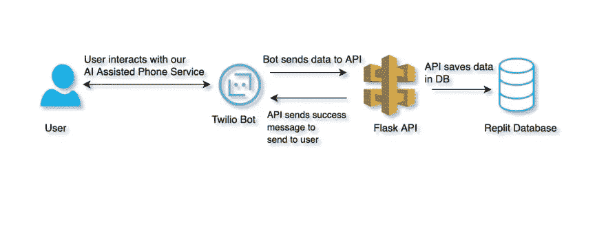

项目概述

# 什么是人工智能辅助电话服务

人工智能辅助电话服务由语音识别软件和 NLP 提供支持，这意味着它们可以理解用户的声音，并以人类自然的方式做出响应。这使得用户体验更像与人交谈，而不是使用传统的自动电话服务。

有两大类人工智能辅助电话服务:

1.  个人助理电话服务:他们可以提供有关当地企业的信息，预约，以及将人们与客户服务代表联系起来。在用户自己无法查找信息的情况下，例如在开车时，它们很有用。
2.  客户服务电话服务:他们为企业提供客户支持。他们可以接受订单，预约，取消预订，并把人转到正确的部门。在这些任务需要在没有人工干预的情况下完成或者这样做更实际的情况下，它们是很有帮助的。

以下是人工智能辅助电话服务的一些好处:

*   他们通常比雇用多人轮班和 24 小时工作更便宜。
*   他们有能力同时处理多个客户。
*   它们可以被编程为自动执行任务，比如创建标签和保存用户的反馈。
*   它们使用户能够体验到更高效、更轻松的客户服务体验。

如前所述，最常见的人工智能辅助电话服务是聊天机器人和 IVR。聊天机器人是可以通过文本模仿人类对话的计算机程序。它们通常用于模拟在线客户服务中的人工对话。

它们还被用来代表品牌和企业与客户沟通，比如在一个手机应用程序中，人们可以点餐或询问当地企业的营业时间。在 Facebook Messenger 中，他们可以被添加为好友并发送消息，使交流更人性化。聊天机器人也可以用在[不和](https://discord.com/)和[懈怠](https://slack.com/)中。

IVRs 是通过声音与人互动的计算机程序。它们也通常用于提供客户服务。IVRs 可用于向人们询问有关其账户的问题，指引他们到正确的部门，提供有关产品或服务的信息，甚至通过电话接受订单。

客户可以呼叫 IVR 并按下与他们拥有或需要的信息相对应的适当按钮，然后 IVR 自动指引他们到正确的部门或提供客户要求的详细信息。

许多公司在他们的在线支持结构中使用这些技术。虽然它没有完全消除对客户支持人员的需求，但它使流程更加高效。

# 打造你自己的人工智能辅助电话服务

本教程分为两个部分。首先，您将使用 Twilio 构建自己的人工智能辅助电话服务。其次，您将构建一个 Flask API 来接收来自电话服务的数据，并将其存储在数据库中。所有的开发都将使用 [Replit](https://replit.com/) 来完成。你可以在这里[免费报名](https://replit.com/signup)。

以下是一些便于访问的有用链接:

*   [API repl](https://replit.com/@rahulbanerjee26/TwilioAIPhoneServiceAPI?v=1)
*   [Twilio 机器人回复](https://replit.com/@rahulbanerjee26/TwilioAIPhoneServiceBot?v=1)
*   [GitHub 回购](https://github.com/rahulbanerjee26/Twilio-Bot)

# 与 Twilio 合作

你将需要一个 Twilio 账户来跟进。注册后，您应该会被重定向到您的仪表板。

首先，请转到帐户> API 密钥和令牌。

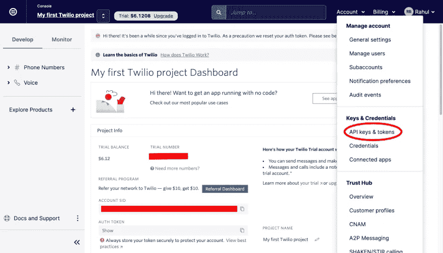

Twilio 仪表板页面

您应该看到一个创建 API 密钥的按钮，您将需要它来使用 Twilio 的 API。

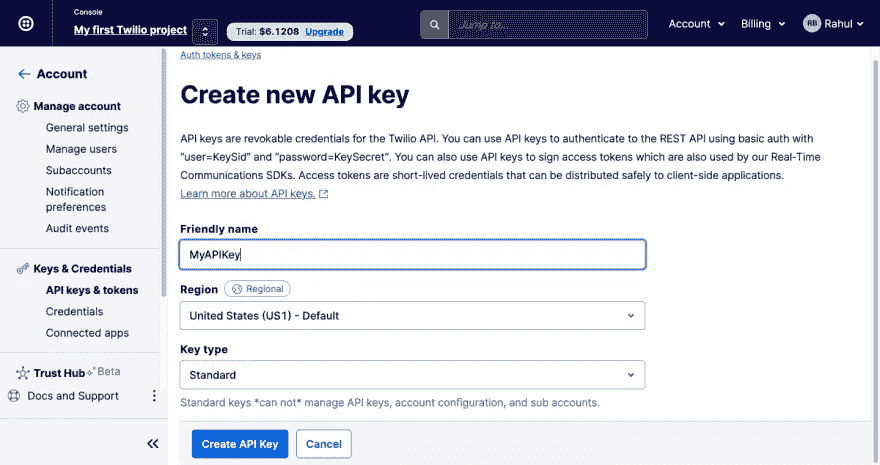

Twilio —生成 API 密钥

创建 API 密钥后，需要保存两个字符串:帐户 SID 和 Auth 令牌。

现在，在 [Replit](https://replit.com/) 上创建一个新的 Python 项目。


回复它

通常，您必须创建一个。存储您的凭据的 env 文件。然而，Replit 对此有一个替代方案。点击工具条上的锁图标。

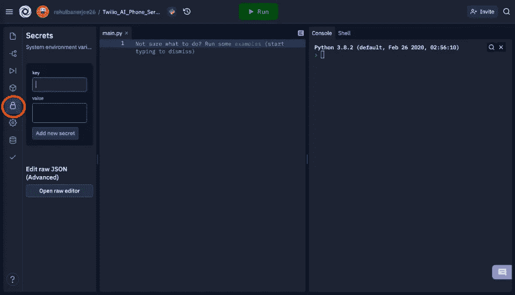

回复它

保存您的 Twilio 帐户 SID ( `account_sid`)和 Auth Token ( `account_key`)，然后向下滚动。您应该看到一个插入代码的选项，以便使用 Python 读取它们。

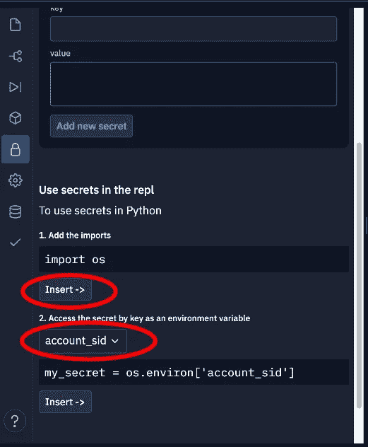

回复它

Twilio 为他们的 API 提供了一个 [Python 包装器](https://www.twilio.com/docs/libraries/python)，Replit 提供了一个简单的安装包的方法。在侧边栏上，选择类似立方体的图标并搜索 Twilio。单击加号图标安装软件包。

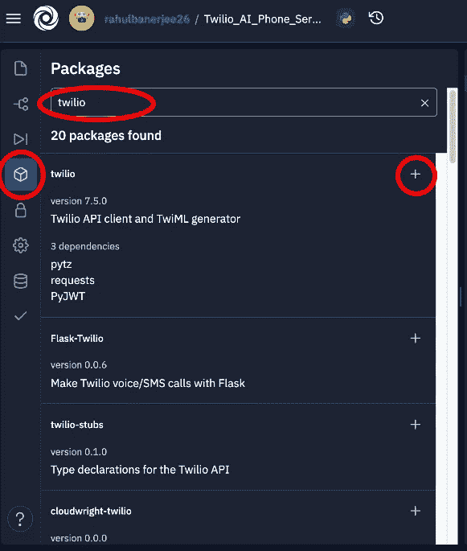

回复它

您必须创建一个[助理资源](https://www.twilio.com/docs/autopilot/api/assistant):

您可以使用代码在 try-except 块中创建助手，以避免每次运行脚本时都创建新的资源。except 块中的代码在创建具有相同唯一名称的助理资源时运行。

在这种情况下，您可以简单地获取现有的助手资源。您可以运行 repl 来创建您自己的。默认情况下，Replit 将运行名为`main.py`的文件。但是，如果您愿意，您可以点击 shell 并使用`python3`命令运行您的文件。

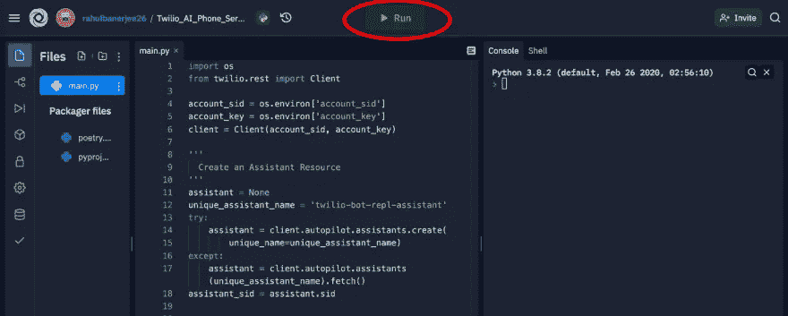

回复它

Replit 有一个非常酷的特性，可以解释代码片段是做什么的。只需突出显示代码片段，然后单击解释代码。请注意，您需要升级到[黑客计划](https://replit.com/pricing)才能使用该功能。

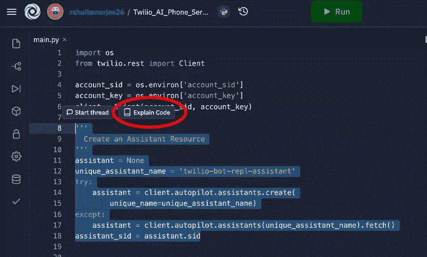

回复它

Replit 将分析你的代码注释并为你生成一个解释。您还可以创建一个线程来添加注释(类似于您在代码评审中所做的)。这是为突出显示的代码片段生成的解释:

```
1\. The code creates a variable called the assistant and sets it to None.2\. The code then tries to create an assistant with the unique name "twilio-bot-repl-assistant".3\. If that fails, then the code fetches the assistant with the unique name "twilio-bot-repl-assistant".
```

如你所见，它相当准确。

接下来，您可以在上面的助手中添加一个任务。任务基本上是助理资源可以执行的操作。你可以在 Twilio 文档中了解更多信息。

与助手资源一样，您可以再次使用 try-except 块来避免创建多个任务。现在，一个空对象被传递给 actions 参数。这将用您希望助理资源执行的操作进行更新。你可以在他们的文档中阅读更多关于 Twilio 支持[的操作。](https://www.twilio.com/docs/autopilot/actions)

现在，我们希望助理资源询问用户的姓名和电话号码。对于我们的用例，我们将使用`[collect](https://www.twilio.com/docs/autopilot/actions/collect)` [动作](https://www.twilio.com/docs/autopilot/actions/collect)。它在许多方面相当于一个 HTML 表单元素。

下面是一个`collect`动作的语法:

你可以添加多个动作，但是现在，我们只需要一个`collect`动作。您可以在一个`collect`动作中添加多个问题。这是我的样子:

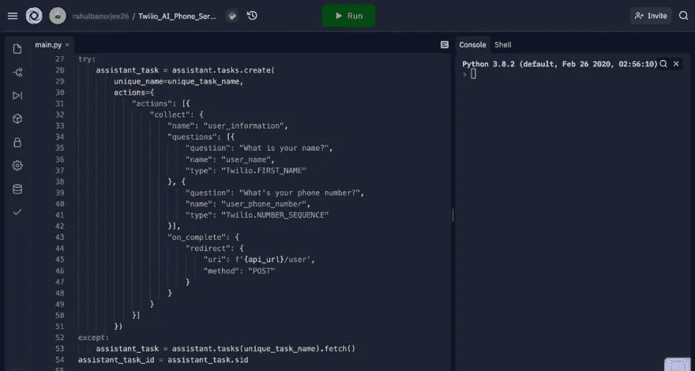

回复它

我用的是 Twilio 提供的[内置类型](https://www.twilio.com/docs/autopilot/built-in-field-types)。可选地，你可以通过遵循这些指令来定义你的类型。在`redirect`中键`uri`的值中，您会注意到一个变量`api_url`。

如果您有一个正常工作的 API 端点，您可以创建一个名为`api_url`的变量，并将其设置为您的 API 的 URL。如果您没有一个正常工作的 API，您不需要创建一个变量，可以保留`uri`的值。

您可以按照后面的小节构建一个 API，并在以后更新`uri`的值。

现在任务已经创建，您需要添加示例短语来触发此任务:

您可以添加多个样本。Twilio 建议每个任务添加十个样本，但是对于本教程，一个就足够了。每当用户说“注册”时，您的助手资源将执行您之前声明的收集操作。

现在您可以构建您的模型了:

这个过程需要一些时间。前往您的仪表板，点击探索产品>自动驾驶。

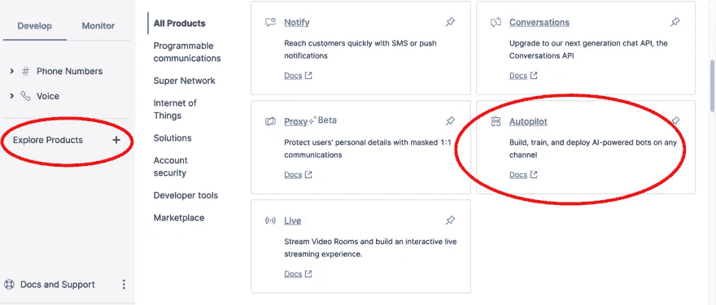

特维利奥

点击你的机器人，检查你的助手资源的最后一个模型构建时间。

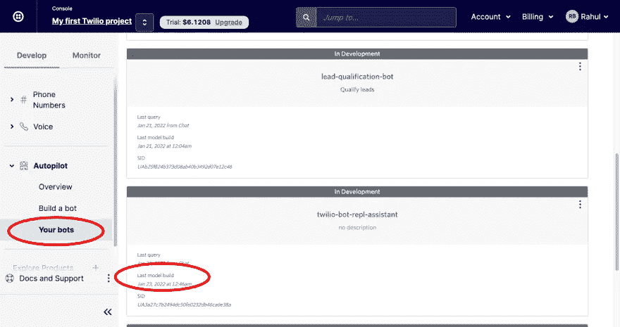

Twilio —你的机器人

构建过程完成后，选择您的模型并单击 Simulator。

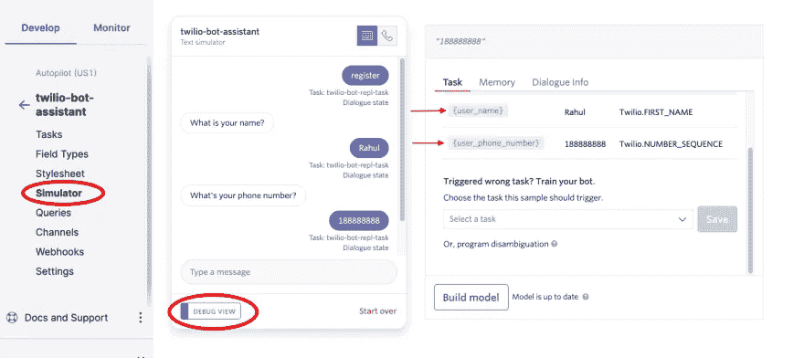

Twilio —测试机器人

这将允许您测试您的模型。由于您现在没有 API，助手将简单地收集信息，而不会将其发送给 API。打开 Debug 视图，检查助手正在执行哪个任务。您还可以看到之前使用`collect`操作创建的变量中存储的值。

在右边的菜单上，您应该会看到一个名为 Channels 的选项。这将允许您将您的机器人添加到 Twilio 电话号码，这样机器人就可以作为聊天机器人或 IVR 工作。

# 构建 API

首先，使用一个现有的模板在 Replit 上创建一个新的 Python 项目。在`main.py`文件中，您应该会看到询问您是否愿意选择一个示例的文本。单击示例链接并选择服务器(Flask)。

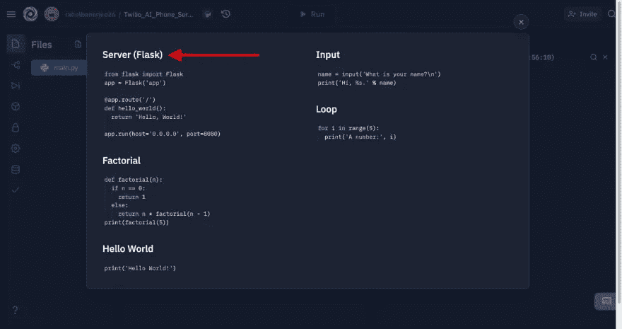

回复它

单击“运行”按钮运行 Flask 服务器。Replit 将自动安装所有需要的依赖项。

通常情况下，你必须使用类似 [ngrok](https://ngrok.com/) 的服务通过公共 URL 暴露你的 Flask 服务器，但是 Replit 会为你处理。只要您的服务器在运行，任何人都可以通过右边显示的 URL 公开访问它:

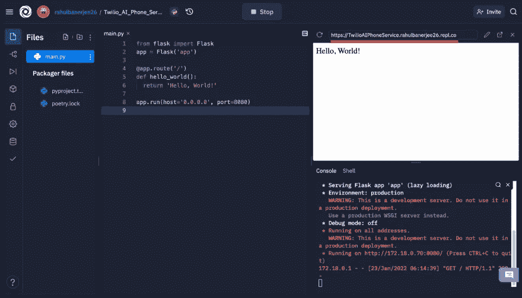

回复它

您可以将 repl 设置为 Always On，这基本上意味着即使您关闭 repl，您的 Flask 服务器也将运行，因此在某种程度上，它部署了您的 Flask 服务器。注意，这个功能只在黑客计划上可用，所以如果你想使用它，你必须升级。

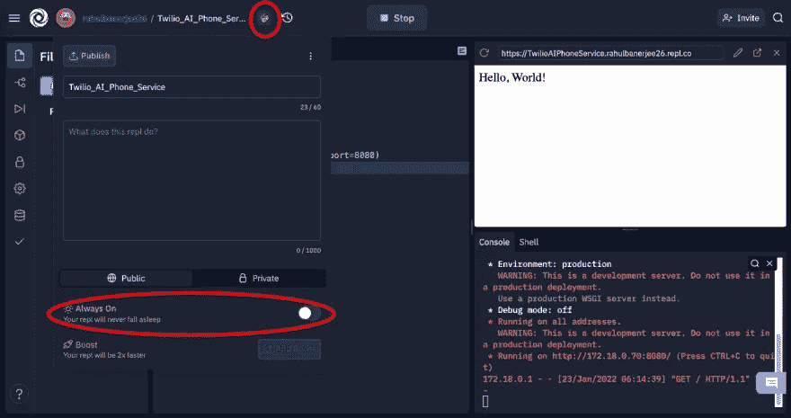

回复它

现在，创建一个接受 GET 请求和 POST 请求的新端点。GET 请求将返回以前注册的用户，而 POST 请求将保存用户的信息。您在上一节中创建的 Twilio bot 将发出 POST 请求。

Replit 有一个内置的数据库，可用于存储用户信息:


回复它

当您单击数据库图标时，将显示一些有助于执行创建、读取、更新和删除(CRUD)操作的代码片段，就像一个备忘单。下面是处理 GET 请求的代码片段:

这段代码只是读取数据库中的所有行，并将它们作为数组返回。Replit 还允许您添加单元测试。您可以添加一个单元测试来验证端点是否按预期处理 GET 请求。

下图中的代码创建了一个简单的单元测试，它检查 GET 请求的响应状态代码，并将数据库中的数据长度与 GET 请求返回的数据长度进行比较:

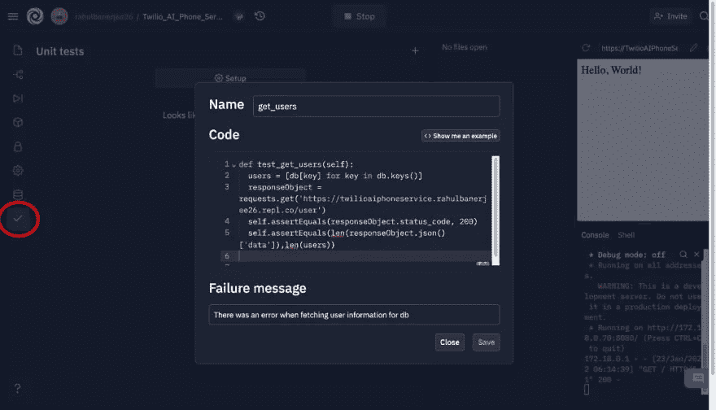

回复它

您必须添加几个 import 语句来让您的单元测试工作。单击设置并添加以下导入:

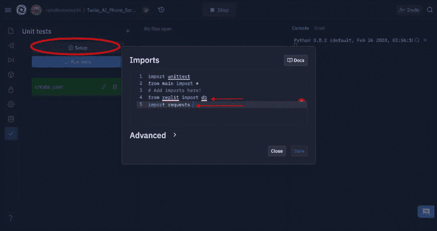

回复它

单击 Run tests，您应该会看到一条成功消息，表明您的所有单元测试用例都通过了。

现在，添加处理 POST 请求的代码:

这里，Twilio bot 发送一个深度嵌套的对象。您可以打印`request.form`中的数据，以检查数据的格式。上面的代码获取用户名和电话号码，并将它们存储在 Replit 数据库中。然后它返回一个 Twilio 动作对象，这样一旦用户的信息被保存，机器人就可以响应用户。

# 将 API URL 添加到 Twilio Bot 中

在测试 bot 之前，您必须将 API 的端点添加到您之前创建的 Twilio 任务中。这可以使用 Twilio 控制台或 Twilio API 来完成。

## 使用 Twilio 控制台

转到 Twilio 控制台并导航到您的 Twilio 机器人，如前几节所示。然后转到任务并选择您已经创建的任务。

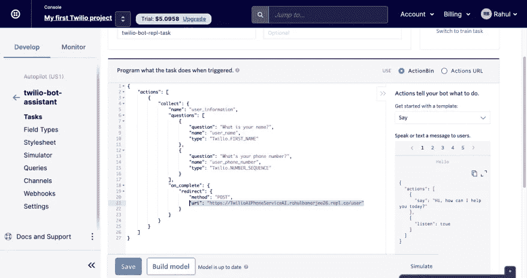

特维利奥

最初，您的行动中有以下内容:

用 API 的 URL 更新`uri`的值。在我的例子中，它看起来像这样:

保存新任务并构建模型。

## 使用 Twilio API

或者，如果您愿意，可以使用代码更新 API URL 值。您之前创建的任务资源有一个 update 方法，可用于传递带有 API URL 的新操作。你可以在 [Twilio 文档](https://www.twilio.com/docs/autopilot/api/task?code-sample=code-update-a-task-to-set-task-actions&code-language=Python&code-sdk-version=7.x)中了解更多信息。

转到您为 Twilio bot 编写代码的文件。在创建任务资源的部分，将`assistant.tasks.create()`替换为`assistant.tasks.update()`。这将确保您的脚本将更新动作，而不是创建新的动作。更新 JSON 对象以包含您的 API URL。完成后，再次运行脚本来更新您的操作并构建模型。

通过 Twilio 控制台或 Twilio API 将 API 的 URL 添加到操作资源后，您的 bot 应该如下所示工作:


Twilio —测试机器人

# 结论

在本教程中，您使用 Twilio 构建了一个人工智能辅助的电话服务来收集用户的姓名和电话号码。您还构建了一个 API 来将这些信息保存在数据库中。

你可能已经注意到了， [Replit](https://replit.com/) 有很多有用的特性，允许你在线编码。虽然本文只展示了它对 Python 的支持，但它同样支持其他编程语言，如 C++、JavaScript 和 TypeScript 还有框架，比如 [React](https://reactjs.org/) 或者 [Vue.js](https://vuejs.org/) 。它带有一个内置的浏览器来预览你的前端或 API。此外，它还有一个内置的数据库，并支持单元测试和存储环境变量。

此外，Replit 的解释代码特性能够为代码片段生成解释。Replit 还支持 [Git](https://git-scm.com/) ，允许您根据需要添加提交或恢复到以前的提交。请务必[看看](https://replit.com/)这款功能强大的在线 IDE，它可以用来提供电话服务以及许多其他服务。

```
This article was originally posted on [realpythonproject.com](https://www.realpythonproject.com/how-to-make-an-ai-assisted-phone-service-with-twilio/)
```